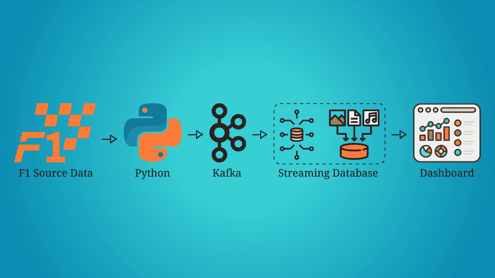
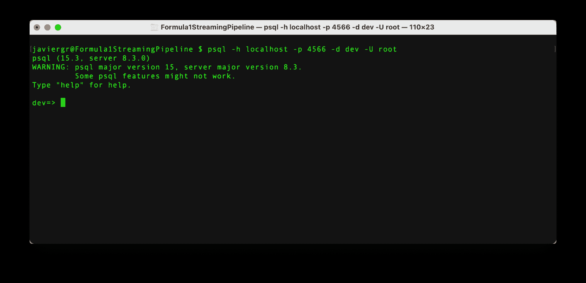
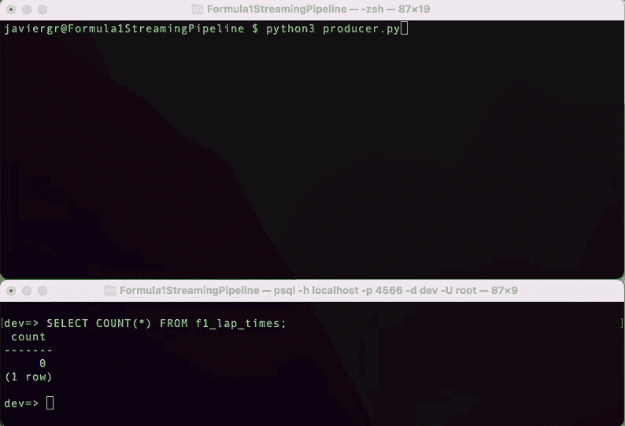
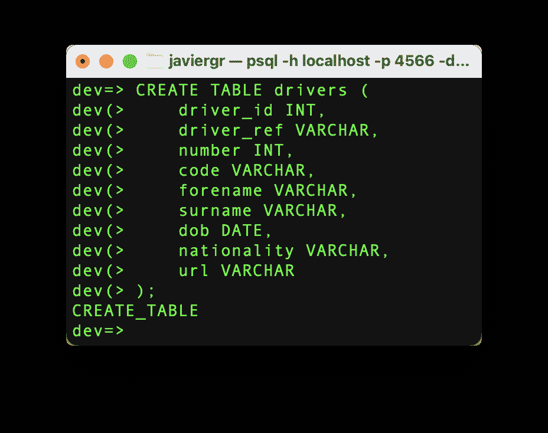
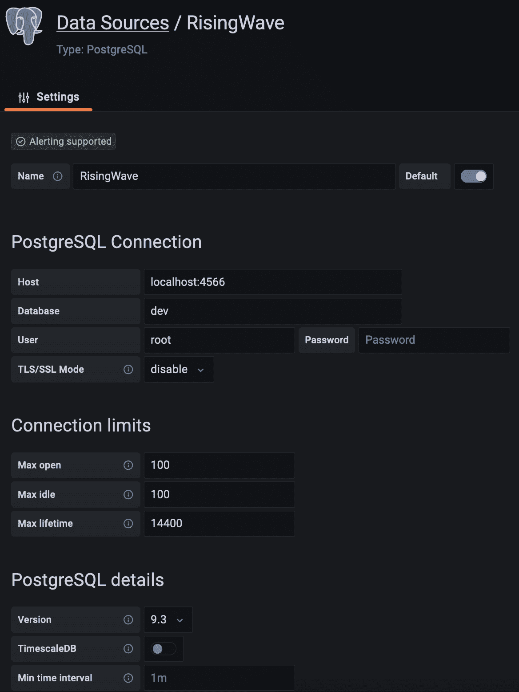
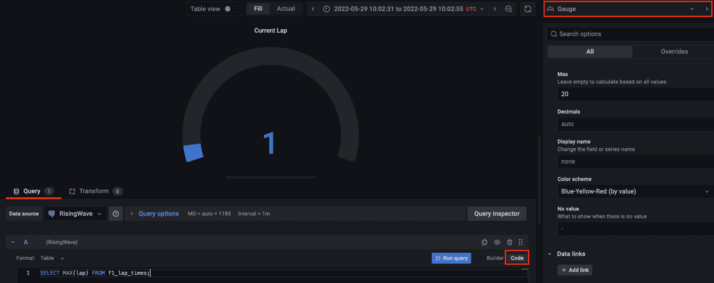
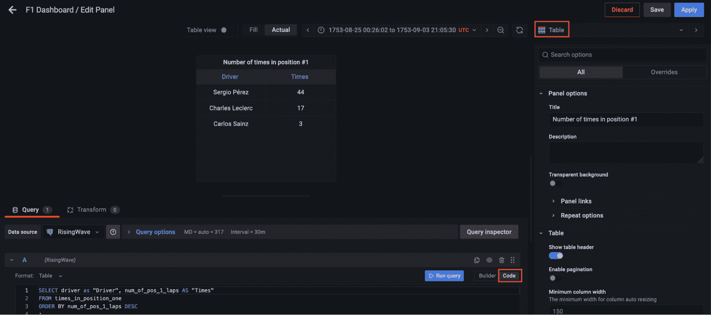

# 构建 Formula 1 流式数据管道与 Kafka 和 Risingwave

> 原文：[`www.kdnuggets.com/building-a-formula-1-streaming-data-pipeline-with-kafka-and-risingwave`](https://www.kdnuggets.com/building-a-formula-1-streaming-data-pipeline-with-kafka-and-risingwave)

实时数据已经到来并且会持续存在。毫无疑问，每天流式数据的数量都在指数级增长，我们需要找到提取、处理和可视化数据的最佳方法。例如，每辆 Formula 1 汽车在一个比赛周末产生约 1.5 TB 的数据（[来源](https://www.racecar-engineering.com/articles/data-analytics-managing-f1s-digital-gold/#:~:text=Each%20Formula%201%20car%20carries,data%20throughout%20a%20race%20weekend.)）。

* * *

## 我们的三大课程推荐

 1\. [谷歌网络安全证书](https://www.kdnuggets.com/google-cybersecurity) - 快速进入网络安全职业生涯

 2\. [谷歌数据分析专业证书](https://www.kdnuggets.com/google-data-analytics) - 提升你的数据分析技能

 3\. [谷歌 IT 支持专业证书](https://www.kdnuggets.com/google-itsupport) - 支持你所在组织的 IT 工作

* * *

在这篇文章中，我们不会流式传输汽车的数据，而是会流式传输、处理和可视化比赛的数据，模拟我们在 Formula 1 比赛中实时进行。在开始之前，重要的是要提到这篇文章不会关注每种技术是什么，而是如何在流式数据管道中实现它们，因此需要对 Python、Kafka、SQL 和数据可视化有一定了解。

# 前提条件

+   **F1 源数据**：在这个数据流管道中使用的 Formula 1 数据是从 Kaggle 下载的，可以在 [Formula 1 世界锦标赛（1950 - 2023）](https://www.kaggle.com/datasets/rohanrao/formula-1-world-championship-1950-2020?select=lap_times.csv) 中找到。

+   **Python：** 这个管道是用 Python 3.9 构建的，但任何高于 3.0 的版本都应该可以使用。有关如何下载和安装 Python 的更多详细信息，可以在 [官方 Python 网站](https://www.python.org/downloads/) 上找到。

+   **Kafka：** Kafka 是这个流式数据管道中使用的主要技术之一，因此在开始之前安装它是很重要的。这个流式数据管道是在 MacOS 上构建的，因此使用了 brew 来安装 Kafka。更多详细信息可以在 [官方 brew 网站](https://formulae.brew.sh/formula/kafka) 上找到。我们还需要一个 Python 库来将 Kafka 与 Python 一起使用。这个管道使用了 kafka-python。安装详细信息可以在它们的 [官方网站](https://kafka-python.readthedocs.io/en/master/) 上找到。

+   **RisingWave（流数据库）：** 市场上有多种流数据库，但本文使用的且最佳的之一是 RisingWave。开始使用 RisingWave 非常简单，只需几分钟。有关如何入门的完整教程可以在他们的[官方网站](https://www.risingwave.dev/docs/current/get-started/)上找到。

+   **Grafana 仪表盘：** 在这个流媒体管道中使用了 Grafana 来实时可视化 Formula 1 数据。有关如何开始使用的详细信息可以在[这个网站](https://www.risingwave.dev/docs/current/grafana-integration/)上找到。

# 流数据源

现在我们已经有了所有先决条件，是时候开始构建 Formula 1 数据流管道了。源数据存储在一个 JSON 文件中，所以我们需要提取它并通过 Kafka 主题发送。为此，我们将使用以下 Python 脚本。

作者提供的代码

# 设置 Kafka

用于流数据的 Python 脚本已准备好开始流数据，但 Kafka 主题 F1Topic 尚未创建，所以我们需要创建它。首先，我们需要初始化 Kafka。为此，我们必须启动 Zookeper，然后启动 Kafka，最后使用以下命令创建主题。请记住，Zookeper 和 Kafka 应在不同的终端中运行。

作者提供的代码

# 设置流数据库 RisingWave

一旦安装了 RisingWave，就很容易启动它。首先，我们需要初始化数据库，然后通过 Postgres 交互式终端 psql 连接它。要初始化流数据库 RisingWave，我们必须执行以下命令。

作者提供的代码

上述命令在游乐场模式下启动 RisingWave，其中数据暂时存储在内存中。该服务设计为在 30 分钟不活动后自动终止，所有存储的数据在终止时将被删除。此方法仅推荐用于测试，[RisingWave Cloud](https://www.risingwave.dev/cloud/intro/) 应用于生产环境。

当 RisingWave 启动并运行后，就可以通过以下命令在新的终端中通过 Postgress 交互式终端连接它。

作者提供的代码

一旦建立了连接，就可以开始从 Kafka 主题中提取数据。为了将流数据导入 RisingWave，我们需要创建一个源。这个源将建立 Kafka 主题和 RisingWave 之间的通信，所以让我们执行以下命令。

作者提供的代码

如果命令成功运行，我们将看到消息“CREATE SOURCE”，并且源已经创建。需要强调的是，一旦源创建完成，数据不会自动导入到 RisingWave 中。我们需要创建一个物化视图来启动数据的流动。这个物化视图还将帮助我们在下一步中创建 Grafana 仪表板。

让我们用以下命令创建具有与源数据相同架构的物化视图。

作者提供的代码

如果命令成功运行，我们将看到消息“CREATE MATERIALIZED_VIEW”，并且物化视图已创建，现在可以进行测试了！

执行 Python 脚本以开始流式传输数据，并在 RisingWave 终端实时查询数据。RisingWave 是一个兼容 Postgres 的 SQL 数据库，因此如果你熟悉 PostgreSQL 或任何其他 SQL 数据库，一切将会顺利进行，你可以轻松查询流数据。

如你所见，流式处理管道现在已经启动并运行，但我们还没有充分利用流数据库 RisingWave 的所有优势。我们可以添加更多的表来实时连接数据，构建一个功能完善的应用程序。

让我们创建比赛表，以便我们可以将流数据与比赛表连接，并获取比赛的实际名称，而不是比赛 id。

作者提供的代码

现在，让我们为我们需要的特定比赛 id 插入数据。

作者提供的代码

让我们按照相同的程序进行，但这次用司机的表格。

作者提供的代码

最后，让我们插入司机的数据。

作者提供的代码

我们已经准备好表格来开始连接流数据，但我们需要一个物化视图，所有的魔法都将在这里发生。让我们创建一个物化视图，在实时中查看前 3 名的位置，连接司机 id 和比赛 id 以获取实际名称。

作者提供的代码

最后但同样重要的是，让我们创建最后一个物化视图，以查看一个司机在整个比赛中获得第一名的次数。

作者提供的代码

现在，是时候构建 Grafana 仪表板，并通过物化视图实时查看所有连接的数据了。

# 设置 Grafana 仪表板

流数据管道的最后一步是实时仪表板中的数据可视化。在创建 Grafana 仪表板之前，我们需要创建一个数据源，以建立 Grafana 和我们的流数据库 RisingWave 之间的连接，按照以下步骤进行。

+   转到 配置 > 数据源。

+   点击添加数据源按钮。

+   从支持的数据库列表中选择 PostgreSQL。

+   填写 PostgreSQL 连接字段，如下所示：

向下滚动并点击保存和测试按钮。数据库连接现在已建立。

现在转到左侧面板中的仪表板，点击新建仪表板选项，添加一个新面板。选择表格可视化，切换到代码选项卡，查询物化视图 live_positions，我们可以看到前 3 名位置的连接数据。

作者代码

让我们添加另一个面板以可视化当前圈数。选择仪表可视化，在代码选项卡中查询流数据中可用的最大圈数。仪表的自定义由你决定。

作者代码

最后，让我们添加另一个面板以查询物化视图 times_in_position_one，并实时查看在整个比赛过程中车手获得第一名的位置次数。

作者代码

# 结果可视化

最终，所有流数据管道的组件都已启动并运行。Python 脚本已经执行，开始通过 Kafka 主题流式传输数据，流式数据库 RisingWave 正在实时读取、处理和连接数据。物化视图 f1_lap_times 从 Kafka 主题中读取数据，Grafana 仪表板中的每个面板都是不同的物化视图，这些视图实时连接数据，通过物化视图对比赛和车手表进行的连接来显示详细数据。Grafana 仪表板查询物化视图，所有处理过程都因为在流式数据库 RisingWave 中处理的物化视图而得到简化。

**[哈维尔·格拉纳多斯](https://medium.com/@JavierGr)** 是一名高级数据工程师，他喜欢阅读和写作关于数据管道的内容。他专注于云管道，主要是在 AWS 上，但他总是探索新技术和新趋势。你可以在 Medium 上找到他，网址是 https://medium.com/@JavierGr

### 更多相关话题

+   [如何使用 Apache Kafka 构建可扩展的数据架构](https://www.kdnuggets.com/2023/04/build-scalable-data-architecture-apache-kafka.html)

+   [使用 Prefect 构建数据管道](https://www.kdnuggets.com/building-data-pipeline-with-prefect)

+   [构建一个可处理的特征工程管道用于多变量时间序列…](https://www.kdnuggets.com/2022/03/building-tractable-feature-engineering-pipeline-multivariate-time-series.html)

+   [使用 Bash 构建你的第一个 ETL 管道](https://www.kdnuggets.com/building-your-first-etl-pipeline-with-bash)

+   [简单且快速的数据流处理，用于机器学习项目](https://www.kdnuggets.com/2022/11/simple-fast-data-streaming-machine-learning-projects.html)

+   [金融中的 Python：在 Jupyter Notebook 中进行实时数据流处理](https://www.kdnuggets.com/python-in-finance-real-time-data-streaming-within-jupyter-notebook)
