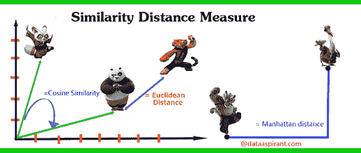
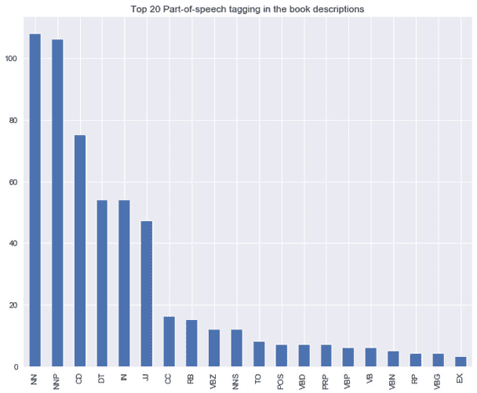
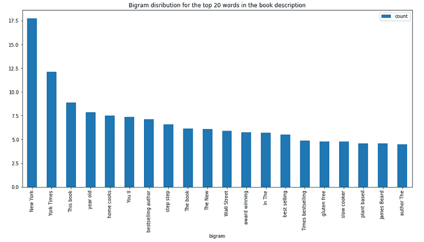
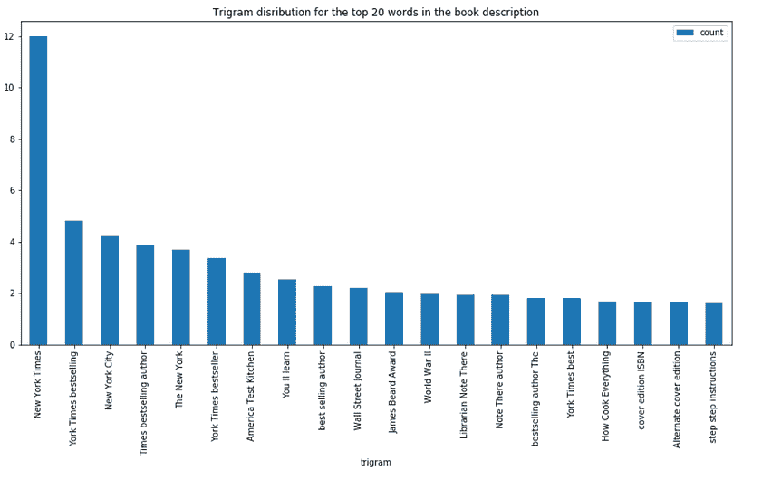

# 构建基于内容的书籍推荐引擎

> 原文：[`www.kdnuggets.com/2020/07/building-content-based-book-recommendation-engine.html`](https://www.kdnuggets.com/2020/07/building-content-based-book-recommendation-engine.html)

评论

**作者：[Dhilip Subramanian](https://medium.com/@sdhilip)，数据科学家和人工智能爱好者**

如果我们计划购买任何新产品，通常会询问朋友、研究产品特性、将产品与类似产品进行比较、阅读互联网上的产品评论，然后做出决定。如果这一过程能够自动完成并有效地推荐产品，那将多么方便？推荐引擎或推荐系统就是这个问题的答案。

* * *

## 我们的前三大课程推荐

 1\. [Google 网络安全证书](https://www.kdnuggets.com/google-cybersecurity) - 快速进入网络安全职业生涯。

 2\. [Google 数据分析专业证书](https://www.kdnuggets.com/google-data-analytics) - 提升您的数据分析技能

 3\. [Google IT 支持专业证书](https://www.kdnuggets.com/google-itsupport) - 支持您的组织的 IT 需求

* * *

基于内容的过滤和基于协同的过滤是两种流行的推荐系统。在本博客中，我们将看到如何使用 Goodreads.com 数据构建一个简单的基于内容的推荐系统。

### 基于内容的推荐系统

基于内容的推荐系统通过使用项目之间的相似性来向用户推荐项目。这个推荐系统根据产品的描述或特征来推荐产品或项目。它通过产品的描述来识别产品之间的相似性。它还考虑用户的历史记录，以推荐类似的产品。

例如：如果用户喜欢 Sidney Sheldon 的小说《告诉我你的梦想》，则推荐系统会推荐用户阅读其他 Sidney Sheldon 的小说，或者推荐一个“非虚构”类型的小说。（Sidney Sheldon 的小说属于非虚构类型）。

如前所述，我们正在使用 goodreads.com 数据，并且没有用户的阅读历史。因此，我们使用了一个简单的基于内容的推荐系统。我们将通过使用书名和书籍描述来构建两个推荐系统。

我们需要找到与给定书籍相似的书籍，然后将这些相似的书籍推荐给用户。我们如何判断给定的书籍是相似还是不相似？这里使用了相似性度量来找出这一点。



来源：[dataaspirant](https://dataaspirant.com/2015/04/11/five-most-popular-similarity-measures-implementation-in-python/)

有不同的相似度度量方法可用。我们的推荐系统使用了余弦相似度来推荐书籍。有关相似度度量的更多详细信息，请参阅此[文章](https://dataaspirant.com/2015/04/11/five-most-popular-similarity-measures-implementation-in-python/)。

### 数据

我从 goodreads.com 抓取了与商业、非小说和烹饪类别相关的书籍详细信息。

```py
# Importing necessary libraries
import pandas as pd
import numpy as np
import pandas as pd
import numpy as np
from nltk.corpus import stopwords
from sklearn.metrics.pairwise import linear_kernel
from sklearn.feature_extraction.text import CountVectorizer
from sklearn.feature_extraction.text import TfidfVectorizer
from nltk.tokenize import RegexpTokenizer
import re
import string
import random
from PIL import Image
import requests
from io import BytesIO
import matplotlib.pyplot as plt
%matplotlib inline

# Reading the file
df = pd.read_csv("goodread.csv")

#Reading the first five records
df.head()

#Checking the shape of the file
df.shape()
```


我们的数据集中总共有 3592 本书籍详细信息。它包含六列：

+   title -> 书名

+   评分 -> 用户给出的书籍评分

+   类别 -> 分类（书籍类型）。我只取了商业、非小说和烹饪这三种类别用于这个问题

+   作者 -> 书籍作者

+   Desc -> 书籍描述

+   url -> 书封面图片链接

### 探索性数据分析

### **类别分布**

```py
# Genre distribution
df['genre'].value_counts().plot(x = 'genre', y ='count', kind = 'bar', figsize = (10,5)  )
```


随机打印书名和描述

```py
# Printing the book title and description randomly
df['title'] [2464]
df['Desc'][2464]
```


```py
# Printing the book title and description randomly
df['title'] [367]
df['Desc'][367]
```


### 书籍描述 — 单词计数分布

```py
# Calculating the word count for book description
df['word_count'] = df2['Desc'].apply(lambda x: len(str(x).split()))# Plotting the word count
df['word_count'].plot(
    kind='hist',
    bins = 50,
    figsize = (12,8),title='Word Count Distribution for book descriptions')
```


我们没有很多长篇的书籍描述。很明显，goodreads.com 提供的是简短的描述。

### 书籍描述中常见词性标签的分布

```py
from textblob import TextBlob
blob = TextBlob(str(df['Desc']))
pos_df = pd.DataFrame(blob.tags, columns = ['word' , 'pos'])
pos_df = pos_df.pos.value_counts()[:20]
pos_df.plot(kind = 'bar', figsize=(10, 8), title = "Top 20 Part-of-speech tagging for comments")
```



### 书籍描述的双词分布

```py
#Converting text descriptions into vectors using TF-IDF using Bigram
tf = TfidfVectorizer(ngram_range=(2, 2), stop_words='english', lowercase = False)
tfidf_matrix = tf.fit_transform(df['Desc'])
total_words = tfidf_matrix.sum(axis=0) 
#Finding the word frequency
freq = [(word, total_words[0, idx]) for word, idx in tf.vocabulary_.items()]
freq =sorted(freq, key = lambda x: x[1], reverse=True)
#converting into dataframe 
bigram = pd.DataFrame(freq)
bigram.rename(columns = {0:'bigram', 1: 'count'}, inplace = True) 
#Taking first 20 records
bigram = bigram.head(20)

#Plotting the bigram distribution
bigram.plot(x ='bigram', y='count', kind = 'bar', title = "Bigram disribution for the top 20 words in the book description", figsize = (15,7), )
```



### 书籍描述的三词分布

```py
#Converting text descriptions into vectors using TF-IDF using Trigram
tf = TfidfVectorizer(ngram_range=(3, 3), stop_words='english', lowercase = False)
tfidf_matrix = tf.fit_transform(df['Desc'])
total_words = tfidf_matrix.sum(axis=0) 
#Finding the word frequency
freq = [(word, total_words[0, idx]) for word, idx in tf.vocabulary_.items()]
freq =sorted(freq, key = lambda x: x[1], reverse=True)#converting into dataframe 
trigram = pd.DataFrame(freq)
trigram.rename(columns = {0:'trigram', 1: 'count'}, inplace = True) 
#Taking first 20 records
trigram = trigram.head(20)

#Plotting the trigramn distribution
trigram.plot(x ='trigram', y='count', kind = 'bar', title = "Bigram disribution for the top 20 words in the book description", figsize = (15,7), )
```



### 文本预处理

清理书籍描述。

```py
# Function for removing NonAscii characters
def _removeNonAscii(s):
    return "".join(i for i in s if  ord(i)<128)

# Function for converting into lower case
def make_lower_case(text):
    return text.lower()

# Function for removing stop words
def remove_stop_words(text):
    text = text.split()
    stops = set(stopwords.words("english"))
    text = [w for w in text if not w in stops]
    text = " ".join(text)
    return text

# Function for removing punctuation
def remove_punctuation(text):
    tokenizer = RegexpTokenizer(r'\w+')
    text = tokenizer.tokenize(text)
    text = " ".join(text)
    return text

# Function for removing the html tags
def remove_html(text):
    html_pattern = re.compile('<.*?>')
    return html_pattern.sub(r'', text)

# Applying all the functions in description and storing as a cleaned_desc
df['cleaned_desc'] = df['Desc'].apply(_removeNonAscii)
df['cleaned_desc'] = df.cleaned_desc.apply(func = make_lower_case)
df['cleaned_desc'] = df.cleaned_desc.apply(func = remove_stop_words)
df['cleaned_desc'] = df.cleaned_desc.apply(func=remove_punctuation)
df['cleaned_desc'] = df.cleaned_desc.apply(func=remove_html)
```

### 推荐引擎

我们将基于书名和书籍描述构建两个推荐引擎。

1.  使用 TF-IDF 和双词组将每本书的标题和描述转换为向量。有关更多详细信息，请参见[TF-IDF](https://en.wikipedia.org/wiki/Tf%E2%80%93idf)。

1.  我们正在构建两个推荐引擎，一个基于书名，另一个基于书籍描述。模型基于标题和描述推荐相似书籍。

1.  使用余弦相似度计算所有书籍之间的相似性。

1.  定义一个函数，该函数以书名和类别作为输入，并返回基于标题和描述的前五本相似推荐书籍。

### 基于书名的推荐

```py
# Function for recommending books based on Book title. It takes book title and genre as an input.def recommend(title, genre):

    # Matching the genre with the dataset and reset the index
    data = df2.loc[df2['genre'] == genre]  
    data.reset_index(level = 0, inplace = True) 

    # Convert the index into series
    indices = pd.Series(data.index, index = data['title'])

   ** #Converting the book title into vectors and used bigram**
    tf = TfidfVectorizer(analyzer='word', ngram_range=(2, 2), min_df = 1, stop_words='english')
    tfidf_matrix = tf.fit_transform(data['title'])

    # Calculating the similarity measures based on Cosine Similarity
    sg = cosine_similarity(tfidf_matrix, tfidf_matrix)

    # Get the index corresponding to original_title

    idx = indices[title]# Get the pairwsie similarity scores 
    sig = list(enumerate(sg[idx]))# Sort the books
    sig = sorted(sig, key=lambda x: x[1], reverse=True)# Scores of the 5 most similar books 
    sig = sig[1:6]# Book indicies
    movie_indices = [i[0] for i in sig]

    # Top 5 book recommendation
    rec = data[['title', 'url']].iloc[movie_indices]

    # It reads the top 5 recommended book urls and print the images

    for i in rec['url']:
        response = requests.get(i)
        img = Image.open(BytesIO(response.content))
        plt.figure()
        print(plt.imshow(img))
```

基于书名“史蒂夫·乔布斯”和类别“商业”进行推荐：

```py
recommend("Steve Jobs", "Business")
```

**输出**


我们以《史蒂夫·乔布斯》这本书作为输入，模型基于书名的相似性推荐其他史蒂夫·乔布斯的书籍。

### 基于书籍描述的推荐

我们通过将书籍描述转换为向量来使用上述相同的函数。

```py
# Function for recommending books based on Book title. It takes book title and genre as an input.def recommend(title, genre):

    global rec
    # Matching the genre with the dataset and reset the index
    data = df2.loc[df2['genre'] == genre]  
    data.reset_index(level = 0, inplace = True) 

    # Convert the index into series
    indices = pd.Series(data.index, index = data['title'])

    **#Converting the book description into vectors and used bigram**
    tf = TfidfVectorizer(analyzer='word', ngram_range=(2, 2), min_df = 1, stop_words='english')
    tfidf_matrix = tf.fit_transform(data['cleaned_desc'])

    # Calculating the similarity measures based on Cosine Similarity
    sg = cosine_similarity(tfidf_matrix, tfidf_matrix)

    # Get the index corresponding to original_title

    idx = indices[title]# Get the pairwsie similarity scores 
    sig = list(enumerate(sg[idx]))# Sort the books
    sig = sorted(sig, key=lambda x: x[1], reverse=True)# Scores of the 5 most similar books 
    sig = sig[1:6]# Book indicies
    movie_indices = [i[0] for i in sig]

    # Top 5 book recommendation
    rec = data[['title', 'url']].iloc[movie_indices]

    # It reads the top 5 recommend book url and print the images

    for i in rec['url']:
        response = requests.get(i)
        img = Image.open(BytesIO(response.content))
        plt.figure()
        print(plt.imshow(img))
```

让我们基于书籍《哈利·波特与阿兹卡班的囚徒》和类型“非虚构”进行推荐：

```py
recommend("Harry Potter and the Prisoner of Azkaban", "Non-Fiction")
```

**输出**


我们提供了《哈利·波特与阿兹卡班的囚徒》和“非虚构”作为输入，模型推荐了另外五本与我们输入相似的《哈利·波特》书籍。

再来一个推荐：

```py
recommend("Norwegian Wood", "Non-Fiction")
```


上述模型根据描述推荐了五本与《挪威的森林》相似的书籍。

这只是一个简单的基本级推荐系统。现实世界中的推荐系统更为强大和先进。我们可以通过添加其他元数据（如作者和类型）来进一步改进上述系统。

此外，我们还可以使用 Word2Vec 进行基于文本的语义推荐。我已经使用 Word2Vec 构建了一个推荐引擎。请查看[这里](https://medium.com/towards-artificial-intelligence/content-based-recommendation-system-using-word-embeddings-c1c15de1ef95)。

感谢阅读。如果您有任何补充，请随时留下评论！

**简介：[Dhilip Subramanian](https://medium.com/@sdhilip)** 是一位机械工程师，已完成分析学硕士学位。他拥有 9 年的经验，专注于与数据相关的各种领域，包括 IT、营销、银行、电力和制造业。他对自然语言处理和机器学习充满热情。他是[SAS 社区](https://communities.sas.com/t5/user/viewprofilepage/user-id/271305)的贡献者，喜欢在 Medium 平台上撰写有关数据科学各个方面的技术文章。

[原文](https://towardsdatascience.com/building-a-content-based-book-recommendation-engine-9fd4d57a4da)。经授权转载。

**相关：**

+   探索数据科学的真实世界

+   五个很酷的 Python 库用于数据科学

+   使用 Python 轻松进行语音转文本

### 更多相关话题

+   [构建视觉搜索引擎 - 第二部分：搜索引擎](https://www.kdnuggets.com/2022/02/building-visual-search-engine-part-2.html)

+   [如何使用图数据库构建实时推荐引擎](https://www.kdnuggets.com/2023/08/build-realtime-recommendation-engine-graph-databases.html)

+   [使用 Hugging Face Transformers 构建推荐系统](https://www.kdnuggets.com/building-a-recommendation-system-with-hugging-face-transformers)

+   [构建视觉搜索引擎 - 第一部分：数据探索](https://www.kdnuggets.com/2022/02/building-visual-search-engine-part-1.html)

+   [使用 Google Earth 在 Python 中构建地理空间应用程序……](https://www.kdnuggets.com/2022/03/building-geospatial-application-python-google-earth-engine-greppo.html)

+   [在商业中实施推荐系统的十大关键经验](https://www.kdnuggets.com/2022/07/ten-key-lessons-implementing-recommendation-systems-business.html)
