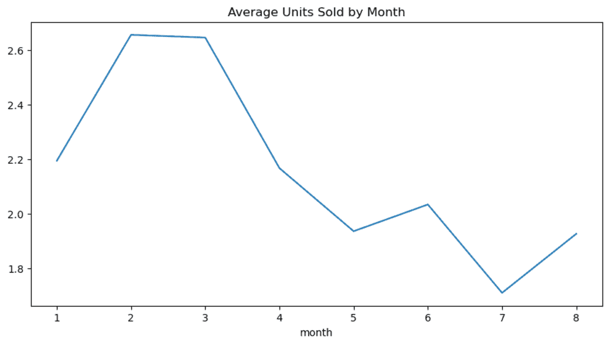
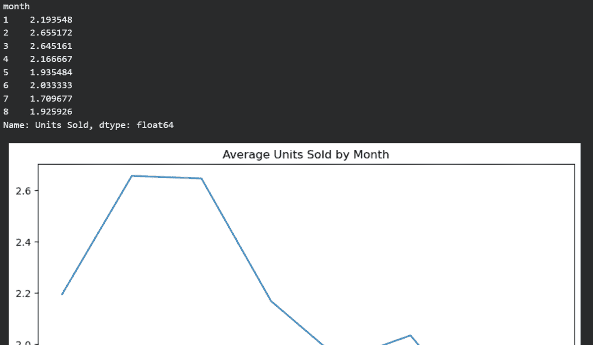
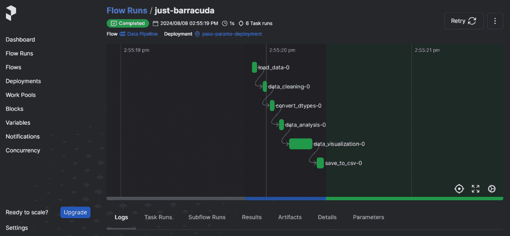

# 使用 Prefect 构建数据管道

> 原文：[`www.kdnuggets.com/building-data-pipeline-with-prefect`](https://www.kdnuggets.com/building-data-pipeline-with-prefect)


图片来源：作者 | Canva

在本教程中，我们将学习 Prefect，这是一款现代工作流编排工具。我们将从使用 Pandas 构建数据管道开始，然后将其与 Prefect 工作流进行比较，以便更好地理解。最后，我们将部署我们的工作流并在仪表板上查看运行日志。

* * *

## 我们的前三名课程推荐

 1\. [谷歌网络安全证书](https://www.kdnuggets.com/google-cybersecurity) - 快速进入网络安全职业道路

 2\. [谷歌数据分析专业证书](https://www.kdnuggets.com/google-data-analytics) - 提升你的数据分析技能

 3\. [谷歌 IT 支持专业证书](https://www.kdnuggets.com/google-itsupport) - 支持你的组织进行 IT 工作

* * *

## 什么是 Prefect？

[Prefect](https://www.prefect.io/) 是一个工作流管理系统，旨在协调和管理复杂的数据工作流，包括机器学习（ML）管道。它提供了一个构建、调度和监控工作流的框架，使其成为管理 ML 操作（MLOps）的重要工具。

Prefect 提供任务和流程管理，允许用户定义依赖关系并高效地执行工作流。具有状态管理和可观察性等功能，Prefect 提供有关任务状态和历史的洞察，帮助调试和优化。它配备了一个高度互动的仪表板，让你可以安排、监控和集成各种其他功能，这些功能将改善你的 MLOps 流程。你甚至可以通过几次点击设置通知和集成其他 ML 框架。

Prefect 作为一个开源框架和托管云服务提供，进一步简化了你的工作流程。

## 使用 Pandas 构建数据管道

我们将复制我在之前教程中使用的数据管道（使用 Pandas 构建数据科学管道—KDnuggets），以便你了解每个任务在管道中的工作方式以及如何将它们结合起来。我在这里提到它，以便你可以清楚地比较完美的数据管道与普通管道的区别。

```py
import pandas as pd

def load_data(path):
    return pd.read_csv(path)

def data_cleaning(data):
    data = data.drop_duplicates()
    data = data.dropna()
    data = data.reset_index(drop=True)
    return data

def convert_dtypes(data, types_dict=None):
    data = data.astype(dtype=types_dict)
    ## convert the date column to datetime
    data["Date"] = pd.to_datetime(data["Date"])
    return data

def data_analysis(data):
    data["month"] = data["Date"].dt.month
    new_df = data.groupby("month")["Units Sold"].mean()
    return new_df

def data_visualization(new_df, vis_type="bar"):
    new_df.plot(kind=vis_type, figsize=(10, 5), title="Average Units Sold by Month")
    return new_df

path = "Online Sales Data.csv"
df = (
    pd.DataFrame()
    .pipe(lambda x: load_data(path))
    .pipe(data_cleaning)
    .pipe(convert_dtypes, {"Product Category": "str", "Product Name": "str"})
    .pipe(data_analysis)
    .pipe(data_visualization, "line")
)
```

当我们运行上述代码时，每个任务将按顺序运行并生成数据可视化。除此之外，它不会做其他事情。我们可以安排它、查看运行日志，甚至集成第三方工具进行通知或监控。



## 使用 Prefect 构建数据管道

现在我们将使用相同的数据集 [在线销售数据集 - 热门市场数据](https://www.kaggle.com/datasets/shreyanshverma27/online-sales-dataset-popular-marketplace-data) 来构建相同的管道，但使用 Prefect。我们将首先使用 PIP 命令安装 Prefect 库。

```py
$ pip install prefect
```

如果你查看下面的代码，你会发现实际上没有什么变化。函数是相同的，只是增加了 Python 装饰器。每一步的管道都有 `@task` 装饰器，而组合这些步骤的管道有 `@flow` 装饰器。此外，我们还保存了生成的图形。

```py
import pandas as pd
import matplotlib.pyplot as plt
from prefect import task, flow

@task
def load_data(path):
    return pd.read_csv(path)

@task
def data_cleaning(data):
    data = data.drop_duplicates()
    data = data.dropna()
    data = data.reset_index(drop=True)
    return data

@task
def convert_dtypes(data, types_dict=None):
    data = data.astype(dtype=types_dict)
    data["Date"] = pd.to_datetime(data["Date"])
    return data

@task
def data_analysis(data):
    data["month"] = data["Date"].dt.month
    new_df = data.groupby("month")["Units Sold"].mean()
    return new_df

@task
def data_visualization(new_df, vis_type="bar"):

    new_df.plot(kind=vis_type, figsize=(10, 5), title="Average Units Sold by Month")
    plt.savefig("average_units_sold_by_month.png")
    return new_df

@flow(name="Data Pipeline")
def data_pipeline(path: str):
    df = load_data(path)
    df_cleaned = data_cleaning(df)
    df_converted = convert_dtypes(
        df_cleaned, {"Product Category": "str", "Product Name": "str"}
    )
    analysis_result = data_analysis(df_converted)
    new_df = data_visualization(analysis_result, "line")
    return new_df

# Run the flow!
if __name__ == "__main__":
    new_df = data_pipeline("Online Sales Data.csv")
    print(new_df)
```

我们将通过提供 CSV 文件的位置来运行数据管道。它将按顺序执行所有步骤并生成运行状态的日志。

```py
14:18:48.649 | INFO    | prefect.engine - Created flow run 'enlightened-dingo' for flow 'Data Pipeline'
14:18:48.816 | INFO    | Flow run 'enlightened-dingo' - Created task run 'load_data-0' for task 'load_data'
14:18:48.822 | INFO    | Flow run 'enlightened-dingo' - Executing 'load_data-0' immediately...
14:18:48.990 | INFO    | Task run 'load_data-0' - Finished in state Completed()
14:18:49.052 | INFO    | Flow run 'enlightened-dingo' - Created task run 'data_cleaning-0' for task 'data_cleaning'
14:18:49.053 | INFO    | Flow run 'enlightened-dingo' - Executing 'data_cleaning-0' immediately...
14:18:49.226 | INFO    | Task run 'data_cleaning-0' - Finished in state Completed()
14:18:49.283 | INFO    | Flow run 'enlightened-dingo' - Created task run 'convert_dtypes-0' for task 'convert_dtypes'
14:18:49.288 | INFO    | Flow run 'enlightened-dingo' - Executing 'convert_dtypes-0' immediately...
14:18:49.441 | INFO    | Task run 'convert_dtypes-0' - Finished in state Completed()
14:18:49.506 | INFO    | Flow run 'enlightened-dingo' - Created task run 'data_analysis-0' for task 'data_analysis'
14:18:49.510 | INFO    | Flow run 'enlightened-dingo' - Executing 'data_analysis-0' immediately...
14:18:49.684 | INFO    | Task run 'data_analysis-0' - Finished in state Completed()
14:18:49.753 | INFO    | Flow run 'enlightened-dingo' - Created task run 'data_visualization-0' for task 'data_visualization'
14:18:49.760 | INFO    | Flow run 'enlightened-dingo' - Executing 'data_visualization-0' immediately...
14:18:50.087 | INFO    | Task run 'data_visualization-0' - Finished in state Completed()
14:18:50.144 | INFO    | Flow run 'enlightened-dingo' - Finished in state Completed()
```

最终，你将获得转换后的数据框和可视化结果。



## 部署 Prefect 管道

为了部署 Prefect 管道，我们需要首先将代码库移动到 Python 文件 `data_pipe.py`。之后，我们将修改运行管道的方式。我们将使用 `.server` 函数来部署管道，并将 CSV 文件作为参数传递给该函数。

**data_pipe.py：**

```py
import pandas as pd
import matplotlib.pyplot as plt
from prefect import task, flow

@task
def load_data(path: str) -> pd.DataFrame:
    return pd.read_csv(path)

@task
def data_cleaning(data: pd.DataFrame) -> pd.DataFrame:
    data = data.drop_duplicates()
    data = data.dropna()
    data = data.reset_index(drop=True)
    return data

@task
def convert_dtypes(data: pd.DataFrame, types_dict: dict = None) -> pd.DataFrame:
    data = data.astype(dtype=types_dict)
    data["Date"] = pd.to_datetime(data["Date"])
    return data

@task
def data_analysis(data: pd.DataFrame) -> pd.DataFrame:
    data["month"] = data["Date"].dt.month
    new_df = data.groupby("month")["Units Sold"].mean()
    return new_df

@task
def data_visualization(new_df: pd.DataFrame, vis_type: str = "bar") -> pd.DataFrame:
    new_df.plot(kind=vis_type, figsize=(10, 5), title="Average Units Sold by Month")
    plt.savefig("average_units_sold_by_month.png")
    return new_df

@task
def save_to_csv(df: pd.DataFrame, filename: str):
    df.to_csv(filename, index=False)
    return filename

@flow(name="Data Pipeline")
def run_pipeline(path: str):
    df = load_data(path)
    df_cleaned = data_cleaning(df)
    df_converted = convert_dtypes(
        df_cleaned, {"Product Category": "str", "Product Name": "str"}
    )
    analysis_result = data_analysis(df_converted)
    data_visualization(analysis_result, "line")
    save_to_csv(analysis_result, "average_units_sold_by_month.csv")

# Run the flow
if __name__ == "__main__":
    run_pipeline.serve(
        name="pass-params-deployment",
        parameters=dict(path="Online Sales Data.csv"),
    )
```

```py
$ python data_pipe.py 
```

当我们运行 Python 文件时，会收到一条消息，说明要运行已部署的管道，我们需要使用以下命令：


启动一个新的终端窗口并输入命令以触发此流的运行。

```py
$ prefect deployment run 'Data Pipeline/pass-params-deployment'
```

正如我们所见，流运行已启动，这意味着管道在后台运行。我们始终可以回到第一个终端窗口以查看日志。


要在仪表板中查看日志，我们需要通过输入以下命令来启动 Prefect 仪表板：

```py
$ prefect server start 
```

点击仪表板链接以在您的网络浏览器中启动仪表板。


仪表板包含各种选项卡和与管道、工作流以及运行相关的信息。要查看当前运行，请导航到“流运行”选项卡并选择最新的流运行。



所有源代码、数据和信息都可以在 [Kingabzpro/Data-Pipeline-with-Prefect](https://github.com/kingabzpro/Data-Pipeline-with-Prefect) GitHub 仓库中找到。请不要忘记 ⭐ 赞一下。

## 结论

使用适当的工具构建数据管道对于扩展数据工作流和避免不必要的故障是必要的。通过使用 Prefect，你可以调度运行、调试管道，并将其与多个你已经使用的第三方工具集成。它易于使用，并且具有许多你会喜欢的功能。如果你是 Prefect 的新手，我强烈推荐查看 Prefect Cloud。他们提供免费的小时数，让用户体验云平台并熟悉工作流管理系统。

[](https://www.polywork.com/kingabzpro)****[Abid Ali Awan](https://www.polywork.com/kingabzpro)**** ([@1abidaliawan](https://www.linkedin.com/in/1abidaliawan)) 是一位认证的数据科学专业人士，热衷于构建机器学习模型。目前，他专注于内容创作，并撰写关于机器学习和数据科学技术的技术博客。Abid 拥有技术管理硕士学位和电信工程学士学位。他的愿景是使用图神经网络构建一个 AI 产品，以帮助面临心理健康问题的学生。

### 更多相关内容

+   [使用 Prefect 在 Python 中协调数据科学项目](https://www.kdnuggets.com/2022/02/orchestrate-data-science-project-python-prefect.html)

+   [使用 Kafka 和 Risingwave 构建 Formula 1 流数据管道](https://www.kdnuggets.com/building-a-formula-1-streaming-data-pipeline-with-kafka-and-risingwave)

+   [构建可处理的多变量特征工程管道…](https://www.kdnuggets.com/2022/03/building-tractable-feature-engineering-pipeline-multivariate-time-series.html)

+   [使用 Bash 构建你的第一个 ETL 管道](https://www.kdnuggets.com/building-your-first-etl-pipeline-with-bash)

+   [构建供应链管道所需的 6 种数据科学技术](https://www.kdnuggets.com/2022/01/6-data-science-technologies-need-build-supply-chain-pipeline.html)

+   [使用 Pandas 管道简化数据处理](https://www.kdnuggets.com/2022/08/simplify-data-processing-pandas-pipeline.html)
