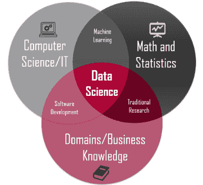
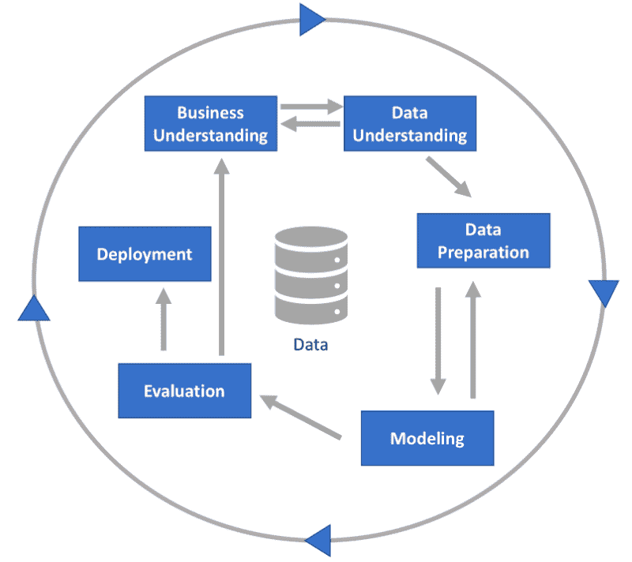
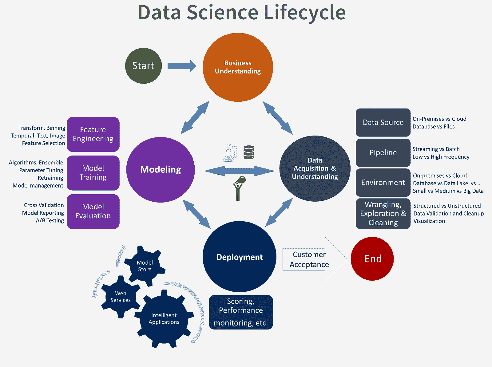
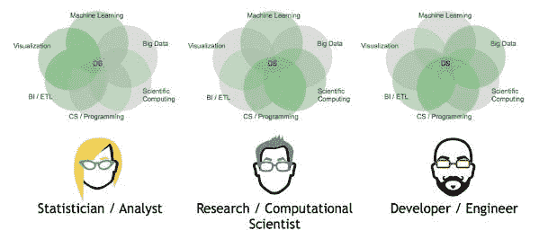
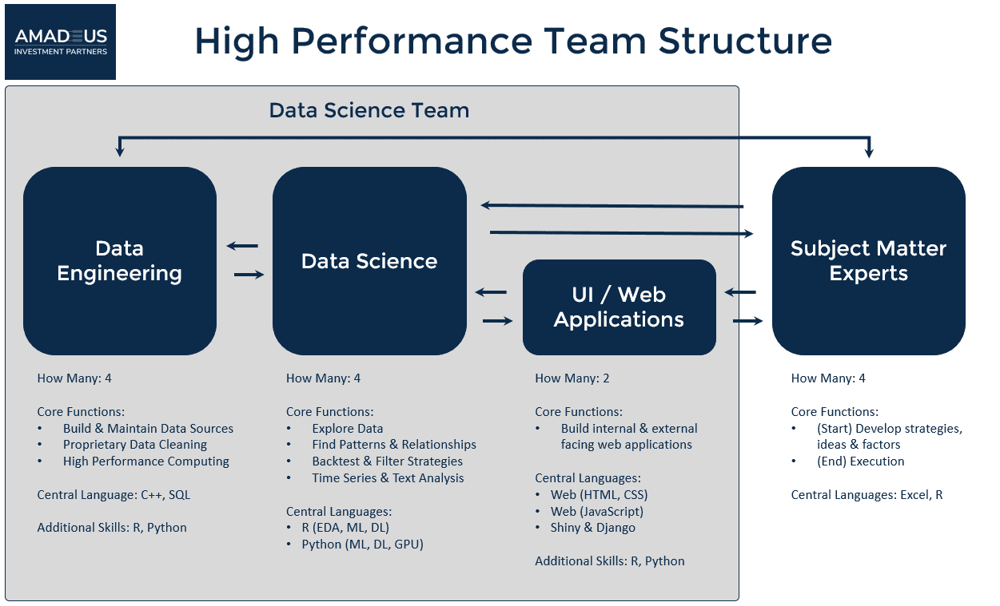

# 关于构建有效的数据科学团队

> 原文：[`www.kdnuggets.com/2019/03/building-effective-data-science-teams.html`](https://www.kdnuggets.com/2019/03/building-effective-data-science-teams.html)

 评论

**由 [Saurav Dhungana](https://twitter.com/sauravD) 创始人 @craftdatalabs**。

* * *

## 我们的前三名课程推荐

 1\. [谷歌网络安全证书](https://www.kdnuggets.com/google-cybersecurity) - 快速进入网络安全职业生涯。

 2\. [谷歌数据分析专业证书](https://www.kdnuggets.com/google-data-analytics) - 提升你的数据分析能力

 3\. [谷歌 IT 支持专业证书](https://www.kdnuggets.com/google-itsupport) - 支持你所在组织的 IT

* * *

随着数据科学和 AI 进入几乎所有行业，构建能够成功实施 AI 项目的团队的挑战也随之而来。对那种完美融合了统计学家、程序员和沟通者的“数据科学家”的需求从未如此之高。但随着尘埃落定，我们开始听到关于 [失败](http://analytics-magazine.org/the-data-economy-why-do-so-many-analytics-projects-fail/)项目和 [失望](https://www.techinasia.com/talk/many-data-scientists-leaving)专业人士的故事。

你可能听说过一些高价组建的专家团队一次次失败。作为一名在多个行业工作的数据科学顾问，我有机会亲眼见证了这种趋势。许多人倾向于认为数据科学是一个新兴领域，并预期它在成为主流的过程中会有成长的阵痛，但我们忘记了这个领域的起源。这是我通过自己的经历反思成功数据团队的特质，并帮助商业领袖和高管制定更好的 AI 策略的尝试。

### 不要忘记你的根基

首先，我们需要将数据科学视为现有学科的自然演变，而不是全新领域。毕竟，在计算机时代开始之前，我们就已经在处理数据，而 AI 的概念至少从 1960 年代就存在。其他学科如数据库中的知识发现、决策支持系统、商业智能、数据挖掘、分析、预测分析等已经存在很长时间。它们的主要目标是从数据中提取有意义的模式，并利用这些模式获得洞察力并为未来做出决策。

数据科学是这种趋势的最新体现，这一趋势得益于互联网时代可用数据量和种类的急剧增加。它还受到相对便宜的计算能力和机器学习算法的新突破的推动，这些突破能够利用这些丰富的数据。这些新算法的复杂性和数学精细程度进一步产生了对能够理解它们的高级学位人员的突然需求，因此人工智能竞赛开始了。

尽管这项技术看起来很新颖，但我坚信我们可以从神话和较早学科中遵循的最佳实践中学到很多。

#### CRISP-DM

最明显且经常被忽视的工具是[CRISP-DM](https://en.wikipedia.org/wiki/Cross-industry_standard_process_for_data_mining)标准。这是一个自 1990 年代以来存在的结构化分析项目的工业流程。

主要思想是将分析项目分为几个明确的阶段。这些阶段是——**业务理解**、**数据理解**、**数据准备**、**建模**、**评估**和**部署**。

**照片：Luminus**

尽管这个过程有一些不足之处，并且标准最近没有更新，但这六个阶段仍然很有用。在我看来，每个数据专业人士都应该阅读并理解这些阶段，以真正发挥作用。

#### Team Data Science Process (TDSP)

数据科学是一个本质上迭代的过程，CRISP-DM 的主要缺点是它没有很好地融入这一点。

[TDSP](https://docs.microsoft.com/en-us/azure/machine-learning/team-data-science-process/overview)是微软的一种现代数据科学生命周期过程，它在旧方法上进行了改进。可以把它看作是 CRISP-DM 在云计算时代进行敏捷开发改造的结果。

照片：Microsoft

你的公司可能有根据你所做的工作量身定制的过程，但了解这些基础流程真的很有帮助。

#### 秘密成分？

好吧，这有点儿是个 trick question。我看到很多公司常常过于关注最新和最先进的算法和计算处理器，而忽视了**数据**。我们可能有大量的数据，但这些数据的质量不是理所当然的。好数据仍然很难收集，因此可能成为你所拥有的主要竞争优势。最好的算法无法保证好的模型，除非你提供好的数据。正如人们所说——垃圾进，垃圾出。

人工智能最被忽视的方面之一是大多数算法通过开源软件或通过云服务以非常低的成本提供。可以说，人工智能算法已经或将通过这些库和服务商品化。

我的建议是首先将你的数据科学路线图拆分为每个人都同意的简单应用案例，这些案例可以在几周内实现。同时确保数据是可以获取的，投资回报和/或交付物是明确定义的，并且数据团队遵循迭代执行的过程。

在你从这些循环中学到了一些经验后，你将更好地应对更复杂和风险更大的应用案例。

### A 团队

现在我们已经讨论了如何规划我们的数据科学项目，我想谈谈如何创建一个数据团队来执行这些计划。我不会深入探讨像在哪里招聘或招聘流程应该如何的问题，而是关注团队的正确组成。

**照片：Hudson UK**

正如我在本文开头提到的，关于数据科学家的定义或职责存在许多困惑。考虑到这一职位的声望，任何曾经从事数据工作的人似乎都把它写在了简历上。我认为是时候摆脱这一点，根据人们实际做的工作来制定专业的职位名称了。

就像我们不期望医生知道每一种医疗程序或诊断一样，我们也不应该期望有人在人工智能领域精通一切。我们必须有专业人员，他们了解自己技能和职责的边界，并能够与他人合作完成任务。当然，这并不意味着没有人能在多个领域表现出色或成为通才，就像我们在医学中有全科医生一样。数据科学在很大程度上是一项团队运动。

**照片：Business Science**

由于数据是任何数据科学战略中最重要的元素，首先你需要的是**数据工程师**。数据工程师通常是那些具备良好的编程和硬件技能的人，能够构建你的数据基础设施。根据你的数据规模，他们通常能熟练操作大数据和云技术，知道如何构建数据管道、设计数据库并从中提取数据。他们会知道如何在基本层面查看数据，并进行简单的汇总以检查数据质量，但不一定擅长分析数据。

在建立好数据基础设施后，你将需要能够处理这些数据的人，他们需要清理、分析数据、进行实验并传达结果。根据你的业务需求，具体的技能要求有所不同。大多数情况下，这项工作由擅长数据处理和清理、创建统计推断或预测模型、运行实验、绘制结果、制作报告并向高层利益相关者提供见解的**数据分析师**来完成。他们通常会在 Jupyter notebook 或 Rstudio 中工作，具备编程、统计学和机器学习的知识。然而，我们不应该期望他们编写生产级别的代码。

这引出了下一个角色。如果你正在建立一个数据产品，你的团队中需要有**机器学习工程师**。这些人不是那些构建机器学习算法的研究人员，而是数据驱动的软件开发人员，他们熟悉各种数据科学库，并知道如何基于分析师开发的模型编写生产级别的代码。为了完成这项工作，他们必须与数据工程师密切合作，或者在较小的团队中，也可以由数学背景强的数据工程师来完成。希望进入数据科学领域的大多数开发人员应该考虑这是一个很好的职业选择。

有时候，拥有一位更注重设计的**数据可视化专家**来制作高度精致的图表和报告以传达分析结果也是很有用的。

我倾向于认为**数据科学家**是那些在所有上述角色中都表现优于平均水平的人，并且知道如何与**领域专家**合作以交付结果。这些领域专家通常是你团队或组织之外的合作者，你将他们引入来利用他们在医学、金融、经济学、市场营销、法律等领域的专业知识。

如果你在处理需要一些定制或专有数据科学算法的问题时，可能就需要雇佣具有博士学位或核心研究背景的人。他们可能对像对话 AI、计算机视觉、机器人学、强化学习、图形模型等 AI 领域的理论和算法有深刻的理解。我个人倾向于称这种角色为**研究工程师**或**研究科学家**。

数据科学团队中另一个重要但较少讨论的角色是**数据科学经理**或**数据科学负责人**。对于较小的团队，拥有一位对所有不同角色有深入了解的资深团队成员来领导团队可能就足够了。但一旦团队扩大，你可能需要拥有强大技术和商业战略背景的人。

数据科学经理是实践型领导者，他们将构建你数据科学战略的基础，招募并组建你的团队，确保每个人之间的互动，获得所需的数据和信息，并制定整个团队可以遵循的流程。他们是数据团队与组织其他部分、合作者和高管的接口。他们将复杂的人工智能术语翻译成非专家能够理解的语言，并确保他们的工作与组织整体战略保持一致。

经理还需要扮演一个常被忽视的重要角色，那就是制定团队的[**数据治理**](https://en.wikipedia.org/wiki/Data_governance)**和**[**伦理**](https://en.wikipedia.org/wiki/Big_data_ethics)标准。大多数进入这个领域的专业人士都学到了执行工作的技术技能，但我很少看到关于数据隐私和分析结果伦理沟通的重要性被提及。这导致了如[Facebook 丑闻](https://en.wikipedia.org/wiki/Facebook%E2%80%93Cambridge_Analytica_data_scandal)这样的案例，使我们的领域名誉受损。在我看来，拥有一个了解并执行这些价值观的团队成员，是让你在同行中脱颖而出的关键。

这些是我对成功的数据科学团队的看法。主要的要点是——如果我们从简单的战略开始，选择正确的人才在合适的时间，利用从之前领域中积累的知识，并制定最适合你的团队和目标的流程，那么没有理由你不能成为一个有效的数据驱动型组织。

**简介**：[Saurav Dhungana](https://twitter.com/sauravD)是一位经验丰富的数据科学和数据可视化专家，也是@craftdatalabs 的创始人。

[原文](https://medium.com/craftdata-labs/on-building-effective-data-science-teams-4813a4b82939)。经许可转载。

**资源：**

+   [在线和基于网络的：分析、数据挖掘、数据科学、机器学习教育](https://www.kdnuggets.com/education/online.html)

+   [分析、数据科学、数据挖掘和机器学习的软件](https://www.kdnuggets.com/software/index.html)

**相关：**

+   [分析工程师——数据团队中的新角色](https://www.kdnuggets.com/2019/02/analytics-engineer-data-team.html)

+   [如何在你不是谷歌或 Facebook 时建立机器学习团队](https://www.kdnuggets.com/2018/11/machine-learning-team-when-not-google-facebook.html)

+   [打造成功数据科学团队的制胜计划](https://www.kdnuggets.com/2018/09/winning-game-plan-building-data-science-team.html)

### 更多相关主题

+   [AI 的人才管理：构建高效能 AI 团队](https://www.kdnuggets.com/2022/03/people-management-ai-building-highvelocity-ai-teams.html)

+   [管理数据科学团队的 5 个技巧](https://www.kdnuggets.com/5-tips-for-managing-data-science-teams)

+   [有效的数据科学经理的五个迹象](https://www.kdnuggets.com/2022/06/five-signs-effective-data-science-manager.html)

+   [赢得会议：创建和呈现有效的数据驱动…](https://www.kdnuggets.com/2022/04/franks-winning-room-creating-delivering-effective-data-driven-presentation.html)

+   [为有效的 Tableau 和 Power BI 仪表盘准备数据](https://www.kdnuggets.com/2022/06/prepare-data-effective-tableau-power-bi-dashboards.html)

+   [数据可视化最佳实践与有效沟通资源](https://www.kdnuggets.com/2023/04/data-visualization-best-practices-resources-effective-communication.html)
