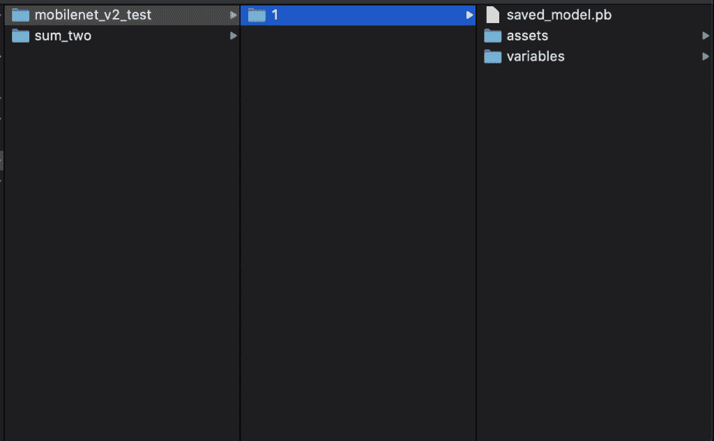

# 使用 Tensorflow Serving 构建 REST API（第一部分）

> 原文：[`www.kdnuggets.com/2020/07/building-rest-api-tensorflow-serving-part-1.html`](https://www.kdnuggets.com/2020/07/building-rest-api-tensorflow-serving-part-1.html)

评论

**由 [Guillermo Gomez](https://www.linkedin.com/in/mlgxmez/)，数据科学家和机器学习工程师**


### 什么是 Tensorflow Serving？

我个人认为 Tensorflow 中一个被低估的功能是服务 Tensorflow 模型的能力。在撰写这篇文章时，帮助你做到这一点的 API 叫做 Tensorflow Serving，并且是 Tensorflow Extended 生态系统的一部分，简称 TFX。

在 Tensorflow Serving 的第一次发布期间，我发现文档有些令人生畏。还有许多数据科学家不太习惯使用的概念：*服务对象、来源、加载器、管理器……* 所有这些元素都是 Tensorflow Serving 架构的一部分。更多细节，见[这里](https://github.com/tensorflow/serving/blob/master/tensorflow_serving/g3doc/architecture.md)。

因此，作为一个简单的介绍，我将向你展示**如何使用 Tensorflow Serving 构建 REST API**。从保存 Tensorflow 对象（这就是我们所说的*可服务对象*）到测试 API 端点。第一部分将解释如何创建和保存准备投入生产的 Tensorflow 对象。

### 服务对象的含义

函数、嵌入或保存的模型是可以作为服务对象使用的一些对象。那么我们如何在 Tensorflow 中定义这些服务对象呢？

好吧，这取决于你，但它们必须能够保存为所谓的**SavedModel 格式**。这种格式在我们将对象加载到新环境中时，能够保持 Tensorflow 对象的所有组件处于相同状态。这些组件是什么？相关的有：权重、图、附加资产等。

用于保存 Tensorflow 对象的模块是 `tf.saved_model`。正如我们将很快看到的那样，它使用起来很简单。现在，让我们看看如何生成两种类型的服务对象：

+   Tensorflow 函数

+   Keras 模型

### TensorFlow 函数作为可服务对象

如果 Tensorflow 函数是这样定义的，它们会被保存为有效的服务对象：

```py
class Adder(tf.Module):
    @tf.function(input_signature=[tf.TensorSpec(shape=[None,3], dtype=tf.float32, name="x")])
    def sum_two(self, x):
        return x + 2
```

+   类内部的函数定义

+   父类必须是 `tf.Module`

+   `@tf.function` 装饰器以某种方式**将函数定义转换为 Tensorflow 图**

+   `input_signature` 参数定义了函数接受的张量的类型和形状

在这种情况下，我们指定了两个维度的张量，第二维被固定为三个元素，而类型将是 `float32`。另一个 Tensorflow 函数的示例是：

```py
class Randomizer(tf.Module):
    @tf.function
    def fun_runif(self, N):
        return tf.random.uniform(shape=(N,))
```

注意，`input_signature` 参数并不是必须的，但在函数投入生产时，包含一些安全测试总是好的。

后续，我们创建类的实例并保存它们：

```py
# For the first function
myfun = Adder()
tf.saved_model.save(myfun, "tmp/sum_two/1")

# For the second function
myfun2 = Randomizer()
tf.saved_model.save(myfun2, "tmp/fun_runif/1")
```

`tf.saved_model.save`的第一个参数指向类的实例对象，而第二个参数是本地文件系统中的路径，模型将在该路径下保存。

### 可服务的 Keras 模型

你可以采用类似的程序来保存 Keras 模型。这个示例关注于一个预训练的图像分类模型，它通过 TensorFlow Hub 加载。此外，我们将围绕它构建一个自定义类来预处理输入图像。

```py
class CustomMobileNet_string(tf.keras.Model):
    model_handler = "https://tfhub.dev/google/imagenet/mobilenet_v2_035_224/classification/4"

    def __init__(self):
        super(CustomMobileNet_string, self).__init__()
        self.model = hub.load(self.__class__.model_handler)
        self.labels = None

    # Design you API with 'tf.function' decorator
    @tf.function(input_signature=[tf.TensorSpec(shape=None, dtype=tf.string)])
    def call(self, input_img):
        def _preprocess(img_file):
            img_bytes = tf.reshape(img_file, [])
            img = tf.io.decode_jpeg(img_bytes, channels=3)
            img = tf.image.convert_image_dtype(img, tf.float32)
            return tf.image.resize(img, (224, 224))

        labels = tf.io.read_file(self.labels)
        labels = tf.strings.split(labels, sep='\n')
        img = _preprocess(input_img)[tf.newaxis,:]
        logits = self.model(img)
        get_class = lambda x: labels[tf.argmax(x)]
        class_text = tf.map_fn(get_class, logits, tf.string)
        return class_text # index of the class
```

该类继承自`tf.keras.Model`，关于它有几点需要讨论：

1.  模型的输入是一个字节字符串，这些字节以 JSON 文件的形式出现，其中包含特定的键|值对。有关更多信息，请参见教程的第二部分。

1.  `tf.reshape`是预处理阶段的第一个函数，因为图像被放入 JSON 文件中的数组中。由于我们使用了`@tf.function`对输入进行限制，因此需要进行这种转换。

1.  属性`labels`存储了*ImageNet*的图像标签（可在[这里](https://storage.googleapis.com/download.tensorflow.org/data/ImageNetLabels.txt)获取）。我们希望模型输出的是文本格式的标签，而不是模型输出层的标签索引。其定义方式的原因如下所述。

像往常一样，我们遵循相同的程序保存模型，但有所增加：

```py
model_string = CustomMobileNet_string()
# Save the image labels as an asset, saved in 'Assets' folder
model_string.labels = tf.saved_model.Asset("data/labels/ImageNetLabels.txt")
tf.saved_model.save(model_string, "tmp/mobilenet_v2_test/1/")

```

为了将额外的组件存储到 SavedModel 对象中，我们必须定义一个资产。我们使用`tf.saved_model.Asset`来实现，我在类定义之外调用此函数以使其更为明确。如果我们在类定义中进行，也可能会以相同的方式工作。**请注意，我们必须在保存模型之前将资产作为类实例的属性保存。**

### 进一步的细节

这些是我们在保存自定义 Keras 模型时在本地文件系统中生成的文件夹。



生成的文件有：

+   函数或模型的图形，保存在扩展名为`.pb`的 Protobuf 文件中。

+   模型的权重或在可服务的过程中使用的任何 TensorFlow 变量，保存在`variables`文件夹中。

+   额外的组件保存在`assets`文件夹中，但在我们的示例中是空的。

在构建自己的函数或模型时，可能会出现一些问题：

+   **选择父类的理由是什么？** 将`tf.Module`类附加到`tf.function`上允许后者使用`tf.saved_model`进行保存。`tf.keras.Model`也是如此。你可以在[这里](https://www.tensorflow.org/guide/saved_model#reusing_savedmodels_in_python)找到更多信息。

+   **为什么在模型路径中添加`/1`？** 可服务的模型必须有一个 ID，以指示我们在容器中运行的模型版本。这有助于在监控模型的指标时跟踪多个版本。你可以在以下[链接](https://stackoverflow.com/a/45552938)中找到更详细的解释。

目前就这些，谢谢阅读！

**简介：[Guillermo Gomez](https://www.linkedin.com/in/mlgxmez/)** 在公共基础设施和服务行业中构建基于机器学习的产品。他的网站上可以找到更多教程：[`thelongrun.blog`](http://thelongrun.blog)

[原文](https://thelongrun.blog/2020/01/12/rest-api-tensorflow-serving-pt1/)。经许可转载。

**相关内容：**

+   使用 torchlayers 轻松构建 PyTorch 模型

+   优化生产环境中机器学习 API 的响应时间

+   TensorFlow 2 入门

* * *

## 我们的前三大课程推荐

 1\. [谷歌网络安全证书](https://www.kdnuggets.com/google-cybersecurity) - 快速进入网络安全职业。

 2\. [谷歌数据分析专业证书](https://www.kdnuggets.com/google-data-analytics) - 提升你的数据分析技能

 3\. [谷歌 IT 支持专业证书](https://www.kdnuggets.com/google-itsupport) - 支持你的组织 IT

* * *

### 更多相关内容

+   [排名前 7 的模型部署和服务工具](https://www.kdnuggets.com/top-7-model-deployment-and-serving-tools)

+   [使用 TensorFlow 和 Keras 构建和训练你的第一个神经网络](https://www.kdnuggets.com/2023/05/building-training-first-neural-network-tensorflow-keras.html)

+   [构建视觉搜索引擎 - 第一部分：数据探索](https://www.kdnuggets.com/2022/02/building-visual-search-engine-part-1.html)

+   [构建视觉搜索引擎 - 第二部分：搜索引擎](https://www.kdnuggets.com/2022/02/building-visual-search-engine-part-2.html)

+   [OpenAI 的 Whisper API 用于转录和翻译](https://www.kdnuggets.com/2023/06/openai-whisper-api-transcription-translation.html)

+   [认识 Gorilla：UC 伯克利和微软的 API 增强型 LLM…](https://www.kdnuggets.com/2023/06/meet-gorilla-uc-berkeley-microsoft-apiaugmented-llm-outperforms-gpt4-chatgpt-claude.html)
