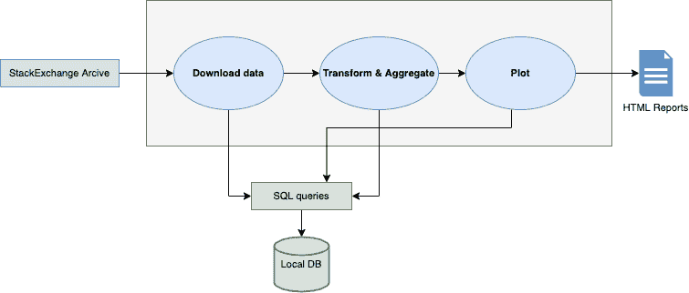

# 使用 SQL + Python 构建可扩展的 ETL

> 原文：[`www.kdnuggets.com/2022/04/building-scalable-etl-sql-python.html`](https://www.kdnuggets.com/2022/04/building-scalable-etl-sql-python.html)

在这篇简短的文章中，我们将构建一个模块化的 ETL 流水线，该流水线使用 SQL 转换数据，并使用 Python 和 R 进行可视化。这个流水线将以经济高效的方式实现完全可扩展。它可以在你的一些其他项目中复制使用。我们将利用一个示例数据集（StackExchange），查看如何将数据提取到特定格式，进行转换和清理，然后将其加载到数据库中，以便进行下游分析，比如分析报告或机器学习预测。如果你想直接查看实时示例，你可以在[ETL 模板这里](https://github.com/ploomber/projects/tree/master/templates/etl)查看整个流水线。我将回顾一下这个模板中的一些原则，并提供如何实现这些原则的深入了解。

**我们将涵盖的主要概念：**

+   通过 Python 连接到任何数据库。

+   [SQL 任务模板化](https://docs.ploomber.io/en/latest/user-guide/sql-templating.html)

+   并行化 - 使用 Ploomber 并行运行查询

+   通过 DAGs 进行协调

* * *

## 我们的前三个课程推荐

 1\. [Google 网络安全证书](https://www.kdnuggets.com/google-cybersecurity) - 快速进入网络安全职业生涯。

 2\. [Google 数据分析专业证书](https://www.kdnuggets.com/google-data-analytics) - 提升你的数据分析技能

 3\. [Google IT 支持专业证书](https://www.kdnuggets.com/google-itsupport) - 支持你的组织的 IT

* * *

# 架构图

我们将首先回顾一下我们流水线的整体架构和数据集，以更好地理解它是如何构建的以及我们可以通过这个演示流水线实现什么。



在这里我们可以看到流水线；它开始时提取我们的数据集并存储它（这个代码片段的来源可以在 preprocess/download.py 找到）：

```py
url = 'https://archive.org/download/stackexchange/arduino.stackexchange.com.7z'
urllib.request.urlretrieve(url, product['zipped'])
Path(product['extracted']).mkdir(exist_ok=True)
Archive(product['zipped']).extractall(product['extracted'])

```

使用 Ploomber，你可以参数化路径并在这些路径上创建依赖关系。我们可以看到每个输出，如提取和压缩的数据，如何被保存回 pipeline.yaml 中指定的任务路径。将这个组件拆分成模块化部分使我们能够更快地开发。下次流水线发生变化时，我们不需要重新运行这个任务，因为它的输出是缓存的。

# 提取、格式化和聚合

我们流水线中的下一个阶段是转换原始数据并进行聚合。我们已经通过一个 get_client 函数（取自 db.py）配置了客户端一次：

```py
def get_client(env):
  path = env.path.products_root / 'data.db'
  # create parent folders if they don't exist, otherwise sqlalchemy fails
  if not path.parent.exists():
      path.parent.mkdir(exist_ok=True, parents=True)
  return SQLAlchemyClient(f'sqlite:///{path}')

```

然后，我创建了利用这个客户端的 SQL 查询（我们可以看到这是一个本地数据库，但它依赖于用例并可以连接到 SQLAlchemy 支持的任何东西）。可以使用这个相同的客户端，也可以使用其他客户端进行聚合。在这个管道中，我将原始数据推送到 3 个不同的表中：**users、comments 和 posts**。我们将在下一节中讨论我使用了哪个模板以及它是如何工作的。

# SQL 作为模板

Ploomber 还有另一个功能，用户可以直接编写 SQL 查询，声明输入/输出文件，Ploomber 会将数据转储到正确的位置。这可以通过模板完全自动化，因此你可以有一个或多个客户端，多个输入或输出表，这使你可以专注于实际编写 SQL，而不是处理数据库客户端、连接字符串或无法重用的自定义脚本。

我们将看到的第一个示例与上一节相关——将我们的 CSV 上传为表（此代码片段取自 *pipeline.yaml*）：

```py
 - source: "{{path.products_root}}/data/Users.csv"
   name: upload-users
   class: SQLUpload
   product: [users, table]
   upstream: convert2csv
   to_sql_kwargs:
     if_exists: replace

```

我们可以看到，我们的源数据是刚从数据提取任务中获得的 `users.csv`，我们正在使用 SQLUpload 类上传 `users` 表。我们为获得的三个表（`users`、`comments` 和 `posts`）创建了这些任务。

现在，由于原始数据已加载到数据库中，我们希望创建一些聚合。为此，我们可以继续使用 `users` 表的示例，看看如何在我们的管道中利用 .sql 文件：

```py
- source: sql/upvotes-by-location.sql
  name: upvotes-by-location
  product: [upvotes_by_location, table]
  upstream: upload-users

```

我们可以看到我们的源是 *upvotes-by-location.sql*（就在本段下方），输出产品是另一个表 **upvotes_by_location**，它依赖于 **upload-users** 任务。

我们可以深入到 *./sql* 文件夹中的源代码：

```py
DROP TABLE IF EXISTS {{product}};
CREATE TABLE {{product}} AS
SELECT Location, AVG(upvotes) AS mean_upvotes
FROM {{upstream['upload-users']}}
GROUP BY Location
HAVING AVG(upvotes) > 1

```

在这里，我们正在覆盖表（从 pipeline.yaml 中参数化），按位置分组，并仅保留投票数为 1+ 的用户。将这些任务和表上传、聚合和分组的组件分开，也将允许我们并行化工作流程，加快速度——我们将在下文中讨论。我们示例管道中的最后一步是绘图任务，它将这些新创建的表可视化。

# 并行化和协调

拥有这种模板化项目的概念，协调 SQL 任务允许我们开发、测试和部署多个目的的数据集。在我们的示例中，我们在 3 个表上运行，具有有限的行数和列数。在企业环境中，例如，我们可以轻松扩展到 20+ 个表，拥有数百万行，这可能会成为按顺序运行的实际难题。


在我们的案例中，协调和并行化帮助我们专注于实际代码，这是主要任务，而不是基础设施。我们能够生成这 3 个独立的工作流程，并行运行它们，减少我们的洞察时间。

# 结论

在这篇文章中，我尝试覆盖 Ploomber 通过 ETL 管道（基于 SQL）所能提供的大多数软件工程最佳实践。这些概念，如模块化、代码重用和可移植性，可以节省大量时间，并提高团队的整体效率。我们总是欢迎反馈和问题，请务必亲自尝试，并分享你的经验。请加入我们的 Slack 频道获取更多更新或提出问题！

**[Ido Michael](https://www.linkedin.com/in/ido-michael/)** 共同创办了 Ploomber，旨在帮助数据科学家更快地构建数据管道。他曾在 AWS 担任数据工程/科学团队的负责人。在与客户的合作中，他与团队一起单独构建了数百条数据管道。他来自以色列，前往纽约在哥伦比亚大学攻读硕士学位。在不断发现项目将约 30% 的时间用于将开发工作（原型）重构为生产管道后，他专注于构建 Ploomber。

### 更多相关话题

+   [用 Bash 构建你的第一个 ETL 管道](https://www.kdnuggets.com/building-your-first-etl-pipeline-with-bash)

+   [通用化和可扩展的最优稀疏决策树（GOSDT）](https://www.kdnuggets.com/2023/02/generalized-scalable-optimal-sparse-decision-treesgosdt.html)

+   [如何使用 Apache Kafka 构建可扩展的数据架构](https://www.kdnuggets.com/2023/04/build-scalable-data-architecture-apache-kafka.html)

+   [SQL 和数据集成：ETL 和 ELT](https://www.kdnuggets.com/2023/01/sql-data-integration-etl-elt.html)

+   [2021 年最佳 ETL 工具](https://www.kdnuggets.com/2021/12/mozart-best-etl-tools-2021.html)

+   [ETL 与机器学习有什么关系？](https://www.kdnuggets.com/2022/08/etl-machine-learning.html)
