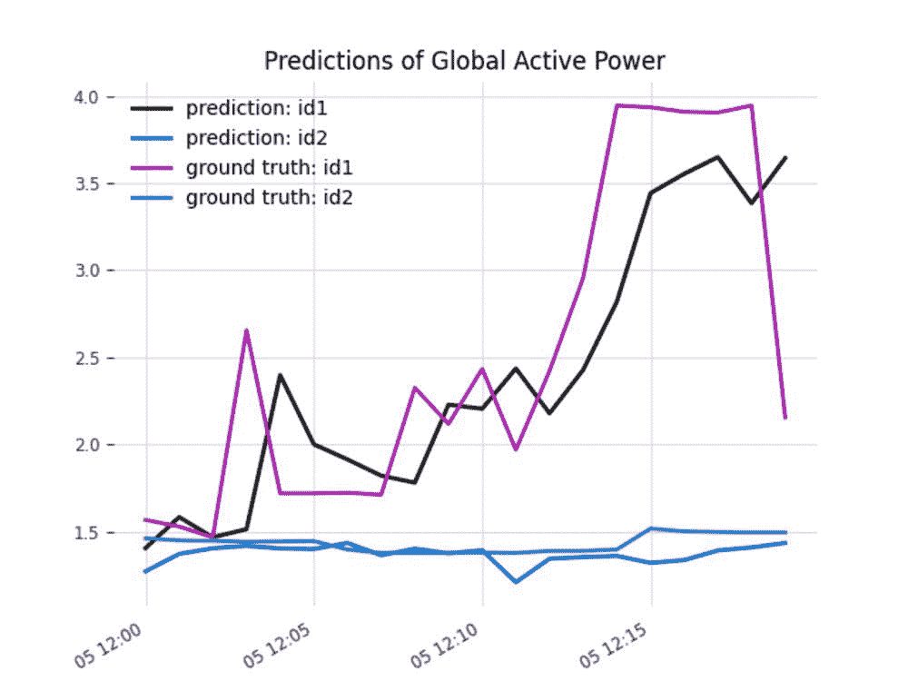

# 构建一个可处理的、多变量时间序列特征工程管道

> 原文：[`www.kdnuggets.com/2022/03/building-tractable-feature-engineering-pipeline-multivariate-time-series.html`](https://www.kdnuggets.com/2022/03/building-tractable-feature-engineering-pipeline-multivariate-time-series.html)

图片来源：[Christophe Dion](https://unsplash.com/@chris_dion?utm_source=unsplash&utm_medium=referral&utm_content=creditCopyText)于[Unsplash](https://unsplash.com/photos/3KA1M16PuoE)

精确的时间序列预测对于业务问题至关重要，例如预测制造中的材料属性变化和销售预测。现代预测技术包括使用像 Xgboost 这样的机器学习算法，在表格数据上构建回归模型来预测未来。表格数据允许回归模型通过利用与实际销售相关的非目标因素（如零售店的每日客流量）来进行预测。

* * *

## 我们的前三大课程推荐

 1\. [谷歌网络安全证书](https://www.kdnuggets.com/google-cybersecurity) - 快速进入网络安全职业生涯。

 2\. [谷歌数据分析专业证书](https://www.kdnuggets.com/google-data-analytics) - 提升你的数据分析能力。

 3\. [谷歌 IT 支持专业证书](https://www.kdnuggets.com/google-itsupport) - 为你的组织提供 IT 支持。

* * *

特征工程对于丰富影响预测准确性的因素至关重要。然而，构建一个时间序列特征工程管道并非易事，因为它涉及不同阶段的各种转换，例如窗口值的聚合。基于滚动窗口的特征，如“两周记录的平均值”，是基础却有效的预测工具，因此支持这种特征生成的管道是有价值的。此外，经过转换后的特征输出顺序可能会在转换过程中被打乱，这对特征追踪提出了挑战。在最终模型训练之前，追踪和验证管道中的转换特征至关重要。这个[github 仓库](https://github.com/JQGoh/multivariate_time_series_pipeline)提供了一个设计时间序列管道的示例，以满足上述需求，本文解释了一些实现这些需求的关键步骤。

基于 Scikit-learn 的转换器可能支持 *get_feature_names_out()* 函数，以提供其在转换后的输出名称。例如，[*OneHotEncoder 转换器*](https://scikit-learn.org/stable/modules/generated/sklearn.preprocessing.OneHotEncoder.html#sklearn.preprocessing.OneHotEncoder.get_feature_names_out) 具有此内置函数，但 *SimpleImputer* 转换器则没有。如果我们希望方便地检索输出名称，Scikit-learn 管道要求所有基础转换器支持 *get_feature_names_out()*。我们的解决方案是设计一个 FeatureNamesMixin 混入类，并结合 [工厂方法](https://realpython.com/factory-method-python/) 设计模式类 *TransformWithFeatureNamesFactory*，以使转换器具备 *get_feature_names_out()* 函数。

我们可以创建一个自定义的*SimpleImputer*，并将其作为 Scikit-learn Pipeline 的步骤或 ColumnTransformer 的一部分，如下所示。

这仅需要转换器类通过参数 *names* 初始化时指定任何所需的输出名称。

其他转换器也可以类似地自定义以支持检索输出名称，只要我们引入*get_feature_names_out()*。以下是一个[*TsfreshRollingMixin*](https://github.com/JQGoh/multivariate_time_series_pipeline/blob/8ca4c9bacc5ae8fcd27702066d7e47f422c30fd3/src/features/tsfresh_transformers.py#L15)类的示例，该类利用 TSFresh 库中的[*roll_time_series()*](https://tsfresh.readthedocs.io/en/latest/api/tsfresh.utilities.html#tsfresh.utilities.dataframe_functions.roll_time_series)实用函数来提取时间序列的滚动窗口。要跟踪派生的滚动窗口特征，我们只需将特征分配为[*derived_names*属性](https://github.com/JQGoh/multivariate_time_series_pipeline/blob/8ca4c9bacc5ae8fcd27702066d7e47f422c30fd3/src/features/tsfresh_transformers.py#L153-L168)。*TsfreshRollingMixin*类还包含其他辅助函数，如[*prepare_df()*](https://github.com/JQGoh/multivariate_time_series_pipeline/blob/ceeb3e3ad639e64c9bc905686e590658133b315c/src/features/tsfresh_transformers.py#L97)和[*get_combined()*](https://github.com/JQGoh/multivariate_time_series_pipeline/blob/ceeb3e3ad639e64c9bc905686e590658133b315c/src/features/tsfresh_transformers.py#L112)，以便将 numpy 数组转换为 pandas.DataFrame，并将派生特征与输入特征结合在一起。感兴趣的读者可以查看[代码库](https://github.com/JQGoh/multivariate_time_series_pipeline/blob/master/src/features/tsfresh_transformers.py)，更好地了解其实现。结合 TSFresh 的[*extract_features()*](https://tsfresh.readthedocs.io/en/latest/api/tsfresh.feature_extraction.html#tsfresh.feature_extraction.extraction.extract_features)，我们可以设计一个*TSFreshRollingTransformer*类，使我们能够指定相关的[TSFresh 参数](https://tsfresh.readthedocs.io/en/latest/text/feature_extraction_settings.html)，以派生所需的时间序列特征，如下所示。

我们将*TSFreshRollingTransformer*派生的特征标记为类似于**(window #)**的名称，以指示聚合窗口的大小。

除了 TSFresh 派生的时间序列特征，[*RollingLagsTrasformer*](https://github.com/JQGoh/multivariate_time_series_pipeline/blob/8ca4c9bacc5ae8fcd27702066d7e47f422c30fd3/src/features/tsfresh_transformers.py#L171)类展示了如何使用*TsfreshRollingMixin*类从给定的滚动窗口中提取滞后值，并将输出特征跟踪为**(lag #)**作为滞后顺序。其他在滚动窗口上执行的特定变换可以参考此示例，设计与可追踪管道兼容的转换器。

[这个脚本](https://github.com/JQGoh/multivariate_time_series_pipeline/blob/master/src/features/make_features.py)展示了如何使用上述变换器构建时间序列管道，以在不同阶段衍生特征。例如，从第一个管道提取的[特征](https://github.com/JQGoh/multivariate_time_series_pipeline/blob/8ca4c9bacc5ae8fcd27702066d7e47f422c30fd3/src/features/make_features.py#L73)有一个名为*Pre-MedianImputer__Global_intensity*的特征，用于指示原始特征“Global_intensity”是基于*SimpleImputer*使用中位数策略进行填补的。随后，衍生出的[滚动特征](https://github.com/JQGoh/multivariate_time_series_pipeline/blob/8ca4c9bacc5ae8fcd27702066d7e47f422c30fd3/src/features/make_features.py#L162)名称类似于*TSFreshRolling__Pre-MedianImputer–Global_intensity__maximum(window 30)*，表示在窗口大小为 30 步的范围内填补的“Global_intensity”的最大值。最后，滚动窗口特征将经过填补和标准化处理，[建议的名称](https://github.com/JQGoh/multivariate_time_series_pipeline/blob/8ca4c9bacc5ae8fcd27702066d7e47f422c30fd3/src/features/make_features.py#L213) *ImputeAndScaler__TSFreshRolling__Pre-MedianImputer–Global_intensity__median(window 30)* 指示原始特征“Global_intensity”已经经历了上述所有变换。我们可以方便地通过相关标记追踪管道提供的变换名称，并验证变换后的输出。

我们通过一个[示例](https://github.com/JQGoh/multivariate_time_series_pipeline/blob/master/src/models/train_and_predict.py)来补充这个演示，示例中使用了[Darts](https://github.com/unit8co/darts)包来构建线性回归模型进行预测。一旦管道准备好，就可以轻松加载输入数据集并相应地衍生特征。下图展示了基于从管道衍生特征训练的线性回归模型的预测结果。我们希望这篇文章能为读者提供一个基本模板，方便他们为时间序列预测用例构建时间序列管道。

基于设计管道中的工程特征的线性回归模型预测。图像由作者提供。

**[Jing Qiang Goh](https://twitter.com/JQGoh)** 是一位时间序列爱好者。

### 了解更多主题

+   [使用 BQML 进行多变量时间序列预测](https://www.kdnuggets.com/2023/07/multivariate-timeseries-prediction-bqml.html)

+   [特征存储峰会 2022：一场关于特征工程的免费会议](https://www.kdnuggets.com/2022/10/hopsworks-feature-store-summit-2022-free-conference-feature-engineering.html)

+   [构建 Formula 1 实时数据管道与 Kafka 和 Risingwave](https://www.kdnuggets.com/building-a-formula-1-streaming-data-pipeline-with-kafka-and-risingwave)

+   [使用 Bash 构建你的第一个 ETL 管道](https://www.kdnuggets.com/building-your-first-etl-pipeline-with-bash)

+   [使用 Prefect 构建数据管道](https://www.kdnuggets.com/building-data-pipeline-with-prefect)

+   [实时 AI 和机器学习的特征存储](https://www.kdnuggets.com/2022/03/feature-stores-realtime-ai-machine-learning.html)
