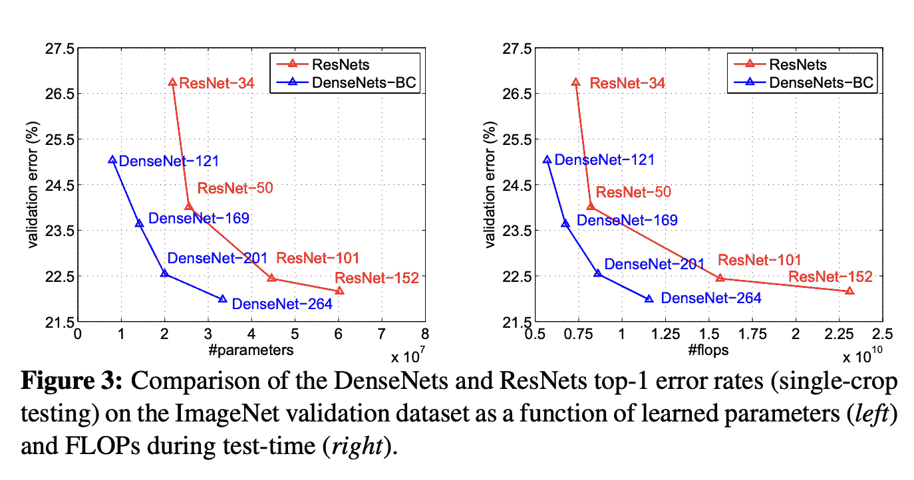
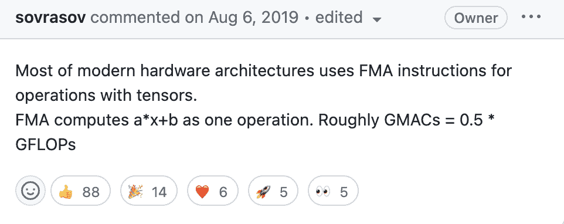

# 计算深度学习模型的计算效率：FLOPs 和 MACs

> 原文：[`www.kdnuggets.com/2023/06/calculate-computational-efficiency-deep-learning-models-flops-macs.html`](https://www.kdnuggets.com/2023/06/calculate-computational-efficiency-deep-learning-models-flops-macs.html)

# FLOPs 和 MACs 是什么？

* * *

## 我们的前三个课程推荐

 1\. [谷歌网络安全证书](https://www.kdnuggets.com/google-cybersecurity) - 快速开启网络安全职业生涯

 2\. [谷歌数据分析专业证书](https://www.kdnuggets.com/google-data-analytics) - 提升你的数据分析能力

 3\. [谷歌 IT 支持专业证书](https://www.kdnuggets.com/google-itsupport) - 支持你组织的 IT 需求

* * *

FLOPs（浮点运算）和 MACs（乘加运算）是常用来计算深度学习模型计算复杂性的指标。它们是一种快速且简单的方法来理解执行给定计算所需的算术操作数量。例如，在处理像[MobileNet](https://arxiv.org/pdf/1704.04861.pdf)或[DenseNet](https://arxiv.org/abs/1608.06993)这样的边缘设备模型架构时，人们使用 MACs 或 FLOPs 来估计模型性能。此外，我们使用“估计”这个词的原因是这两个指标是近似值，而不是实际的运行时性能模型。然而，它们仍能提供关于能耗或计算需求的有用见解，这在边缘计算中非常有用。



图 1：使用来自“密集连接卷积网络”的 FLOPs 比较不同神经网络

FLOPs 特指浮点运算次数，包括对浮点数的加法、减法、乘法和除法操作。这些操作在机器学习中的许多数学计算中很常见，例如矩阵乘法、激活函数和梯度计算。FLOPs 通常用于衡量模型或模型中某个操作的计算成本或复杂性。这在我们需要提供所需总算术运算估计时非常有用，这通常用于衡量计算效率的背景下。

MACs 则仅计算乘加操作的次数，这涉及将两个数字相乘并加上结果。这一操作是许多线性代数操作的基础，如矩阵乘法、卷积和点积。MACs 常被用作计算模型计算复杂度的更具体的度量，尤其是在严重依赖线性代数操作的模型中，例如卷积神经网络（CNNs）。

值得提到的是，FLOPs 不能作为人们计算计算效率的唯一因素。估计模型效率时，还需考虑许多其他因素。例如，系统设置的并行程度；模型的架构（例如，组卷积在 MACs 中的成本）；模型使用的计算平台（例如，Cudnn 为深度神经网络提供 GPU 加速，标准操作如前向传播或归一化被高度优化）。

## FLOPS 和 FLOPs 是一样的吗？

全部大写的 FLOPS 是“每秒浮点运算”的缩写，指的是计算速度，通常用于衡量硬件性能。“FLOPS”中的“S”代表“秒”，与“P”（表示“每”）一起，通常用于表示速率。

FLOPs（小写“s”表示复数形式）则指的是浮点运算。它通常用于计算算法或模型的计算复杂度。然而，在 AI 讨论中，FLOPs 有时可能具有上述两种含义，具体指代哪一种由读者自行判断。也有一些[讨论](https://www.lesswrong.com/posts/XiKidK9kNvJHX9Yte/avoid-the-abbreviation-flops-use-flop-or-flop-s-instead)呼吁完全放弃“FLOPs”的使用，而改用“FLOP”，以便更容易区分。在本文中，我们将继续使用 FLOPs。

## FLOPs 与 MACs 之间的关系



图 2：GMACs 与 GLOPs 之间的关系（[来源](https://github.com/sovrasov/flops-counter.pytorch/issues/16#issuecomment-518585837)）

如前所述，FLOPs 和 MACs 之间的主要区别包括它们计算的算术操作类型和使用的背景。像图 2 中的 GitHub 评论一样，AI 社区的普遍共识是，一 MACs 大致等于两个 FLOPs。对于深度神经网络，乘加操作的计算负担较重，因此 MACs 被认为更为重要。

# 如何计算 FLOPs？

好消息是，目前已经有多个开源包可以专门用于计算 FLOPs，因此你无需从零开始实现。最受欢迎的包括 [flops-counter.pytorch](https://github.com/sovrasov/flops-counter.pytorch) 和 [pytorch-OpCounter](https://github.com/Lyken17/pytorch-OpCounter)。还有一些如 [torchstat](https://github.com/Swall0w/torchstat) 的包，为用户提供基于 PyTorch 的一般网络分析器。值得注意的是，这些包支持的层和模型是有限的。因此，如果你使用的模型包含自定义网络层，可能需要自己计算 FLOPs。

在这里，我们展示了一个使用 pytorch-OpCounter 和 torchvision 中的预训练 alexnet 计算 FLOPs 的代码示例：

```py
from torchvision.models import alexnet
from thop import profile

model = alexnet()
input = torch.randn(1, 3, 224, 224)
macs, params = profile(model, inputs=(input, )) 
```

# 结论

在本文中，我们介绍了 FLOPs 和 MACs 的定义，它们通常在什么情况下使用以及这两个属性之间的区别。

# 参考文献

+   [`github.com/sovrasov/flops-counter.pytorch`](https://github.com/sovrasov/flops-counter.pytorch)

+   [`github.com/Lyken17/pytorch-OpCounter`](https://github.com/Lyken17/pytorch-OpCounter)

+   [`github.com/Swall0w/torchstat`](https://github.com/Swall0w/torchstat)

+   [`arxiv.org/pdf/1704.04861.pdf`](https://arxiv.org/pdf/1704.04861.pdf)

+   [`arxiv.org/abs/1608.06993`](https://arxiv.org/abs/1608.06993)

**[Danni Li](https://www.linkedin.com/in/danni-li-cs/)** 是 Meta 的现任 AI 研究员。她对构建高效的 AI 系统感兴趣，目前的研究重点是设备上的机器学习模型。她也是开源协作和利用社区支持以最大化创新潜力的坚定信徒。

### 了解更多主题

+   [如何计算算法效率](https://www.kdnuggets.com/2022/09/calculate-algorithm-efficiency.html)

+   [效率决定生物神经元与…之间的差异](https://www.kdnuggets.com/2022/11/efficiency-spells-difference-biological-neurons-artificial-counterparts.html)

+   [3 种基于研究的高级提示技术提升 LLM 效率…](https://www.kdnuggets.com/3-research-driven-advanced-prompting-techniques-for-llm-efficiency-and-speed-optimization)

+   [5 个提高数据效率和速度的 Python 技巧](https://www.kdnuggets.com/5-python-tips-for-data-efficiency-and-speed)

+   [提升数学效率：驾驭 Numpy 数组操作](https://www.kdnuggets.com/elevate-math-efficiency-navigating-numpy-array-operations)

+   [利用 ChatGPT 最大化数据分析效率](https://www.kdnuggets.com/maximizing-efficiency-in-data-analysis-with-chatgpt)
