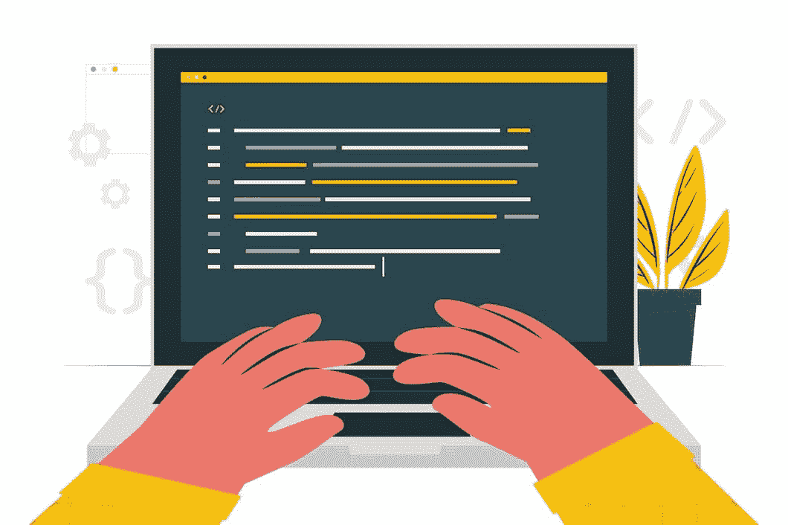
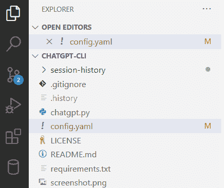
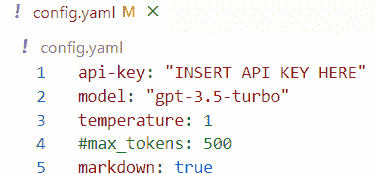
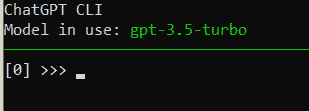
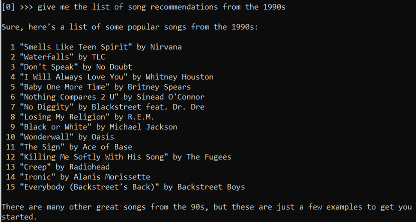
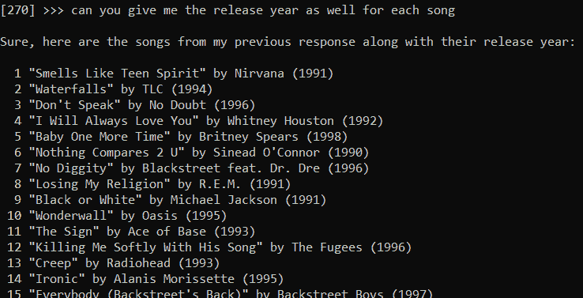
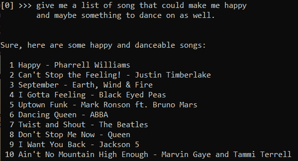

# ChatGPT CLI: 将你的命令行界面转变为 ChatGPT

> 原文：[`www.kdnuggets.com/2023/07/chatgpt-cli-transform-commandline-interface-chatgpt.html`](https://www.kdnuggets.com/2023/07/chatgpt-cli-transform-commandline-interface-chatgpt.html)



图片由 [storyset](https://www.freepik.com/free-vector/hand-coding-concept-illustration_21532467.htm#query=command%20prompt&position=4&from_view=search&track=ais) 提供，发布在 [Freepik](https://www.freepik.com/)

ChatGPT 现在是每个人生活的一部分。GPT 模型为用户提供了多年前不存在的东西，例如简单的知识搜索、营销规划、代码补全等等。这是一个将来只会进一步发展的系统。

使用 ChatGPT 的一种常见方式是通过 [网页平台](https://chat.openai.com/)，在这里我们可以探索和存储提示结果。但我们也可以使用 OpenAI API，这也是许多开发者使用的方式。反过来，API 还可以用来将结果扩展到我们的命令行界面（CLI）。

我们如何在 CLI 中访问 ChatGPT？让我们来了解一下。

# ChatGPT CLI

[ChatGPT CLI](https://github.com/marcolardera/chatgpt-cli) 是一个 Python 脚本，用于在我们的 CLI 中使用 ChatGPT。通过使用 OpenAI API，我们可以像在网站上使用 ChatGPT 一样轻松地在 CLI 中访问它。让我们自己尝试一下吧。

首先，我们需要 OpenAI API 密钥，你可以通过在 [OpenAI 开发者平台](https://platform.openai.com/overview) 注册并访问个人资料中的查看 API 密钥来获得。创建并获得你的 API 密钥后，将其保存在某个地方，因为生成后密钥不会再次出现。

接下来，使用以下代码在 CLI 中将 ChatGPT CLI 仓库克隆到你的系统上。

```py
git clone https://github.com/marcolardera/chatgpt-cli.git
```

如果你已经克隆了仓库，将你的目录更改为 chatgpt-cli 文件夹。

```py
cd chatgpt-cli
```

在文件夹内，使用以下代码安装所需的依赖。

```py
pip install -r requirements.txt
```

然后，我们需要使用 IDE 探索之前克隆的文件夹。在这个示例中，我将使用 Visual Studio Code。当你探索完文件夹后，内容应如下图所示。



在其中，访问 config.yaml 文件，并用你的 OpenAI API 密钥替换 api-key 参数。



你也可以更改要传递到 API 的参数。你可以参考我的上一篇文章来了解 OpenAI API 提供的所有参数。

我们现在可以使用已设置好所有设置的 CLI 作为 ChatGPT。为此，你只需运行以下代码即可。

```py
python chatgpt.py
```



只需尝试在 CLI 中输入任何内容，你将立即得到结果。例如，我输入了提示，“ 给我 1990 年代的歌曲推荐列表。”

结果会在 CLI 中显示，类似于上面的图像。我们还可以继续提示，方式类似于在网页平台上使用 ChatGPT。



每个提示前显示的数字是已使用的 token 数量，我们也需要对此保持谨慎。

此外，如果你有较长的提示，可以在启动脚本前添加 -ml 参数来使用多行模式。



最后，如果你想退出，可以使用 /q 命令。完成后，ChatGPT CLI 将显示你使用的 token 数量和你活动的预估费用。


# 结论

ChatGPT 是一种常态化的工具，我们应该尽可能最大化地使用它。在本教程中，我们将学习如何使用 ChatGPT CLI 在命令行界面中进行 ChatGPT 提示。

**[Cornellius Yudha Wijaya](https://www.linkedin.com/in/cornellius-yudha-wijaya/)** 是一位数据科学助理经理和数据撰稿人。在全职工作于 Allianz Indonesia 时，他喜欢通过社交媒体和写作媒体分享 Python 和数据技巧。

### 更多相关话题

+   [GitHub CLI 数据科学备忘单](https://www.kdnuggets.com/2023/03/github-cli-data-science-cheat-sheet.html)

+   [开始使用 GitHub CLI](https://www.kdnuggets.com/2023/03/getting-started-github-cli.html)

+   [介绍 DataCamp 的 AI 驱动聊天界面：DataLab](https://www.kdnuggets.com/introducing-datacamps-ai-powered-chat-interface-datalab)

+   [人工智能如何改变数据集成](https://www.kdnuggets.com/2022/04/artificial-intelligence-transform-data-integration.html)

+   [数据科学如何改变移动应用开发？](https://www.kdnuggets.com/2023/03/data-science-transform-mobile-app-development.html)

+   [利用 GPT 模型将自然语言转换为 SQL 查询](https://www.kdnuggets.com/leveraging-gpt-models-to-transform-natural-language-to-sql-queries)
