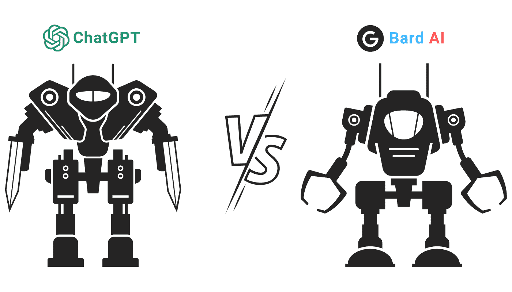
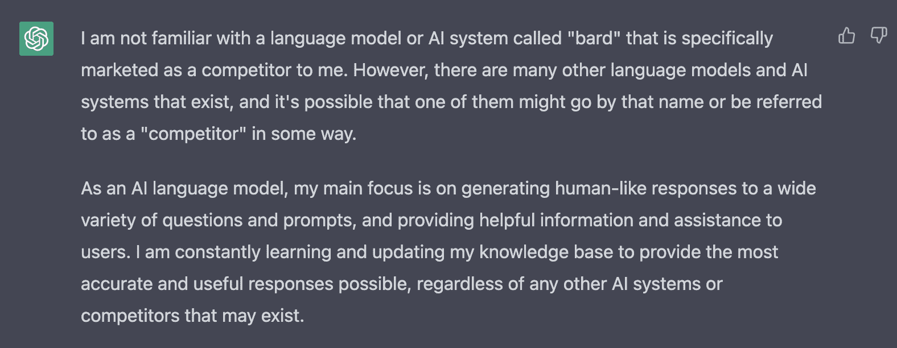
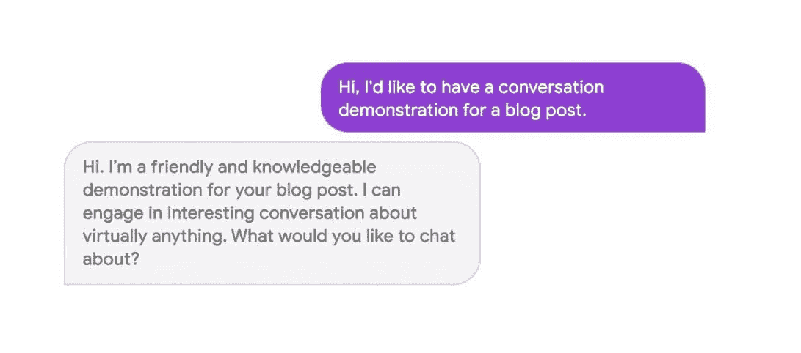

# ChatGPT 与 Google Bard：技术差异比较

> 原文：[`www.kdnuggets.com/2023/03/chatgpt-google-bard-comparison-technical-differences.html`](https://www.kdnuggets.com/2023/03/chatgpt-google-bard-comparison-technical-differences.html)

作者提供的图片

Google Bard 和 ChatGPT 之间最大的区别是，截至目前，Bard 知道 ChatGPT 的存在，但 ChatGPT 对 Bard 一无所知。但我可以玩转 ChatGPT，而 Google Bard 对我们大多数人来说仍然遥不可及。

来源：[ChatGPT](https://chat.openai.com/) 的截图

# ChatGPT 与 Google Bard 对决的开始

ChatGPT 和 Google Bard 都是 AI 聊天机器人。这种技术的最简单版本已经存在于你的智能手机上——你输入“Good”，手机预测你可能想用的下一个词是“morning”。

ChatGPT 最初由 OpenAI 开发，然后微软以高达 100 亿美元的巨额投资进行了投资（除此之外还早期投资了 10 亿美元）。Google 略显恐慌地认为他们的搜索垄断可能要结束了，于是推出了 Bard，这是他们的技术版本，但有一些缺陷。在第一次现场演示中，Bard [出现了几处事实错误。](https://www.theverge.com/2023/2/8/23590864/google-ai-chatbot-bard-mistake-error-exoplanet-demo) 对 Google 来说，至少是尴尬的。

ChatGPT 和 Google Bard 比智能手机预测文本要复杂一些，但要理解这两种 AI 聊天机器人的差异，你只需要了解这些基本信息。

让我们更深入地探讨这两种 AI 引擎之间的技术差异。

# ChatGPT 与 Bard：底层技术是什么？

你在这里是为了快速、轻松地获取这两种引擎的技术差异表格。这里正是你需要的。如果你想要更详细的了解，随时可以继续浏览。

|  | **ChatGPT** | **Bard** |
| --- | --- | --- |
| **模型** | GPT-3.5 | [LaMDA](https://arxiv.org/pdf/2201.08239.pdf)，即对话应用的语言模型 |
| **神经网络架构** | [Transformer](https://ai.googleblog.com/2017/08/transformer-novel-neural-network.html) | [Transformer](https://ai.googleblog.com/2017/08/transformer-novel-neural-network.html) |
| **训练数据** | 网络文本，主要是一个名为“common crawl”的数据集，截止到 2021 年中期 | 156 万字的公共对话数据和网络文本 |
| **目的** | 成为一个多功能的文本生成聊天机器人 | 专门用于协助搜索 |
| **参数** | 1750 亿参数 | 1370 亿参数 |
| **创建者** | OpenAI | Google |
| **优点** | - 目前对所有人开放 - 更加灵活且能够处理开放式文本 - 训练数据截止到 2021 年 | - 训练数据更新到现在 - 专门为对话训练，因此在你使用时听起来更像人类 |
| **缺点** | - 对话不够令人信服 - 不如精细调整 | - 当前不可用 - 可能不适合通用文本创作 |

现在你已经了解了 TL;DR，让我们更深入地看一下这些指标。

# ChatGPT 是什么？

ChatGPT 于 2022 年 11 月 30 日迅速登场。到 2022 年 12 月 4 日，该服务的 [每日用户数](https://en.wikipedia.org/wiki/ChatGPT#cite_note-ZDNET-12:~:text=%22What%20is%20ChatGPT%20and%20why%20does%20it%20matter%3F%20Here%27s%20what%20you%20need%20to%20know%22) 超过了一百万。到 2023 年 1 月，这一数字 [激增](https://www.theguardian.com/technology/2023/feb/02/chatgpt-100-million-users-open-ai-fastest-growing-app) 至超过 1 亿用户。

它之所以立即受到欢迎，是因为它能以一种几乎像人类的方式提供对多个主题的可靠回答，而且任何有互联网连接的人都可以访问。

ChatGPT 由 OpenAI 创建，OpenAI 是一个总部位于旧金山的 AI 实验室，专注于创建友好的 AI。这个聊天机器人基于 GPT-3.5，这是一种大型语言模型，当提供文本时，可以继续提示。

ChatGPT 在此基础上进行了额外的训练——人类训练师通过与模型互动来改进模型，并对更高质量的回答给予“奖励”。

## 训练数据

GPT-3.5 是在一个巨大的网络文本数据集上训练的，包括一个名为 Common Crawl 的流行数据集。Common Crawl 包含了大量的网页数据，包括原始网页数据、元数据提取和文本提取。例如，它包括了来自 [StrataScratch](https://www.stratascratch.com/?utm_source=blog&utm_medium=click&utm_campaign=kdn+ChatGPT+vs+Bard) 的 [一组我们自己的网站链接](https://index.commoncrawl.org/CC-MAIN-2023-06-index?url=*.stratascratch.com&output=json)。想到 ChatGPT 是使用我们每天访问的网站进行训练的，确实令人感到惊讶。

Common Crawl 负责了 60% 的训练数据，但 GPT-3.5 也从其他来源获得了数据。

来源：[维基百科](https://en.wikipedia.org/wiki/GPT-3)

# Google Bard 是什么？

Bard 是 [Google 对 ChatGPT 流行的回应](https://blog.google/technology/ai/bard-google-ai-search-updates/)。与 ChatGPT 不同，Bard 由 Google 自己的 [LaMDA 模型](https://blog.google/technology/ai/lamda/) 提供支持，LaMDA 是对话应用语言模型的缩写。而且与 ChatGPT 不同的是，Bard 目前尚未对大多数人开放。尽管 Google 在 2 月初举办了一个充满错误的 Bard 演示，但现在它仅对少数人开放。

Google Bard 的主要优势在于它能够访问互联网。问 ChatGPT 谁是总统，它不知道。这是因为训练数据截止于 2021 年中期。而 Bard 则可以利用今天的互联网信息。问 Bard，理论上，Bard 应该能够从今天互联网上的数据中告诉你谁是总统。

尽管你还不能亲自体验，但很容易看出 Bard 在几个关键方面如何与 ChatGPT 区分开来。

来源: 谷歌的 [博客帖子](https://blog.google/technology/ai/lamda/) 关于 LaMDA

## 训练数据

首先，LaMDA 是在对话中进行训练的，特别是为了在对话中交流，而不仅仅是像 GPT-n 模型那样生成文本。虽然 ChatGPT 对其训练数据并不隐瞒，但我们还不太了解 Bard 的训练数据。

我们可以通过查看 [LaMDA 的研究论文](https://arxiv.org/pdf/2201.08239.pdf)稍微推测一下。谷歌的研究人员表示，12.5% 的训练数据来自 Common Crawl，类似于 GPT-n 模型。另有 12.5% 来自维基百科。根据研究论文，他们使用了 1.56 万亿字的“公共对话数据和网页文本”。

这是完整的细分：

| 12.5% 基于 C4 的数据（Common Crawl 数据的衍生） |
| --- |
| 12.5% 英文维基百科 |
| 12.5% 编程问答网站、教程等的代码文档 |
| 6.25% 英文网页文档 |
| 6.25% 非英文网页文档 |
| 50% 公开论坛对话数据 |

我们知道 Common Crawl 数据，显然你也知道维基百科。其余的？这些故意被隐藏， presumably 以防止 Bard（和 LaMDA）受到模仿者的影响。

LaMDA 是通过微调一系列基于 Transformer 的神经语言模型构建的，这是一种最初由 [谷歌](https://ai.googleblog.com/2017/08/transformer-novel-neural-network.html) 开发的开源神经网络架构。（有趣的是，GPT 也是基于 Transformer 的。）

来源: [谷歌关于 Bard 的博客帖子](https://blog.google/technology/ai/bard-google-ai-search-updates/)

ChatGPT 有一些保护措施，防止其变得过于恶劣或胡言乱语，但谷歌已[明确指出](https://www.blog.google/technology/ai/ai-principles/)他们如何精心制定质量保证，使 Bard 成为一个更好、更安全的聊天机器人。Bard 被微调以促进“质量、可信度和安全”。

谷歌对这一点 [有很多话要说](https://ai.googleblog.com/2022/01/lamda-towards-safe-grounded-and-high.html)，我建议你阅读他们的博客帖子，但如果你时间紧张，总的来说就是这样：

+   Bard 应该给出合理的回答——没有荒谬的内容，没有矛盾

+   Bard 应该给出富有洞察力、机智或以良好方式出人意料的回答。

+   Bard 应该避免任何可能对用户造成伤害的内容——例如血腥、偏见、仇恨的刻板印象。

+   Bard 不应捏造内容。

由于一次失败的发布，我们已经知道 Google 尚未完全解决这个基本要求。但值得注意的是，Google 正在以 ChatGPT 尚未做到的方式明确说明这些设计要求——至少目前尚未做到。

# ChatGPT 与 Google Bard 的对比：模型参数及其重要性？

ChatGPT 的模型参数比 Bard 更多——1750 亿对 1370 亿。你可以把参数看作是模型调整以适应训练数据的旋钮或杠杆。更多的参数通常意味着模型能够捕捉语言中的复杂关系，但也有过拟合的风险。

Google Bard 可能不够灵活，但相比 ChatGPT 可能对新的语言使用场景更为稳健。

# ChatGPT 与 Google Bard 的对比：它们有什么共同点？

值得强调的是，Bard 和 ChatGPT 都基于模型（分别是 LaMDA 和 GPT-3.5），这些模型依赖于 [基于 Transformer 的](https://en.wikipedia.org/wiki/Transformer_(machine_learning_model)#:~:text=Transformers%20were%20introduced%20in%202017,allows%20training%20on%20larger%20datasets.) 深度学习神经网络。

Transformer 可以使得训练过的模型在阅读句子或段落时，关注这些词汇之间的关系，然后预测它认为接下来会出现哪些词——类似于我之前提到的智能手机预测文本功能。

我不会过多深入，但你只需要知道的是，从根本上讲，Bard 和 ChatGPT 并没有太大不同。

# ChatGPT 与 Google Bard 的对比：所有权

虽然所有权不完全是技术上的区别，但值得考虑。

Google Bard 完全由 Google 生产和拥有，基于 Google 创造的 LaMDA。

ChatGPT 由 OpenAI 开发，OpenAI 是一家位于旧金山的人工智能研究实验室。OpenAI 最初是非营利组织，但在 2019 年创建了一个盈利子公司。OpenAI 还开发了 Dall-E，这是你可能玩过的 AI 图像生成工具。

尽管微软已经在 OpenAI 上投入了大量资金，但目前它仍然是一个独立的研究组织。

# 哪个更好，ChatGPT 还是 Google Bard？

对这个问题很难给出公平的答案，因为它们既相似又不同。首先，几乎没有人现在可以访问 Google Bard。其次，ChatGPT 的训练数据几乎在两年前就被中断了。

两者都是文本生成器——你提供一个提示，Google Bard 和 ChatGPT 都可以回答。两者都有数十亿个参数来微调模型。两者的训练数据源有重叠，并且都基于 Transformer，相同的神经网络模型。

它们的设计目的也不同。Bard 将帮助你导航 Google 搜索。它旨在进行对话式交流。ChatGPT 可以生成整篇博客文章。它旨在生成有意义的文本块。

最终，ChatGPT 和 Google Bard 之间的技术差异凸显了 AI 驱动的文本生成技术已经取得的进展。尽管它们都有待完善，并且在版权和伦理方面都曾引发争议，但这两种生成器都强有力地展示了现代 AI 模型的能力。

**[Nate Rosidi](https://www.stratascratch.com)** 是一名数据科学家和产品策略专家。他还是一名兼职教授，教授分析学，同时也是 [StrataScratch](https://www.stratascratch.com/) 的创始人，该平台帮助数据科学家通过来自顶级公司的真实面试问题准备面试。可以通过 [Twitter: StrataScratch](https://twitter.com/StrataScratch) 或 [LinkedIn](https://www.linkedin.com/in/nathanrosidi/) 与他联系。

### 更多相关主题

+   [为何数据科学家期望 Google Bard 提供有缺陷的建议](https://www.kdnuggets.com/2023/02/data-scientists-expect-flawed-advice-google-bard.html)

+   [Google AI Bard 是什么？](https://www.kdnuggets.com/2023/03/google-ai-bard.html)

+   [8 款开源替代 ChatGPT 和 Bard 的工具](https://www.kdnuggets.com/2023/04/8-opensource-alternative-chatgpt-bard.html)

+   [检测 ChatGPT、GPT-4、Bard 和 Claude 的十大工具](https://www.kdnuggets.com/2023/05/top-10-tools-detecting-chatgpt-gpt4-bard-llms.html)

+   [ChatGPT 与 BARD](https://www.kdnuggets.com/chatgpt-vs-bard)

+   [随机森林与决策树：关键区别](https://www.kdnuggets.com/2022/02/random-forest-decision-tree-key-differences.html)
