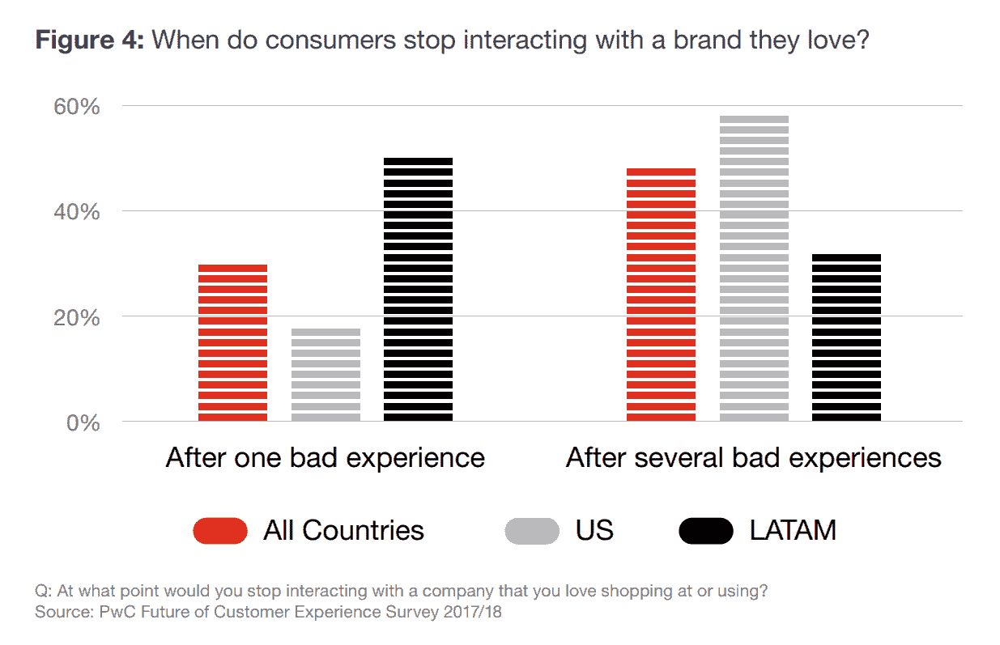
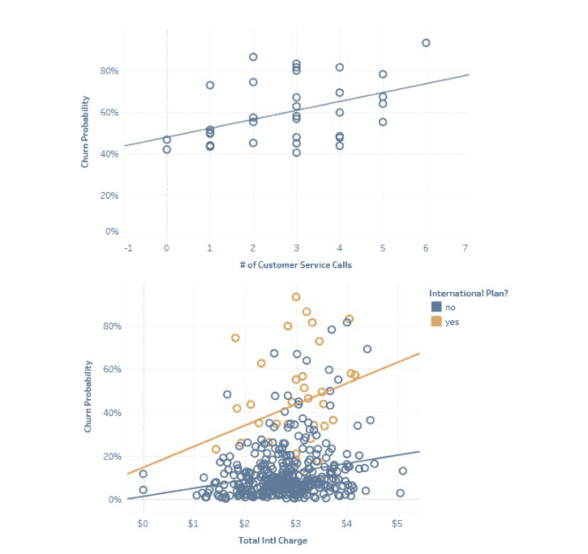
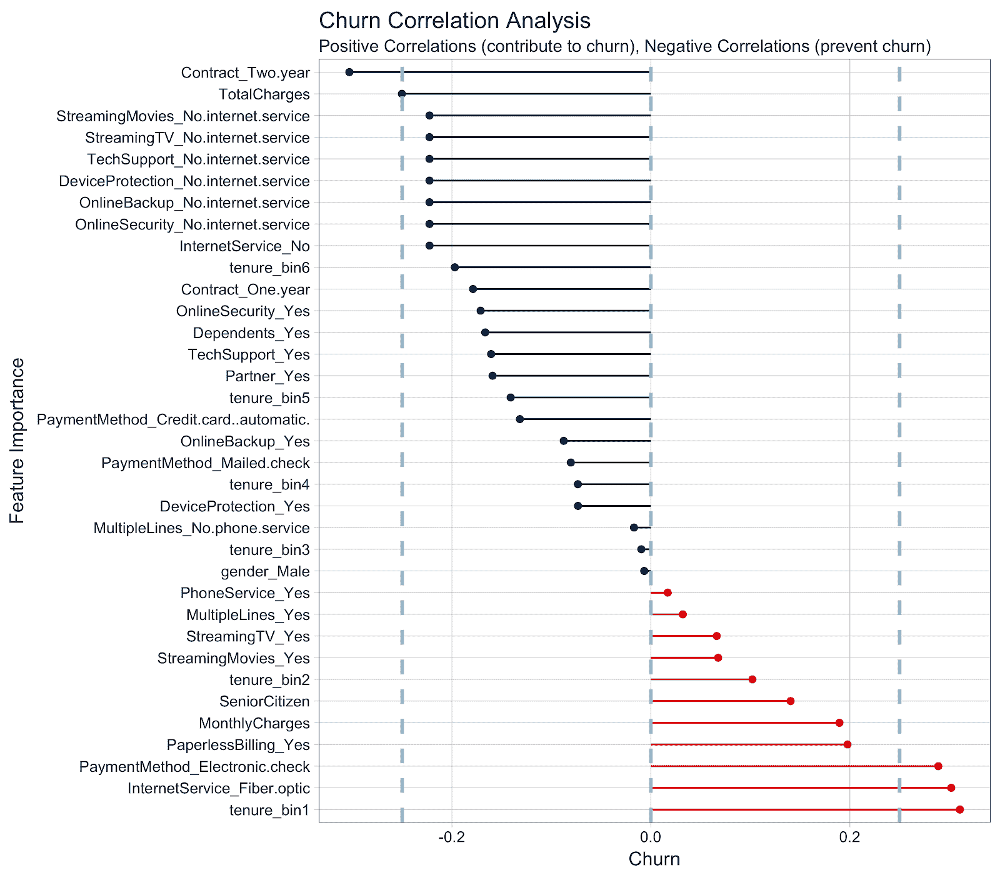
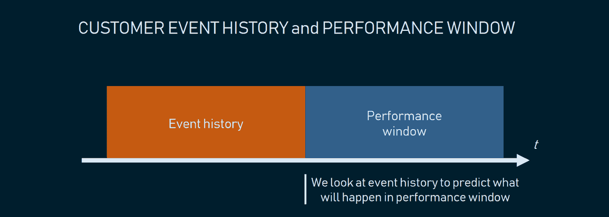
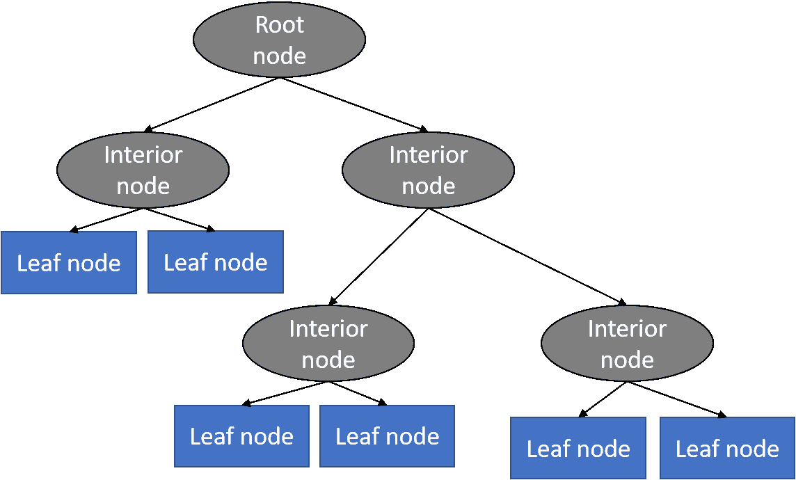
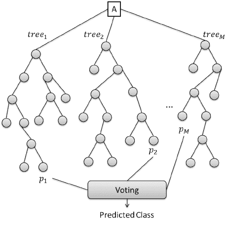

# 客户流失预测使用机器学习：主要方法和模型

> 原文：[`www.kdnuggets.com/2019/05/churn-prediction-machine-learning.html`](https://www.kdnuggets.com/2019/05/churn-prediction-machine-learning.html)

评论

**由 [Altexsoft](https://www.altexsoft.com)** 提供。

客户留存是基于订阅的 [商业模式](https://www.altexsoft.com/blog/business/software-business-models-examples-revenue-streams-and-characteristics-for-products-services-and-platforms/) 的产品主要增长支柱之一。SaaS 市场竞争激烈，客户可以从众多供应商中自由选择，即使是在同一产品类别中。几次不愉快的经历——甚至一次——客户可能就会流失。如果大量不满意的客户频繁流失，不仅会造成物质损失，还会对声誉造成巨大损害。

* * *

## 我们的前 3 个课程推荐

 1\. [谷歌网络安全证书](https://www.kdnuggets.com/google-cybersecurity) - 快速进入网络安全职业轨道

 2\. [谷歌数据分析专业证书](https://www.kdnuggets.com/google-data-analytics) - 提升你的数据分析技能

 3\. [谷歌 IT 支持专业证书](https://www.kdnuggets.com/google-itsupport) - 支持你的组织在 IT 领域

* * *

对于本文，我们联系了来自 [HubSpot](https://www.hubspot.com/) 和 [ScienceSoft](https://www.scnsoft.com/) 的专家，讨论了 SaaS 公司如何通过预测建模来处理客户流失问题。你将发现解决这一问题的方法和最佳实践。我们将讨论如何收集有关客户与品牌关系的数据，分析与流失最相关的客户行为特征，并探讨选择表现最佳的机器学习模型的逻辑。

### **什么是客户流失？**

**客户流失（或客户流失率）** 是指客户放弃品牌并停止成为某一业务的付费客户的倾向。客户在特定时间段内停止使用公司产品或服务的比例被称为 *客户流失率*。计算流失率的一种方法是将给定时间间隔内失去的客户数量除以获得的客户数量，然后将该数值乘以 100%。例如，如果你获得了 150 名客户，而上个月流失了 3 名，那么你的月流失率就是 2%。

客户流失率是一个衡量业务健康状况的指标，对于那些客户是订阅者并且按周期支付服务费用的企业尤为重要，ScienceSoft 数据分析部门负责人[Alex Bekker](https://twitter.com/alexlbekker)指出，*“订阅型业务的客户在特定时期内选择某个产品或服务，这个时期可能相当短——比如一个月。因此，客户会对更有趣或更有优势的提议保持开放态度。此外，每次当前的承诺结束时，客户都有机会重新考虑，并选择不继续与公司合作。当然，某些自然流失是不可避免的，而这个数字因行业而异。但流失率高于这个水平显然是业务存在问题的标志。”*

品牌可能会犯很多错误，从当客户没有得到易于理解的产品使用和功能信息时的复杂入门流程，到沟通不畅，例如缺乏反馈或对查询的延迟回答。另一个情况是：长期客户可能会感到不被重视，因为他们没有获得像新客户那样多的奖励。

一般来说，整体客户体验定义了品牌感知，并影响客户如何认知他们使用的产品或服务的性价比。

现实是，即使是忠诚的客户，如果他们与品牌发生了一次或几次问题，也不会容忍该品牌。例如，美国 59%的受访者在[普华永道（PwC）调查](https://www.pwc.com/us/en/advisory-services/publications/consumer-intelligence-series/pwc-consumer-intelligence-series-customer-experience.pdf#page=8)中表示，他们在经历几次糟糕的体验后会与品牌说再见，其中 17%的人在经历一次糟糕的体验后就会离开。

**糟糕的体验可能会使即使是忠诚的客户也感到疏远。来源：[PwC](https://www.pwc.com/us/en/advisory-services/publications/consumer-intelligence-series/pwc-consumer-intelligence-series-customer-experience.pdf#page=8)**

#### **客户流失对企业的影响**

流失是不好的。但它究竟如何在长期内影响公司绩效呢？

不要低估即使是微小的流失百分比的影响，HubSpot 服务中心总经理[Michael Redbord](https://www.linkedin.com/in/mredbord/?lipi=urn%3Ali%3Apage%3Ad_flagship3_search_srp_top%3BL0kyvSq6RtG31Y%2BiJAjWWg%3D%3D&licu=urn%3Ali%3Acontrol%3Ad_flagship3_search_srp_top-search_srp_result&lici=e1pUKpgpST6L9WptRqo6Qg%3D%3D)表示。“*在订阅型业务中，即使是小的月度/季度流失率也会随着时间的推移迅速积累。仅 1%的月度流失率就意味着接近 12%的年度流失率。鉴于获取新客户的成本远高于保留现有客户，流失率高的企业很快就会发现自己陷入财务困境，因为他们必须投入越来越多的资源来获取新客户。”*

许多关于客户获取和留存成本的调查可以在网上找到。根据[Invesp](https://www.invespcro.com/blog/customer-acquisition-retention/)这家转化率优化公司的调查，获取新客户的成本可能是留住现有客户成本的五倍。

客户流失率确实与收入损失和增加的获取支出有关。此外，它们在公司增长潜力中扮演了更微妙的角色，Michael 继续说道，*“如今的买家不吝啬于通过评论网站和社交媒体等渠道以及点对点网络分享他们与供应商的经历。*[*HubSpot Research*](https://blog.hubspot.com/news-trends/customer-acquisition-study)*发现 49%的买家表示他们在社交媒体上分享了与公司相关的经历。在对企业信任度下降的世界中，口碑在购买过程中扮演的角色比以往任何时候都更加关键。根据同一项 HubSpot Research 研究，55%的买家不再像以前那样信任他们购买的公司，65%的人不信任公司新闻稿，69%的人不信任广告，71%的人不信任社交网络上的赞助广告。”*

*对客户对企业信任状态的概览。来源：*[*HubSpot Research Trust Survey*](https://blog.hubspot.com/news-trends/customer-acquisition-study)

专家总结说，流失率高的公司不仅在与前客户的关系中未能提供良好的服务，而且还通过在产品周围创造负面口碑来损害其未来的获取努力。

CallMiner 对话分析解决方案提供商采访了 1000 名成年人，以了解他们如何与公司互动。这项[survey](https://learn.callminer.com/whitepapers/callminerindex-us-consumers-switch-by-sector)显示，美国企业由于客户流失每年损失约 1360 亿美元。更重要的是，导致客户与品牌断绝关系的公司行为本可以得到纠正。

#### **客户流失预测的使用案例**

正如我们之前提到的，流失率是订阅业务的关键绩效指标之一。订阅商业模式*–* [由 17 世纪的英国图书出版商](https://www.journals.uchicago.edu/doi/10.1086/387957)开创的*–* 在现代服务提供商中非常受欢迎。让我们快速了解这些公司：

**音乐和视频流媒体服务**可能是最常与订阅商业模式相关联的（Netflix、YouTube、Apple Music、Google Play、Spotify、Hulu、Amazon Video、Deezer 等）。

**媒体。** 数字化存在已成为新闻界的必备，因此新闻公司除了提供纸质订阅外，还提供数字订阅（Bloomberg、*The Guardian、Financial Times、The New York Times*、Medium 等）。

**电信公司（有线或无线）**。这些公司可能提供全方位的产品和服务，包括无线网络、互联网、电视、手机和家庭电话服务（AT&T，Sprint，Verizon，Cox Communications 等）。有些公司专注于移动通信（中国移动，沃达丰，T-Mobile 等）。

**软件即服务提供商**。云托管软件的采用正在增长。根据[Gartner](https://www.gartner.com/en/newsroom/press-releases/2018-09-12-gartner-forecasts-worldwide-public-cloud-revenue-to-grow-17-percent-in-2019)的预测，SaaS 市场仍然是云市场的最大细分领域。其收入预计将增长 17.8%，在 2019 年达到 851 亿美元。SaaS 提供商的产品范围广泛：图形和视频编辑（Adobe Creative Cloud，Canva），会计（Sage 50cloud，FreshBooks），电子商务（BigCommerce，Shopify），电子邮件营销（MailChimp，Zoho Campaigns）等。

这些公司类型可能使用流失率来衡量跨部门操作和产品管理的有效性。

### **利用机器学习识别高风险客户：一瞥问题解决方案**

那些不断监控人们如何与产品互动，鼓励客户分享意见，并及时解决问题的公司，更有机会维持互利的客户关系。

现在设想一个公司，它已经收集了一段时间的客户数据，因此可以利用这些数据来识别潜在流失者的行为模式，将这些高风险客户进行细分，并采取适当的措施来重新获得他们的信任。那些采取主动客户流失管理方法的公司使用*预测分析*。这是[four analytics types](https://www.altexsoft.com/blog/datascience/machine-learning-strategy-7-steps/)之一，它通过分析当前和历史数据来预测未来结果、事件或值的概率。预测分析利用各种统计技术，如数据挖掘（模式识别）和[machine learning](https://www.altexsoft.com/data-science/)（ML）。

*“仅仅追踪实际流失的一个弱点是，它仅作为客户体验差的滞后指标，而预测流失模型在这里变得极其重要，”* HubSpot 的 Michael Redbord 指出。

[机器学习](https://www.altexsoft.com/whitepapers/machine-learning-bridging-between-business-and-data-science/)的主要特征是建立能够在数据中寻找模式、在没有明确编程的情况下学习的系统。在客户流失预测的背景下，这些是表明客户对公司服务/产品满意度下降的在线行为特征。

**检测高风险客户有助于提前采取措施**

ScienceSoft 的 Alex Bekker 也强调了机器学习在主动流失管理中的重要性：*“在识别潜在流失者方面，机器学习算法能够发挥很大作用。它们揭示了那些已经离开公司的客户的一些共同行为模式。然后，机器学习算法会将当前客户的行为与这些模式进行对比，并在发现潜在流失者时发出信号。”*

基于订阅的企业利用机器学习进行预测分析，以找出哪些当前用户对服务不完全满意，并在为时已晚之前解决他们的问题：*“在续订前多达 11 个月识别出有流失风险的客户，使我们的客户成功团队能够与这些客户接触，了解他们的问题，并与他们一起制定一个长期计划，重点帮助客户从他们购买的服务中获得价值，”* Michael 解释道。

预测流失建模的使用案例不仅限于主动接触潜在流失的客户和选择有效的保留措施。根据 Redbord 的说法，基于机器学习的软件可以让客户成功经理定义他们应该联系哪些客户。换句话说，员工可以确保他们在正确的时间与合适的客户交谈。

销售、客户成功和市场营销团队也可以利用数据分析中的知识来协调他们的行动。*“例如，如果一个客户显示出流失风险的迹象，那么此时销售团队与客户接触，提供额外服务的信息可能不是一个好时机。相反，这种接触应该由客户成功经理来进行，以帮助客户重新投入使用并看到他们目前拥有的产品的价值。与销售类似，市场营销也可以根据客户当前的流失风险指示与客户进行不同的互动：例如，非流失风险客户比目前存在流失风险的客户更适合参与案例研究，”* HubSpot 的专家解释道。一般来说，客户互动的策略应基于伦理和时机感。而利用机器学习进行客户数据分析可以为这一策略提供有力的支持。

### **使用机器学习预测客户流失**

但是如何开始处理流失率预测呢？需要哪些数据？实施的步骤是什么？

与任何机器学习任务一样，数据科学专家首先需要数据来进行工作。根据目标，研究人员定义他们必须收集的数据。接下来，选择的数据会被准备、预处理，并转化为适合构建机器学习模型的形式。找到合适的方法来训练机器、调整模型以及选择最佳表现者是工作中的另一个重要部分。一旦选择了一个具有最高准确性的预测模型，就可以投入生产使用。

数据科学家进行的整体工作范围，以构建能够预测客户流失的机器学习系统，可能如下所示：

+   理解问题和最终目标

+   数据收集

+   数据准备和预处理

+   建模和测试

+   模型部署和监控

如果你想了解这些步骤中的具体情况，请阅读我们关于[机器学习项目结构](https://www.altexsoft.com/blog/datascience/machine-learning-project-structure-stages-roles-and-tools/)的文章。现在让我们来看看如何在流失预测的背景下完成这些阶段。

#### **理解问题和最终目标**

理解从分析中需要获得哪些见解是很重要的。简而言之，你必须决定要提出什么问题，从而决定要解决什么类型的机器学习问题：分类还是回归。听起来复杂，但请耐心跟随我们。

**分类。** 分类的目标是确定一个数据点（在我们的例子中是客户）属于哪个类别或类别。对于分类问题，数据科学家会使用具有预定义目标变量即标签（流失客户/非流失客户）的历史数据——需要预测的答案——来训练算法。通过分类，企业可以回答以下问题：

+   这个客户会流失吗？

+   客户会续订他们的订阅吗？

+   用户会降级定价计划吗？

+   是否有异常客户行为的迹象？

关于异常行为迹象的第四个问题代表了一种称为*异常检测*的分类问题。异常检测涉及识别离群值——显著偏离其他数据点的数据。

**回归。** 客户流失预测也可以被表述为回归任务。回归分析是一种统计技术，用于估计目标变量与其他影响目标变量的数据值之间的关系，结果是连续值。如果这听起来很难理解——回归的结果总是一个数字，而分类总是建议一个类别。此外，回归分析允许估计数据中的多少个变量影响目标变量。通过回归，企业可以预测特定客户可能在多长时间内流失或接收每位客户的流失概率估计。

**这是一个关于使用逻辑回归预测电信行业流失概率的示例，来自于[Towards Data Science](https://towardsdatascience.com/machine-learning-powered-churn-analysis-for-modern-day-business-leaders-ad2177e1cb0d)。在这里，图示描绘了服务电话数量和国际计划使用与客户流失的相关性**

#### **数据收集**

**识别数据来源。** 一旦你确定了要寻找的见解类型，你可以决定哪些数据来源是进一步预测建模所必需的。让我们假设用于预测流失的最常见数据来源如下：

+   CRM 系统（包括销售和客户支持记录）

+   分析服务（如 Google Analytics、AWStats、CrazyEgg）

+   社交媒体和评论平台的反馈

+   根据要求提供的组织反馈等。

显然，这个列表可能会因行业而异，长短不一。

#### **数据准备和预处理**

为解决问题而选择的历史数据必须转换成适合机器学习的格式。由于模型性能和所获得见解的质量依赖于数据质量，主要目标是确保所有数据点使用相同的逻辑呈现，并且整体数据集没有不一致。我们之前撰写了一篇关于 [数据集准备的基本技术](https://www.altexsoft.com/blog/datascience/preparing-your-dataset-for-machine-learning-8-basic-techniques-that-make-your-data-better/)，如果你想了解更多，请随时查看。

**特征工程、提取和选择。** *特征工程* 是数据集准备中非常重要的一部分。在此过程中，数据科学家创建一组属性（输入特征），表示与客户对服务或产品的参与程度相关的各种行为模式。从广义上讲，特征是 ML 模型在预测结果时考虑的可测量观察特征（在我们的案例中，与流失概率相关的决策）。

尽管行为特征因行业而异，但识别风险客户的方法是普遍的，Alex 指出：*“企业寻找揭示潜在流失者的特定行为模式。”*

数字营销专家和企业家 Neil Patel [将](https://neilpatel.com/blog/improve-by-predicting-churn/) 功能分为四类。客户人口统计信息和支持功能适用于任何行业。用户行为和上下文功能则通常适用于 SaaS 商业模式：

+   **客户人口统计特征** 包含有关客户的基本信息（如年龄、教育水平、位置、收入）

+   **用户行为特征** 描述一个人如何使用服务或产品（如生命周期阶段、登录账户的次数、活跃会话时长、产品的活跃使用时间、使用的功能或模块、操作、货币价值）

+   **支持特征**  描述与客户支持的互动（如查询发送次数、互动次数、客户满意度评分历史）

+   **上下文特征** 代表有关客户的其他上下文信息。

HubSpot 专家试图通过使用网站访问者、生成的潜在客户和创建的交易等指标来了解“什么使客户成功”。服务中心总经理迈克尔·雷德博德表示：*“我们不仅跟踪使用数据（例如，发布博客文章、编辑交易的预期关闭值或发送电子邮件），还跟踪结果数据（例如，电子邮件点击次数、博客文章的浏览量、季度内关闭交易的美元价值）。重要的是了解客户不仅如何使用您的产品，还要了解他们看到的结果。如果客户没有从产品中获得价值，我们通常会看到流失可能性增加。”*

**[用户行为、订阅和人口统计特征如何与互联网服务的流失相关](https://blogs.rstudio.com/tensorflow/posts/2018-01-11-keras-customer-churn/)** 由 Matt Dancho 为 RStudio 博客撰写

但数据过多并不总是好事。

*特征提取* 旨在通过保留那些表示最具辨别性信息的特征来减少变量（属性）的数量。特征提取有助于降低数据维度（维度是数据集中属性的列）并排除无关信息。

在 *特征选择* 过程中，专家复审先前提取的特征，并定义一个与客户流失最相关的特征子集。特征选择的结果是专家拥有一个仅包含相关特征的数据集。

**方法。** 科学软数据分析部门负责人亚历克斯·贝克尔指出，像排列重要性、ELI5 Python 包和 SHAP（SHapley Additive exPlanations）这样的方法可以用来定义最相关和有用的特征。

所有方法的工作原理在于解释模型如何进行预测（基于模型做出特定结论的特征）。模型可解释性是该领域的高优先级问题，数据科学家们不断开发解决方案。您可以在我们的文章中了解更多关于[人工智能和数据科学的进展和趋势](https://www.altexsoft.com/blog/datascience/artificial-intelligence-and-data-science-advances-in-2018-and-trends-for-2019/)。

[排列重要性](https://www.kaggle.com/dansbecker/permutation-importance) 是定义特征重要性的一种方法——特征对预测的影响。它是基于已经训练好的模型计算的。排列重要性的做法如下：数据科学家改变单列中数据点的顺序，将结果数据集输入模型，并确定这种变化在多大程度上降低了模型的准确性。对结果影响最大的特征是最重要的。

另一种进行排列重要性的方法是从数据集中移除一个特征并重新训练模型。

Permutation importance 可以使用 [ELI5](https://github.com/TeamHG-Memex/eli5) 完成——一个开源 Python 库，允许可视化、调试机器学习分类器（算法）并解释其输出。

根据 [ELI5 文档](https://eli5.readthedocs.io/en/latest/blackbox/permutation_importance.html)，此方法最适用于不含大量列（特征）的数据集。

使用 [SHAP](https://shap.readthedocs.io/en/latest/)（SHapley Additive exPlanations）框架，专家可以解读“任何机器学习模型”的决策。SHAP 还为特定预测分配每个特征的重要性值。

**客户细分。** 发展中的公司和那些扩展产品范围的公司通常会使用预定义和选择的特征来细分客户。客户可以根据他们的生命周期阶段、需求、使用的解决方案、参与度、货币价值或基本信息分成子组。由于每个客户类别都有共同的行为模式，通过使用专门针对每个细分数据集训练的机器学习模型，可以提高预测准确性。

例如，HubSpot 使用客户画像、生命周期阶段、拥有的产品、地区、语言和账户总收入等细分标准。*“像这样的细分组合就是我们如何划分账户所有权并定义一个客户支持经理* [customer support manager] *或销售人员的业务范围，”* 迈克尔说。

此外，掌握客户价值知识的员工可以优先考虑他们的客户留存活动。

在数据准备、特征选择和客户细分阶段之后，需要定义追踪用户行为的时间长度，然后再进行预测。

**选择观察窗口（客户事件历史）。** 预测建模是学习在特定时间点之前的一个时期（窗口）所做观察与在同一时间点之后开始的一个时期之间的关系。前一个时期称为 *观察*、*独立*、*解释* 窗口，或 *客户事件历史*（为清晰起见，我们使用最后一个定义）。紧随观察期之后的时期称为 *性能*、*依赖* 或 *响应窗口*。换句话说，我们在未来的性能窗口中预测事件（用户流失或留存）。

**定义正确的事件历史和观察窗口至关重要**

Spotify 的机器学习工程师 Guilherme Dinis, Jr. 在他的 [硕士论文](https://kth.diva-portal.org/smash/get/diva2:1149077/FULLTEXT01.pdf) 中研究了注册免费计划的新 Spotify 用户的行为，以确定他们是否在注册后的第二周离开或保持活跃。

他选择了使用的第一周作为事件历史。为了将用户分类为流失者和活跃用户，Guilherme 检查了第二周是否有任何流媒体活动。如果用户继续听音乐，他们被分类为非流失者。

*“保持观察*[事件历史]*和激活窗口*[性能窗口]*相对较小的原因是基于对同一用户群体的内部先前研究，这些研究表明在注册后两周内流失概率较高，”*工程师解释说。

因此，为了定义事件历史的持续时间和性能窗口，你必须考虑用户通常何时流失。可能是在第二周，如 Spotify 的例子中，或者可能是在年度订阅的第 11 个月。但最有可能的是，你不会希望在一个月内发现这个订阅者可能会流失，因为你将有非常短的重新参与时间。

平衡观察时间和预测时间实际上是一个棘手的任务。例如，如果观察窗口是一个月，那么一个年订阅客户的性能窗口将是 11 个月。看起来，制作一个短的事件历史和长的性能窗口对企业最有利。你花费很少的时间进行观察，并且有足够的时间进行重新参与。不幸的是，事情并不总是这样。短的事件历史可能不足以做出可靠的预测，因此，实验这些参数可能会成为一个反复进行的过程，并且会有权衡。基本上，你必须定义足够的事件历史，以便模型能够做出合理的预测，但仍然要有足够的时间来处理潜在的流失。

#### **建模与测试**

本阶段项目的主要目标是开发一个用户流失预测模型。专家们通常会训练大量模型，调整、评估和测试它们，以确定哪个模型能够在训练数据上以期望的准确度检测潜在的流失者。

经典的机器学习模型通常用于预测客户流失，例如逻辑回归、决策树、随机森林等。来自 ScienceSoft 的 Alex Bekker 建议使用随机森林作为基线模型，然后*“可以评估 XGBoost、LightGBM 或 CatBoost 等模型的表现。”* 数据科学家通常使用基线模型的性能作为比较更复杂算法预测准确度的标准。

[**逻辑回归**](https://machinelearningmastery.com/logistic-regression-for-machine-learning/)是一种用于二分类问题的算法。它通过测量因变量与一个或多个自变量（特征）之间的关系来预测事件的可能性。更具体地说，逻辑回归将预测一个实例（数据点）属于默认类别的可能性。

[**决策树**](https://www.analyticsvidhya.com/blog/2016/04/complete-tutorial-tree-based-modeling-scratch-in-python/) 是一种监督学习算法（具有预定义目标变量）。虽然主要用于分类任务，但它也可以处理数值数据。该算法根据输入变量中最重要的区分因素将数据样本分为两个或更多的同质集合以进行预测。每次分裂时，都会生成树的一部分。因此，形成了一个包含决策节点和叶子节点（即决策或分类）的树。树从根节点开始——最佳预测器。

**决策树基本结构。来源：[Python 机器学习教程](https://www.python-course.eu/Decision_Trees.php)**

决策树的预测结果易于解释和可视化。即使是没有分析或数据科学背景的人也能理解某个输出是如何产生的。与其他算法相比，决策树对数据准备的要求较低，这也是一个优势。然而，如果数据中发生任何小的变化，决策树可能会不稳定。换句话说，数据的变化可能导致生成完全不同的树。为了解决这个问题，数据科学家使用决策树的组合（即集成方法），我们将在接下来的内容中讨论。

**随机森林** 是一种集成学习方法，利用大量决策树来实现更高的预测准确性和模型稳定性。这种方法适用于回归和分类任务。每棵树根据属性对数据实例进行分类（或投票），森林选择获得最多票数的分类。在回归任务中，则取不同树决策的平均值。

**这就是随机森林如何进行预测的。来源：[ResearchGate](https://www.researchgate.net/figure/Voting-in-Random-Forest_fig2_272815108)**

[**XGBoost**](https://xgboost.readthedocs.io/en/latest/) 是梯度提升树算法的实现，常用于分类和回归问题。梯度提升是一种由一组较弱模型（树）组成的算法，这些模型的估计结果相加以更准确地预测目标变量。

来自[弗吉尼亚大学的研究小组](https://ieeexplore.ieee.org/abstract/document/7937698/authors#authors) 研究了与时间相关的软件特性使用数据，例如登录次数和评论次数，以预测在三个月时间范围内的 SaaS 客户流失。作者比较了四种分类算法的模型性能，*“XGBoost 模型在识别最重要的软件使用特性和将客户分类为流失类型或非风险类型方面取得了最佳结果。”* 根据研究人员的说法，XGBoost 模型定义了最显著的特性，这些特性代表了客户如何使用 SaaS 软件，可以帮助服务提供商在针对潜在客户时启动更有效的营销活动。

[**LightGBM**](https://lightgbm.readthedocs.io/en/latest/) 是一个使用基于树的学习算法的梯度提升框架。它可以用于许多机器学习任务，例如分类和排序。根据文档，LightGBM 的一些优点包括更快的训练速度和更高的效率，以及更大的准确性。这些算法使用更少的内存并处理大量数据 —— 在数据集少于 10,000 行的情况下，[不建议](https://medium.com/@pushkarmandot/https-medium-com-pushkarmandot-what-is-lightgbm-how-to-implement-it-how-to-fine-tune-the-parameters-60347819b7fc) 使用它们。LightGBM 还支持并行和 GPU 学习（使用图形处理单元来训练大数据集）。

[**CatBoost**](https://github.com/catboost) 是另一个基于决策树的梯度提升库。它处理数值特征和分类特征，因此可以用于分类、回归、排序和其他机器学习任务。CatBoost 的一个优点是它允许使用 CPU 和两个或更多 GPU 来训练模型。

**技术选择。** 许多因素可以影响生产中所需模型的数量及其类型。尽管每个公司的情况都是独特的，但通常客户数据和业务需求的管理方法确实有一定的影响。预测技术的选择可能取决于：

+   **客户生命周期阶段。** 例如，HubSpot 的专家得出结论，模型的选择可能取决于客户与品牌之间的互动阶段。*“在入驻阶段的客户通常不会显示出与使用 HubSpot 超过一年客户相同的价值指标。因此，针对超过一年客户训练的模型可能在这些客户身上效果很好，但在仍处于入驻阶段的客户身上可能不够准确，”* HubSpot 的 Michael 解释道。

+   **输出解释的必要性。** 当公司代表（如客户成功经理）需要理解流失原因时，可以使用所谓的白盒技术，如决策树、随机森林或逻辑回归。增加的可解释性是 HubSpot 选择随机森林的主要原因之一。有时仅仅检测流失就足够了，例如当公司管理层需要估算下一年度预算时，同时考虑到可能因客户流失而造成的损失。在这些情况下，解释性较差的模型也会有效。

+   **客户画像。** 想象一家提供众多产品的公司，每种产品都针对特定的用户类型。由于不同的客户画像可能有典型的行为模式，因此使用专用模型来预测他们流失的可能性是合理的。迈克尔·雷德博德补充道：“*在一个不断发展的企业中，客户基础的性质会发生变化，尤其是在引入新产品时。基于一组客户建立的模型可能在新客户画像进入客户基础时效果不佳。因此，当我们推出新的产品线时，我们通常会建立新的模型来预测这些客户的流失。*”

#### **部署与监控**

现在，流失预测项目工作流程的最后阶段。选择的模型需要投入生产。一个模型可能会被整合进现有软件中，或成为新程序的核心。然而，“部署后忘记”的情况是不行的：数据科学家必须持续跟踪模型的准确性，并在必要时进行改进。

*“利用机器学习和人工智能预测客户流失是一个永无止境的迭代过程。我们监控模型性能，并根据需要调整特征，以便在客户服务团队向我们反馈或有新数据可用时提高准确性。在任何人类互动的时刻 *–* 支持电话、CSM 季度业务回顾 *[quarterly business review]*、销售发现电话 *–* 我们都监控并记录对客户帮助的人工解读，这有助于增强机器学习模型，提高我们对每位客户健康预测的准确性，”* 迈克尔总结道。

模型性能测试的频率取决于数据在组织中变得过时的速度。

### **结论**

流失率是基于订阅的公司的健康指标。识别对提供的解决方案不满意的客户，使企业能够了解产品或定价计划的弱点、运营问题以及客户的偏好和期望，从而主动减少流失的原因。

定义数据源和观察期对于全面了解客户互动历史至关重要。选择模型的最重要特征将影响其预测性能：数据集的质量越高，预测就越准确。

拥有大量客户基础和众多产品的公司将从客户细分中受益。选择和数量的机器学习模型也可能依赖于细分结果。数据科学家还需要监控已部署的模型，并修订和调整特征，以维持期望的预测准确性。

[原文](https://www.altexsoft.com/blog/business/customer-churn-prediction-for-subscription-businesses-using-machine-learning-main-approaches-and-models/)。经许可转载。

**资源：**

+   [在线和基于网络的：分析、数据挖掘、数据科学、机器学习教育](https://www.kdnuggets.com/education/online.html)

+   [分析、数据科学、数据挖掘和机器学习的软件](https://www.kdnuggets.com/software/index.html)

**相关：**

+   [雇主希望看到的数据科学项目：如何展示业务影响](https://www.kdnuggets.com/2018/12/data-science-projects-business-impact.html)

+   [数据匿名化的 7 个神话](https://www.kdnuggets.com/2019/03/7-myths-data-anonymisation.html)

+   [战略：客户分析：你是否从数据中获利？](https://www.kdnuggets.com/2018/11/wharton-strategy-customer-analytics.html)

### 更多相关主题

+   [人工智能、分析、机器学习、数据科学、深度学习…](https://www.kdnuggets.com/2021/12/developments-predictions-ai-machine-learning-data-science-research.html)

+   [机器学习的数据标注：市场概况、方法和工具](https://www.kdnuggets.com/2021/12/data-labeling-ml-overview-and-tools.html)

+   [机器学习的甜点：自然语言处理和文档分析中的纯方法](https://www.kdnuggets.com/2022/05/machine-learning-sweet-spot-pure-approaches-nlp-document-analysis.html)

+   [2021 年的主要进展和 2022 年的关键趋势：人工智能、数据科学…](https://www.kdnuggets.com/2021/12/trends-ai-data-science-ml-technology.html)

+   [使用 Python 的自动化机器学习：不同方法的比较…](https://www.kdnuggets.com/2023/03/automated-machine-learning-python-comparison-different-approaches.html)

+   [多标签自然语言处理：类别不平衡和损失函数分析…](https://www.kdnuggets.com/2023/03/multilabel-nlp-analysis-class-imbalance-loss-function-approaches.html)
