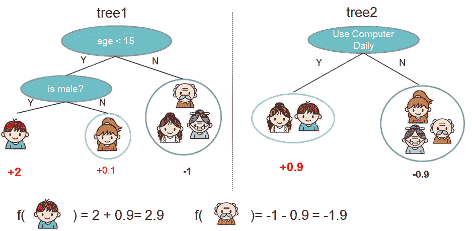
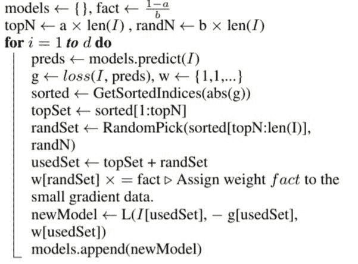
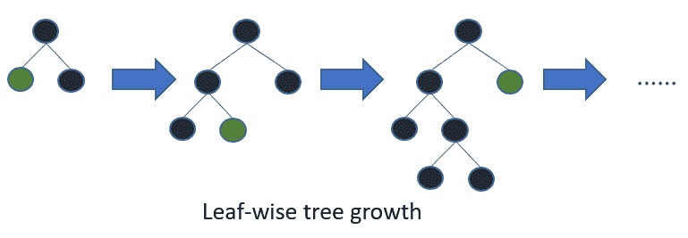

# 澄清“提升”相关问题

> 原文：[`www.kdnuggets.com/2019/06/clearing-air-around-boosting.html`](https://www.kdnuggets.com/2019/06/clearing-air-around-boosting.html)

 评论

**作者 [Puneet Grover](https://twitter.com/MLAIwithPuneet), 帮助机器学习**。

**清除照片由 [SpaceX](https://unsplash.com/@spacex?utm_source=medium&utm_medium=referral) 在 [Unsplash](https://unsplash.com/?utm_source=medium&utm_medium=referral) 提供**

**注意：** 尽管这篇文章稍微偏重数学，但你仍然可以通过阅读前两节，即 [介绍](https://towardsdatascience.com/clearing-air-around-boosting-28452bb63f9e#4b85) 和 [历史](https://towardsdatascience.com/clearing-air-around-boosting-28452bb63f9e#a355)，理解提升和梯度提升的核心工作。之后的部分是对不同梯度提升算法论文的解释。

这是我 Concepts 类别中的一篇文章，可以在我的 GitHub 仓库 [这里](https://github.com/PuneetGrov3r/MediumPosts/tree/master/Concepts) 找到。

**目录**

1.  介绍

1.  历史（袋装、随机森林、提升和梯度提升）

1.  AdaBoost

1.  XGBoost

1.  LightGBM

1.  CatBoost

1.  进一步阅读

1.  参考文献

***注意：*** 本文配有在我 GitHub 仓库中的***Jupyter Notebook***：[[ClearingAirAroundBoosting](https://nbviewer.jupyter.org/github/PuneetGrov3r/MediumPosts/blob/master/Concepts/Boosting.ipynb)]

**1) 介绍**

**提升** 是一种集成元算法，主要用于减少监督学习中的偏差和方差。

如今，提升算法是获得各种问题和情境下最先进结果的最常用算法之一。它已成为解决任何机器学习问题或竞赛的首选方法。现在，

1.  这种提升算法的巨大成功背后的原因是什么？

1.  它是如何产生的？

1.  我们可以期待未来发生什么？

我将通过这篇文章尝试回答所有这些问题以及更多问题。

**2) 历史** [^](https://towardsdatascience.com/clearing-air-around-boosting-28452bb63f9e#bd3e)

**照片来源 [Andrik Langfield](https://unsplash.com/@andriklangfield?utm_source=medium&utm_medium=referral) 在 [Unsplash](https://unsplash.com/?utm_source=medium&utm_medium=referral)**

提升基于 [Kearns](https://en.wikipedia.org/wiki/Michael_Kearns_%28computer_scientist%29) 和 [Valiant](https://en.wikipedia.org/wiki/Leslie_Valiant)（1988, 1989）提出的问题：“一组 **弱学习器** 能否创建一个 **强学习器**？”

[罗伯特·沙皮雷](https://en.wikipedia.org/wiki/Robert_Schapire)在 1990 年[论文](https://en.wikipedia.org/wiki/Boosting_%28machine_learning%29#cite_note-Schapire90-5)中对凯恩斯和瓦利安特提出的问题的肯定回答在机器学习和统计学中产生了重大影响，最显著的是导致了 Boosting 的发展。

在 Bagging 方法中，还有一些其他集成方法在同一时期出现，可以说它们是现代梯度提升算法的子集，它们包括：

1.  **Bagging**（Bootstrap Aggregating）：（即[自助采样](https://en.wikipedia.org/wiki/Bootstrapping_%28statistics%29) + 聚合）

Bagging 是一种集成元算法，有助于提高稳定性和准确性。它还帮助减少方差，从而减少过拟合。

在 bagging 中，如果我们有 N 个数据点，并且我们想要生成‘m’个模型，那么我们将从数据中取出一些**数据的分数**[通常是(1–1/*e*)≈63.2%]，从数据中重复‘m’次**并重复一些行**，使其长度等于 N 个数据点（尽管其中一些是冗余的）。现在，我们将在这些‘m’个数据集上训练‘m’个模型，然后得到‘m’组预测。然后我们将这些预测进行汇总以获得最终预测。

它可以与神经网络、分类和回归树以及线性回归中的子集选择一起使用。

1.  **随机森林**：

随机森林（或随机决策森林）方法是一种集成学习方法，通过构建大量决策树来操作。它有助于减少在决策树模型（具有较高深度值）中常见的过拟合。

随机森林结合了“bagging”思想和特征的随机选择，以构建一个决策树集合来对抗方差。与 bagging 一样，我们为决策树创建**自助采样训练集**，但现在在树生成过程中每次进行分裂时，我们只选择**总特征数的一部分**[通常为√n 或 log2(n)]。

这些方法，自助采样和子集选择，使树之间更***不相关***，有助于更多地减少方差，因此以更具概括性的方法减少过拟合。

1.  **Boosting**:

以上方法使用了互斥模型的平均以减少方差。**Boosting**略有不同。Boosting 是一种*序列集成*方法。对于总数为‘n’的树，我们以序列方式添加树的预测（即我们添加第二棵树来提高第一棵树的性能，或者说尝试纠正第一棵树的错误，依此类推）。所以我们所做的是，从目标值中减去第一模型的预测值乘以常数（0<λ≤1），然后将这些值作为目标值来拟合第二模型，依此类推。我们可以将其视为：新模型尝试纠正之前模型/之前模型的错误。Boosting 可以通过一个公式来概括：

**示例：预测某人是否会喜欢计算机游戏。[来源：XGBoost 文档]**

即最终预测是所有模型预测的总和，每个预测乘以一个小常数（0<λ≤1）。这是一种观察提升算法的另一种方式。

实际上，我们尝试从每个学习器（这些都是**弱学习器**）中学习少量关于目标的信息，这些学习器试图改进先前的模型，然后将它们汇总以获得最终预测（这是可能的，因为我们只拟合先前模型的残差）。因此，每个顺序学习器试图预测：

（初始预测） — （λ * 前述学习器所有预测的总和）

每个树预测器也可以根据其表现具有不同的 λ 值。

1.  **梯度提升：**

在梯度提升中，我们使用一个*损失函数*，在每次拟合周期中进行评估（就像在深度学习中一样）。Jerome H. Friedman 首次提出的[论文](https://statweb.stanford.edu/~jhf/ftp/trebst.pdf)集中于最终函数的加性扩展，类似于我们上面看到的内容。

我们首先预测一个目标值（例如，γ），这是一个给出最小误差的常数（即第一次预测是 F0 = γ）。之后我们计算数据集中每个点相对于我们之前输出的梯度。因此，我们计算误差函数相对于之前模型所有输出总和的梯度，在平方误差的情况下是：

**相对于该数据点所有值之和的梯度（即第 i 个梯度）**

这样我们就得到了相对于之前模型所有输出的梯度。

我们为什么要这样计算梯度？

在神经网络中，计算所有参数（即所有神经节点）梯度是很直接的，因为神经网络在所有层中只是线性（或某个梯度容易计算的函数）组合，因此通过*反向传播*（相对于所有参数）计算梯度并更新它们更为容易。但是在决策树中，我们无法计算输出相对于任何参数（如深度、叶子数量、分裂点等）的梯度，因为这并不直接（实际上是抽象的）。

1.  Friedman 使用每个输出的误差梯度（误差函数）并将模型拟合到这些梯度。

这如何有助于获得更好的模型？

每个输出的梯度表示我们应该朝哪个方向移动以及移动多少，以获得该特定数据点/行的更好结果，将树拟合问题转化为优化问题。我们可以使用任何可微分且可以针对我们当前任务进行定制的损失函数，这在普通提升方法中是不可能的。例如，我们可以使用 MSE 进行回归任务，用 Log Loss 进行分类任务。

这里梯度如何用于获得更好的结果？

与提升算法不同，在提升算法中，我们在第`i`次迭代时学习了一部分输出（目标），而第`(i+1)`棵树会尝试预测剩余的部分，即我们对残差进行拟合；而在梯度提升中，我们计算相对于所有数据点/行的梯度，这告诉我们要前进的方向（负梯度）以及前进的幅度（可以看作是梯度的绝对值），并在这些梯度上拟合一棵树。

这些梯度基于我们的损失函数（选择以比其他方法更好地优化问题），反映了我们希望对预测进行的变化。例如，在凸损失函数中，我们会随着残差的增加而得到梯度的指数增加的倍数，而残差是线性增加的。因此，收敛时间更好。这取决于损失函数和优化方法。

这为数据点的梯度区域提供了类似的更新，因为它们将有相似的梯度。现在我们将找到该区域的最佳值，这将为该区域提供最小的误差。（即树拟合）

在这之后，我们将这些预测添加到之前的预测中，以获得本阶段的最终预测。

**其中 γjm 是第 j 区域第 m 棵树的预测值，Jm 是第 m 棵树的区域数量。因此，为该区域添加 γ 乘以身份，若数据点在当前区域，则为 1。**

这为每个数据点/行提供了新的预测。

> *正常提升和梯度提升的基本区别在于，在正常提升中，我们将下一模型拟合到残差上，而在梯度提升中，我们将下一模型拟合到残差的梯度上。嗯……梯度提升实际上使用损失函数，因此我们将下一模型拟合到该损失函数的梯度（其中通过使用之前的预测找到梯度）。*

**注意开始**

**进一步可能的改进：**

目前的梯度提升库远不止这些，例如：

1.  树的约束（例如`max_depth`，或`num_leaves`等）

1.  缩减（即`learning_rate`）

1.  随机采样（行采样，列采样）[在树和叶子级别]

1.  惩罚学习（L1 回归，L2 回归等）[这需要修改的损失函数，正常提升无法实现]

1.  以及更多……

这些方法（其中一些）在一种称为 [*随机梯度提升*](https://en.wikipedia.org/wiki/Gradient_boosting#Stochastic_gradient_boosting)的提升算法中实现。

**注意结束**

**3) AdaBoost**

**照片由 [Mehrshad Rajabi](https://unsplash.com/@mehrshadr?utm_source=medium&utm_medium=referral) 提供，来自 [Unsplash](https://unsplash.com/?utm_source=medium&utm_medium=referral)**

这是第一个在机器学习领域留下巨大印记的提升算法。它由 Freund 和 Schapire（1997）开发，[这里](http://www.site.uottawa.ca/~stan/csi5387/boost-tut-ppr.pdf)是相关论文。

除了顺序地添加模型的预测（即提升）外，它还为每个预测添加权重。它最初是为分类问题设计的，其中它增加了所有错误分类样本的权重，并减少了所有正确分类样本的权重（虽然也可以应用于[回归](http://citeseerx.ist.psu.edu/viewdoc/download?doi=10.1.1.409.2861&rep=rep1&type=pdf)）。因此，下一个模型将更多地关注权重较大的样本，而较少关注权重较小的样本。

他们还使用一个常数来缩小每棵树的预测值，这个常数的值是在拟合过程中计算得出的，并且取决于拟合后的误差。误差越大，该树的常数值就越小。这使得预测更准确，因为我们从不够准确的模型中学习较少，从更准确的学习器中学习更多。

它最初用于两类分类，并选择输出为{-1, +1}，其中：

1.  它以每个数据点的权重相等= 1/N（其中，N：数据点数量）开始，

1.  然后，它使用初始权重（最初相同）拟合第一个分类模型 h_0(x)到训练数据上，

1.  然后计算*总误差*，并基于此更新所有数据点的权重（即增加错误分类的权重，减少正确分类的权重）。总误差在计算该特定树的*缩小常数*时也变得有用（即我们计算常数α，对于大误差较小，对于小误差较大，并用于缩小和权重计算）。

1.  最终，当前轮次的预测结果会在与α相乘后加到之前的预测结果上。由于最初是分类为+1 或-1，因此最终预测结果取最后一轮的预测符号：

**其中 α_i 是第 i 个常数（前一位置），h_i 是第 i 个模型预测值**

（AdaBoost 不是基于梯度的）

### 4) XGBoost

**照片由 [Viktor Theo](https://unsplash.com/@viktortheo?utm_source=medium&utm_medium=referral) 提供，来源于 [Unsplash](https://unsplash.com/?utm_source=medium&utm_medium=referral)**

XGBoost 试图在先前的梯度提升算法基础上进行改进，以提供更好、更快和更具通用性的结果。

它在梯度提升的基础上进行了一些不同的和新的改进，例如：

1.  **a) 正则化学习目标：**

与许多其他目标函数实现类似，这里建议向损失函数中添加一个额外的函数来惩罚模型的复杂性（如 LASSO、Ridge 等），称为*正则化项*。这有助于模型避免过拟合数据。

**一些损失函数 + （一些正则化函数以控制模型的复杂性）**

现在，对于具有加法性质的梯度提升，我们可以将第‘t’次预测写作 F_t(x) = F_t-1(x) + y_hat_t(x)，即此轮预测加上所有先前预测的总和。损失函数：

经过[**泰勒级数近似**](https://en.wikipedia.org/wiki/Taylor_series)后，可以写成：

**其中 g_i 和 h_i 是损失函数的梯度和 Hessian，即损失函数的一阶和二阶导数**

为什么到二阶？

仅使用一阶梯度的梯度提升算法面临收敛问题（只有在步长较小的情况下才可能收敛）。而且它对损失函数的近似效果相当好，加上我们不希望增加计算量。

然后通过将损失函数的梯度设置为零，从而找到损失函数的*最优值*，并通过损失函数找到用于分裂的函数。（即，分裂后损失的变化函数）

**通过将上述公式的导数设置为零来发现。[最优变化值]**

1.  **b) 收缩和列子采样：**

它还为每棵树增加了收缩，以减少单棵树的影响，并对列进行子采样，以对抗过拟合并减少方差，如历史部分所讨论的。

1.  **c) 不同的分裂查找算法：**

梯度提升算法遍历所有可能的分裂，以找到该级别的最佳分裂。然而，如果我们的数据非常庞大，这可能是一个昂贵的瓶颈，因此许多算法使用某种近似或其他技巧来寻找一个特别好的分裂，而不是最佳分裂。因此，XGBoost 查看特定特征的分布，并选择一些百分位数（或分位数）作为分裂点。

**注意：**

为了近似分裂的查找，这些方法也被使用，而不是百分位数方法：

1) 通过构造梯度统计的近似直方图。2) 通过使用其他变体的分箱策略。

它建议选择一个值，称之为 q，现在从[0, 100]的分位数范围中，几乎每个 q 分位值都被选为分裂的候选点。将会大约有 100/q 个候选点。

它还添加了*稀疏感知*分裂查找，这在稀疏的 BigData 数组中可能很有帮助。

1.  **d) 为了提高速度和空间效率：**

它建议将数据划分为**块**，内存中的块。每个块中的数据以**压缩列（CSC）**格式存储，其中每列按相应的特征值*存储*。因此，在块中对列进行线性搜索足以获取该列的所有分裂点。

块格式使得在线性时间内找到所有拆分变得容易，但当需要获取这些点的梯度统计时，它变成了非连续的梯度统计提取（因为梯度仍然以之前的格式存在，其中块值指向它们的梯度），这可能导致缓存缺失。为了解决这个问题，他们制定了**缓存感知**算法用于梯度累积。在这种算法中，每个线程都会获得一个内部缓冲区。这个缓冲区用于以小批量的方式获取梯度并进行累积，而不是按顺序从这里获取一些梯度，再从那里获取一些梯度。

找到最佳块大小也是一个问题，它可以帮助最佳利用并行性并最大程度地减少缓存缺失。

它还提出了一个叫做**块分片**的方案。它在多个磁盘上交替写入数据（如果你有这些磁盘的话）。所以，当它想读取一些数据时，这种设置可以帮助同时读取多个块。例如，如果你有 4 个磁盘，这四个磁盘可以在一个单位时间内读取 4 个块，实现 4 倍的速度提升。

### 5) LightGBM

**照片由 [Severin D.](https://unsplash.com/@sdmk?utm_source=medium&utm_medium=referral) 提供，来自 [Unsplash](https://unsplash.com/?utm_source=medium&utm_medium=referral)**

这篇论文提出了两种技术来加速整体的 Boosting 过程。

对于第一个，它提出了一种方法，在这种方法中，他们不必为特定模型使用所有数据点，而不会损失太多的*信息增益*。它被称为**基于梯度的单侧采样（GOSS）**。在这种方法中，他们计算损失函数的梯度，然后按绝对值排序。它还有一个证明，证明梯度值较大的值对信息增益的贡献更大，因此它建议忽略许多梯度较低的数据点。

因此，为特定模型选择一部分顶部梯度和从其余部分中选择不同的部分（从剩余梯度中随机选择），对随机梯度集施加较低的权重，因为它们的梯度值较低，不应对当前模型贡献太多。

**获取损失的梯度，排序，取顶部梯度集和其余的随机梯度，减少随机梯度的权重，然后将此模型添加到之前模型的集合中。**

需要注意的一点是，LightGBM 使用基于直方图的算法，将连续特征值分成离散的箱子。这加速了训练并减少了内存使用。

此外，他们使用了一种不同的决策树，它优化叶节点而不是普通决策树的深度（即，它枚举所有可能的叶子节点，并选择错误最少的一个）。

对于第二种方法，它提出了一种将许多特征组合成*一个*新特征的方法，从而在减少数据维度的同时不会丢失太多信息。这种方法称为**独占特征捆绑（EFB）**。它表示，在高维数据的世界中，存在许多相互排斥的列。为什么？因为高维数据有许多高度稀疏的列，可能有许多列在同一时间内没有取任何值（即，通常只有其中一个取非零值，即相互排斥）。因此，他们建议将这些特征捆绑成一个，没有冲突超过某个预设值（即，它们在许多点上在相同数据点没有非零值，即它们并非完全相互排斥，但在某种程度上是相互排斥）。为了区分来自不同特征的每个值，它建议对来自不同特征的值添加不同的常数，这样来自一个特征的值会落在一个特定的范围内，而来自其他特征的值则不在该范围内。例如，假设我们有三个特征要组合，所有特征的范围是 0-100。因此，我们将对第二个特征加 100，对第三个特征加 200，以获得三个特征的三个范围，分别为 0, 100)、[100, 200) 和 [200, 300)。在基于树的模型中，这种做法是可以接受的，因为它不会影响通过分裂获得的信息增益。

。

### 6) CatBoost

图片来源：[Alex Iby](https://unsplash.com/@alexiby?utm_source=medium&utm_medium=referral)  于 [Unsplash](https://unsplash.com/?utm_source=medium&utm_medium=referral)

本文着重于提升算法面临的一个问题，即泄漏，*目标泄漏*。在提升中，多个模型在训练示例上进行拟合依赖于目标值（用于计算残差）。这会导致测试集中目标值的偏移，即**预测偏移**。因此，它提出了一种绕过这个问题的方法。

此外，它还提出了一种将**类别特征**转换为**目标统计量（TS）**的方法（如果处理不当可能会导致目标泄漏*如果做错了*）。

提出了一个叫做*有序提升*的算法，帮助防止目标泄漏，以及一个处理分类特征的算法。虽然两者都使用了某种叫做**排序原则**的方法。

首先，为了将分类特征转换为**目标统计（TS）**。如果你了解*均值编码*或*目标编码*的分类特征，特别是 K 折均值编码，这将很容易理解，因为这只是稍作调整。他们为了避免目标泄漏但仍能进行目标编码，是从数据集中获取第 i 个元素的(i-1)个元素，以获得该元素的特征值（即，如果第 i 个元素上方有 7 个相同类别的元素，则他们取这些值的目标均值来获得第 i 个元素的特征值）。

**如果 i,j 属于同一类别，则平均目标值仅在该元素在本次迭代的随机排列中位于第 i 个元素之上时才计算（如声明中的条件）。‘a’和‘p’是防止等式下溢的参数。**

其次，为了使算法*预测偏移*稳健，它提出了一个称为**有序提升**的算法。在每次迭代中，它独立地抽取一个新的数据集 D_t，并通过将当前模型应用于此数据集来获取*未偏移的残差*（因为这是一个不同的数据集），然后拟合一个新模型。实际上，他们将新数据点添加到之前的数据点中，从而为当前迭代中新添加的数据点提供至少未偏移的残差。

**对于 i=1..n，从随机排列 r`中计算 avg（如果它属于同一叶子节点的梯度），仅在排列 r`中该叶子节点位于 2^(j+1) th 点之上时计算。[通过添加新预测更新模型]**

使用此算法，我们可以为'n'个示例制作’n’个模型。但由于时间考虑，我们只制作 log_2(n)个模型。因此，第一个模型拟合 2 个示例，第二个模型拟合 4 个，以此类推。

CatBoost 也使用一种不同的决策树，称为*盲树*。在这种树中，相同的分裂标准用于树的整个层级。这种树是平衡的，且不容易过拟合。

在盲树中，每个叶子索引可以编码为长度等于树深度的二进制向量。这个事实在 CatBoost 模型评估器中被广泛使用：它首先将所有浮点特征和所有独热编码特征二值化，然后使用这些二进制特征来计算模型预测。这有助于以非常快的速度进行预测。

**7) 进一步阅读**

1.  Trevor Hastie; Robert Tibshirani; Jerome Friedman (2009). [*统计学习的元素：数据挖掘、推断与预测*](http://statweb.stanford.edu/~tibs/ElemStatLearn/download.html)（第 2 版）。纽约：Springer。 (ISBN 978–0–387–84858–7)

1.  所有参考文献

**8) 参考文献**

1.  [维基百科 — 提升方法](https://en.wikipedia.org/wiki/Boosting_%28machine_learning%29)

1.  Trevor Hastie; Robert Tibshirani; Jerome Friedman (2009). [*统计学习的要素: 数据挖掘、推断与预测*](http://statweb.stanford.edu/~tibs/ElemStatLearn/download.html)(第 2 版)。纽约: Springer. (ISBN 978–0–387–84858–7)

1.  论文 — [提升简介 — Yoav Freund, Robert E. Schapire](http://www.site.uottawa.ca/~stan/csi5387/boost-tut-ppr.pdf)(1999) — AdaBoost

1.  论文 — [XGBoost: 一个可扩展的树提升系统 — 田忌 陈，卡洛斯·古斯特林 (2016)](https://arxiv.org/pdf/1603.02754.pdf)

1.  [Stack Exchange — 需要帮助理解 XGBoost 的合适分裂点提议](https://datascience.stackexchange.com/questions/10997/need-help-understanding-xgboosts-approximate-split-points-proposal)

1.  论文 — [LightGBM: 高效的梯度提升决策树 — Ke, Meng 等](https://papers.nips.cc/paper/6907-lightgbm-a-highly-efficient-gradient-boosting-decision-tree.pdf)

1.  论文 — [CatBoost: 无偏提升与分类特征 — Prokhorenkova, Gusev 等](https://arxiv.org/pdf/1706.09516.pdf) — v5 (2019)

1.  论文 — [CatBoost: 支持分类特征的梯度提升 — 多罗戈什，厄尔肖夫，古林](http://learningsys.org/nips17/assets/papers/paper_11.pdf)

1.  论文 — [使用无知树增强 LambdaMART — Modr´y，Ferov (2016)](https://arxiv.org/pdf/1609.05610.pdf)

1.  YouTube — [CatBoost — 新一代梯度提升 — 安娜·维罗妮卡·多罗戈什](https://www.youtube.com/watch?v=8o0e-r0B5xQ)

1.  [渐进式介绍梯度提升算法](https://machinelearningmastery.com/gentle-introduction-gradient-boosting-algorithm-machine-learning/) — MachineLearningMastery

[原文](https://towardsdatascience.com/clearing-air-around-boosting-28452bb63f9e). 经允许转载。

**资源:**

+   [在线及基于网络: 分析、数据挖掘、数据科学、机器学习教育](https://www.kdnuggets.com/education/online.html)

+   [分析、数据科学、数据挖掘和机器学习的软件](https://www.kdnuggets.com/software/index.html)

**相关:**

+   [集成学习: 5 种主要方法](https://www.kdnuggets.com/2019/01/ensemble-learning-5-main-approaches.html)

+   [掌握新一代梯度提升](https://www.kdnuggets.com/2018/11/mastering-new-generation-gradient-boosting.html)

+   [机器学习工程师需要了解的 10 种算法](https://www.kdnuggets.com/2016/08/10-algorithms-machine-learning-engineers.html)

* * *

## 我们的前三个课程推荐

 1\. [谷歌网络安全证书](https://www.kdnuggets.com/google-cybersecurity) - 快速进入网络安全职业生涯。

 2\. [谷歌数据分析专业证书](https://www.kdnuggets.com/google-data-analytics) - 提升你的数据分析能力

 3\. [谷歌 IT 支持专业证书](https://www.kdnuggets.com/google-itsupport) - 支持您的组织进行 IT 方面的工作

* * *

### 了解更多相关信息

+   [数据协作失败的原因（及修复的 4 个建议）](https://www.kdnuggets.com/2023/01/collaboration-fails-around-data-4-tips-fixing.html)

+   [提升机器学习算法：概述](https://www.kdnuggets.com/2022/07/boosting-machine-learning-algorithms-overview.html)

+   [掌握季节性并提升业务成果的终极指南](https://www.kdnuggets.com/2023/08/media-mix-modeling-ultimate-guide-mastering-seasonality-boosting-business-results.html)
