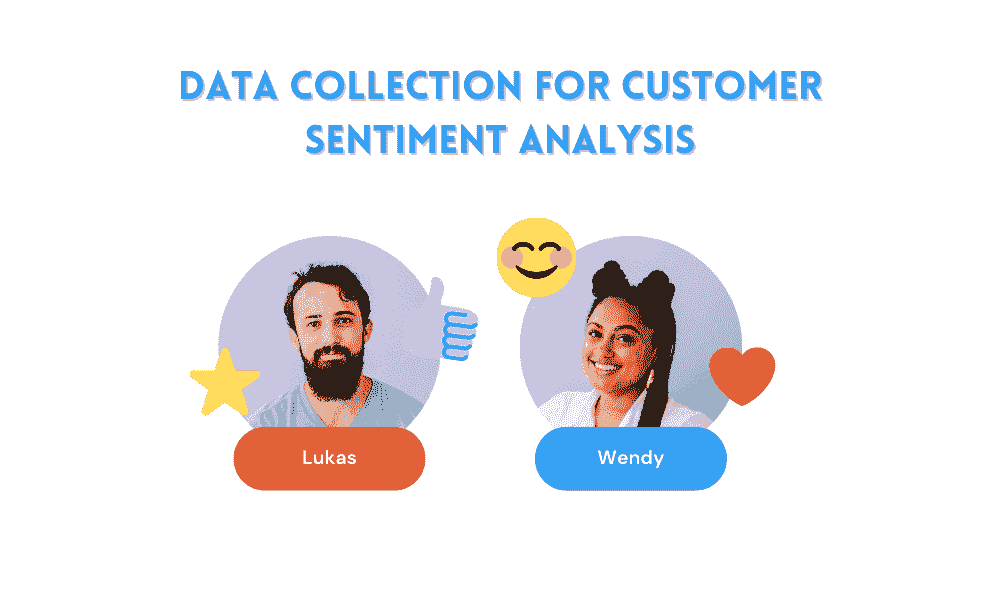
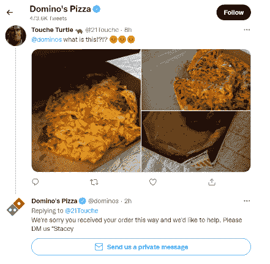
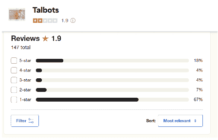
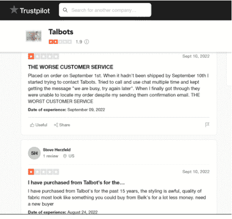

# 如何收集客户情感分析的数据

> 原文：[`www.kdnuggets.com/2022/12/collect-data-customer-sentiment-analysis.html`](https://www.kdnuggets.com/2022/12/collect-data-customer-sentiment-analysis.html)

编辑提供的图像

客户情感分析是利用机器学习（ML）从客户在评论、论坛、调查等中提供的反馈中发现客户对品牌的意图和看法的过程。对客户体验数据的情感分析为企业提供了对购买决策动机、基于时间线或事件变化的品牌情感模式的深刻洞察，以及有助于产品和服务改进的[市场差距分析](https://www.techtarget.com/searchcio/definition/gap-analysis)。

* * *

## 我们的前三大课程推荐

 1\. [谷歌网络安全证书](https://www.kdnuggets.com/google-cybersecurity) - 快速进入网络安全职业生涯。

 2\. [谷歌数据分析专业证书](https://www.kdnuggets.com/google-data-analytics) - 提升你的数据分析技能

 3\. [谷歌 IT 支持专业证书](https://www.kdnuggets.com/google-itsupport) - 支持你在 IT 方面的组织

* * *

**目录：**

+   什么是客户情感分析？

+   你如何收集客户情感分析的数据？

+   如何从客户反馈中得出情感评分

+   结论

情感分析细致地检查客户反馈数据，以识别特定的情感或情绪。大致上，这些情感是积极的、消极的或中性的。但在这些参数内，基于机器学习任务如自然语言处理（NLP）和语义分析的情感分析模型可以发现词语的语义和句法方面，从而帮助发现不同类型的消极情感。

例如，它可以根据表示不同负面情绪的词汇，如焦虑、失望、遗憾、愤怒等，提供不同的情感评分。积极的微观情感也同样如此。

这种细致的情感挖掘结合基于方面的品牌体验分析至关重要。例如，当你了解基于价格、便利性、购买容易程度、客户服务等方面的情感时，你可以获得可依赖的行动洞察，以便在质量控制和产品改进方面做出正确决策。

# 你如何收集客户情感分析的数据？

获取有针对性和深刻品牌情感情报的重要部分是拥有可靠的客户反馈数据。以下是你可以收集这些数据的五种基本方法。

## 1\. 社交媒体评论和视频

社交媒体监听是你获取关于品牌的当前客户反馈的方式之一，包括你的产品以及服务。一个能够处理和评估社交媒体评论以及视频内容的情感分析模型，是利用这一数据来源的最佳选择。

借助这样的工具，你可以从以文本为主的社交媒体网站（如 Twitter）到以视频为主的网站（如 TikTok 或 Instagram）中获取客户情感分析数据。这给你带来了极大的优势，因为并不是所有社交媒体平台在客户选择上都是一刀切的。[客户选择](https://www.journalism.co.uk/news/ofcom-news-consumption-report-shows-social-media-users-are-still-concerned-by-fake-news-/s2/a845925/)。

例如，虽然客户主要使用 Twitter 直接与品牌互动，但 Facebook 用户通常会留下详细的关于他们与企业相关的评论。这种明显的差异是由于业务性质、年龄、地理位置、数字使用等因素造成的。

以下示例展示了客户在两个不同社交媒体渠道上留下评论的情况。

社交媒体情感分析的另一个巨大优势是，你还可以找到符合要求的社交媒体意见领袖，他们可以成为你数字营销策略中的绝佳补充。意见领袖的成本仅为雇用公关公司或名人代言的一半。

此外，人们信任产品评论和他们可以[相关](https://www.forbes.com/sites/forbesagencycouncil/2021/02/04/influencer-marketings-surprising-rise-of-the-everyperson/)的意见领袖的推荐。这无论是你是寻找专业造型建议的实习生，还是寻找青少年手机最佳选择的四个孩子的父亲，这都是事实。[这就是](https://www.repustate.com/blog/finding-tiktok-influencers-for-your-brand-using-ai/)数据科学和机器学习如何帮助找到适合业务的 TikTok 意见领袖。

## 2\. 超越定量调查，如 NPS、CES 或 CSAT

客户反馈指标，如净推荐值（NPS）、客户努力值（CES）或星级评分，可以一眼看出人们是否对你的业务满意。但这并不会真正提供任何实际的业务洞察。

要获取真实的客户情感洞察，你需要超越定量指标。为此，你需要分析评论和开放式调查回应，这些回应没有固定的回答。这允许客户写下自由流动的评论，从而为你提供关于你业务的某些方面的洞察，甚至是你未曾意识到的。

在上述示例中，我们可以看到客户对企业给予了 1 星评价。但在阅读评论后，我们意识到负面情绪背后的原因完全不同。

一位客户对公司的在线客服感到不满，而另一位则提到，尽管他们是长期客户，但由于质量下降和新的定价，他们可能不再购买他们的产品。

这些是可操作的洞察，企业可以准确知道在哪些方面需要改进以维持客户满意度和忠诚度。超越单纯的数字指标可以获得这些洞察。

## 3\. 分析客户论坛和网站上的评论

另一个获取多样化客户反馈数据的优秀方法是筛选产品评论网站如 GoogleMyBusiness 和论坛如 Reddit。重要的是，从不同的数据来源获得的洞察更具价值，因为不同平台吸引的受众类型各异。

例如，Reddit 通常被那些对某个主题或产品更有热情的客户使用，因为这个论坛允许他们进行详细的讨论。而 Amazon 评论或 Google 评论则主要被那些希望在商家催促下或因为经历了好的或坏的体验而留下评论的普通客户使用。

这些 [基于机器学习的技术洞察](https://www.repustate.com/blog/disney-resort-reviews/) 从 Florida 的 Disney World 评论中提取的客户评论展示了这一点。

## 4\. 非传统来源的客户声音（VoC）数据

非传统来源的客户反馈数据，如 [聊天机器人历史记录](https://www.nytimes.com/2022/03/03/technology/ai-chatbot.html)、客户邮件、客户支持记录等，都是获取客户体验洞察的绝佳来源。这些来源的一个优势是这些数据已经存在于你的客户关系管理（CRM）工具中。

当你能够收集和分析这些数据时，你将能够发现许多潜在问题，即使是精心规划的客户调查或社交媒体监测也可能无法突出这些问题。

## 5\. 分析新闻和播客

包含文章、新闻视频和播客的新闻数据可以为品牌绩效和认知提供详细的见解。新闻来源的市场反馈可以帮助企业进行有效的公关（PR）活动，以管理品牌声誉。

它还可以通过行业趋势来帮助进行竞争对手分析，这些趋势是情感分析模型从新闻文章或视频中的品牌体验数据中提取的，同时帮助他们了解消费者行为。

# 如何从客户反馈中推导情感分数？

为了说明情感是如何提取和计算分数的，让我们以新闻来源作为客户反馈的重要来源，看看机器学习模型如何分析这些数据。

## 1\. 收集数据

为了获得最准确的结果，我们必须使用所有公开的新闻来源。这包括来自电视台、在线杂志和其他出版物、广播、播客、视频等的新闻。

这可以通过两种方式完成。我们可以直接通过像 Google 新闻 API、[ESPN 头条 API](http://www.espn.com/apis/devcenter/)、[BBC 新闻 API](https://bbcnewslabs.co.uk/projects/juicer/)等直播新闻 API 上传数据。或者，我们可以手动将数据上传到我们使用的机器学习模型中，通过下载 .csv 文件中的评论和文章。

## 2\. 使用机器学习任务处理数据

现在模型处理数据，并识别不同的格式 - 文本、视频或音频。在文本的情况下，过程相对简单。模型提取所有文本，包括[表情符号](https://www.psychologistworld.com/emotion/emoticons-emojis-emotion-psychology)和标签。在播客、广播和视频的情况下，则需要通过语音转文本软件进行音频转录。这些数据也会被发送到文本分析流程中。

一旦进入处理流程，自然语言处理（NLP）、命名实体识别（NER）、语义分类等技术会确保从数据中提取和归纳出关键方面、主题和话题，以便进行情感分析。

## 3\. 分析情感

现在文本已经被分离，每个主题、方面和实体都进行情感分析，计算情感分数。这可以通过三种方法中的任何一种完成 - 词数统计方法、句子长度方法和正负面词汇的比例。

让我们以这个句子为例。*“体育场的观众评论说座位很好。然而，票价确实显得有些昂贵，因为没有季票可供购买，而且许多人在票务柜台甚至遇到了粗鲁的工作人员，根据《每日先驱报》的报道。”*

假设在经过[分词](https://neptune.ai/blog/tokenization-in-nlp)、文本规范化（去除非文本数据）、词干提取（寻找词根）和停用词移除（去除冗余词）后，我们获得了负面和正面情感的以下分数。

正面 - 好 - 1(+ 0.07)

负面 - 昂贵(- 0.5)，粗鲁(- 0.7) - 2

现在让我们使用前三种方法计算情感分数。

### 词数统计方法

这是计算情感分数最简单的方法。在此方法中，我们从正面出现的次数中减去负面出现的次数（1 - 2 = -1）。

因此，上述示例的情感分数为 -1。

### 句子长度方法

积极词汇的数量从消极词汇中减去。结果再除以文本中的总词数。由于得出的分数可能非常小，并且有很多小数位，因此通常将其乘以一个数字。这是为了使得分数更大，从而更容易理解和比较。在我们的例子中，得分将是。

1-2/42 = -0.0238095

**### 负面-正面词汇计数比例

积极词汇的总数除以消极词汇的总数，然后结果加上 1。这比其他方法更为平衡，尤其是在大量数据的情况下。

1/ 2+1 = 0.33333

## 4\. 洞察可视化

一旦数据被分析出情感，洞察将呈现在可视化仪表板上，让你了解从所有数据中获得的智慧。你可以看到基于时间线的情感分析，以及基于事件的分析，如产品发布、股市波动、新闻发布、公司声明、新定价等。

这些基于方面的洞察在你规划营销和增长策略时，可以提供极大的价值。

# 结论

在营销活动中，AI 和数据科学具有巨大的重要性，尤其是在不断创新和市场动态不断变化的时代。由直接从客户反馈数据中获取的客户情感分析，可以为你提供确保持续增长的可持续营销策略所需的一切杠杆。

**[马丁·奥斯特罗夫斯基](https://www.linkedin.com/in/martinostrovsky/)** 是 Repustate 的创始人兼首席执行官。他对 AI、机器学习和自然语言处理充满热情。他制定了 Repustate 全球文本分析 API、情感分析、深度搜索和命名实体识别解决方案的战略、路线图和功能定义。

### 更多相关话题

+   [对加密数据进行情感分析：同态加密技术](https://www.kdnuggets.com/2022/12/zama-sentiment-analysis-encrypted-data-homomorphic-encryption.html)

+   [Python 中的情感分析：超越词袋模型](https://www.kdnuggets.com/sentiment-analysis-in-python-going-beyond-bag-of-words)

+   [如何使用 Hugging Face Transformers 微调 BERT 进行情感分析](https://www.kdnuggets.com/how-to-fine-tune-bert-sentiment-analysis-hugging-face-transformers)

+   [数据管理：如何保持在客户心中占据重要地位？](https://www.kdnuggets.com/2022/04/data-management-stay-top-customer-mind.html)

+   [一个为客户数据建模开发 Hugging Face 的社区](https://www.kdnuggets.com/2022/08/objectiv-community-developing-hugging-face-customer-data-modeling.html)

+   [假装直到成功：生成真实的合成客户数据集](https://www.kdnuggets.com/2022/01/fake-realistic-synthetic-customer-datasets-projects.html)**
