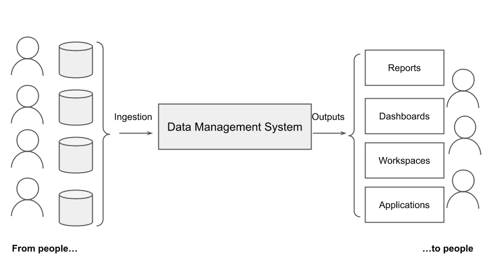
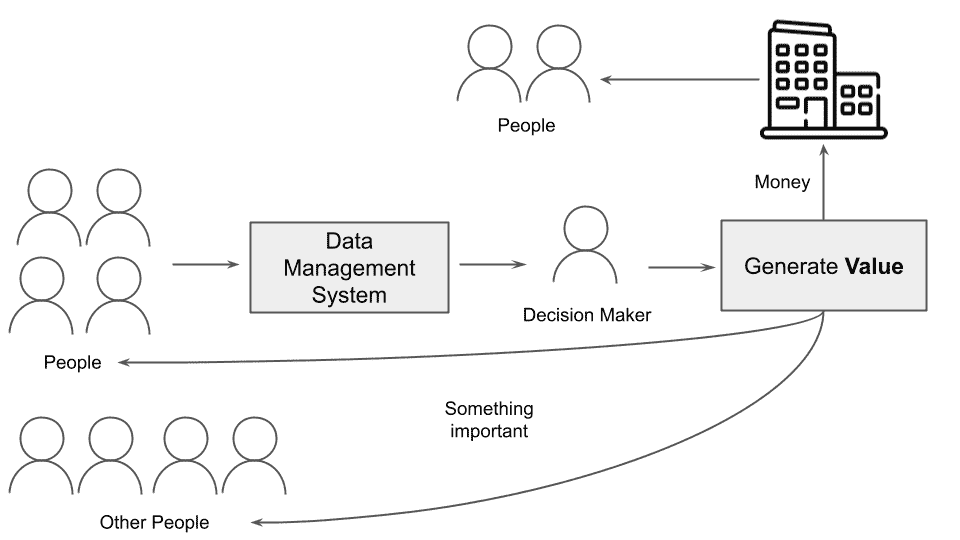
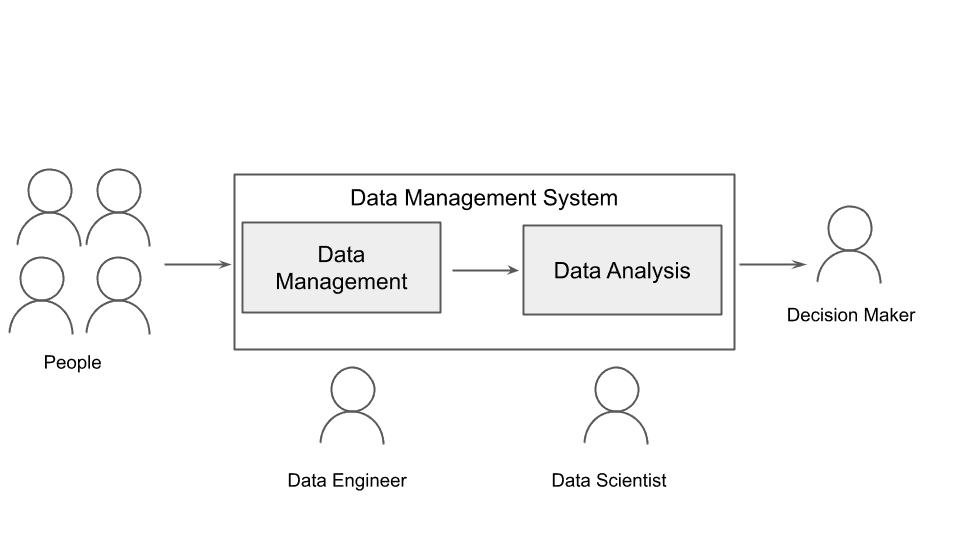

# 将数据管理与数据讲述结合起来以创造价值

> 原文：[`www.kdnuggets.com/combining-data-management-and-data-storytelling-to-generate-value`](https://www.kdnuggets.com/combining-data-management-and-data-storytelling-to-generate-value)

最近，我专注于数据讲述及其在有效传达数据分析结果以创造价值方面的重要性。然而，我的技术背景非常接近数据管理及其问题，这促使我思考数据管理需要满足哪些条件，以确保你能够迅速构建以数据为驱动的故事。我得出一个常常被视为理所当然的结论，但始终值得牢记。你不能仅仅依靠数据来构建数据驱动的故事。数据管理系统还必须考虑至少两个方面。你想知道是哪两个方面吗？让我们在本文中尝试找出答案。

我们将在本文中涵盖的内容：

+   数据介绍

+   数据管理系统

+   数据讲述

+   数据管理与数据讲述

* * *

## 我们的三大课程推荐

 1\. [谷歌网络安全证书](https://www.kdnuggets.com/google-cybersecurity) - 快速进入网络安全职业生涯。

 2\. [谷歌数据分析专业证书](https://www.kdnuggets.com/google-data-analytics) - 提升您的数据分析技能

 3\. [谷歌 IT 支持专业证书](https://www.kdnuggets.com/google-itsupport) - 支持您的组织在 IT 领域

* * *

## 1\. 数据介绍

我们不断谈论、使用和生成数据。但你是否想过什么是数据以及数据有哪些类型？让我们试着定义一下。

数据是原始事实、数字或符号，可以处理以生成有意义的信息。数据有不同类型：

+   **结构化数据**是按照固定模式组织的数据，如 SQL 或 CSV。这种数据的主要优点是易于得出见解。主要缺点是模式依赖限制了扩展性。数据库就是这种数据的一个例子。

+   **半结构化数据**是部分组织但没有固定模式的数据，如 JSON XML。优点是它们比结构化数据更灵活。主要缺点是元级结构可能包含非结构化数据。示例包括带有标签的推文等注释文本。

+   **非结构化数据**，如音频、视频和文本，未被注释。其主要优点是它们是非结构化的，因此存储起来较为容易，并且具有很好的扩展性。然而，它们管理起来却具有挑战性。例如，很难提取其含义。纯文本和数字照片就是非结构化数据的例子。

为了组织数据并应对其不断增长的体量，妥善管理数据至关重要。

## 2\. 数据管理

数据管理是摄取、处理、安全存储组织数据的实践，这些数据随后用于战略决策，以改善业务成果 [1]。数据管理系统主要有三种：

+   数据仓库

+   数据湖

+   数据湖仓

### 2.1 数据仓库

数据仓库只能处理结构化数据，经过提取、转换和加载（ETL）过程后。一旦加工，数据可以用于报告、仪表板或挖掘。下图总结了数据仓库的结构。

图 1：数据仓库的架构

数据仓库的主要问题是：

+   **可扩展性** - 它们不可扩展

+   **非结构化数据** - 他们不管理非结构化数据

+   **实时数据** - 它们不管理实时数据。

### 2.2 数据湖

数据湖可以摄取原始数据。与数据仓库不同，数据湖管理并提供处理结构化、半结构化和非结构化数据的方法。摄取原始数据允许数据湖在原始存储系统中摄取历史数据和实时数据。

数据湖增加了元数据和治理层，如下图所示，使数据可以被上层（报告、仪表板和数据挖掘）消费。下图显示了数据湖的架构。

图 2：数据湖的架构

数据湖的主要优势在于可以快速摄取任何类型的数据，因为它不需要任何初步处理。数据湖的主要缺点是，由于它摄取原始数据，因此不支持数据仓库的语义和事务系统。

### 2.3 数据湖仓

随着时间的推移，数据湖的概念演变为数据湖仓，即一个增强的数据湖，支持其顶部的事务。在实际应用中，数据湖仓根据数据仓库的语义修改数据湖中的现有数据，如下图所示。

图 3：数据湖仓的架构

数据湖仓从操作源中摄取数据，如结构化、半结构化和非结构化数据。它将数据提供给分析应用程序，如报告、仪表板、工作区和应用程序。数据湖仓包括以下主要组件：

+   数据湖，包括表格式、文件格式和文件存储

+   数据科学和机器学习层

+   查询引擎

+   元数据管理层

+   数据治理层。

### 2.4 数据管理系统架构的概述

下图概述了数据管理系统的架构。

图 4\. 数据管理系统的一般架构

一个数据管理系统（数据仓库、数据湖、数据湖屋，或其他）接收数据作为输入，并生成输出（报告、仪表盘、工作空间、应用程序等）。输入由人生成，输出再次被人利用。因此，我们可以说，我们有输入中的人和输出中的人。**数据管理系统是从人到人的。**

输入中的人包括生成数据的人员，如佩戴传感器的人、回答调查的人、撰写评论的人、有关人员的统计数据等。输出中的人可以属于以下三类之一：

+   **普通公众**，其目标是学习某些东西或获得娱乐

+   **专业人士**，他们是希望理解数据的技术人员

+   **决策者**，即做出决策的人员。

在这篇文章中，我们将重点关注高管，因为他们生成价值。

那么**价值**是什么呢？《剑桥词典》对价值有不同的定义[2]。

1.  **能够获得的金钱数量**

1.  **对某人而言事物的重要性或价值**

1.  价值：人们拥有的信念，特别是关于什么是对的和错的，什么是生活中最重要的，这些信念控制着他们的行为。

如果我们接受价值作为金钱数量的定义，决策者可以为他们工作的公司生成价值，并间接为公司内的人员以及使用公司服务或产品的人员生成价值。如果我们接受价值作为事物重要性的定义，那么价值对生成数据的人员以及其他外部人员至关重要，如下图所示。

图 5：生成价值的过程

在这种情况下，正确有效地将数据传达给决策者变得至关重要，以生成价值。因此，整个数据管道应该设计成将数据传达给最终观众（决策者），以便生成价值。

## 3\. 数据讲故事

有三种传达数据的方式：

+   **数据报告**包括数据描述，涵盖数据探索和分析阶段的所有细节。

+   **数据展示**仅选择相关数据，并以有组织和结构化的方式呈现给最终观众。

+   **数据讲故事**在数据上构建一个故事。

让我们专注于数据讲故事。数据讲故事是通过故事向观众传达数据分析过程的结果。根据你的观众，你将选择一个合适的

+   **语言和语气**：传达的词汇（语言）和通过这些词汇表达的情感（语气）

+   **背景**：根据观众的文化敏感性，为故事添加的细节水平

数据讲故事必须考虑数据及其相关信息（背景）。数据背景指的是围绕数据集的背景信息和相关细节。在数据管道中，这些数据背景作为元数据存储[3]。**元数据**应提供以下问题的答案：

+   谁收集了数据

+   数据内容

+   数据何时被收集

+   数据从何处收集

+   数据为何被收集

+   数据如何被收集

### 3.1 元数据的重要性

让我们从数据讲故事的角度重新审视数据管理管道，它包括数据和元数据（背景）

图 6：从数据讲故事的角度看数据管理管道

数据管理系统包括两个要素：数据管理，主要角色是数据工程师；数据分析，主要角色是数据科学家。

数据工程师应关注不仅仅是数据，还要关注元数据，这有助于数据科学家围绕数据构建背景。元数据管理系统有两种类型：

+   被动元数据管理，它将元数据聚合并存储在静态数据目录中（例如，Apache Hive）

+   主动元数据管理，它提供动态和实时的元数据（例如，Apache Atlas）

数据科学家应构建数据驱动的故事。

## 4\. 数据管理和数据讲故事

结合数据管理和数据讲故事意味着：

+   考虑最终从数据中获益的人。数据管理系统从人到人。

+   考虑元数据，它帮助构建最强大的故事。

如果我们从期望结果的角度看待整个数据管道，我们会发现每一步背后人员的重要性。只有当我们关注数据背后的人员时，我们才能从数据中创造价值。

## 总结

恭喜！你刚刚学会了如何从数据讲故事的角度看待数据管理。除了数据之外，你应该考虑两个方面：

+   数据背后的人员

+   元数据，它为你的数据提供背景。

而且，最重要的是，永远不要忘记人员！数据讲故事帮助你了解数据背后的故事！

## 参考文献

[1] IBM. [什么是数据管理？](https://www.ibm.com/topics/data-management)

[2] 剑桥词典. [价值](https://dictionary.cambridge.org/dictionary/english/value).

[3] Peter Crocker. [提升数据背景的指南：谁，什么，何时，哪里，为什么，以及如何](https://www.thoughtspot.com/data-trends/best-practices/data-context)

## 外部资源

[使用数据讲故事将数据转化为价值 [讲座]](https://www.brighttalk.com/webcast/9059/609317)

****[Angelica Lo Duca](https://www.linkedin.com/in/angelicaloduca/)**** ([Medium](https://alod83.medium.com/)) (@alod83) 是意大利比萨国家研究委员会（IIT-CNR）信息学与电信研究所的研究员。她是比萨大学数字人文学科硕士课程“数据新闻学”的教授。她的研究兴趣包括数据科学、数据分析、文本分析、开放数据、网络应用、数据工程和数据新闻学，应用于社会、旅游和文化遗产领域。她是《Comet for Data Science》一书的作者，该书由 Packt Ltd. 出版；即将出版的《Data Storytelling in Python Altair and Generative AI》一书的作者，该书由 Manning 出版；以及即将出版的《Learning and Operating Presto》一书的合著者，该书由 O'Reilly Media 出版。Angelica 还是一位热衷的技术作家。

### 了解更多相关话题

+   [简化 Pandas DataFrames 的合并](https://www.kdnuggets.com/2022/09/combining-pandas-dataframes-made-simple.html)

+   [使用开源工具生成合成的时间序列数据](https://www.kdnuggets.com/2022/06/generate-synthetic-timeseries-data-opensource-tools.html)

+   [如何生成合成的表格数据集](https://www.kdnuggets.com/2022/03/generate-tabular-synthetic-dataset.html)

+   [使用 ChatGPT 生成被动收入的 4 种方法](https://www.kdnuggets.com/2023/03/4-ways-generate-passive-income-chatgpt.html)

+   [使用 Google MusicLM 从文本生成音乐](https://www.kdnuggets.com/2023/06/generate-music-text-google-musiclm.html)

+   [使用 Stable Diffusion 生成超现实主义面孔的 3 种方法](https://www.kdnuggets.com/3-ways-to-generate-hyper-realistic-faces-using-stable-diffusion)
