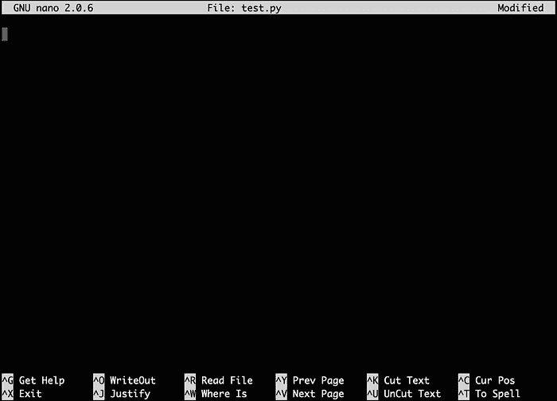
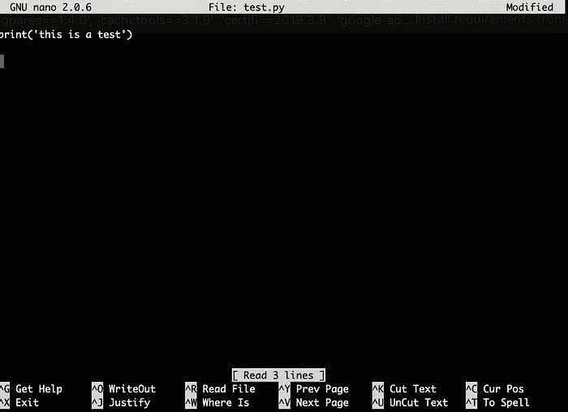

# 每位数据科学家都应该了解的命令行基础

> 原文：[`www.kdnuggets.com/2019/08/command-line-basics-every-data-scientist.html`](https://www.kdnuggets.com/2019/08/command-line-basics-every-data-scientist.html)

 评论

**作者：[Rebecca Vickery](https://www.linkedin.com/in/rebecca-vickery-20b94133/)，数据科学家**

照片由 [Almos Bechtold](https://unsplash.com/@almosbech?utm_source=unsplash&utm_medium=referral&utm_content=creditCopyText) 拍摄，来源于 [Unsplash](https://unsplash.com/search/photos/magic?utm_source=unsplash&utm_medium=referral&utm_content=creditCopyText)

* * *

## 我们的三大课程推荐

 1\. [Google 网络安全证书](https://www.kdnuggets.com/google-cybersecurity) - 快速进入网络安全职业轨道。

 2\. [Google 数据分析专业证书](https://www.kdnuggets.com/google-data-analytics) - 提升你的数据分析技能

 3\. [Google IT 支持专业证书](https://www.kdnuggets.com/google-itsupport) - 支持你的组织的 IT

* * *

如果你是数据科学家或正在学习数据科学，并且希望从使用 jupyter notebooks 转向编写生产就绪的代码，那么你很可能需要在某些任务中使用命令行。我发现生产数据科学工具和过程的文档通常假设你已经了解这些基础知识。然而，如果你没有计算机科学背景，你可能不知道如何在终端完成一些较简单的任务。

我想写这篇简短的指南，介绍使用命令行执行简单任务的基本知识。了解这些基础知识无疑会使你的工作流程更加高效，并在处理生产系统时提供帮助。

### 文件和目录导航

当你打开终端时，通常会看到这样的界面。

`~`符号是你主目录的简写，这意味着你当前在这个目录中。如果你输入命令`pwd`，它会显示你当前的工作目录，在我们的例子中看起来像这样`/Users/myname`。

如果你想创建一个新的目录，可以输入`mkdir test`，这将创建一个名为 test 的新目录。你现在可以使用`cd`命令进入这个目录。

你也可以通过输入`..`来导航目录，这会让你返回到上一级目录。在我们的情况下，我们将返回到主目录。

### 文件和目录操作

接下来，让我们在测试目录中创建一个新的 Python 文件。要创建文件，你可以输入这个命令`touch test.py`。这将创建一个空白的 Python 文件。`ls`命令会将目录的内容打印到终端，因此我们可以使用它来检查文件是否已创建。

我们将使用一个名为[nano](https://www.nano-editor.org/dist/v2.2/nano.html)的程序来编辑文件。要打开文件，只需输入`nano test.py`，然后将打开一个新标签页，如下所示。

在这个例子中，我们将进行一个小的修改，因此我们将输入`print('this is a test')`。要保存文件，你可以使用快捷键`Ctrl+O`，要退出程序，使用`Ctrl+X`。

现在我们已经编辑了文件，我们可以使用这个命令`python test.py`来运行它。简单的 Python 代码被执行，‘this is a test’会显示在终端上。

### 移动和删除

让我们快速创建一个新的目录`mkdir new`，以探索如何移动文件。你可能会想用三种主要的方法来做到这一点。

在下面的命令中，`./new`前面的`.`是父目录（test）的简写。

1.  复制并移动文件，以保留当前目录中的原始文件`cp test.py ./new`

1.  移动文件而不复制`mv test.py ./new`

1.  复制文件并在新位置重命名文件`cp test.py ./new/test_new.py`

最后，要删除文件，我们可以使用`rm test.py`。要删除一个空目录，你可以使用`rmdir new`。要删除包含一些文件的目录，使用`rm -rf new`。

本文涵盖了数据科学家可能需要完成的一些最基本的命令行任务。如果你想探索一些更高级的命令行工具，我已经写了另一篇指南[在这里](https://towardsdatascience.com/five-command-line-tools-for-data-science-29f04e5b9c16)。

感谢阅读！

**个人简介: [Rebecca Vickery](https://www.linkedin.com/in/rebecca-vickery-20b94133/)** 正在通过自学数据科学。Holiday Extras 的数据科学家。alGo 的联合创始人。

[原文](https://towardsdatascience.com/command-line-basics-every-data-scientist-should-know-72f9b4bcd08e)。经许可转载。

**相关：**

+   数据科学中的五款命令行工具

+   数据科学家必备的前 12 款命令行工具

+   命令行中的数据科学：探索数据

### 更多相关内容

+   [每个初学者数据科学家都应掌握的 6 种预测模型](https://www.kdnuggets.com/2021/12/6-predictive-models-every-beginner-data-scientist-master.html)

+   [每个数据科学家都应了解的三个 R 库（即使你使用 Python）](https://www.kdnuggets.com/2021/12/three-r-libraries-every-data-scientist-know-even-python.html)

+   [成为优秀数据科学家所需的 5 项关键技能](https://www.kdnuggets.com/2021/12/5-key-skills-needed-become-great-data-scientist.html)

+   [2021 年最佳 ETL 工具](https://www.kdnuggets.com/2021/12/mozart-best-etl-tools-2021.html)

+   [命令行数据科学：免费电子书](https://www.kdnuggets.com/2022/03/data-science-command-line-free-ebook.html)

+   [数据科学的 5 个命令行工具](https://www.kdnuggets.com/2023/03/5-command-line-tools-data-science.html)
