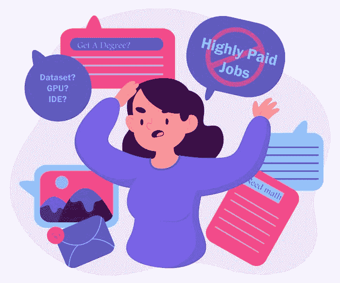
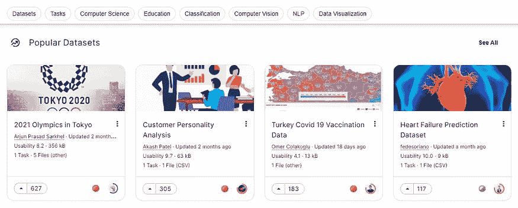
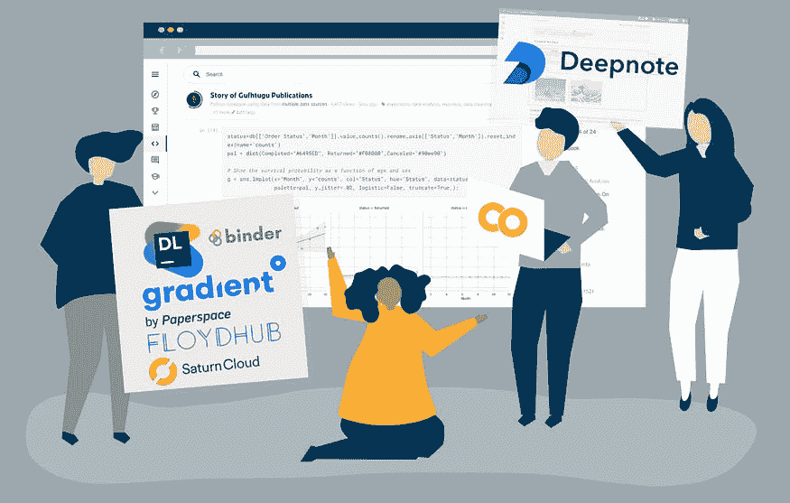

# 关于机器学习的常见误解

> 原文：[`www.kdnuggets.com/2021/11/common-misconception-about-machine-learning.html`](https://www.kdnuggets.com/2021/11/common-misconception-about-machine-learning.html)

评论

*作者图像 | 元素来自 [freepik](https://www.freepik.com/free-vector/infodemic-news-illustration_10877579.htm#page=1&query=Misconception&position=0&from_view=search)。*

目前关于机器学习（ML）有很多炒作，许多初学者因错误的理由而成为这种炒作的受害者。你的教授会解释，如果你想要进步，获得博士学位是必要的，或者你的同学会告诉你如何获得更好的 GPU 和 IDE（集成开发环境）。当你开始从在线课程中学习时，你意识到你需要一个更大的数据集和对 Python 的熟练掌握。在学习了所需的技能后，当你申请工作时，你发现仅凭几个课程或认证是不够的。最后，在获得工作后，你意识到这是一项要求很高的工作，有时这些工作在初期的薪水并不高。

本文将帮助你克服这些失望，并准备好面对这些问题。我们将学习许多关于初学者进入机器学习领域所面临的现实问题。

> *有明确的实证证据表明，你不需要大量的**数学**，你不需要大量的**数据**，也不需要大量的**昂贵的计算机**。— [Jeremy Howard](https://www.linkedin.com/in/howardjeremy/) （[实用深度学习课程](https://course.fast.ai/)）*

### 学习编程？

是的，编程是进入机器学习领域（特别是深度学习）所必需的。这并不意味着你要先花时间学习 Python、C++ 或 R，然后再开始学习机器学习。编程部分会在你学习基础知识时自然出现。你不需要记住语法或模型架构，你可以通过简单的 Google 搜索找到这些信息。就是这么简单。世界正朝着无代码机器学习和 [AutoML](https://docs.microsoft.com/en-us/azure/machine-learning/concept-automated-ml) 的方向发展。AutoML 是一个强大的工具，它会为你完成所有任务，并提供一个有效的机器学习模型。有时你只需要写两行代码，而不是两百行代码，就能获得类似的结果。

### 你需要数学或博士学位吗？

是的，你需要一些数学知识，但主要是为了进行研究和推动深度学习的边界。如果你打算训练模型并将其部署到生产环境中，那么你可能需要学习 MLOps，而不是数学。

> *你不需要数学来进行应用机器学习，但在进行任何研究和推动边界时，你需要学习高级统计学。— [Jakub Žitný](https://www.linkedin.com/in/zitny/)*

你还需要了解模型架构的工作原理和各种矩阵函数。这些可以通过 8 小时的课程来教授，有时你甚至不需要了解所有可用的模型架构来解决问题。我是 Jeremy 的忠实粉丝，他在他的书 [深度学习编程员的书：使用 Fastai 和 PyTorch](https://www.amazon.com/Deep-Learning-Coders-fastai-PyTorch/dp/1492045527) 中解释了深度学习领域存在很多门槛。学术界会要求你学习高级微积分，了解所有数学模型，最终获得特定领域的博士学位才能成功。但你不需要这些。我见过很多没有学位而有商业背景的人现在在这些领域成为了专家。因此，请专注于基础知识，学习整个课程，并通过在作品集项目上工作来不断成长。

### 你需要一个庞大的数据集吗？

是的，但在少数情况下。现代深度学习模型现在能够用有限的样本产生高精度。即使是数据集的获取也变得更容易了，像 Kaggle 这样的平台提供了数以千计的开源数据集，可以下载并用于商业目的。我们还可以在 [GitHub](https://github.com/jbrownlee/Datasets)、[DAGsHub](https://dagshub.com/explore/datasets)、[HuggingFace](https://huggingface.co/datasets)、[Knoema](https://knoema.com/atlas/sources) 和 [Google Dataset Search](https://datasetsearch.research.google.com/) 上找到数据集，以训练我们的模型，并最终将其用于生产。

*[来自 Kaggle 的图片](https://www.kaggle.com/datasets)。*

### 你需要学位或认证吗？

一些职位确实要求机器学习学位或 TensorFlow 证书，但如果你在 GitHub 和 Kaggle 上有强大的作品集，这些就变得次要了。很多开发者正在转向机器学习，他们没有专门的学位或证书，但有深度学习模型的经验并将其投入生产。如果你能向雇主证明你可以完成机器学习生命周期中的每个任务，那么你就是完美的候选人。总的来说，如果你有强大的机器学习作品集，就不必考虑获得证书或学位。要获得强大的 ML 作品集，请阅读：[如何作为初学者构建强大的数据科学作品集 — KDnuggets](https://www.kdnuggets.com/2021/10/strong-data-science-portfolio-as-beginner.html)。

*[使用 Google Cloud 上的 TensorFlow 进行机器学习 | Coursera](https://www.coursera.org/specializations/machine-learning-tensorflow-gcp?ranMID=40328&ranEAID=jU79Zysihs4&ranSiteID=jU79Zysihs4-1DFWDxcnbqCtsY4mCUi.jw&siteID=jU79Zysihs4-1DFWDxcnbqCtsY4mCUi.jw&utm_content=10&utm_medium=partners&utm_source=linkshare&utm_campaign=jU79Zysihs4)*

### 你需要昂贵的计算设备或 IDE 吗？

不，我有一台旧笔记本电脑，我可以借助 Kaggle 平台在云端 GPU 和 TPU 上训练这些大型模型。世界正从个人电脑转向云计算机。你可以从 Kaggle 和*[Google Colab](https://colab.research.google.com/)*获得免费的 CPU、GPU 和 TPU。还有其他平台也可以帮助你进行数据分析和创建完整的项目，如*[Deepnote](https://deepnote.com/)*、*[JetBrains Datalore](https://datalore.jetbrains.com/notebooks)*和*[Paperspace](https://console.paperspace.com/)*。这些平台为你提供免费的工作空间来构建你的机器学习产品，并且附带协作工具。在我的日常工作中，我使用 Deepnote 来处理新的研究或项目，如果需要更好的 GPU 或 TPU，我会切换到 Kaggle 或 Colab。

*你不需要购买昂贵的 IDE 或计算设备来构建你的产品。现在你可以使用这些免费的云工具。*

*[2021 年数据科学前 5 大免费云 IDE | by Abid Ali Awan | Towards AI](https://pub.towardsai.net/top-5-free-cloud-ide-for-data-science-2021-9c129745590b)*

### 职场的真实情况

在获得所需技能后，你开始在市场上寻找工作，但很快你会意识到公司要求更多。他们希望你了解数据工程、数据分析和 MLOps。在面试阶段，他们会询问你最近的项目和你在模型部署方面的工作经验。

*[机器学习工作 | Glassdoor](https://www.glassdoor.com/Job/machine-learning-jobs-SRCH_KO0,16.htm)*

即使学习了关键的必需技能，你也可能感到相当失望。这是因为大多数公司在寻找有经验的个人或具有多种技能的人。唯一能提高你机会的方法就是不断学习新技能，并且不断参与机器学习竞赛。这也会提升你的机器学习作品集，并最终让你脱颖而出。如果你刚开始，很难找到工作。继续提升自己，最终你会找到理想的工作。

### 机器学习工程师的生活

如我之前提到的，这需要擅长多种技能：显然，包括成为一名优秀的机器学习工程师所需的一切，比如好奇心、分析能力、算法知识、理解业务需求的能力以及有效沟通的需求。此外，你还需要擅长构建需要机器学习操作经验的软件解决方案。*[机器学习工程师的一天 | by Shanif Dhanani](https://medium.com/@shanif/a-day-in-the-life-of-a-machine-learning-engineer-fa73c18ef705)*

除此之外，有时你必须执行诸如数据集标注这样的迭代任务。你可能不会得到高薪工作，但最终你会得到一个需要全职和专注的工作。如果你进入这个领域只是因为它提供高薪工作，那么你应该开始考虑其他选项。你在职业生涯中成功的唯一途径是对 AI 技术的热爱。

### 结论

最终，我总是建议你不断学习新技能，并开始参加 Kaggle 比赛。为了你的职业生涯，不断寻找新工作并为技术面试做准备。我只是想向你展示这个领域的现实情况。它并不美好，并不是每个人都能成功。只有通过努力工作和持续学习，你才能达到一个舒适的职位，获得高薪工作。

我们也讨论了机器学习不需要大量的数学、专业学位或博士学位。它不需要大量的计算能力或庞大的数据集。它只需要你的时间和努力。你可以找到令人惊叹的在线课程，学会一些技能后，将这些技能应用到你的作品集中。

**相关：**

+   [数据科学家从初学者到第一份工作的职业路径](https://www.kdnuggets.com/2021/11/data-scientist-career-path-first-job.html)

+   [如何作为初学者构建强大的数据科学作品集](https://www.kdnuggets.com/2021/10/strong-data-science-portfolio-as-beginner.html)

+   [8 个适合初学者的深度学习项目创意](https://www.kdnuggets.com/2021/09/8-deep-learning-project-ideas-beginners.html)

### 更多相关内容

+   [关于语义分割标注的误解](https://www.kdnuggets.com/2022/01/misconceptions-semantic-segmentation-annotation.html)

+   [如何应对 3 个常见的机器学习挑战](https://www.kdnuggets.com/2022/09/comet-tackle-3-common-machine-learning-challenges.html)

+   [常见数据问题（及解决方案）](https://www.kdnuggets.com/2022/02/common-data-problems-solutions.html)

+   [10 个最常见的数据质量问题及解决方法](https://www.kdnuggets.com/2022/11/10-common-data-quality-issues-fix.html)

+   [5 个常见的 Python 陷阱（及如何避免）](https://www.kdnuggets.com/5-common-python-gotchas-and-how-to-avoid-them)

+   [避免这 5 个每个 AI 初学者常犯的错误](https://www.kdnuggets.com/avoid-these-5-common-mistakes-every-novice-in-ai-makes)
