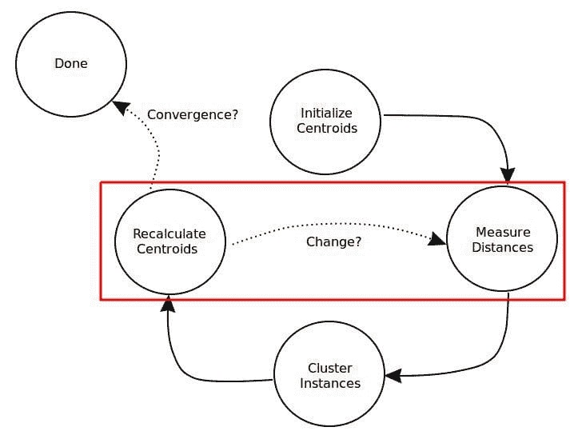
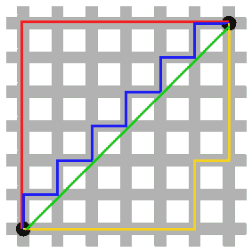
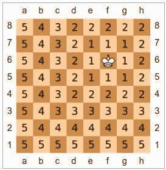

# 使用 Python 和 SciPy 比较距离测量

> 原文：[`www.kdnuggets.com/2017/08/comparing-distance-measurements-python-scipy.html`](https://www.kdnuggets.com/2017/08/comparing-distance-measurements-python-scipy.html)


聚类或聚类分析用于分析不包含预先标记类别的数据。数据实例通过最大化类内相似性和最小化不同类别之间的相似性来进行分组。这意味着聚类算法识别并分组非常相似的实例，而不是那些彼此相似度较低的未分组实例。由于聚类不需要预先标记类别，它是一种无监督学习的形式。

聚类分析的核心是测量不同数据点维度之间的距离。例如，在考虑 k-means 聚类时，需要测量：a) 各个数据点维度与所有聚类中心维度之间的距离，b) 聚类中心维度与所有聚类成员数据点维度之间的距离。

虽然 k-means，作为最简单且最显著的聚类算法，通常使用欧几里得距离作为相似性距离测量，但设计创新或变体聚类算法，其中包括使用不同的距离测量方法并非难事。换句话说，使用不同的聚类相关距离测量技术是相对容易实现的。然而，*实际这样做的原因*则需要对领域和数据有深入的了解。

我们将跳过追求特定距离测量的“为什么”的讨论，而是快速介绍五种有效的测量数据点之间距离的方法。我们还将使用 Python 和 SciPy 库进行简单的演示和比较。有关 SciPy `spatial.distance`模块中可用的距离测量，请[点击这里](https://docs.scipy.org/doc/scipy/reference/spatial.distance.html#module-scipy.spatial.distance)。



**图 1：距离测量在聚类中扮演着重要角色。**

对 k-means 聚类算法过程的简单概述，并指出了与距离相关的步骤。

**欧几里得距离**

我们不妨从永恒的欧几里得空间距离测量冠军开始。欧几里得距离是"['欧几里得空间中两点之间的“普通”直线距离](https://en.wikipedia.org/wiki/Euclidean_distance)"。

作为提醒，给定两个形式为*(x, y)*的点，欧几里得距离可以表示为：


**曼哈顿距离**

曼哈顿——也称为城市街区和出租车——距离定义为“[两个点之间的距离是它们的笛卡尔坐标绝对差的总和](https://en.wikipedia.org/wiki/Taxicab_geometry)。”



**图 2：** 曼哈顿几何以蓝色（楼梯）可视化，欧几里得以绿色（直线）（来源：[维基百科](https://en.wikipedia.org/wiki/Taxicab_geometry)）。

**切比雪夫**

切比雪夫——也称为棋盘——距离最好定义为一种距离度量“[其中两个向量之间的距离是它们在任何坐标维度上的差异的最大值](https://en.wikipedia.org/wiki/Chebyshev_distance)。”



**图 3：** 使用棋盘可视化切比雪夫（来源：[维基百科](https://en.wikipedia.org/wiki/Chebyshev_distance)）。

**堪培拉**

堪培拉距离是曼哈顿距离的加权版本，“[曾被用作比较排名列表的度量和计算机安全中的入侵检测](https://en.wikipedia.org/wiki/Canberra_distance)。”

堪培拉距离可以表示为


其中 **p** 和 **q** 是向量


**余弦**

余弦相似度 [定义为](https://en.wikipedia.org/wiki/Cosine_similarity):

> ...在内积空间中度量两个非零向量之间相似度的度量，它衡量它们之间角度的余弦。0°的余弦值为 1，对于其他角度则小于 1。因此，它是对方向的判断而非大小：具有相同方向的两个向量的余弦相似度为 1，90°的两个向量的相似度为 0，而两个相反的向量的相似度为-1，与它们的大小无关。余弦相似度特别用于正空间，其中结果 neatly 限定在 [0,1]。

余弦相似度常用于聚类中评估凝聚力，而不是确定簇的成员资格。

**Python 和 SciPy 比较**

为了明确我们在做什么，首先创建两个向量——每个向量有 10 维——然后使用 5 种测量技术对这些向量之间的距离进行逐元素比较，这些技术在 SciPy 函数中实现，每个函数接受一对一维向量作为参数。其次，创建一对 100 维的向量，并进行相同的距离测量和报告。

```py` ``` 10 维向量 ------------------------ [ 3.77539984  0.17095249  5.0676076   7.80039483  9.51290778  7.94013829    6.32300886  7.54311972  3.40075028  4.92240096] [ 7.13095162  1.59745192  1.22637349  3.4916574   7.30864499  2.22205897    4.42982693  1.99973618  9.44411503  9.97186125]  10 维向量的距离测量 ------------------------------------------------- 欧几里得距离为 13.435128482 曼哈顿距离为 39.3837553638 切比雪夫距离为 6.04336474839 堪培拉距离为 4.36638963773 余弦距离为 0.247317394393 100 维向量的距离测量 -------------------------------------------------- 欧几里得距离为 42.6017789666 曼哈顿距离为 359.435547878 切比雪夫距离为 9.06282495069 堪培拉距离为 40.8173353649 余弦距离为 0.269329456631 ```py ````

从这些测量结果中，我们可以迅速发现两个重要的结论：

1.  报告的距离（显然）在距离测量技术之间差异很大

1.  一些测量技术在（至少在这个实验中）更容易受到维度增加的影响（而相反，有些技术的影响要小得多）

尽管从这个简单的概述和展示中无法得出重大结论，但这些结果应该将 Hastie、Tibshirani 和 Friedman 的[《统计学习元素》](https://web.stanford.edu/~hastie/ElemStatLearn/)的这段摘录放在合适的背景下考虑：

> 适当的差异度量在聚类的成功中比聚类算法的选择更为重要。这个问题的这一方面……取决于领域特定知识，并且不太适合通用研究。

同样重要的是要注意，距离的关键概念在聚类分析中，并不是测量值的确切数值，而是这些测量值如何用于对数据点进行分组。例如，如果你将每个测量值乘以 100，数值会有所不同，但最终的聚类结果仍然保持不变。

在考虑“聚类”时，很多人往往只会将数据集直接投入到 k-means 算法中，使用默认设置。希望这篇简短的文章能为聚类算法及其组成部分的潜在复杂性和影响提供一些见解。

**相关**：

+   比较聚类技术：简明技术概述

+   聚类关键术语解释

+   从头开始的 Python 机器学习工作流程第二部分：k-means 聚类

* * *

## 我们的前三课程推荐

 1\. [谷歌网络安全证书](https://www.kdnuggets.com/google-cybersecurity) - 快速开启网络安全职业生涯。

 2\. [Google 数据分析专业证书](https://www.kdnuggets.com/google-data-analytics) - 提升你的数据分析技能

 3\. [Google IT 支持专业证书](https://www.kdnuggets.com/google-itsupport) - 支持你的组织 IT 部门

* * *

### 更多相关话题

+   [距离度量：欧几里得、曼哈顿、明可夫斯基，天呐！](https://www.kdnuggets.com/2023/03/distance-metrics-euclidean-manhattan-minkowski-oh.html)

+   [比较线性回归和逻辑回归](https://www.kdnuggets.com/2022/11/comparing-linear-logistic-regression.html)

+   [PyTorch 还是 TensorFlow？比较流行的机器学习框架](https://www.kdnuggets.com/2022/02/packt-pytorch-tensorflow-comparing-popular-machine-learning-frameworks.html)

+   [比较自然语言处理技术：RNNs、Transformers、BERT](https://www.kdnuggets.com/comparing-natural-language-processing-techniques-rnns-transformers-bert)

+   [理解 Python 的迭代和成员资格：__contains__ 和 __iter__ 魔法方法指南](https://www.kdnuggets.com/understanding-pythons-iteration-and-membership-a-guide-to-__contains__-and-__iter__-magic-methods)

+   [通过《Fast Python for Data Science》提升你的 Python 技能！](https://www.kdnuggets.com/2022/06/manning-step-python-game-fast-python-data-science.html)
