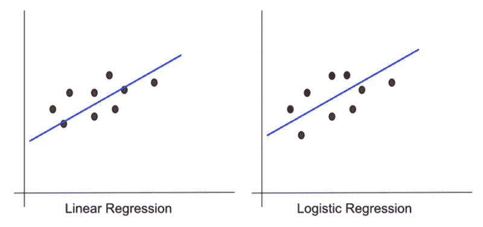
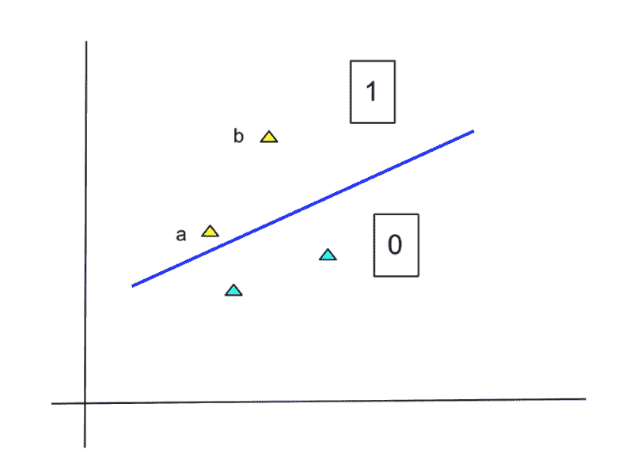
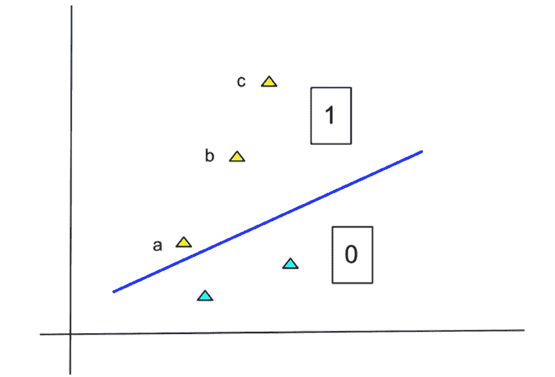

# 比较线性回归和逻辑回归

> 原文：[`www.kdnuggets.com/2022/11/comparing-linear-logistic-regression.html`](https://www.kdnuggets.com/2022/11/comparing-linear-logistic-regression.html)

数据科学面试的深度有所不同。有些面试会深入探讨候选人对高级模型或复杂微调的知识。而许多面试则在入门级别进行，测试候选人的基本知识。在本文中，我们将看到一个可以在这种面试中讨论的问题。尽管这个问题非常简单，但讨论涉及到许多有趣的机器学习基础方面。

> * * *
> 
> ## 我们的前三个课程推荐
> ## 
>  1\. [谷歌网络安全证书](https://www.kdnuggets.com/google-cybersecurity) - 快速进入网络安全职业生涯。
> 
>  2\. [谷歌数据分析专业证书](https://www.kdnuggets.com/google-data-analytics) - 提升你的数据分析技能
> 
>  3\. [谷歌 IT 支持专业证书](https://www.kdnuggets.com/google-itsupport) - 支持你所在组织的 IT
> 
> * * *
> 
> 问题：线性回归和逻辑回归有什么区别？

实际上，两者之间有许多相似之处，从它们的名字发音相似开始。它们都使用直线作为模型函数。它们的图形也非常相似。



图片由作者提供

尽管存在这些相似之处，但它们在方法和应用上却大相径庭。我们现在将重点突出这些差异。为了比较，我们将使用以下通常在讨论任何机器学习模型时考虑的要点：

+   假设或模型家族

+   输入和输出

+   损失函数

+   优化技术

+   应用

我们现在将对线性回归（LinReg）和逻辑回归（LogReg）在每一点上进行比较。让我们从应用开始，以便将讨论引导到正确的轨道上。

# 应用


图片由 Rajashree Rajadhyax 提供

线性回归用于根据其他数量估计一个数量。例如，想象一下你作为学生，在暑假期间经营一个柠檬水摊。你想预测明天会卖出多少杯柠檬水，以便你可以购买足够的柠檬和糖。通过你在售卖柠檬水方面的长期经验，你已经发现销量与当天的最高温度有很强的关系。因此，你想利用预测的最高温度来预测柠檬水的销售。这是一个经典的 LinReg 应用，通常在 ML 文献中称为预测。

LinReg 也用于找出特定输入如何影响输出。在柠檬水摊的例子中，假设你有两个输入——最高温度和是否是节假日。你想找出哪一个对销售的影响更大——最高温度还是节假日。LinReg 将在识别这一点时发挥作用。

LogReg 主要用于分类。分类是将输入归入多个可能类别之一的行为。分类对于人类智能如此重要，以至于可以说“智能大多是分类”。一个好的分类例子是临床诊断。考虑一位可靠的家庭医生。一个女士走进来，抱怨不停地咳嗽。医生进行各种检查以决定多种可能的病症。某些可能的病症相对无害，如喉咙感染。但有些则很严重，例如结核病甚至肺癌。根据各种因素，医生决定她所患的病症，并开始适当的治疗。这就是分类的实际应用。

我们必须记住，估计和分类都是猜测任务，而不是计算任务。这类任务没有准确或正确的答案。猜测任务是机器学习系统擅长的领域。

# 模型家族

机器学习系统通过检测模式来解决猜测问题。它们从给定的数据中检测模式，然后利用这些模式执行任务，如估计或分类。在自然现象中发现的一个重要模式是关系模式。在这种模式下，一个量与另一个量相关。这种关系在大多数情况下可以用数学函数来近似。

从给定的数据中识别数学函数被称为“学习”或“训练”。学习有两个步骤：

1.  函数的“类型”（例如线性、指数、多项式）由人工选择。

1.  学习算法从给定的数据中学习参数（如直线的斜率和截距）。

所以当我们说机器学习系统从数据中学习时，这只是部分正确。选择函数类型的第一步是手动的，并且是模型设计的一部分。函数的类型也称为“假设”或“模型家族”。

在 LinReg 和 LogReg 中，模型家族都是线性函数。正如你所知道的，一条线有两个参数——斜率和截距。但这仅在函数只有一个输入时才成立。对于大多数实际问题，输入不止一个。这些情况的模型函数称为线性函数，而不是线。线性函数有更多的参数需要学习。如果模型有 n 个输入，线性函数有 n+1 个参数。如前所述，这些参数是从给定的数据中学习的。为了本文的目的，我们将继续假设函数是具有两个参数的简单直线。LogReg 的模型函数稍微复杂一点。直线存在，但它与另一个函数组合在一起。我们稍后会看到这一点。

# 输入和输出

如上所述，LinReg 和 LogReg 都从给定的数据中学习线性函数的参数，这些数据被称为训练数据。训练数据包含了什么？

训练数据是通过记录一些实际世界现象（RWP）来准备的。例如，最高气温与柠檬水销售之间的关系就是一个 RWP。我们看不到潜在的关系。我们只能看到每天的温度值和销售情况。在记录观察时，我们将一些量指定为 RWP 的输入，其他量指定为输出。在柠檬水的例子中，我们称最高气温为输入，柠檬水的销售为输出。


作者提供的图片

我们的训练数据包含输入和输出的对。在这个示例中，数据将包括每日最高气温和售出的柠檬水数量。这将是 LinReg 的输入和输出。

LogReg 执行的任务是分类，因此它的输出应该是一个类别。假设有两个类别，称为 0 和 1。模型的输出也应该是 0 或 1。

然而，这种指定输出的方法不是很合适。请看下面的图：



作者提供的图片

黄色点属于类别 1，浅蓝色点属于类别 0。那条线是我们的模型函数，它将这两个类别分开。根据这个分隔线，黄色点（a 和 b）都属于类别 1。然而，点 b 的隶属度比点 a 更确定。如果模型只是输出 0 和 1，那么这一事实就会丢失。

为了纠正这种情况，LogReg 模型会产生每个点属于某个类别的概率。在上述示例中，点‘a’属于类别 1 的概率较低，而点‘b’的概率较高。由于概率是 0 到 1 之间的数值，LogReg 的输出也是如此。

现在请看下面的图：



作者提供的图片

这个图与之前的相同，只是添加了点 c。这个点也属于类别 1，并且实际上比点 b 更加确定。然而，将点的概率按其与直线的距离成比例地增加是错误的。直观上，一旦你离直线一定距离，我们对这些点的类别就或多或少有了确定性。我们不需要进一步增加概率。这符合概率的性质，其最大值为 1。

为了使 LogReg 模型能够产生这样的输出，线性函数必须连接到另一个函数。这个第二个函数叫做 sigmoid，其方程为：


图片由作者提供

因此，LogReg 模型看起来像：

图片由作者提供

Sigmoid 函数也称为‘逻辑斯蒂’函数，这也是‘逻辑回归’这个名字的由来。

如果有超过两个类别，LogReg 的输出是一个向量。输出向量的元素是输入属于特定类别的概率。例如，如果临床诊断模型的第一个元素值为 0.8，这意味着模型认为患者有 80% 的可能性患有感冒。

# 损失函数

我们看到 LinReg 和 LogReg 都从训练数据中学习线性函数的参数。那么它们是如何学习这些参数的呢？

它们使用一种叫做‘优化’的方法。优化通过生成许多可能的解决方案来解决给定的问题。在我们的例子中，可能的解决方案是 (斜率, 截距) 的集合。我们使用性能度量来评估这些解决方案中的每一个。最终选择在这一度量下表现最好的解决方案。

在机器学习模型的学习中，性能度量有时被称为‘损失’，而帮助我们计算损失的函数被称为‘损失函数’。我们可以将其表示为：

```py
Loss = Loss_Function (Parameters_being_evaluated)
```

‘损失’和‘损失函数’这两个术语有负面含义，这意味着较低的损失值表示更好的解决方案。换句话说，学习是一个优化过程，旨在找到产生最小损失的参数。

我们现在来看一下优化 LinReg 和 LogReg 时常用的损失函数。注意，实际操作中使用了许多不同的损失函数，因此我们可以讨论那些最常见的。

对于 LinReg 参数的优化，最常见的损失函数称为平方和误差 (SSE)。这个函数接受以下输入：

1) 所有训练数据点。对于每个点，我们指定：

a) 输入，例如最大数据温度，

b) 输出，例如出售的柠檬水杯数

2) 带参数的线性方程

然后函数使用以下公式计算损失：

```py
SSE Loss = Sum_for_all_points(
Square_of(
output_of_linear_equation_for_the_inputs — actual_output_from_the_data point
))
```

LogReg 的优化度量以非常不同的方式定义。在 SSE 函数中，我们问以下问题：

```py
If we use this line for fitting the training data, how much error will it make?
```

在设计 LogReg 优化度量时，我们问：

```py
If this line is the separator, how likely is it that we will get the distribution of classes that is seen in the training data?
```

该度量的输出因此是一个似然性。度量函数的数学形式使用对数，因此得名对数似然性（LL）。在讨论输出时，我们看到 LogReg 函数涉及指数项（e ‘提升到’ z 的项），对数有助于有效处理这些指数项。

你应该直观地理解优化应当最大化 LL。这样考虑：我们想找到使训练数据最可能的线。然而在实际中，我们更倾向于使用可以最小化的度量，因此我们只是取 LL 的负值。我们因此得到了负对数似然性（NLL）损失函数，尽管我认为称之为损失函数并不完全正确。

因此，我们有两个损失函数：LinReg 的 SSE 和 LogReg 的 NLL。请注意，这些损失函数有许多名称，你应当熟悉这些术语。

# 总结

尽管线性回归和逻辑回归看起来非常相似，但实际上它们有很大不同。LinReg 用于估计/预测，而 LogReg 用于分类。确实它们都使用线性函数作为基础，但 LogReg 进一步添加了逻辑函数。它们在消耗训练数据和生成模型输出的方式上有所不同。两者也使用了非常不同的损失函数。

进一步的细节可以深入探讨。为什么选择 SSE？如何计算似然性？我们没有在这里深入优化方法以避免更多的数学内容。然而，你必须记住，LogReg 的优化通常需要迭代梯度下降方法，而 LinReg 通常可以使用快速的封闭形式解法。我们可以在另一篇文章中讨论这些和更多的点。

**[Devesh Rajadhyax](https://www.linkedin.com/in/deveshraj/)** 已在人工智能领域工作了八年。他创立了 Cere Labs 公司，致力于 AI 的各个方面。Cere Labs 创建了一个名为 Cerescope 的 AI 平台，基于深度学习、机器学习和认知计算。该平台已经被用于金融服务、医疗保健、零售、制造等领域的解决方案建设。

[原文](https://towardsdatascience.com/comparing-linear-and-logistic-regression-11a3e1812212)。转载授权。

### 更多相关主题

+   [线性回归与逻辑回归: 简明解释](https://www.kdnuggets.com/2022/03/linear-logistic-regression-succinct-explanation.html)

+   [KDnuggets 新闻 22:n12, 3 月 23 日: 数据科学最佳书籍…](https://www.kdnuggets.com/2022/n12.html)

+   [分类指标演示: 逻辑回归与…](https://www.kdnuggets.com/2022/10/classification-metrics-walkthrough-logistic-regression-accuracy-precision-recall-roc.html)

+   [逻辑回归概述](https://www.kdnuggets.com/2022/02/overview-logistic-regression.html)

+   [用于分类的逻辑回归](https://www.kdnuggets.com/2022/04/logistic-regression-classification.html)

+   [逻辑回归是如何工作的？](https://www.kdnuggets.com/2022/07/logistic-regression-work.html)
