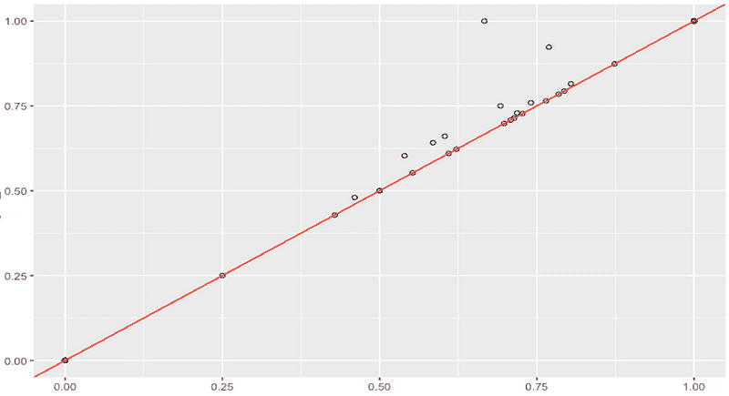
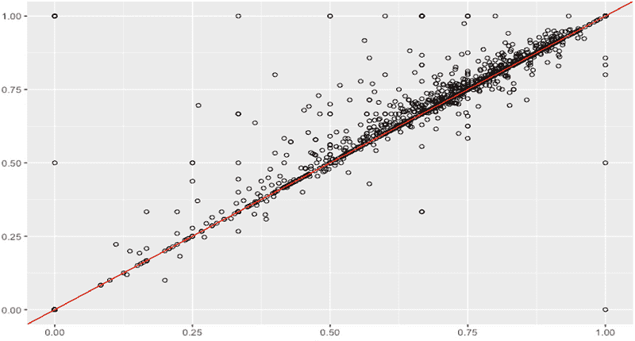
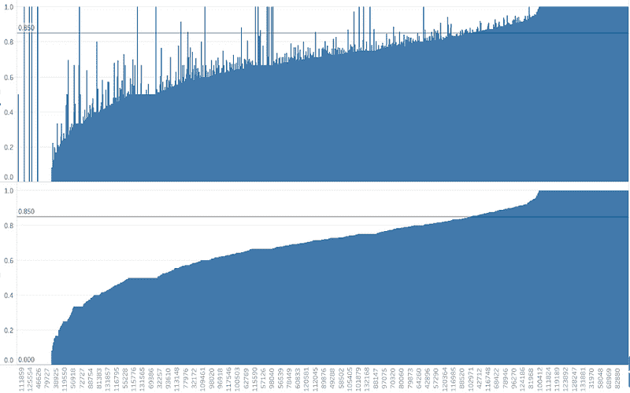
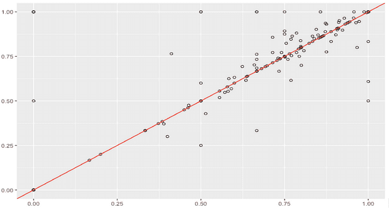

# 比较机器学习模型：统计学意义与实际意义

> 原文：[`www.kdnuggets.com/2019/01/comparing-machine-learning-models-statistical-vs-practical-significance.html`](https://www.kdnuggets.com/2019/01/comparing-machine-learning-models-statistical-vs-practical-significance.html)

 评论

**由 [Dina Jankovic](https://www.linkedin.com/in/dinajankovich/)，Hubdoc**


左边还是右边？虽然已经投入了大量工作来构建和调整机器学习模型，但一个自然的问题是——我们到底如何比较我们构建的模型？如果我们面临模型 A 和模型 B 的选择，哪个模型是赢家，为什么？是否可以将这些模型结合起来以实现最佳性能？

一种非常浅显的方法是比较测试集上的总体准确率，比如，模型 A 的准确率是 94%，模型 B 的准确率是 95%，然后盲目地得出 B 赢了的结论。**事实上，除了总体准确率之外，还有很多因素需要调查和考虑。**

在这篇博客文章中，我想分享我最近在模型比较方面的发现。我喜欢使用简单的语言来解释统计学，所以这篇文章对于那些不太擅长统计学但希望多了解一点的人来说，是一篇很好的阅读材料。

### 1\. “理解”数据

如果可能的话，最好提出一些可以立即告诉你实际情况的图表。在这个时候进行绘图似乎有些奇怪，但图表可以提供一些数字无法提供的见解。

在我的一个项目中，我的目标是比较两个机器学习模型在预测用户文档上的税务准确性时在同一测试集上的表现，因此我认为通过用户 ID 聚合数据并计算每个模型正确预测的税务比例是个好主意。

我拥有的数据集很大（100K+实例），所以我按地区划分分析，集中在较小的数据子集上——子集间的准确性可能会有所不同。这在处理极其庞大的数据集时通常是个好主意，因为一次性消化大量数据几乎是不可能的，更不用说得出可靠的结论了（*样本量问题*稍后再谈）。**大数据集的一个巨大优势是，不仅有大量的信息可供利用，还可以放大数据并探索某一像素子集中的情况。**



子集 1：模型 A vs. 模型 B 得分

子集 2：模型 A vs. 模型 B 得分

子集 2：模型 A 显然比 B 表现更好……看看那些 spikes!

子集 3：模型 A 与模型 B 的评分在这一点上，我怀疑某些子集中一个模型表现更好，而在其他子集中的表现差不多。**这比仅仅比较整体准确性要进步很多。**但这种怀疑可以通过**假设检验**进一步调查。假设检验能比肉眼更好地发现差异——我们在测试集中的数据量有限，可能会想知道如果在不同的测试集上比较模型，准确性会如何变化。可惜的是，往往无法获得不同的测试集，因此了解一些统计学知识可能有助于调查模型准确性的性质。

### 2. 假设检验：让我们正确地做！

起初看起来很简单，你可能之前见过：

1.  设定 H0 和 H1

1.  提出一个检验统计量，并突然假设正态分布

1.  不知怎么计算 p 值

1.  如果 p < alpha = 0.05，则拒绝 H0，然后就完成了！

实际上，假设检验要复杂且敏感得多。可悲的是，人们使用它时往往不够谨慎，并且误解结果。让我们一步步来做！

**步骤 1.** 我们设定 H0：**原假设** = 两个模型之间没有*统计显著*差异，H1：**备择假设** = 两个模型的准确性之间有*统计显著*差异——由你决定：模型 A != B（双尾）或模型 A < 或 > 模型 B（单尾）

**步骤 2.** 我们设定一个**检验统计量**，以在观察到的数据中量化区分原假设和备择假设的行为。有很多选择，即使是最好的统计学家也可能对一些统计检验感到困惑——这完全没问题！需要考虑的假设和事实太多，一旦你了解了数据，就可以选择合适的。关键是理解假设检验的工作原理，而实际的检验统计量只是一个容易用软件计算的工具。

注意，应用任何统计检验前需要满足一系列假设。每种检验都有其所需假设；然而，大多数实际数据不会严格满足所有条件，因此可以适当放宽一些！但如果你的数据，例如，严重偏离正态分布怎么办？

统计检验分为两个大类：**参数**和**非参数**检验，我强烈建议你稍微了解一下[这里](https://keydifferences.com/difference-between-parametric-and-nonparametric-test.html)。我会简短说明：**这两者之间的主要区别在于参数检验要求对总体分布有某些假设，而非参数检验则更为稳健（*没有参数，请！*）。**

在我的分析中，我最初想使用[配对样本 t 检验](https://www.statisticssolutions.com/manova-analysis-paired-sample-t-test/)，但我的数据显然不符合正态分布，因此我选择了[Wilcoxon 符号秩检验](https://www.statisticssolutions.com/how-to-conduct-the-wilcox-sign-test/)（配对样本 t 检验的非参数等效检验）。你可以决定在分析中使用哪种检验统计量，但一定要**确保假设条件得到满足**。


我的数据不符合正态分布 :( **第 3 步。** 现在讨论 p 值。p 值的概念有点抽象，我敢打赌很多人以前使用过 p 值，但让我们澄清一下 p 值到底是什么：p 值只是一个衡量反对 H0 证据的数字：反对 H0 的证据越强，p 值就越小。如果你的 p 值足够小，你就有足够的理由来拒绝 H0。

幸运的是，p 值可以很容易地在 R/Python 中找到，所以你不需要折磨自己手动计算，尽管我主要使用 Python，但我更喜欢在 R 中进行假设检验，因为 R 提供了更多选项。下面是一个代码片段。我们看到在子集 2 上，我们确实得到了一个较小的 p 值，但置信区间无用。

```py
> wilcox.test(data1, data2, conf.int = TRUE, alternative="greater", paired=TRUE, conf.level = .95, exact = FALSE)

V = 1061.5, p-value = 0.008576
alternative hypothesis: true location shift is less than 0
95 percent confidence interval:
-Inf -0.008297017
sample estimates:
(pseudo)median
-0.02717335
```

**第 4 步。** 非常简单：如果 p 值 < 预设的 alpha（通常是 0.05），你可以拒绝 H0 以支持 H1。否则，证据不足以拒绝 H0，**这并不意味着 H0 真实存在！** 实际上，它可能仍然是错误的，只是根据数据没有足够的证据来拒绝它。如果 alpha 是 0.05 = 5%，这意味着在实际不存在差异的情况下，得出差异存在的结论的风险仅为 5%（即**第一类错误**）。你可能会问：为什么不能将 alpha 设置为 1% 而不是 5%？这是因为分析会变得更保守，因此更难以拒绝 H0（而我们的目标是拒绝它）。

最常用的 alpha 值是 5%、10% 和 1%，但你可以选择任何你喜欢的 alpha！这真的取决于你愿意承担的风险。

alpha 可以是 0%（即没有第一类错误的机会）吗？不行 :) 实际上，总是有可能会犯错，所以选择 0% 并没有意义。总是留有一些出错的余地比较好。

如果你想玩玩*p-hacking*，你可以提高你的 alpha 值并拒绝 H0，但你必须接受较低的置信水平（随着 alpha 的增加，置信水平降低——你不能同时拥有一切 :)）。

### 3\. 事后分析：统计显著性与实际显著性

如果你得到了一个极其小的 p 值，那肯定意味着两个模型的准确性之间存在 *统计显著* 差异。之前我确实得到了一个小 p 值，从数学上讲，模型确实存在差异，但“显著”并不意味着“重要”。这个差异实际上意味着什么？这个小差异对业务问题有意义吗？

**统计显著性** 指的是观察到的样本均值差异由于抽样误差发生的可能性很小。给定足够大的样本，尽管总体差异看似微不足道，仍然可能找到统计显著性。另一方面，**实际显著性** 关注的是差异是否足够大以在实际意义上有价值。虽然统计显著性是严格定义的，但实际显著性更直观和主观。


到这个阶段，你可能已经意识到 p 值并不像你想的那样强大。还有更多需要探讨的内容。考虑一下 **效应大小** 也非常重要。效应大小衡量的是差异的大小——如果存在统计显著差异，我们可能会对其 *大小* 感兴趣。**效应大小** 强调的是差异的规模，而不是与样本大小混淆。

```py
> abs(qnorm(p-value))/sqrt(n)

0.14

# the effect size is small
```

什么算是小、中、大效应大小？传统的界限是 0.1、0.3、0.5，但这真的取决于你的业务问题。

*样本大小有什么问题？* 如果你的样本太小，那么你的结果将不可靠，但这是显而易见的。如果你的样本大小太大呢？这看起来很棒——但在这种情况下，即使是极其微小的差异也可能通过假设检验被检测到。数据太多，即使是微小的偏差也可能被视为显著。这就是效应大小变得有用的原因。

还有更多需要做的——我们可以尝试找出检验的效能或最佳样本量。但现在这些就足够了。

如果假设检验做得对，它在模型比较中可能非常有用。设定 H0 和 H1，计算检验统计量和寻找 p 值是常规工作，但解读结果需要一些直觉、创造力和对业务问题的深入理解。记住，如果测试是基于一个非常大的测试集，发现的 **统计显著性** 可能没有太多 **实际意义**。不要盲目相信那些神奇的 p 值：深入数据并进行事后分析总是一个好主意！ :)

随时通过 [电子邮件](https://dinajankovic93@gmail.com/) 或 [LinkedIn](https://www.linkedin.com/in/dinajankovich/) 联系我，我随时乐意聊聊数据科学！

**个人简介：[Dina Jankovic](https://www.linkedin.com/in/dinajankovich/)** 是位于加拿大多伦多的 Hubdoc 数据科学团队的数据分析师。她获得了贝尔格莱德大学的数学学士学位和渥太华大学的统计学硕士学位。她利用计算统计学和机器学习技术做出明智的商业决策，并更好地理解世界。

[原文](https://towardsdatascience.com/comparing-machine-learning-models-statistical-vs-practical-significance-de345c38b42a)。经许可转载。

**相关：**

+   理解偏差-方差权衡：概述

+   如何计算两个分类器性能差异的统计显著性

+   统计建模：入门指南

* * *

## 我们的三大课程推荐

 1\. [谷歌网络安全证书](https://www.kdnuggets.com/google-cybersecurity) - 快速进入网络安全职业生涯

 2\. [谷歌数据分析专业证书](https://www.kdnuggets.com/google-data-analytics) - 提升你的数据分析技能

 3\. [谷歌 IT 支持专业证书](https://www.kdnuggets.com/google-itsupport) - 支持你的组织的 IT 需求

* * *

### 更多相关内容

+   [数据质量在成功机器学习模型中的重要性](https://www.kdnuggets.com/2022/03/significance-data-quality-making-successful-machine-learning-model.html)

+   [PyTorch 还是 TensorFlow？比较流行的机器学习框架](https://www.kdnuggets.com/2022/02/packt-pytorch-tensorflow-comparing-popular-machine-learning-frameworks.html)

+   [特征存储峰会 2023：部署机器学习模型的实用策略](https://www.kdnuggets.com/2023/09/hopsworks-feature-store-summit-2023-practical-strategies-deploying-ml-models-production-environments)

+   [线性回归与逻辑回归的比较](https://www.kdnuggets.com/2022/11/comparing-linear-logistic-regression.html)

+   [比较自然语言处理技术：RNN、Transformers、BERT](https://www.kdnuggets.com/comparing-natural-language-processing-techniques-rnns-transformers-bert)

+   [机器学习中的实用特征工程方法](https://www.kdnuggets.com/2023/07/practical-approach-feature-engineering-machine-learning.html)
