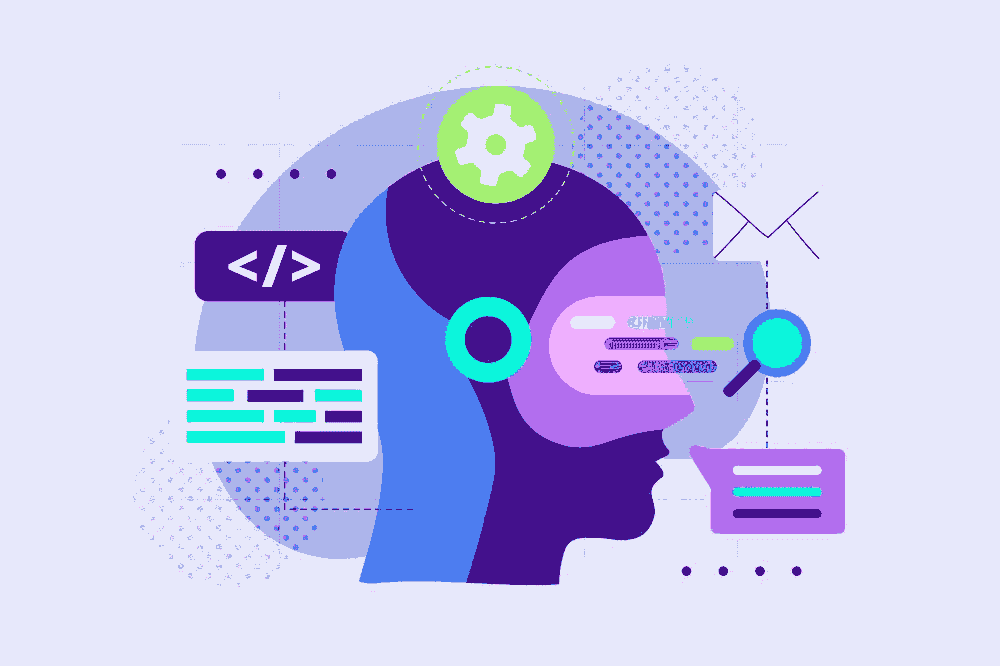
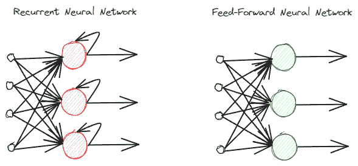
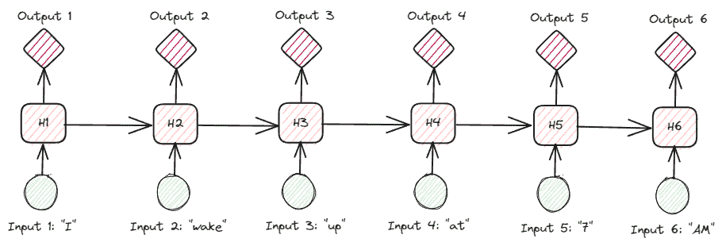
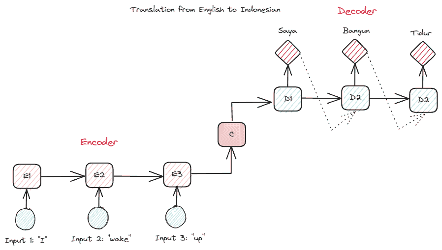
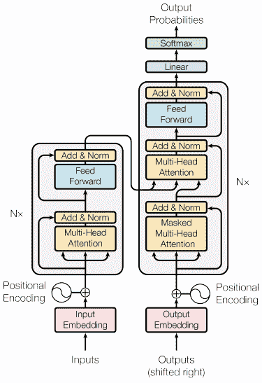
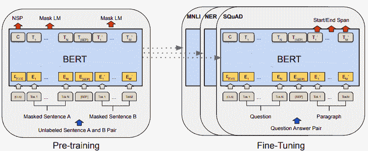

# 比较自然语言处理技术：RNN、变换器、BERT

> 原文：[`www.kdnuggets.com/comparing-natural-language-processing-techniques-rnns-transformers-bert`](https://www.kdnuggets.com/comparing-natural-language-processing-techniques-rnns-transformers-bert)

图片由 [Freepik](https://www.freepik.com/free-vector/hand-drawn-flat-design-npl-illustration_22379566.htm#query=natural%20language%20processing&position=9&from_view=search&track=ais) 提供

自然语言处理（NLP）是人工智能领域中的一个领域，旨在让机器具备理解文本数据的能力。NLP 研究已经存在了很长时间，但随着大数据和更高计算处理能力的引入，它最近才变得更加突出。

* * *

## 我们的前三大课程推荐

 1\. [谷歌网络安全证书](https://www.kdnuggets.com/google-cybersecurity) - 快速进入网络安全职业生涯。

 2\. [谷歌数据分析专业证书](https://www.kdnuggets.com/google-data-analytics) - 提升您的数据分析技能

 3\. [谷歌 IT 支持专业证书](https://www.kdnuggets.com/google-itsupport) - 支持您组织的 IT 工作

* * *

随着 NLP 领域的不断扩大，许多研究人员会尝试提高机器理解文本数据的能力。经过多次进展，许多技术在 NLP 领域中被提出和应用。

本文将比较 NLP 领域中处理文本数据的各种技术。本文将重点讨论 RNN、变换器和 BERT，因为它们是研究中经常使用的技术。让我们开始吧。

# 递归神经网络

[递归神经网络](https://en.wikipedia.org/wiki/Recurrent_neural_network)（RNN）于 1980 年开发，但最近才在 NLP 领域获得关注。RNN 是神经网络家族中的一种特殊类型，用于处理序列数据或彼此之间不能独立的数据。序列数据的例子有时间序列、音频或文本句子数据，基本上是任何具有有意义顺序的数据。

RNN（递归神经网络）与普通的前馈神经网络不同，因为它们处理信息的方式不同。在普通的前馈神经网络中，信息是按层次进行处理的。然而，RNN 是通过对信息输入进行循环处理来考虑的。要理解这些差异，我们可以看看下面的图像。

图片由作者提供

如您所见，RNN 模型在信息处理过程中实现了循环。RNN 在处理这些信息时会考虑当前和先前的数据输入。这就是为什么该模型适用于任何类型的序列数据。

如果我们以文本数据为例，假设我们有句子“I wake up at 7 AM”，并且将每个单词作为输入。在前馈神经网络中，当我们到达单词“up”时，模型可能已经忘记了单词“I”、“wake”和“up”。然而，RNN 会利用每个单词的输出并将其循环回来，以便模型不会遗忘。

在自然语言处理领域，RNN 常用于许多文本应用，例如文本分类和生成。它常用于词级应用，如词性标注、下一个词生成等。

深入分析文本数据中的 RNN，有许多不同类型的 RNN。例如，下面的图像展示了多对多类型。

图片由作者提供

从上面的图像可以看到，每一步的输出（RNN 中的时间步）是逐步处理的，每次迭代始终考虑先前的信息。

另一种在许多 NLP 应用中使用的 RNN 类型是编码器-解码器类型（序列到序列）。其结构如下面的图像所示。

图片由作者提供

这种结构引入了模型中使用的两个部分。第一个部分称为编码器，它接收数据序列并基于其创建一个新的表示。该表示将用于模型的第二部分，即解码器。通过这种结构，输入和输出的长度不一定需要相等。一个示例用例是语言翻译，输入和输出之间的长度通常不相同。

使用 RNN 处理自然语言数据有多种好处，包括：

1.  RNN 可以处理没有长度限制的文本输入。

1.  模型在所有时间步中共享相同的权重，这使得神经网络在每一步使用相同的参数。

1.  由于记忆过去的输入，使得 RNN 适用于任何序列数据。

但是，也存在一些缺点：

1.  RNN 容易受到梯度消失和梯度爆炸的影响。这是指梯度结果接近零值（消失），导致网络权重只更新很少，或者梯度结果非常显著（爆炸），使网络赋予不现实的巨大重要性。

1.  由于模型的序列性质，训练时间较长。

1.  短期记忆意味着模型在训练时间较长时开始遗忘。有一种名为[LSTM](https://en.wikipedia.org/wiki/Long_short-term_memory)的 RNN 扩展用于缓解此问题。

# 变换器

变换器是一个自然语言处理模型架构，旨在解决之前在 RNN 中遇到的序列到序列任务。如前所述，RNN 存在短期记忆问题。输入越长，模型遗忘信息的现象越明显。这是注意力机制可以帮助解决的问题所在。

注意力机制在[Bahdanau *et al*. (2014)](https://arxiv.org/abs/1409.0473)的论文中引入，用于解决长输入问题，特别是对于编码器-解码器类型的 RNN。我不会详细解释注意力机制。基本上，它是一个允许模型在进行输出预测时关注模型输入关键部分的层。例如，如果任务是翻译，那么“Clock”这个词在印尼语中与“Jam”会有很高的相关性。

变换器模型由[Vaswani *et al.* (2017)](https://arxiv.org/pdf/1706.03762v5.pdf)引入。该架构受到编码器-解码器 RNN 的启发，并在设计时考虑了注意力机制，且不按顺序处理数据。整体变换器模型结构如下图所示。

变换器架构 ([Vaswani *et al*. 2017](https://arxiv.org/pdf/1706.03762v5.pdf))

在上述结构中，变换器将数据向量序列编码为带有位置编码的词嵌入，同时使用解码将数据转换回原始形式。借助注意力机制，编码可以根据输入赋予不同的重要性。

与其他模型相比，变换器提供了一些优势，包括：

1.  并行化过程提高了训练和推理速度。

1.  能够处理更长的输入，这提供了对上下文的更好理解。

变换器模型仍然存在一些缺点：

1.  高计算处理和需求。

1.  注意力机制可能要求对文本进行拆分，因为它能处理的长度有限制。

1.  如果拆分方式不正确，可能会丢失上下文。

**BERT**

BERT，即双向编码器表示变换器，是由[Devlin *et al.* (2019)](https://arxiv.org/pdf/1810.04805.pdf)开发的模型，包含两个步骤（预训练和微调）来构建模型。比较而言，BERT 是一个变换器编码器堆叠（BERT Base 有 12 层，而 BERT Large 有 24 层）。

BERT 的整体模型开发可以在下图中看到。

BERT 整体流程（[Devlin *et al.* (2019)](https://arxiv.org/pdf/1810.04805.pdf)）

预训练任务同时启动模型的训练，完成后，模型可以针对各种下游任务（问答、分类等）进行微调。

BERT 的独特之处在于它是第一个在文本数据上进行预训练的无监督双向语言模型。BERT 之前在整个维基百科和书籍语料库上进行了预训练，包含了超过 30 亿个词。

BERT 被认为是双向的，因为它没有顺序读取数据输入（从左到右或反之），而是变换器编码器同时读取整个序列。

与顺序读取文本输入（从左到右或从右到左）的方向模型不同，变换器编码器同时读取整个词序列。这就是为什么该模型被认为是双向的，并且使模型能够理解输入数据的整体上下文。

为了实现双向，BERT 使用了两种技术：

1.  **掩码语言模型（MLM）**——词掩码技术。该技术会掩盖输入词的 15%，并尝试根据未掩盖的词来预测被掩盖的词。

1.  **下一句预测（NSP）**——BERT 尝试学习句子之间的关系。该模型将句子对作为数据输入，并尝试预测后续句子是否存在于原始文档中。

在 NLP 领域使用 BERT 有几个优点，包括：

1.  BERT 易于用于预训练的各种 NLP 下游任务。

1.  双向使 BERT 能够更好地理解文本上下文。

1.  这是一个受到社区广泛支持的热门模型。

尽管如此，仍然存在一些缺点，包括：

1.  对于一些下游任务微调，需要较高的计算能力和较长的训练时间。

1.  BERT 模型可能会导致一个需要更大存储空间的大型模型。

1.  对于复杂任务，BERT 的表现更好，因为在简单任务上的表现与使用更简单的模型并没有太大区别。

# 结论

自然语言处理（NLP）最近变得更加突出，许多研究集中在改进应用上。在本文中，我们讨论了三种常用的 NLP 技术：

1.  RNN

1.  变换器

1.  BERT

每种技术都有其优缺点，但总体而言，我们可以看到模型在不断进化。

[Cornellius Yudha Wijaya](https://www.linkedin.com/in/cornellius-yudha-wijaya/) 是数据科学助理经理和数据撰稿人。在全职工作于安联印尼期间，他喜欢通过社交媒体和写作媒体分享 Python 和数据技巧。Cornellius 撰写了各种人工智能和机器学习主题的文章。

### 更多相关内容

+   [自然语言处理中的 N-gram 语言建模](https://www.kdnuggets.com/2022/06/ngram-language-modeling-natural-language-processing.html)

+   [如何使用 Hugging Face Transformers 微调 BERT 以进行情感分析](https://www.kdnuggets.com/how-to-fine-tune-bert-sentiment-analysis-hugging-face-transformers)

+   [自然语言处理关键术语解析](https://www.kdnuggets.com/2017/02/natural-language-processing-key-terms-explained.html)

+   [自然语言处理任务的数据表示](https://www.kdnuggets.com/2018/11/data-representation-natural-language-processing.html)

+   [图像识别和自然语言处理的迁移学习](https://www.kdnuggets.com/2022/01/transfer-learning-image-recognition-natural-language-processing.html)

+   [如何开始使用 PyTorch 进行自然语言处理](https://www.kdnuggets.com/2022/04/start-natural-language-processing-pytorch.html)
