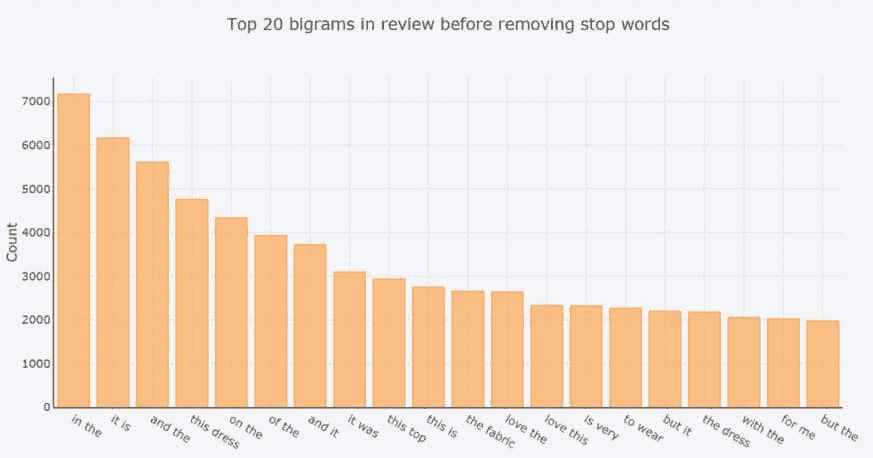
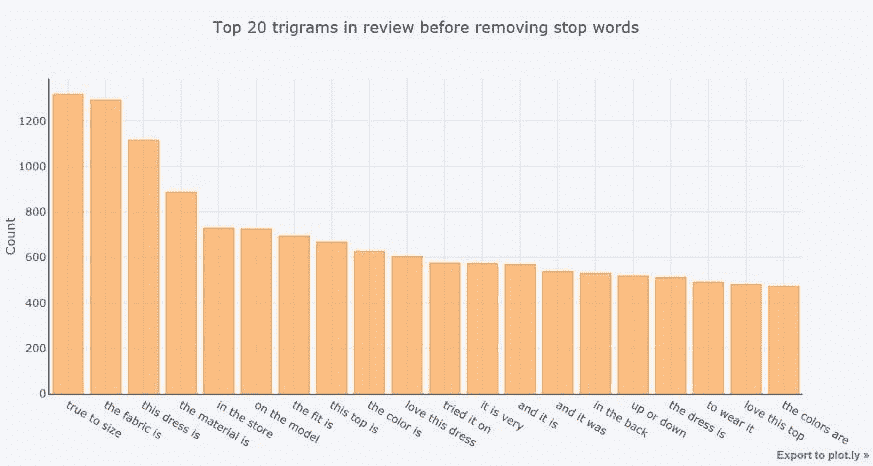
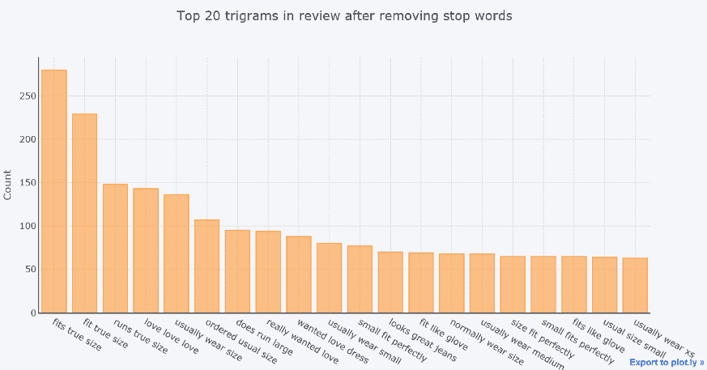

# 完整的探索性数据分析与文本数据可视化：结合可视化和 NLP 生成见解

> 原文：[`www.kdnuggets.com/2019/05/complete-exploratory-data-analysis-visualization-text-data.html`](https://www.kdnuggets.com/2019/05/complete-exploratory-data-analysis-visualization-text-data.html)

 评论

**作者 [Susan Li](https://www.linkedin.com/in/susanli/)，高级数据科学家**

照片来源：Pixabay

* * *

## 我们的前三个课程推荐

 1\. [谷歌网络安全证书](https://www.kdnuggets.com/google-cybersecurity) - 快速进入网络安全职业。

 2\. [谷歌数据分析专业证书](https://www.kdnuggets.com/google-data-analytics) - 提升数据分析技能

 3\. [谷歌 IT 支持专业证书](https://www.kdnuggets.com/google-itsupport) - 支持您的 IT 组织

* * *

直观呈现文本文件的内容是[文本挖掘](https://en.wikipedia.org/wiki/Text_mining)领域中最重要的任务之一。作为数据科学家或[NLP](https://plot.ly/python/)专家，我们不仅从不同的角度和细节层次探索文档的内容，还总结单个文档，展示词汇和主题，检测事件，并创建故事情节。

然而，在可视化非结构化（文本）数据和结构化数据之间存在一些差距。例如，许多文本可视化并未直接表示文本，而是表示语言模型的输出（词频、字符长度、词序列等）。

在这篇文章中，我们将使用[女性服装电子商务评论数据集](https://www.kaggle.com/nicapotato/womens-ecommerce-clothing-reviews)，并尽可能多地探索和可视化数据，使用[Plotly 的 Python 图形库](https://plot.ly/python/)和[Bokeh 可视化库](https://bokeh.pydata.org/en/latest/)。我们不仅将探索文本数据，还将可视化数值和分类特征。让我们开始吧！

### 数据

```py

df = pd.read_csv('Womens Clothing E-Commerce Reviews.csv')

```

表 1

在对数据进行简要检查后，我们发现需要进行一系列的数据预处理工作。

+   移除“标题”特征。

+   移除“评论文本”缺失的行。

+   清理“评论文本”列。

+   使用[**TextBlob**](https://textblob.readthedocs.io/en/dev/)计算情感极性，其范围在[-1,1]之间，1 表示积极情感，-1 表示消极情感。

+   创建评论长度的新特征。

+   创建评论字数的新特征。

```py

df.drop('Unnamed: 0', axis=1, inplace=True)
df.drop('Title', axis=1, inplace=True)
df = df[~df['Review Text'].isnull()]

def preprocess(ReviewText):
    ReviewText = ReviewText.str.replace("(
)", "")
    ReviewText = ReviewText.str.replace('().*()', '')
    ReviewText = ReviewText.str.replace('(&amp)', '')
    ReviewText = ReviewText.str.replace('(&gt)', '')
    ReviewText = ReviewText.str.replace('(&lt)', '')
    ReviewText = ReviewText.str.replace('(\xa0)', ' ')  
    return ReviewText
df['Review Text'] = preprocess(df['Review Text'])

df['polarity'] = df['Review Text'].map(lambda text: TextBlob(text).sentiment.polarity)
df['review_len'] = df['Review Text'].astype(str).apply(len)
df['word_count'] = df['Review Text'].apply(lambda x: len(str(x).split()))

```

text_preprocessing.py

为了预览情感极性分数是否有效，我们随机选择了 5 条情感极性分数最高的评论 (1)：

```py

print('5 random reviews with the highest positive sentiment polarity: \n')
cl = df.loc[df.polarity == 1, ['Review Text']].sample(5).values
for c in cl:
    print(c[0])

```

图 1

然后随机选择 5 条情感极性分数最中性的评论（零）：

```py

print('5 random reviews with the most neutral sentiment(zero) polarity: \n')
cl = df.loc[df.polarity == 0, ['Review Text']].sample(5).values
for c in cl:
    print(c[0])

```

图 2

只有 2 条评论的情感极性分数最为负面：

```py

print('2 reviews with the most negative polarity: \n')
cl = df.loc[df.polarity == -0.97500000000000009, ['Review Text']].sample(2).values
for c in cl:
    print(c[0])

```

图 3

成功了！

### 使用 Plotly 进行单变量可视化

单变量或单维可视化是最简单的可视化类型，仅由对单一特征或属性的观察组成。单变量可视化包括直方图、条形图和折线图。

****评论情感极性分数的分布****

```py

df['polarity'].iplot(
    kind='hist',
    bins=50,
    xTitle='polarity',
    linecolor='black',
    yTitle='count',
    title='Sentiment Polarity Distribution')

```

图 4

绝大多数的情感极性分数都大于零，这意味着大多数评论都相当积极。

**评论评分的分布**

```py

df['Rating'].iplot(
    kind='hist',
    xTitle='rating',
    linecolor='black',
    yTitle='count',
    title='Review Rating Distribution')

```


图 5

评分与极性分数一致，即大多数评分都很高，处于 4 或 5 的范围内。

**评论者年龄的分布**

```py

df['Age'].iplot(
    kind='hist',
    bins=50,
    xTitle='age',
    linecolor='black',
    yTitle='count',
    title='Reviewers Age Distribution')

```


图 6

大多数评论者年龄在 30 到 40 岁之间。

**评论文本长度的分布**

```py

df['review_len'].iplot(
    kind='hist',
    bins=100,
    xTitle='review length',
    linecolor='black',
    yTitle='count',
    title='Review Text Length Distribution')

```


图 7

**评论字数的分布**

```py

df['word_count'].iplot(
    kind='hist',
    bins=100,
    xTitle='word count',
    linecolor='black',
    yTitle='count',
    title='Review Text Word Count Distribution')

```


图 8

有相当多人喜欢留下长评论。

对于类别特征，我们简单使用条形图来展示频率。

**部门的分布**

```py

df.groupby('Division Name').count()['Clothing ID'].iplot(kind='bar', yTitle='Count', linecolor='black', opacity=0.8, title='Bar chart of Division Name', xTitle='Division Name')

```


图 9

General 部门的评论最多，而 Initmates 部门的评论最少。

**部门的分布**

```py

df.groupby('Department Name').count()['Clothing ID'].sort_values(ascending=False).iplot(kind='bar', yTitle='Count', linecolor='black', opacity=0.8, title='Bar chart of Department Name', xTitle='Department Name')

```


图 10

说到部门，Tops 部门的评论最多，而 Trend 部门的评论最少。

**类别的分布**

```py

df.groupby('Class Name').count()['Clothing ID'].sort_values(ascending=False).iplot(kind='bar', yTitle='Count', linecolor='black', opacity=0.8, title='Bar chart of Class Name', xTitle='Class Name')
```


图 11

现在我们来探索“评论文本”功能，在探索这个功能之前，我们需要提取 [N-Gram](https://en.wikipedia.org/wiki/N-gram) 特征。[N-grams](https://en.wikipedia.org/wiki/N-gram) 用于描述作为观察点的单词数量，例如 unigram 指单字，bigram 指二字短语，trigram 指三字短语。为此，我们使用 [scikit-learn’s](https://scikit-learn.org/stable/modules/generated/sklearn.feature_extraction.text.CountVectorizer.html) `[CountVectorizer](https://scikit-learn.org/stable/modules/generated/sklearn.feature_extraction.text.CountVectorizer.html)` [函数](https://scikit-learn.org/stable/modules/generated/sklearn.feature_extraction.text.CountVectorizer.html)。

首先，比较去除停用词前后的单词分布将会很有趣。

****去除停用词前的顶级单词分布****

```py

def get_top_n_words(corpus, n=None):
    vec = CountVectorizer().fit(corpus)
    bag_of_words = vec.transform(corpus)
    sum_words = bag_of_words.sum(axis=0) 
    words_freq = [(word, sum_words[0, idx]) for word, idx in vec.vocabulary_.items()]
    words_freq =sorted(words_freq, key = lambda x: x[1], reverse=True)
    return words_freq[:n]
common_words = get_top_n_words(df['Review Text'], 20)
for word, freq in common_words:
    print(word, freq)
df1 = pd.DataFrame(common_words, columns = ['ReviewText' , 'count'])
df1.groupby('ReviewText').sum()['count'].sort_values(ascending=False).iplot(
kind='bar', yTitle='Count', linecolor='black', title='Top 20 words in review before removing stop words')

```

top_unigram.py

图 12

**去除停用词后的顶级单词分布**

```py

def get_top_n_words(corpus, n=None):
    vec = CountVectorizer(stop_words = 'english').fit(corpus)
    bag_of_words = vec.transform(corpus)
    sum_words = bag_of_words.sum(axis=0) 
    words_freq = [(word, sum_words[0, idx]) for word, idx in vec.vocabulary_.items()]
    words_freq =sorted(words_freq, key = lambda x: x[1], reverse=True)
    return words_freq[:n]
common_words = get_top_n_words(df['Review Text'], 20)
for word, freq in common_words:
    print(word, freq)
df2 = pd.DataFrame(common_words, columns = ['ReviewText' , 'count'])
df2.groupby('ReviewText').sum()['count'].sort_values(ascending=False).iplot(
kind='bar', yTitle='Count', linecolor='black', title='Top 20 words in review after removing stop words')

```

top_unigram_no_stopwords.py

图 13

其次，我们希望比较去除停用词前后的二元组。

****去除停用词前的顶级二元组分布****

```py

def get_top_n_bigram(corpus, n=None):
    vec = CountVectorizer(ngram_range=(2, 2)).fit(corpus)
    bag_of_words = vec.transform(corpus)
    sum_words = bag_of_words.sum(axis=0) 
    words_freq = [(word, sum_words[0, idx]) for word, idx in vec.vocabulary_.items()]
    words_freq =sorted(words_freq, key = lambda x: x[1], reverse=True)
    return words_freq[:n]
common_words = get_top_n_bigram(df['Review Text'], 20)
for word, freq in common_words:
    print(word, freq)
df3 = pd.DataFrame(common_words, columns = ['ReviewText' , 'count'])
df3.groupby('ReviewText').sum()['count'].sort_values(ascending=False).iplot(
kind='bar', yTitle='Count', linecolor='black', title='Top 20 bigrams in review before removing stop words')

```

top_bigram.py图 14

**去除停用词后的顶级二元组分布**

```py

def get_top_n_bigram(corpus, n=None):
    vec = CountVectorizer(ngram_range=(2, 2), stop_words='english').fit(corpus)
    bag_of_words = vec.transform(corpus)
    sum_words = bag_of_words.sum(axis=0) 
    words_freq = [(word, sum_words[0, idx]) for word, idx in vec.vocabulary_.items()]
    words_freq =sorted(words_freq, key = lambda x: x[1], reverse=True)
    return words_freq[:n]
common_words = get_top_n_bigram(df['Review Text'], 20)
for word, freq in common_words:
    print(word, freq)
df4 = pd.DataFrame(common_words, columns = ['ReviewText' , 'count'])
df4.groupby('ReviewText').sum()['count'].sort_values(ascending=False).iplot(
kind='bar', yTitle='Count', linecolor='black', title='Top 20 bigrams in review after removing stop words')

```

top_bigram_no_stopwords.py

图 15

最后，我们比较去除停用词前后的三元组。

****去除停用词前的顶级三元组分布****

```py

def get_top_n_trigram(corpus, n=None):
    vec = CountVectorizer(ngram_range=(3, 3)).fit(corpus)
    bag_of_words = vec.transform(corpus)
    sum_words = bag_of_words.sum(axis=0) 
    words_freq = [(word, sum_words[0, idx]) for word, idx in vec.vocabulary_.items()]
    words_freq =sorted(words_freq, key = lambda x: x[1], reverse=True)
    return words_freq[:n]
common_words = get_top_n_trigram(df['Review Text'], 20)
for word, freq in common_words:
    print(word, freq)
df5 = pd.DataFrame(common_words, columns = ['ReviewText' , 'count'])
df5.groupby('ReviewText').sum()['count'].sort_values(ascending=False).iplot(
kind='bar', yTitle='Count', linecolor='black', title='Top 20 trigrams in review before removing stop words')

```

top_trigram.py图 16

**去除停用词后的顶级三元组分布**

```py

def get_top_n_trigram(corpus, n=None):
    vec = CountVectorizer(ngram_range=(3, 3), stop_words='english').fit(corpus)
    bag_of_words = vec.transform(corpus)
    sum_words = bag_of_words.sum(axis=0) 
    words_freq = [(word, sum_words[0, idx]) for word, idx in vec.vocabulary_.items()]
    words_freq =sorted(words_freq, key = lambda x: x[1], reverse=True)
    return words_freq[:n]
common_words = get_top_n_trigram(df['Review Text'], 20)
for word, freq in common_words:
    print(word, freq)
df6 = pd.DataFrame(common_words, columns = ['ReviewText' , 'count'])
df6.groupby('ReviewText').sum()['count'].sort_values(ascending=False).iplot(
kind='bar', yTitle='Count', linecolor='black', title='Top 20 trigrams in review after removing stop words')

```

top_trigram_no_stopwords.py图 17

[***词性标注 (POS)***](https://en.wikipedia.org/wiki/Part-of-speech_tagging) 是一种将词语标注为不同词性的过程，例如名词、动词、形容词等。

我们使用一个简单的 [***TextBlob***](https://textblob.readthedocs.io/en/dev/) API 来深入探讨数据集中的“评论文本”功能的词性，并可视化这些标签。

****评论语料库的顶级词性标注分布****

```py

blob = TextBlob(str(df['Review Text']))
pos_df = pd.DataFrame(blob.tags, columns = ['word' , 'pos'])
pos_df = pos_df.pos.value_counts()[:20]
pos_df.iplot(
    kind='bar',
    xTitle='POS',
    yTitle='count', 
title='Top 20 Part-of-speech tagging for review corpus')

```

POS.py

图 18

箱形图用于比较电子商务商店每个部门或分部的情感极性得分、评级、评论文本长度。

**各部门对情感极性的分析**

```py

y0 = df.loc[df['Department Name'] == 'Tops']['polarity']
y1 = df.loc[df['Department Name'] == 'Dresses']['polarity']
y2 = df.loc[df['Department Name'] == 'Bottoms']['polarity']
y3 = df.loc[df['Department Name'] == 'Intimate']['polarity']
y4 = df.loc[df['Department Name'] == 'Jackets']['polarity']
y5 = df.loc[df['Department Name'] == 'Trend']['polarity']

trace0 = go.Box(
    y=y0,
    name = 'Tops',
    marker = dict(
        color = 'rgb(214, 12, 140)',
    )
)
trace1 = go.Box(
    y=y1,
    name = 'Dresses',
    marker = dict(
        color = 'rgb(0, 128, 128)',
    )
)
trace2 = go.Box(
    y=y2,
    name = 'Bottoms',
    marker = dict(
        color = 'rgb(10, 140, 208)',
    )
)
trace3 = go.Box(
    y=y3,
    name = 'Intimate',
    marker = dict(
        color = 'rgb(12, 102, 14)',
    )
)
trace4 = go.Box(
    y=y4,
    name = 'Jackets',
    marker = dict(
        color = 'rgb(10, 0, 100)',
    )
)
trace5 = go.Box(
    y=y5,
    name = 'Trend',
    marker = dict(
        color = 'rgb(100, 0, 10)',
    )
)
data = [trace0, trace1, trace2, trace3, trace4, trace5]
layout = go.Layout(
    title = "Sentiment Polarity Boxplot of Department Name"
)

fig = go.Figure(data=data,layout=layout)
iplot(fig, filename = "Sentiment Polarity Boxplot of Department Name")

```

department_polarity.py

图 19

除了 Trend 部门外，所有六个部门的情感极性得分都很高，而 Tops 部门的情感极性得分最低。Trend 部门具有最低的中位极性得分。如果你还记得，Trend 部门的评论数量最少。这解释了为什么它的评分分布没有其他部门那么广泛。

**各部门对评分的影响**

```py

y0 = df.loc[df['Department Name'] == 'Tops']['Rating']
y1 = df.loc[df['Department Name'] == 'Dresses']['Rating']
y2 = df.loc[df['Department Name'] == 'Bottoms']['Rating']
y3 = df.loc[df['Department Name'] == 'Intimate']['Rating']
y4 = df.loc[df['Department Name'] == 'Jackets']['Rating']
y5 = df.loc[df['Department Name'] == 'Trend']['Rating']

trace0 = go.Box(
    y=y0,
    name = 'Tops',
    marker = dict(
        color = 'rgb(214, 12, 140)',
    )
)
trace1 = go.Box(
    y=y1,
    name = 'Dresses',
    marker = dict(
        color = 'rgb(0, 128, 128)',
    )
)
trace2 = go.Box(
    y=y2,
    name = 'Bottoms',
    marker = dict(
        color = 'rgb(10, 140, 208)',
    )
)
trace3 = go.Box(
    y=y3,
    name = 'Intimate',
    marker = dict(
        color = 'rgb(12, 102, 14)',
    )
)
trace4 = go.Box(
    y=y4,
    name = 'Jackets',
    marker = dict(
        color = 'rgb(10, 0, 100)',
    )
)
trace5 = go.Box(
    y=y5,
    name = 'Trend',
    marker = dict(
        color = 'rgb(100, 0, 10)',
    )
)
data = [trace0, trace1, trace2, trace3, trace4, trace5]
layout = go.Layout(
    title = "Rating Boxplot of Department Name"
)

fig = go.Figure(data=data,layout=layout)
iplot(fig, filename = "Rating Boxplot of Department Name")

```

rating_division.py

图 20

除了 Trend 部门，所有其他部门的中位评分均为 5。总体而言，评分较高，情感在该评论数据集中较为积极。

**部门评论长度**

```py

y0 = df.loc[df['Department Name'] == 'Tops']['review_len']
y1 = df.loc[df['Department Name'] == 'Dresses']['review_len']
y2 = df.loc[df['Department Name'] == 'Bottoms']['review_len']
y3 = df.loc[df['Department Name'] == 'Intimate']['review_len']
y4 = df.loc[df['Department Name'] == 'Jackets']['review_len']
y5 = df.loc[df['Department Name'] == 'Trend']['review_len']

trace0 = go.Box(
    y=y0,
    name = 'Tops',
    marker = dict(
        color = 'rgb(214, 12, 140)',
    )
)
trace1 = go.Box(
    y=y1,
    name = 'Dresses',
    marker = dict(
        color = 'rgb(0, 128, 128)',
    )
)
trace2 = go.Box(
    y=y2,
    name = 'Bottoms',
    marker = dict(
        color = 'rgb(10, 140, 208)',
    )
)
trace3 = go.Box(
    y=y3,
    name = 'Intimate',
    marker = dict(
        color = 'rgb(12, 102, 14)',
    )
)
trace4 = go.Box(
    y=y4,
    name = 'Jackets',
    marker = dict(
        color = 'rgb(10, 0, 100)',
    )
)
trace5 = go.Box(
    y=y5,
    name = 'Trend',
    marker = dict(
        color = 'rgb(100, 0, 10)',
    )
)
data = [trace0, trace1, trace2, trace3, trace4, trace5]
layout = go.Layout(
    title = "Review length Boxplot of Department Name"
)

fig = go.Figure(data=data,layout=layout)
iplot(fig, filename = "Review Length Boxplot of Department Name")

```

length_department.py

图 21

Tops 和 Intimate 部门的中位评论长度相对低于其他部门。

### 更多相关话题

+   [使用 Google MusicLM 从文本生成音乐](https://www.kdnuggets.com/2023/06/generate-music-text-google-musiclm.html)

+   [掌握 SQL、Python、数据清洗、数据处理和探索性数据分析的指南合集](https://www.kdnuggets.com/collection-of-guides-on-mastering-sql-python-data-cleaning-data-wrangling-and-exploratory-data-analysis)

+   [非结构化数据的探索性数据分析技术](https://www.kdnuggets.com/2023/05/exploratory-data-analysis-techniques-unstructured-data.html)

+   [数据科学家探索性数据分析的基本指南](https://www.kdnuggets.com/2023/06/data-scientist-essential-guide-exploratory-data-analysis.html)

+   [掌握探索性数据分析的 7 个步骤](https://www.kdnuggets.com/7-steps-to-mastering-exploratory-data-analysis)

+   [SQL 的 Group By 和 Partition By 场景：何时以及如何组合…](https://www.kdnuggets.com/sql-group-by-and-partition-by-scenarios-when-and-how-to-combine-data-in-data-science)
