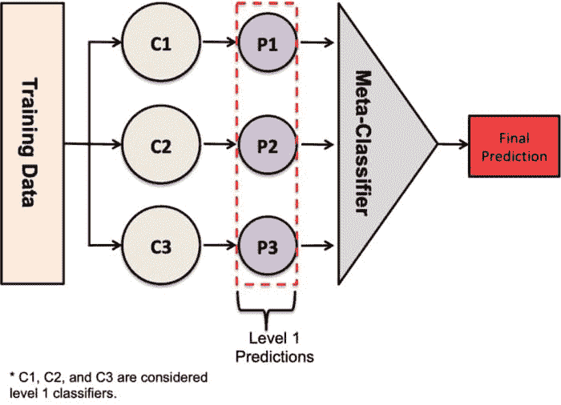
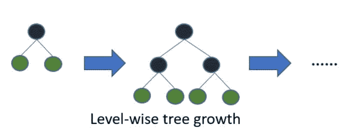

# 集成学习全面指南 – 正是你需要知道的内容

> 原文：[`www.kdnuggets.com/2021/05/comprehensive-guide-ensemble-learning.html`](https://www.kdnuggets.com/2021/05/comprehensive-guide-ensemble-learning.html)

评论

[集成学习技术](https://www.toptal.com/machine-learning/ensemble-methods-machine-learning)已经证明在机器学习问题上能取得更好的表现。我们可以将这些技术用于回归和分类问题。

从这些集成技术中获得的最终预测结果是通过结合多个基础模型的结果得到的。平均值、投票和堆叠是一些将结果组合以获得最终预测的方法。

* * *

## 我们的三大课程推荐

 1\. [谷歌网络安全证书](https://www.kdnuggets.com/google-cybersecurity) - 快速开启网络安全职业生涯

 2\. [谷歌数据分析专业证书](https://www.kdnuggets.com/google-data-analytics) - 提升你的数据分析技能

 3\. [谷歌 IT 支持专业证书](https://www.kdnuggets.com/google-itsupport) - 为你的组织提供 IT 支持

* * *

在这篇文章中，我们将探讨如何使用集成学习来得出最佳的机器学习模型。

### 什么是集成学习？

集成学习是将多个机器学习模型组合在一个问题中的方法。这些模型被称为弱学习器。其直观的理解是，当你结合多个弱学习器时，它们可以变成强学习器。

每个弱学习器都在训练集上进行训练并提供预测。最终的预测结果是通过结合所有弱学习器的结果来计算的。

### 基本的集成学习技术

让我们花点时间来看看简单的集成学习技术。

**最大投票**

在分类中，每个模型的预测都是一票。在最大投票中，最终预测结果来自于票数最多的预测。

让我们看一个例子，假设你有三个分类器，其预测结果如下：

+   分类器 1 – 类 A

+   分类器 2 – 类 B

+   分类器 3 – 类 B

最终的预测结果是类 B，因为它获得了最多的票数。

**平均值**

在平均值方法中，最终输出是所有预测值的平均值。这适用于回归问题。例如，在 [随机森林回归](https://neptune.ai/blog/random-forest-regression-when-does-it-fail-and-why)中，最终结果是来自各个决策树预测值的平均值。

让我们看一个例子，其中三个回归模型预测商品价格如下：

+   回归器 1 – 200

+   回归器 2 – 300

+   回归器 3 – 400

最终预测结果是 200、300 和 400 的平均值。

**加权平均**

在加权平均中，具有更高预测能力的基础模型更重要。在价格预测示例中，每个回归模型会被分配一个权重。

权重的总和应等于 1。假设回归模型的权重分别为 0.35、0.45 和 0.2。最终模型的预测可以如下计算：

0.35 * 200 + 0.45 * 300 + 0.2 * 400 = 285

### 高级集成学习技术

上述是一些简单的技术，现在让我们来看看集成学习的高级技术。

### 堆叠

堆叠是将各种估计器组合在一起以减少其偏差的过程。每个估计器的预测结果被堆叠在一起，并作为输入传递给最终估计器（通常称为*元模型*），以计算最终预测。最终估计器的训练通过交叉验证进行。

堆叠可以用于回归和分类问题。



[*来源*](https://towardsdatascience.com/stacking-classifiers-for-higher-predictive-performance-566f963e4840)

堆叠可以被认为是以下步骤：

1.  将数据分割为训练集和验证集，

1.  将训练集划分为 K 折，例如 10 折，

1.  在 9 折上训练一个基础模型（例如 SVM）并对第 10 折进行预测，

1.  直到你对每一折有一个预测，

1.  在整个训练集上拟合基础模型，

1.  使用模型对测试集进行预测，

1.  对其他基础模型（例如决策树）重复步骤 3 至 6，

1.  使用测试集的预测作为新模型的特征——*元模型*，

1.  使用元模型对测试集做最终预测。

对于回归问题，传递给元模型的值是数值型的。对于分类问题，它们是概率或类别标签。

### 混合

混合类似于堆叠，但使用训练集的留出集进行预测。因此，预测仅在留出集上进行。预测和留出集用于构建一个最终模型，该模型在测试集上进行预测。

你可以将混合视为一种堆叠，其中元模型在基础模型对留出的验证集进行的预测上进行训练。

你可以将*混合*过程视为：

+   将数据分割为测试集和验证集，

+   在验证集上拟合基础模型，

+   对验证集和测试集进行预测，

+   使用验证集及其预测结果来构建最终模型，

+   使用此模型进行最终预测。

混合的概念[*由 Netflix 奖竞赛推广*](https://netflixprize.com/assets/ProgressPrize2008_BellKor.pdf)。获胜团队使用了混合解决方案，在 Netflix 的电影推荐算法上实现了 10 倍的性能提升。

根据这个[Kaggle 集成指南](https://mlwave.com/kaggle-ensembling-guide/)：

> **“混合”**是 Netflix 获胜者引入的术语。它非常接近堆叠泛化，但更简单，且信息泄露的风险较小。一些研究人员将“堆叠集成”和“混合”互换使用。
> 
> 使用混合时，不是为训练集创建折外预测，而是创建一个小的保留集，比如训练集的 10%。然后，堆叠模型仅在这个保留集上进行训练。”

### 混合与堆叠

混合比堆叠更简单，并且防止模型中的信息泄露。泛化器和堆叠器使用不同的数据集。然而，混合使用的数据较少，可能导致过拟合。

交叉验证在堆叠上比在混合上更可靠。与在混合中使用小的保留数据集相比，堆叠的交叉验证是在更多的折叠上计算的。

### 自助法

自助法采用随机样本数据，构建学习算法，并使用均值来找出自助法概率。这也称为*自助聚合*。自助法通过整合多个模型的结果来获得一个泛化的结果。

该方法包括：

+   从原始数据集中创建多个有替换的子集，

+   为每个子集构建一个基础模型，

+   所有模型并行运行，

+   将所有模型的预测结果结合起来以获得最终预测。

### 提升法

提升法是一种机器学习集成技术，通过将弱学习者转化为强学习者来减少偏差和方差。弱学习者以顺序方式应用于数据集。第一步是构建初始模型并将其拟合到训练集中。

然后拟合一个第二模型，该模型尝试修正第一个模型产生的错误。整个过程如下：

+   从原始数据中创建一个子集，

+   使用这些数据构建初始模型，

+   对整个数据集进行预测，

+   使用预测和实际值计算错误，

+   对不正确的预测赋予更多权重，

+   创建另一个模型，尝试修正上一个模型的错误，

+   使用新模型对整个数据集进行预测，

+   创建多个模型，每个模型旨在修正前一个模型产生的错误，

+   通过对所有模型的均值加权来获得最终模型。

### 集成学习的库

介绍完这些内容后，我们来谈谈你可以用来进行集成的库。广义上讲，有两个类别：

+   自助法算法，

+   提升算法。

### 自助法算法

自助法算法基于上述自助法技术。让我们看看其中的几个。

**自助法元估计器**

Scikit-learn 允许我们实现一个`[BaggingClassifier](https://scikit-learn.org/stable/modules/generated/sklearn.ensemble.BaggingClassifier.html)`和一个`[BaggingRegressor](https://scikit-learn.org/stable/modules/generated/sklearn.ensemble.BaggingRegressor.html)`。包袋元估计器在原始数据集的随机子集上拟合每个基础模型。然后通过汇总单个基础模型的预测来计算最终预测。汇总是通过投票或平均来完成的。这种方法通过在构建过程中引入随机化来减少估计器的方差。

包袋有几种变体：

+   将数据的随机子集作为样本的随机子集抽取被称为*pasting*。

+   当样本是有放回地抽取时，这种算法被称为*包袋*。

+   如果随机数据子集作为特征的随机子集被抽取，算法被称为*随机子空间*。

+   当你从样本和特征的子集创建基础估计器时，这被称为*随机补丁*。

让我们看看如何使用 Scikit-learn 创建一个包袋估计器。

这需要几个步骤：

+   导入`BaggingClassifier`，

+   导入一个基础估计器——一个决策树分类器，

+   创建一个`BaggingClassifier`的实例。

```py
from sklearn.ensemble import BaggingClassifier
from sklearn.tree import DecisionTreeClassifier
bagging = BaggingClassifier(base_estimator=DecisionTreeClassifier(),n_estimators=10, max_samples=0.5, max_features=0.5)
```

包袋分类器有几个参数：

+   基础估计器——这里是一个决策树分类器，

+   你想要在集成中使用的估计器数量，

+   使用`max_samples`来定义从训练集中为每个基础估计器抽取的样本数量，

+   `max_features`用于指定用于训练每个基础估计器的特征数量。

接下来，你可以在训练集上拟合这个分类器并对其进行评分。

```py
bagging.fit(X_train, y_train)
bagging.score(X_test,y_test)
```

对于回归问题，过程将是相同的，唯一的区别是你将使用回归估计器。

```py
from sklearn.ensemble import BaggingRegressor
bagging = BaggingRegressor(DecisionTreeRegressor())
bagging.fit(X_train, y_train)
model.score(X_test,y_test)
```

**随机化树的森林**

一个[随机森林](https://neptune.ai/blog/random-forest-regression-when-does-it-fail-and-why)®是一个由随机决策树组成的集成。每棵决策树都是从数据集的不同样本中创建的。这些样本是有放回地抽取的。每棵树都会产生自己的预测。

在回归中，这些结果会被平均以得到最终结果。

在分类中，最终结果可以作为获得最多投票的类别。

平均和投票通过防止过拟合来提高模型的准确性。

在 Scikit-learn 中，随机化树的森林可以通过`RandomForestClassifier`和`ExtraTreesClassifier`来实现。类似的估计器也适用于回归问题。

```py
from sklearn.ensemble import RandomForestClassifier
from sklearn.ensemble import ExtraTreesClassifier
clf = RandomForestClassifier(n_estimators=10, max_depth=None,  min_samples_split=2, random_state=0)
clf.fit(X_train, y_train)
clf.score(X_test,y_test)

clf = ExtraTreesClassifier(n_estimators=10, max_depth=None, min_samples_split=2, random_state=0)
clf.fit(X_train, y_train)
clf.score(X_test,y_test)
```

### 提升算法

这些算法基于之前描述的提升框架。让我们来看一下其中几个。

**AdaBoost**

AdaBoost 通过拟合一系列弱学习器来工作。它在后续迭代中给予错误预测更多的权重，而给予正确预测较少的权重。这迫使算法关注那些更难预测的观测值。最终预测来自加权的多数投票或总和。

AdaBoost 可以用于回归和分类问题。让我们花点时间看看如何使用 Scikit-learn 将算法应用于分类问题。

我们使用 `AdaBoostClassifier`。`n_estimators` 决定了集成中的弱学习器数量。每个弱学习器对最终组合的贡献由 `learning_rate` 控制。

默认情况下，决策树被用作基估计器。为了获得更好的结果，可以调整决策树的参数。你还可以调整基估计器的数量。

```py
from sklearn.ensemble import AdaBoostClassifier
model = AdaBoostClassifier(n_estimators=100)
model.fit(X_train, y_train)
model.score(X_test,y_test)
```

**梯度树提升**

梯度树提升还将一组弱学习器组合成一个强学习器。关于梯度提升树，有三项主要事项需要注意：

+   必须使用差分损失函数，

+   决策树被用作弱学习器，

+   它是一个加法模型，因此树是一个接一个地添加的。梯度下降被用来在添加后续树时最小化损失。

你可以使用 Scikit-learn 基于梯度树提升构建模型。

```py
from sklearn.ensemble import GradientBoostingClassifier
model = GradientBoostingClassifier(n_estimators=100, learning_rate=1.0, max_depth=1, random_state=0)
model.fit(X_train, y_train)
model.score(X_test,y_test)
```

**eXtreme Gradient Boosting**

eXtreme Gradient Boosting，广泛称为[XGoost](https://neptune.ai/blog/how-to-organize-your-xgboost-machine-learning-ml-model-development-process)，是一个顶级的梯度提升框架。它基于一组弱决策树。它可以在单台计算机上进行并行计算。

该算法使用回归树作为基学习器。它还内置了交叉验证。开发者喜欢它的准确性、效率和可行性。

```py
import xgboost as xgb
params = {"objective":"binary:logistic",'colsample_bytree': 0.3,'learning_rate': 0.1,
                'max_depth': 5, 'alpha': 10}
model = xgb.XGBClassifier(**params)
model.fit(X_train, y_train)
model.fit(X_train, y_train)
model.score(X_test,y_test)
```

**LightGBM**

[LightGBM](https://lightgbm.readthedocs.io/en/latest/) 是一种基于树学习的梯度提升算法。与使用按深度增长的其他基于树的算法不同，LightGBM 使用按叶子增长的树。叶子增长算法的收敛速度通常比基于深度的算法要快。

[*来源*](https://lightgbm.readthedocs.io/en/latest/Features.html?highlight=dart#other-features)

[*来源*](https://lightgbm.readthedocs.io/en/latest/Features.html?highlight=dart#other-features)

[*来源*](https://lightgbm.readthedocs.io/en/latest/Features.html?highlight=dart#other-features)

LightGBM 可以通过设置适当的目标来用于回归和分类问题。

下面是如何将 LightGBM 应用于二分类问题。

```py
import lightgbm as lgb
lgb_train = lgb.Dataset(X_train, y_train)
lgb_eval = lgb.Dataset(X_test, y_test, reference=lgb_train)
params = {'boosting_type': 'gbdt',
              'objective': 'binary',
              'num_leaves': 40,
              'learning_rate': 0.1,
              'feature_fraction': 0.9
              }
gbm = lgb.train(params,
    lgb_train,
    num_boost_round=200,
    valid_sets=[lgb_train, lgb_eval],
    valid_names=['train','valid'],
   )
```

**CatBoost**

[CatBoost](https://github.com/catboost) 是一个由 [Yandex](https://yandex.com/company/) 开发的深度梯度提升库。它使用遗忘决策树来生长平衡树。正如下面的图像所示，在每一层的左右分裂时使用相同的特征。

*[来源](https://heartbeat.fritz.ai/fast-gradient-boosting-with-catboost-38779b0d5d9a)*

研究人员需要 Catboost 的原因如下：

+   具有本地处理分类特征的能力，

+   模型可以在多个 GPU 上进行训练，

+   它通过提供默认参数的优秀结果来减少参数调整时间，

+   模型可以导出到 Core ML 进行设备端推理（iOS），

+   它内部处理缺失值，

+   它可以用于回归和分类问题。

这是如何将 CatBoost 应用于分类问题的。

```py
from catboost import CatBoostClassifier
cat = CatBoostClassifier()
cat.fit(X_train,y_train,verbose=False, plot=True
```

### 帮助你对基础模型进行堆叠的库

在堆叠时，单个模型的输出被堆叠，并使用最终估计器来计算最终预测。估计器在整个训练集上进行拟合。最终估计器在基础估计器的交叉验证预测上进行训练。

Scikit-learn 可以用于堆叠估计器。让我们来看看如何为分类问题堆叠估计器。

首先，你需要设置要使用的基础估计器。

```py
estimators = [
  ('knn', KNeighborsClassifier()),
   ('rf', RandomForestClassifier(n_estimators=10, random_state=42)),
   ('svr', LinearSVC(random_state=42))
]
```

接下来，实例化堆叠分类器。其参数包括：

+   上面定义的估计器，

+   你希望使用的最终估计器。默认使用逻辑回归估计器，

+   `cv` 交叉验证生成器。默认使用 5 折交叉验证，

+   `stack_method` 用于指定应用于每个估计器的方法。如果为 `auto`，它将按顺序尝试 `predict_proba`、`decision_function` 或 `predict`。

```py
from sklearn.ensemble import StackingClassifier
clf = StackingClassifier(
 estimators=estimators, final_estimator=LogisticRegression()
 )
```

然后，你可以将数据拟合到训练集，并在测试集上进行评分。

```py
clf.fit(X_train, y_train)
clf.score(X_test,y_test)
```

Scikit-learn 还允许你实现投票估计器。它使用基础估计器的多数投票或概率平均值来做出最终预测。

这可以使用 `VotingClassifier` 实现分类问题，用 `VotingRegressor` 实现回归问题。就像堆叠一样，你首先需要定义一组基础估计器。

让我们看看如何为分类问题实现它。`VotingClassifier` 让你选择投票类型：

+   `soft` 表示将使用概率的平均值来计算最终结果，

+   `hard` 通知分类器使用预测的类别进行多数投票。

```py
from sklearn.ensemble import VotingClassifier
voting = VotingClassifier(
    estimators=estimators,
    voting='soft')
```

投票回归器使用多个估计器，并将最终结果返回为预测值的平均值。

### 使用 Mlxtend 进行堆叠

你还可以使用 [Mlxtend 的](http://rasbt.github.io/mlxtend/) ` [StackingCVClassifier](http://rasbt.github.io/mlxtend/user_guide/classifier/StackingCVClassifier/)` 来进行堆叠。第一步是定义一个基础估算器列表，然后将这些估算器传递给分类器。

你还需要定义将用于聚合预测的最终模型。在这种情况下，就是逻辑回归模型。

```py
knn = KNeighborsClassifier(n_neighbors=1)
rf = RandomForestClassifier(random_state=1)
gnb = GaussianNB()
lr = LogisticRegression()
estimators = [knn,gnb,rf,lr]
stack = StackingCVClassifier(classifiers = estimators,
                            shuffle = False,
use_probas = True,
cv = 5, 
meta_classifier = LogisticRegression())
```

### 何时使用集成学习

当你想提高机器学习模型的性能时，可以采用集成学习技术。例如，提高分类模型的准确性或减少回归模型的平均绝对误差。集成学习还会导致模型更加稳定。

当你的模型在训练集上过拟合时，你还可以采用集成学习方法来创建更复杂的模型。集成中的模型将通过结合它们的预测来提高数据集上的性能。

### 集成学习最佳的应用时机

当基础模型不相关时，集成学习效果最佳。例如，你可以在不同的数据集或特征上训练不同的模型，如线性模型、决策树和神经网络。基础模型的相关性越低，效果越好。

使用不相关模型的思想在于每个模型可能解决了其他模型的弱点。它们还有不同的优点，当这些优点结合起来时，会形成一个表现良好的估算器。例如，单纯创建树基模型的集成可能不如将树型算法与其他类型算法结合效果更佳。

### 最后的思考

在本文中，我们探讨了如何使用集成学习来提高机器学习模型的性能。我们还介绍了可以用于集成的各种工具和技术。希望你的机器学习技能得到了提升。

祝集成学习愉快！

### 资源

+   [Kaggle 集成学习指南](https://mlwave.com/kaggle-ensembling-guide/)

+   [Scikit-learn 集成学习指南](https://scikit-learn.org/stable/modules/ensemble.html)

+   [文章中使用的笔记本](https://colab.research.google.com/drive/1MEcl4W1Mr9_rRJEPcY2IHWppJq08bgc2?usp=sharing)

**简介：[Derrick Mwiti](https://www.linkedin.com/in/mwitiderrick/)** 是一位对分享知识充满热情的数据科学家。他是数据科学社区的积极贡献者，参与了 Heartbeat、Towards Data Science、Datacamp、Neptune AI、KDnuggets 等多个博客。他的内容在互联网上已经被观看超过一百万次。Derrick 还是一名作者和在线讲师。他还与各种机构合作，实施数据科学解决方案并提升员工技能。你可以查看他的[完整数据科学与机器学习 Python 课程](https://www.udemy.com/course/data-science-bootcamp-in-python/?referralCode=9F6DFBC3F92C44E8C7F4)。

[原文](https://neptune.ai/blog/ensemble-learning-guide)。经许可转载。

**相关：**

+   XGBoost：它是什么，何时使用

+   梯度提升决策树 – 概念解释

+   最佳机器学习框架及 Scikit-learn 的扩展

### 更多相关主题

+   [KDnuggets 新闻，4 月 13 日：数据科学家应使用的 Python 库…](https://www.kdnuggets.com/2022/n15.html)

+   [带示例的集成学习](https://www.kdnuggets.com/2022/10/ensemble-learning-examples.html)

+   [集成学习技术：Python 中随机森林的详细讲解](https://www.kdnuggets.com/ensemble-learning-techniques-a-walkthrough-with-random-forests-in-python)

+   [何时选择集成技术？](https://www.kdnuggets.com/2022/07/would-ensemble-techniques-good-choice.html)

+   [机器学习中的统计学：成为…所需了解的内容](https://www.kdnuggets.com/2024/03/sas-statistics-machine-learning-need-know-become-certified-expert)

+   [想用你的数据技能解决全球问题？这里有…](https://www.kdnuggets.com/2022/04/jhu-want-data-skills-solve-global-problems.html)
