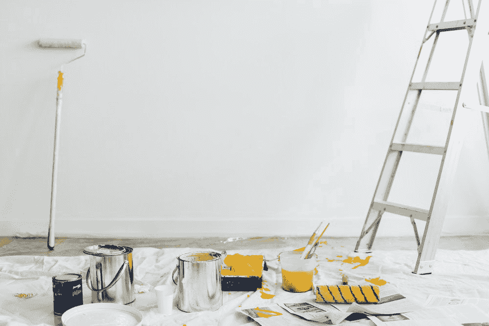
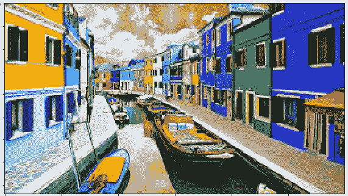
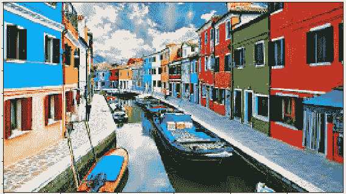
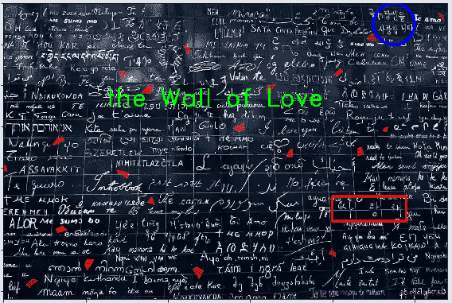

# 计算机视觉初学者：第一部分

> 原文：[`www.kdnuggets.com/2019/07/computer-vision-beginners.html`](https://www.kdnuggets.com/2019/07/computer-vision-beginners.html)

 评论

**作者 [Jiwon Jeong](https://jjone36.github.io/)，延世大学数据科学研究员和 DataCamp 项目讲师**



计算机视觉是人工智能中最热门的话题之一。它在自动驾驶汽车、机器人以及各种照片修正应用程序中取得了巨大进展。物体检测的稳步进展每天都在进行。GANs 也是研究人员当前关注的焦点。视觉展示了技术的未来，我们甚至无法想象它的最终可能性。

* * *

## 我们的前三大课程推荐

 1\. [谷歌网络安全证书](https://www.kdnuggets.com/google-cybersecurity) - 快速进入网络安全职业生涯。

 2\. [谷歌数据分析专业证书](https://www.kdnuggets.com/google-data-analytics) - 提升你的数据分析水平

 3\. [谷歌 IT 支持专业证书](https://www.kdnuggets.com/google-itsupport) - 支持你的组织 IT 事务

* * *

那么，你想迈出计算机视觉的第一步并参与这场最新的潮流吗？欢迎，你来对地方了。通过这篇文章，我们将进行一系列关于图像处理和物体检测基础的教程。这是针对初学者的 OpenCV 教程的第一部分，系列的完整内容如下：

1.  ***理解颜色模型和在图像上绘制图形***

1.  [图像处理基础与过滤](https://towardsdatascience.com/computer-vision-for-beginners-part-2-29b3f9151874)

1.  [从特征检测到人脸检测](https://towardsdatascience.com/computer-vision-for-beginners-part-3-79de62dbeef7)

1.  [轮廓检测和一点乐趣](https://towardsdatascience.com/computer-vision-for-beginners-part-4-64a8d9856208)

本系列的第一个故事将涉及安装 OpenCV，解释颜色模型和在图像上绘制图形。本教程的完整代码也可以在[**Github**](https://github.com/jjone36/vision_4_beginners/blob/master/part1_introduction.ipynb)上找到。现在让我们开始吧。

### OpenCV 简介

[**图像处理**](https://en.wikipedia.org/wiki/Digital_image_processing) 是对图像执行某些操作以获得预期的处理效果。想想我们在开始新的数据分析时会做什么。我们进行数据预处理和特征工程。图像处理也是一样的。我们进行图像处理以操控图片，从中提取有用的信息。我们可以减少噪声，控制亮度和颜色对比度。要学习详细的图像处理基础知识，请访问 [**这个视频**](https://www.youtube.com/watch?v=QMLbTEQJCaI)**。**

OpenCV 代表 [***开源计算机视觉***](https://opencv.org/) 库，它由英特尔于 1999 年发明。它最初是用 C/C++ 编写的，因此你可能会看到更多的 C 语言教程而非 Python。不过，现在它在计算机视觉中也被广泛用于 Python。首先，我们需要为使用 OpenCV 设置一个合适的环境。安装过程如下所示，但你也可以在 [**这里**](https://pypi.org/project/opencv-python/)**找到详细说明**。

```py
pip install opencv-python==3.4.2
pip install opencv-contrib-python==3.3.1
```

安装完成后，尝试导入包以查看它是否正常工作。如果没有出现任何错误返回，那么你现在可以开始使用了！

```py
import cv2
cv2.__version__
```

我们使用 OpenCV 的第一步是导入图像，可以按照如下步骤完成。

```py
import numpy as np
import matplotlib.pyplot as plt
%matplotlib inline# Import the image
img = cv2.imread('burano.jpg')
plt.imshow(img)
```



你去过[布拉诺](https://en.wikipedia.org/wiki/Burano)吗？它是意大利最美丽的岛屿之一。如果你还没去过，下一次假期你一定要去看看。但如果你已经知道这个岛屿，你可能会注意到这张图片有些不同。它与我们通常看到的布拉诺的图片有些许差异。它应该比这张图更令人愉快！

这是因为 OpenCV 的默认颜色模式设置为 BGR 顺序，这与 Matplotlib 的顺序不同。因此，为了以 RGB 模式查看图像，我们需要将其从 BGR 转换为 RGB，方法如下。

```py
# Convert the image into RGB
img_rgb = cv2.cvtColor(img, cv2.COLOR_BGR2RGB)
plt.imshow(img_rgb)
```



现在，这就是布拉诺！意大利的一个可爱岛屿！

### 不仅仅是 RGB

让我们多谈谈一下颜色模式。 [***颜色模型***](https://www.designersinsights.com/designer-resources/understanding-color-models/)是一种使用原色创建全范围颜色的系统。这里有两种不同的颜色模型：***加色模型***和***减色模型***。加色模型使用光来表示计算机屏幕上的颜色，而减色模型使用墨水在纸上打印这些数字图像。前者的原色是红色、绿色和蓝色 (RGB)，而后者的原色是青色、品红色、黄色和黑色 (CMYK)。我们在图像中看到的所有其他颜色都是通过组合或混合这些原色得到的。因此，当图像以 RGB 和 CMYK 模式表示时，可能会有些许不同。

([来源](https://www.kinkos.co.kr/bbs/board.php?bo_table=k_magazine&wr_id=9&page=2))

你可能对这两种模型已经比较熟悉。然而，在颜色模型的世界中，还有不止两种模型。其中，***灰度、HSV*** 和 ***HLS*** 是你在计算机视觉中会经常看到的模型。

灰度图像很简单。它通过黑白的强度来表示图像和形态，这意味着它只有一个通道。要查看灰度图像，我们需要将颜色模式转换为灰色，就像我们之前处理 BGR 图像一样。

```py
# Convert the image into gray scale
img_gray = cv2.cvtColor(img, cv2.COLOR_BGR2GRAY)
plt.imshow(img_gray, cmap = 'gray')
```


实际上，RGB 图像是通过叠加三个通道（R、G 和 B）组成的。因此，如果我们逐一展示每个通道，就可以理解颜色通道的结构。

```py
# Plot the three channels of the image
fig, axs = plt.subplots(nrows = 1, ncols = 3, figsize = (20, 20))
for i in range(0, 3):
    ax = axs[i]
    ax.imshow(img_rgb[:, :, i], cmap = 'gray')
plt.show()
```


看一下上面的图像。这三张图展示了每个通道的组成。在 R 通道的图片中，高饱和度的红色部分看起来是白色的。这是为什么呢？这是因为红色部分的值接近 255。在灰度模式中，值越高，颜色越白。你也可以用 G 或 B 通道来检查并比较某些部分的差异。


HSV 和 HLS 采用了稍微不同的视角。如上图所示，它们有三维表示，并且更类似于人类的感知方式。***HSV*** 代表色调、饱和度和明度。***HSL*** 代表色调、饱和度和亮度。HSV 的中心轴是颜色的明度，而 HSL 的中心轴是光的量。沿着从中心轴的角度，有色调，即实际颜色。而从中心轴的距离属于饱和度。颜色模式的转换可以按如下方式进行。

```py
# Transform the image into HSV and HLS models
img_hsv = cv2.cvtColor(img, cv2.COLOR_BGR2HSV)
img_hls = cv2.cvtColor(img, cv2.COLOR_BGR2HLS)# Plot the converted images
fig, (ax1, ax2) = plt.subplots(nrows = 1, ncols = 2, figsize = (20, 20))
ax1.imshow(img_hsv)
ax2.imshow(img_hls)
plt.show()
```


但为什么我们需要转换颜色？这些转换有什么用？一个可以回答这个问题的例子是车道检测。请看下面的图片。查看在不同颜色模式下车道是如何被检测到的。在计算机视觉任务中，我们进行多次颜色模式转换和掩模操作。如果你想了解更多关于图像处理在车道检测任务中的应用，请查看 [**这篇文章**](https://towardsdatascience.com/finding-lane-lines-simple-pipeline-for-lane-detection-d02b62e7572b) ，作者是 [nachiket tanksale](https://towardsdatascience.com/u/26a6ee15a5c5)。

[RGB 与灰度（加深）与 HSV 与 HSL](https://towardsdatascience.com/finding-lane-lines-simple-pipeline-for-lane-detection-d02b62e7572b)

现在我相信你明白了这个概念。图像处理就是‘数据预处理’。它是减少噪声和提取有用的模式，以便使分类和检测任务变得更加容易。因此，包括我们接下来要讨论的技术在内的所有这些技术，都是为了帮助模型更容易地检测模式。

### 在图像上绘图

让我们在图像上添加一些图形。现在，我们要去巴黎。你听说过[爱的墙](https://en.wikipedia.org/wiki/Wall_of_Love)吗？那是一面用各种国际语言写着“我爱你”字样的墙。我们要做的是找到我们语言中的这些字词，并用矩形标记它们。由于我来自韩国，所以我会查找韩语中的“我爱你”。首先，我会复制原始图像，然后用`cv2.rectangle()`绘制一个矩形。我们需要给出左上角和右下角的坐标值。

```py
# Copy the image
img_copy = img.copy()# Draw a rectangle
cv2.rectangle(img_copy, pt1 = (800, 470), pt2 = (980, 530),
              color = (255, 0, 0), thickness = 5)
plt.imshow(img_copy)
```


很好！我觉得我找对了位置。我们再试一次。我可以从图像中看到一个韩语单词，所以这次我会画一个圆圈。使用`cv2.circle()`，我们需要指定圆心的位置和半径的长度。

```py
# Draw a circle
cv2.circle(img_copy, center = (950, 50), radius = 50,
           color = (0, 0, 255), thickness = 5)
plt.imshow(img_copy)
```


我们也可以在图像上添加文本数据。这次我们为何不写下这面墙的名字呢？使用`cv2.putText()`，我们可以指定文本的位置、字体样式和大小。

```py
# Add text
cv2.putText(img_copy, text = "the Wall of Love",
            org = (250, 250),
            fontFace = cv2.FONT_HERSHEY_DUPLEX,
            fontScale = 2,
            color = (0, 255, 0),
            thickness = 2,
            lineType = cv2.LINE_AA)
plt.imshow(img_copy)
```



这真是一面“可爱的”墙，不是吗？试试自己找找看你语言中的“我爱你”吧！ ????

### 超越图像

现在我们已经去了意大利和法国。你想去哪里呢？为什么不放一张地图并标记这些地方呢？我们将创建一个窗口，并通过直接在窗口上点击来绘制图形，而不是指定点。我们先试试绘制一个圆圈。我们首先创建一个函数，该函数将根据鼠标的位置和点击数据绘制一个圆圈。

```py
# Step 1\. Define callback function
def draw_circle(event, x, y, flags, param):
if event == cv2.EVENT_LBUTTONDOWN:
            cv2.circle(img, center = (x, y), radius = 5,
                       color = (87, 184, 237), thickness = -1)
elif event == cv2.EVENT_RBUTTONDOWN:
            cv2.circle(img, center = (x, y), radius = 10,
                       color = (87, 184, 237), thickness = 1)
```

使用`cv2.EVENT_LBUTTONDOWN`或`cv2.EVENT_RBUTTONDOWN`，我们可以获取按下鼠标按钮时的位置数据。鼠标的位置将是`(x, y)`，我们将绘制一个以该点为中心的圆圈。

```py
# Step 2\. Call the window
img = cv2.imread('map.png')cv2.namedWindow(winname = 'my_drawing')
cv2.setMouseCallback('my_drawing', draw_circle)
```

我们将设置一张地图作为窗口的背景，并将窗口命名为*my_drawing*。窗口的名称可以是任何名称，但它应该保持一致，因为这就像是窗口的 ID。使用`cv2.setMouseCallback()`，我们将窗口和在第 1 步中创建的函数`draw_circle`连接起来。

```py
# Step 3\. Execution
while True:
    cv2.imshow('my_drawing',img)
    if cv2.waitKey(10) & 0xFF == 27:
        break
cv2.destroyAllWindows()
```

现在我们使用 while 循环来执行窗口。除非你在做无限循环，否则不要忘记设置中断。if 语句的条件是当我们按下键盘上的 ESC 时，关闭窗口。将这个文件保存并在你的终端中导入。如果你使用的是 jupyter lab，将代码放在一个单元格中并执行。现在，告诉我！你想去哪里？


让我们尝试绘制一个矩形。由于矩形需要两个点作为**pt1**和**pt2**在`cv2.rectangle()`中，我们需要额外的步骤将第一个点击点设置为**pt1**，最后一个点设置为**pt2**。我们将使用`cv2.EVENT_MOUSEMOVE`和`cv2.EVENT_LBUTTONUP`来检测鼠标的移动。

我们首先将`drawing = False`定义为默认值。当按下左键时，`drawing`变为真，我们将第一个位置设为**pt1**。如果绘制开启，它将当前点作为**pt2**并在移动鼠标时继续绘制矩形。就像重叠图形一样。当左键释放时，`drawing`变为假，并将鼠标的最后位置作为**pt2**的最终点。

```py
# Initialization
drawing = False
ix = -1
iy = -1# create a drawing function
def draw_rectangle(event, x, y, flags, params):

    global ix, iy, drawing    
    if event == cv2.EVENT_LBUTTONDOWN:
        drawing = True
        ix, iy = x, y

    elif event == cv2.EVENT_MOUSEMOVE:
        if drawing == True:
            cv2.rectangle(img, pt1=(ix, iy), pt2=(x, y),
                          color = (87, 184, 237), thickness = -1)

    elif event == cv2.EVENT_LBUTTONUP:
        drawing = False
        cv2.rectangle(img, pt1=(ix, iy), pt2=(x, y),
                     color = (87, 184, 237), thickness = -1)
```

在步骤 1 中，将`draw_circle`函数替换为`draw_rectangle`。请不要忘记在回调函数`cv2.setMouseCallback()`中也进行更改。因此，整个代码脚本如下。保存此脚本文件并在终端或 Jupyter Notebook 中运行。

### 接下来是什么？

你喜欢第一次使用 OpenCV 的体验吗？你还可以尝试其他函数，例如绘制直线或多边形。请随意查看文档，文档链接在[**这里**](https://docs.opencv.org/2.4/modules/core/doc/drawing_functions.html)。下次，我们将讨论更高级的技术，例如合并两张不同的图像、图像轮廓和对象检测。

有什么错误你希望纠正吗？请与我们分享你的见解。我随时乐于交谈，请随时在下面留言，分享你的想法。我还在[LinkedIn](https://www.linkedin.com/in/jiwon-jeong/)上分享有趣和有用的资源，欢迎关注或联系我。我下次会带来另一个有趣的故事！

**简介：[Jiwon Jeong](https://jjone36.github.io/)**，是一名数据科学家，目前正在攻读工业工程硕士学位，并担任 DataCamp 的项目讲师。

[原文](https://towardsdatascience.com/computer-vision-for-beginners-part-1-7cca775f58ef)。已获授权转载。

**相关内容：**

+   端到端机器学习：从图像制作视频

+   深度学习的预处理：从协方差矩阵到图像白化

+   使用 Numpy 和 OpenCV 进行基本图像数据分析 – 第一部分

### 更多相关话题

+   [TensorFlow 计算机视觉 - 轻松实现迁移学习](https://www.kdnuggets.com/2022/01/tensorflow-computer-vision-transfer-learning-made-easy.html)

+   [探索计算机视觉的世界：介绍 MLM 最新…](https://www.kdnuggets.com/2024/01/mlm-discover-the-world-of-computer-vision-ebook)

+   [计算机视觉的 5 个应用](https://www.kdnuggets.com/2022/03/5-applications-computer-vision.html)

+   [关于数据管理你需要了解的 6 件事及其重要性](https://www.kdnuggets.com/2022/05/6-things-need-know-data-management-matters-computer-vision.html)

+   [KDnuggets 新闻 2022 年 3 月 9 日：在 5 分钟内构建一个机器学习网页应用](https://www.kdnuggets.com/2022/n10.html)

+   [DINOv2: Meta AI 自监督计算机视觉模型](https://www.kdnuggets.com/2023/05/dinov2-selfsupervised-computer-vision-models-meta-ai.html)
