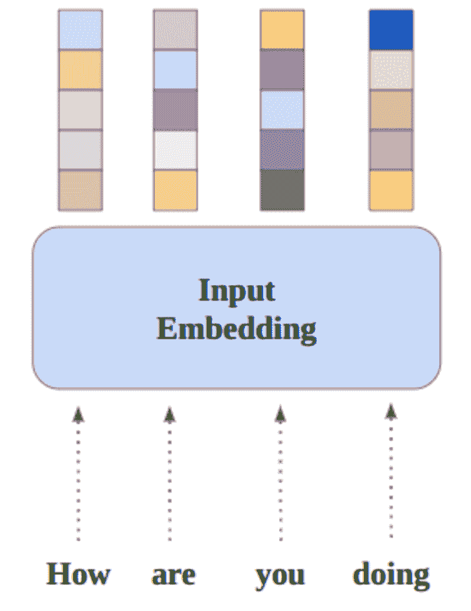
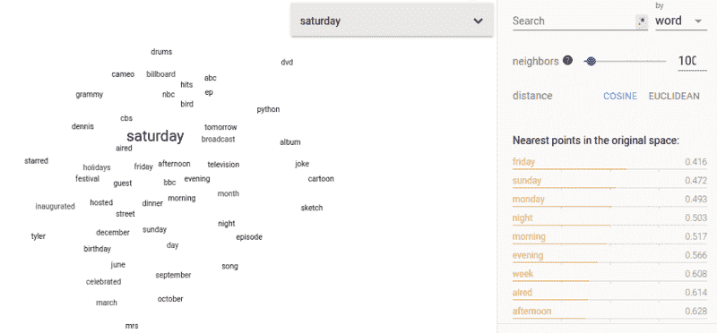
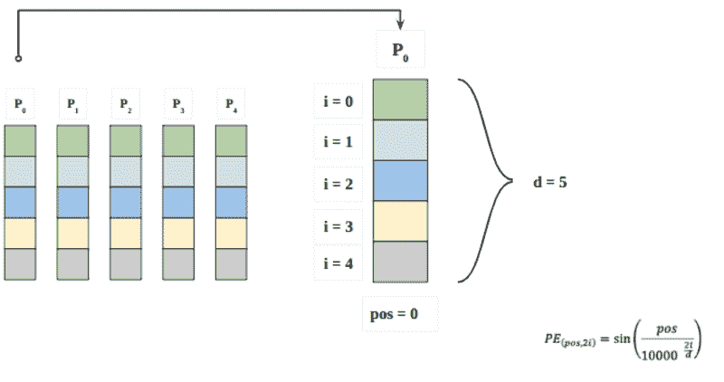
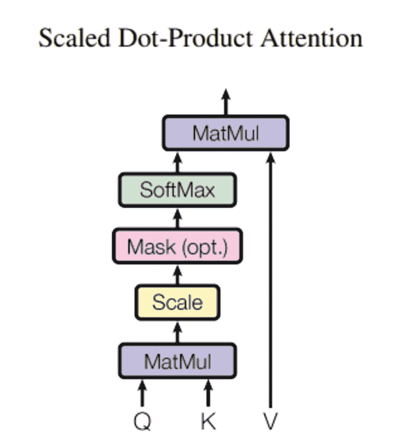
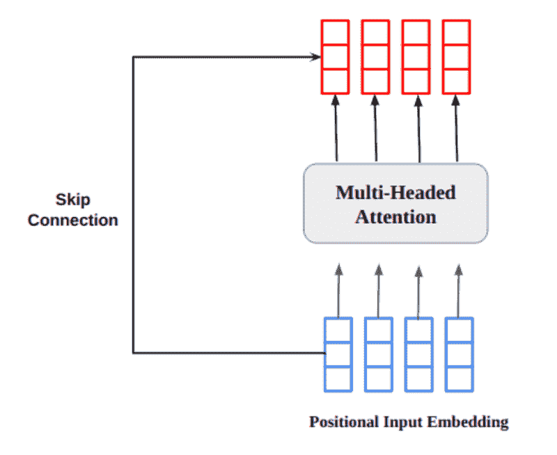
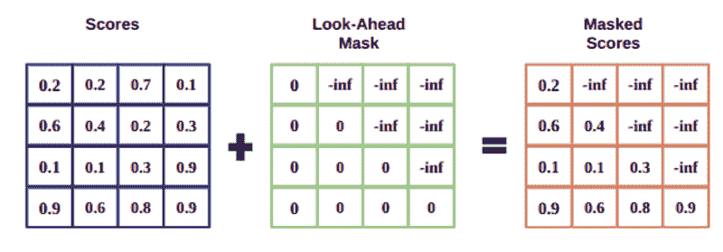
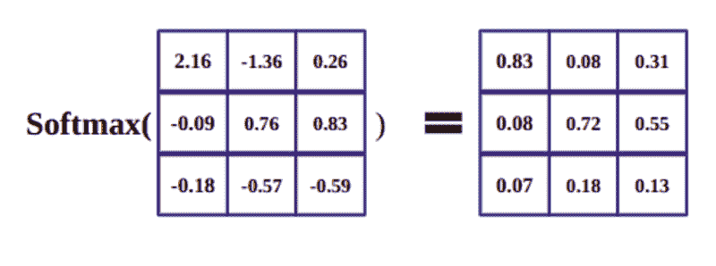

# 在深入了解 Transformer 之前应该了解的概念

> 原文：[`www.kdnuggets.com/2023/01/concepts-know-getting-transformer.html`](https://www.kdnuggets.com/2023/01/concepts-know-getting-transformer.html)

# 1. 输入嵌入

神经网络通过数字进行学习，因此每个单词都会被映射到向量中以表示特定的单词。嵌入层可以被认为是一个查找表，用于存储单词嵌入并通过索引检索它们。

具有相同含义的单词在欧氏距离/余弦相似度方面会很接近。例如，在下面的单词表示中，“Saturday”，“Sunday”和“Monday”与相同的概念相关，因此我们可以看到这些单词的结果是相似的。

# 2. 位置编码

确定单词的位置的原因，为什么我们需要确定单词的位置？因为，transformer 编码器没有像递归神经网络那样的递归，我们必须在输入嵌入中添加一些关于位置的信息。这是通过位置编码来完成的。论文的作者使用了以下函数来建模单词的位置。

我们将尝试解释位置编码。

这里“pos”指的是序列中“单词”的位置。P0 指的是第一个单词的位置嵌入；“d”表示单词/标记嵌入的大小。在这个例子中，d=5。最后，“i”指的是嵌入的 5 个单独维度（即 0、1、2、3、4）。

如果上面的方程中的“i”发生变化，你将得到一系列频率不同的曲线。通过读取不同频率下的位置嵌入值，会在不同的嵌入维度中为 P0 和 P4 提供不同的值。

# 3. 缩放点积注意力

在这个**查询 Q**中，表示一个向量单词，**键 K**是句子中的所有其他单词，而**值 V**表示单词的向量。

注意力的目的是计算关键术语与查询术语相比的重要性，关键术语与相同的人/事物或概念相关。

在我们的例子中，V 等于 Q。

**注意力机制给出了句子中单词的重要性。**

当我们计算查询和键之间的归一化点积时，我们得到一个张量，表示每个其他单词对查询的相对重要性。

当计算 Q 和 K.T 之间的点积时，我们尝试估计向量（即查询和键之间的词）是如何对齐的，并为句子中的每个词返回一个权重。

然后，我们对 d_k 的平方结果进行归一化，softmax 函数对项进行正则化并将其重新缩放到 0 和 1 之间。

最后，我们将结果（即权重）乘以值（即所有词汇），以减少不相关词汇的重要性，并仅关注最重要的词汇。

# 4. 残差连接

多头注意力输出向量被添加到原始位置输入嵌入中。这被称为残差连接/跳跃连接。残差连接的输出经过层归一化。归一化后的残差输出经过逐点前馈网络进行进一步处理。

# 5. 掩码

掩码是一个与注意力分数大小相同的矩阵，填充了 0 和负无穷值。

使用掩码的原因是，一旦对掩码后的分数进行 softmax 操作，负无穷将变为零，从而使未来的词汇注意力分数为零。

这告诉模型对那些词不加关注。

# 6. softmax 函数

softmax 函数的目的是将真实数（正数和负数）转换为总和为 1 的正数。

**[Ravikumar Naduvin](https://www.linkedin.com/in/ravikumar-mn/)** 正忙于使用 PyTorch 构建和理解 NLP 任务。

[原文](https://ravikumarmn.github.io/concepts-you-should-know-before-getting-into/)。经许可转载。

* * *

## 我们的三大课程推荐

 1. [谷歌网络安全证书](https://www.kdnuggets.com/google-cybersecurity) - 快速进入网络安全职业。

 2. [谷歌数据分析专业证书](https://www.kdnuggets.com/google-data-analytics) - 提升你的数据分析技能

 3. [谷歌 IT 支持专业证书](https://www.kdnuggets.com/google-itsupport) - 支持你的组织的 IT 工作

* * *

### 更多相关主题

+   [关于梯度下降和代价函数的 5 个概念](https://www.kdnuggets.com/2020/05/5-concepts-gradient-descent-cost-function.html)

+   [数据科学中你应该知道的 7 个 SQL 概念](https://www.kdnuggets.com/2022/11/7-sql-concepts-needed-data-science.html)

+   [KDnuggets™ 新闻 22:n03，1 月 19 日：深入探讨 13 个数据…](https://www.kdnuggets.com/2022/n03.html)

+   [谷歌建议你在参加他们的机器学习课程之前做什么…](https://www.kdnuggets.com/2021/10/google-recommends-before-machine-learning-data-science-course.html)

+   [在参加任何免费的数据科学课程之前请先阅读此文](https://www.kdnuggets.com/read-this-before-you-take-any-free-data-science-course)

+   [KDnuggets 新闻，4 月 13 日：数据科学家应关注的 Python 库…](https://www.kdnuggets.com/2022/n15.html)
