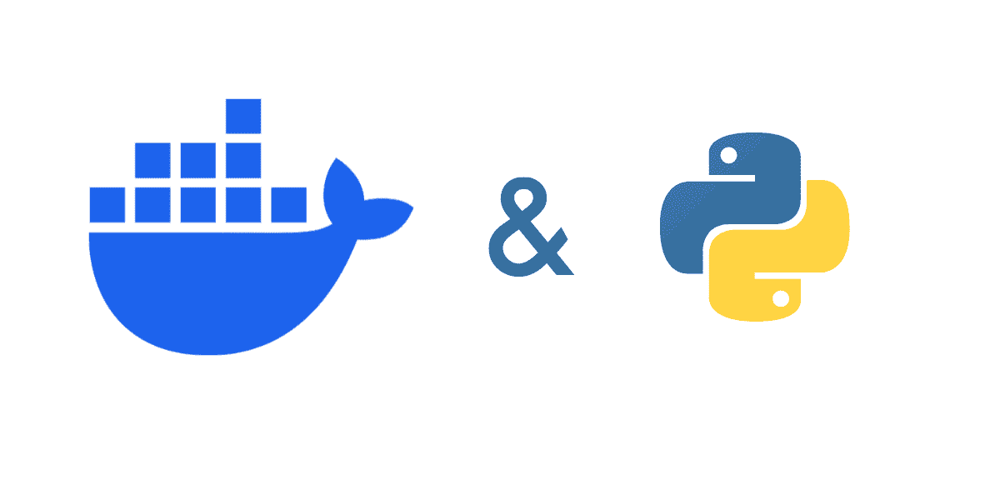

# 使用 Docker 在 5 个简单步骤中容器化 Python 应用程序

> 原文：[`www.kdnuggets.com/containerize-python-apps-with-docker-in-5-easy-steps`](https://www.kdnuggets.com/containerize-python-apps-with-docker-in-5-easy-steps)



作者提供的图片

* * *

## 我们的前三大课程推荐

 1\. [Google 网络安全证书](https://www.kdnuggets.com/google-cybersecurity) - 快速进入网络安全职业道路。

 2\. [Google 数据分析专业证书](https://www.kdnuggets.com/google-data-analytics) - 提升你的数据分析技能

 3\. [Google IT 支持专业证书](https://www.kdnuggets.com/google-itsupport) - 支持你的组织的 IT

* * *

在使用 Python 构建应用程序时，你常常会遇到依赖冲突、版本不匹配等问题。使用 Docker，你可以将应用程序——连同所需的依赖、运行时和配置——打包成一个称为镜像的单一可移植工件。然后，你可以使用这个镜像启动一个运行应用程序的 Docker 容器。

无论是简单的 Python 应用程序还是数据科学应用程序，Docker 都使得管理依赖变得更加简单。这在数据科学项目中特别有用，因为你需要不同的库和这些库的特定版本以确保应用程序没有错误地运行。使用 Docker，你可以为所有应用程序创建隔离、一致和可重现的环境。

作为迈出这一步的第一步，让我们学习如何将 Python 应用程序容器化。

## 第 1 步：开始使用

首先，[在你使用的平台上安装 Docker](https://docs.docker.com/get-docker/)。你可以在 Windows、Linux 和 MacOs 上运行 Docker。以下是安装 Docker 后你可能需要做的几件事。

Docker 守护进程绑定到一个默认由`root`用户拥有的 Unix 套接字。因此，你只能使用`sudo`访问它。为了避免在所有 Docker 命令前加上`sudo`，可以创建一个`docker`组，并像这样将用户添加到该组：

```py
$ sudo groupadd docker

$ sudo usermod -aG docker $USER
```

对于较新的 Docker 版本，BuildKit 是默认的构建工具。然而，如果你使用的是较旧版本的 Docker，当你运行`docker build`命令时，可能会收到弃用警告。这是因为旧版构建客户端将在未来的版本中被弃用。作为解决方法，你可以[安装 buildx](https://github.com/docker/buildx)，这是一个 CLI 工具，用于使用 BuildKit 的功能。然后使用`docker buildx build`命令来使用 BuildKit 进行构建。

## 第 2 步：编写你的 Python 应用程序

接下来，编写一个 Python 应用程序，我们可以使用 Docker 对其进行容器化。在这里，我们将容器化一个简单的[命令行待办事项列表应用程序](https://github.com/balapriyac/python-projects/blob/main/command-line-app/dockerize/todo.py)。该应用程序的代码[在 GitHub 上：todo.py 文件](http://todo.py)。

你可以将任何你选择的 Python 应用程序容器化，或者按照我们在这里使用的示例进行操作。如果你对逐步教程构建命令行 TO-DO 应用程序感兴趣，请阅读 [用 Python 在 7 个简单步骤中构建命令行应用程序](https://www.kdnuggets.com/build-a-command-line-app-with-python-in-7-easy-steps)。

## 第 3 步：创建 Dockerfile

接下来，我们将创建一个 Dockerfile。把它看作是定义如何为应用程序构建 Docker 镜像的配方。在你的工作目录中创建一个名为 `Dockerfile` 的文件，内容如下：

```py
 # Use Python 3.11 as base image
FROM python:3.11-slim

# Set the working directory in the container
WORKDIR /app

# Copy the current directory contents into the container at /app
COPY . /app

# Command to run the Python script
CMD ["/bin/bash"]
```

在这里，我们使用 Python 3.11 作为基础镜像。然后我们使用 `WORKDIR` 命令设置所有后续指令的工作目录。接着，我们使用 `COPY` 命令将项目中的文件复制到容器的文件系统中。

因为我们要将一个命令行应用容器化，我们将要执行的命令指定为 `“/bin/bash”`。这样，当我们运行镜像并启动容器时，就会启动一个交互式的 bash shell。

## 第 4 步：构建 Docker 镜像

我们已经准备好 todo.py 文件和 Dockerfile。接下来，我们可以使用以下命令构建 Docker 镜像：

```py
docker build -t todo-app .
```

使用构建命令中的 `-t` 选项，你可以同时指定一个名称和标签，如：`docker build -t name:tag .`

这个命令根据 `Dockerfile` 中的指令构建一个名为 `todo-app` 的 Docker 镜像。末尾的 `.` 指定了构建上下文为当前目录。

构建过程需要几分钟：

```py
Sending build context to Docker daemon  4.096kB
Step 1/4 : FROM python:3.11-slim
3.11-slim: Pulling from library/python
13808c22b207: Pull complete
6c9a484475c1: Pull complete
b45f078996b5: Pull complete
16dd65a710d2: Pull complete
fc35a8622e8e: Pull complete
Digest: sha256:dad770592ab3582ab2dabcf0e18a863df9d86bd9d23efcfa614110ce49ac20e4
Status: Downloaded newer image for python:3.11-slim
 ---> c516402fec78
Step 2/4 : WORKDIR /app
 ---> Running in 27d02ba3a48d
Removing intermediate container 27d02ba3a48d
 ---> 7747abda0fc0
Step 3/4 : COPY . /app
 ---> fd5cb75a0529
Step 4/4 : CMD ["/bin/bash"]
 ---> Running in ef704c22cd3f
Removing intermediate container ef704c22cd3f
 ---> b41986b633e6
Successfully built b41986b633e6
Successfully tagged todo-app:latest 
```

## 第 5 步：运行你的 Docker 容器

一旦镜像构建完成，你可以使用以下命令从构建好的镜像启动一个 Docker 容器：

```py
docker run -it todo-app
```

`-it` 选项是 `-i` 和 `-t` 的组合：

+   `-i` 选项用于交互式运行容器，并且即使没有附加，也保持 STDIN 开放。

+   `-t` 选项分配一个伪 TTY。因此，它在容器内提供一个可以交互的终端界面。

现在，我们的 TO-DO 应用程序在 Docker 容器内运行，我们可以在命令行中与之交互：

```py
root@9d85c09f01ec:/app# python3 todo.py
usage: todo.py [-h] [-a] [-l] [-r]

Command-line Todo List App

options:
  -h, --help  	show this help message and exit
  -a , --add  	Add a new task
  -l, --list  	List all tasks
  -r , --remove   Remove a task by index
root@9d85c09f01ec:/app# python3 todo.py -a 'walk 2 miles'
root@9d85c09f01ec:/app# python3 todo.py -l
1\. walk 2 miles 
```

## 总结

就这样！你已经成功地使用 Docker 容器化了一个命令行 Python 应用程序。在这个教程中，我们展示了如何使用 Docker 容器化一个简单的 Python 应用程序。

我们在 Python 中构建了这个应用程序，没有使用任何外部 Python 库。因此我们没有定义 requirements.txt 文件。requirements.txt 文件通常列出各种库及其版本，你可以使用简单的 `pip install` 命令安装它们。如果你对专注于数据科学的 Docker 教程感兴趣，请查看 [数据科学家的 Docker 教程](https://www.kdnuggets.com/2023/07/docker-tutorial-data-scientists.html)。

**[](https://twitter.com/balawc27)**[Bala Priya C](https://www.kdnuggets.com/wp-content/uploads/bala-priya-author-image-update-230821.jpg)**** 是来自印度的开发者和技术写作者。她喜欢在数学、编程、数据科学和内容创作的交汇处工作。她的兴趣和专长领域包括 DevOps、数据科学和自然语言处理。她喜欢阅读、写作、编码和喝咖啡！目前，她正在通过编写教程、指南、观点文章等来学习和分享她的知识，与开发者社区互动。Bala 还创建了引人入胜的资源概述和编码教程。

### 更多相关内容

+   [用 Python 在 10 个简单步骤中构建 AI 应用](https://www.kdnuggets.com/build-an-ai-application-with-python-in-10-easy-steps)

+   [用 Python 在 7 个简单步骤中构建命令行应用](https://www.kdnuggets.com/build-a-command-line-app-with-python-in-7-easy-steps)

+   [Python 向量数据库和向量索引：构建 LLM 应用的架构](https://www.kdnuggets.com/2023/08/python-vector-databases-vector-indexes-architecting-llm-apps.html)

+   [Python 构建 LLM 应用的初学者指南](https://www.kdnuggets.com/beginners-guide-to-building-llm-apps-with-python)

+   [Python 数据预处理简单指南](https://www.kdnuggets.com/2020/07/easy-guide-data-preprocessing-python.html)

+   [Tick-Tock：使用 Pendulum 在 Python 中轻松管理日期和时间](https://www.kdnuggets.com/tick-tock-using-pendulum-for-easy-date-and-time-management-in-python)
