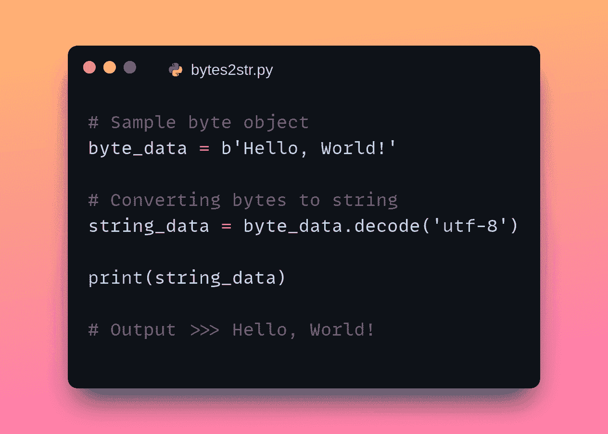

# 在 Python 中将字节转换为字符串：初学者教程

> 原文：[`www.kdnuggets.com/convert-bytes-to-string-in-python-a-tutorial-for-beginners`](https://www.kdnuggets.com/convert-bytes-to-string-in-python-a-tutorial-for-beginners)



图片由作者提供

在 Python 中，字符串是不可变的字符序列，具有可读性，并通常编码为特定的字符编码，例如 UTF-8。字节表示原始的二进制数据。字节对象是不可变的，由字节数组（8 位值）组成。在 Python 3 中，字符串文字默认是 Unicode，而字节文字以 `b` 为前缀。

* * *

## 我们的前三大课程推荐

 1\. [Google 网络安全证书](https://www.kdnuggets.com/google-cybersecurity) - 快速通道进入网络安全职业

 2\. [Google 数据分析专业证书](https://www.kdnuggets.com/google-data-analytics) - 提升你的数据分析技能

 3\. [Google IT 支持专业证书](https://www.kdnuggets.com/google-itsupport) - 支持你在 IT 领域的组织

* * *

将字节转换为字符串是 Python 中的一个常见任务，特别是在处理来自网络操作、文件 I/O 或某些 API 响应的数据时。这是一个关于如何在 Python 中将字节转换为字符串的教程。

## 1\. 使用 `decode()` 方法将字节转换为字符串

将字节转换为字符串的最简单方法是使用字节对象（或字节字符串）上的 `decode()` 方法。此方法需要指定所使用的字符编码。

> **注意**：字符串没有关联的二进制编码，而字节没有关联的文本编码。要将字节转换为字符串，你可以在字节对象上使用 `decode()` 方法。要将字符串转换为字节，你可以在字符串上使用 `encode()` 方法。在这两种情况下，都需要指定使用的编码。

### 示例 1：UTF-8 编码

这里我们使用 `decode()` 方法将 `byte_data` 转换为 UTF-8 编码的字符串：

```py
# Sample byte object
byte_data = b'Hello, World!'

# Converting bytes to string 
string_data = byte_data.decode('utf-8')

print(string_data) 
```

你应该得到以下输出：

```py
Output >>>
Hello, World! 
```

你可以像这样验证转换前后的数据类型：

```py
print(type(bytes_data))
print(type(string_data)) 
```

数据类型应该如预期那样：

```py
Output >>>
<class 'bytes'>
<class 'str'>
```

### 示例 2：处理其他编码

有时，字节序列可能包含除 UTF-8 之外的编码。你可以通过在调用字节对象的 `decode()` 方法时指定相应的编码方案来处理这种情况。

下面是如何使用 UTF-16 编码解码字节字符串的方法：

```py
# Sample byte object 
byte_data_utf16 = b'\xff\xfeH\x00e\x00l\x00l\x00o\x00,\x00 \x00W\x00o\x00r\x00l\x00d\x00!\x00'

# Converting bytes to string 
string_data_utf16 = byte_data_utf16.decode('utf-16')

print(string_data_utf16) 
```

这是输出结果：

```py
Output >>>
Hello, World! 
```

### 使用 Chardet 检测编码

实际上，你可能并不总是知道所使用的编码方案。不匹配的编码可能导致错误或乱码。那么你该如何解决这个问题呢？

你可以使用[chardet 库](https://pypi.org/project/chardet/)（使用 pip 安装 chardet: `pip install chardet`）来检测编码。然后在`decode()`方法调用中使用它。下面是一个示例：

```py
import chardet

# Sample byte object with unknown encoding
byte_data_unknown = b'\xe4\xbd\xa0\xe5\xa5\xbd'

# Detecting the encoding
detected_encoding = chardet.detect(byte_data_unknown)
encoding = detected_encoding['encoding']
print(encoding)

# Converting bytes to string using detected encoding
string_data_unknown = byte_data_unknown.decode(encoding)

print(string_data_unknown) 
```

你应该得到类似的输出：

```py
Output >>>
你好 
```

## 解码中的错误处理

你正在使用的`bytes`对象可能并不总是有效；它有时可能包含指定编码的无效序列。这将导致错误。

在这里，`byte_data_invalid`包含无效序列 \xff：

```py
# Sample byte object with invalid sequence for UTF-8
byte_data_invalid = b'Hello, World!\xff'

# try converting bytes to string 
string_data = byte_data_invalid.decode('utf-8')

print(string_data) 
```

当你尝试解码时，会出现以下错误：

```py
Traceback (most recent call last):
  File "/home/balapriya/bytes2str/main.py", line 5, in <module>string_data = byte_data_invalid.decode('utf-8')
              	^^^^^^^^^^^^^^^^^^^^^^^^^^^^^^^^^
UnicodeDecodeError: 'utf-8' codec can't decode byte 0xff in position 13: invalid start byte</module> 
```

但是有几种方法可以处理这些错误。你可以在解码时忽略这些错误，也可以用占位符替换无效序列。

### 忽略错误

要在解码时忽略无效序列，你可以将`errors`设置为`ignore`，在`decode()`方法调用中：

```py
# Sample byte object with invalid sequence for UTF-8
byte_data_invalid = b'Hello, World!\xff'

# Converting bytes to string while ignoring errors
string_data = byte_data_invalid.decode('utf-8', errors='ignore')

print(string_data) 
```

你现在会得到以下没有错误的输出：

```py
Output >>>
Hello, World! 
```

### 替换错误

你也可以用占位符替换无效序列。为此，你可以将`errors`设置为`replace`，如下所示：

```py
# Sample byte object with invalid sequence for UTF-8
byte_data_invalid = b'Hello, World!\xff'

# Converting bytes to string while replacing errors with a placeholder
string_data_replace = byte_data_invalid.decode('utf-8', errors='replace')

print(string_data_replace) 
```

现在，无效序列（在末尾）被占位符替换：

```py
Output >>>
Hello, World!� 
```

## 2\. 使用 str() 构造函数将字节转换为字符串

`decode()`方法是将字节转换为字符串的最常见方法。但你也可以使用`str()`构造函数从字节对象获取字符串。你可以将编码方案传递给`str()`，如下所示：

```py
# Sample byte object
byte_data = b'Hello, World!'

# Converting bytes to string
string_data = str(byte_data,'utf-8')

print(string_data) 
```

这输出：

```py
Output >>>
Hello, World! 
```

## 3\. 使用 Codecs 模块将字节转换为字符串

在 Python 中将字节转换为字符串的另一种方法是使用内置的[codecs](https://docs.python.org/3/library/codecs.html)模块中的`decode()`函数。该模块提供了编码和解码的便利函数。

你可以像下面这样调用`decode()`函数，传入字节对象和编码方案：

```py
import codecs

# Sample byte object
byte_data = b'Hello, World!'

# Converting bytes to string
string_data = codecs.decode(byte_data,'utf-8')

print(string_data) 
```

正如预期的，这也输出：

```py
Output >>>
Hello, World! 
```

## 总结

在本教程中，我们学习了如何在 Python 中将字节转换为字符串，同时优雅地处理不同的编码和潜在的错误。具体来说，我们学习了如何：

+   使用`decode()`方法将字节转换为字符串，指定正确的编码。

+   使用`errors`参数处理潜在的解码错误，选项包括`ignore`或`replace`。

+   使用`str()`构造函数将有效的字节对象转换为字符串。

+   使用 Python 标准库中内置的`codecs`模块的`decode()`函数将有效的字节对象转换为字符串。

编程愉快！

**[](https://twitter.com/balawc27)**[Bala Priya C](https://www.kdnuggets.com/wp-content/uploads/bala-priya-author-image-update-230821.jpg)** 是一位来自印度的开发者和技术作家。她喜欢在数学、编程、数据科学和内容创作的交汇处工作。她的兴趣和专长领域包括 DevOps、数据科学和自然语言处理。她享受阅读、写作、编码和咖啡！目前，她正在通过编写教程、操作指南、观点文章等，学习并与开发者社区分享她的知识。Bala 还创建了引人入胜的资源概述和编码教程。**

### 更多相关话题

+   [将 Python 字典转换为 JSON：初学者教程](https://www.kdnuggets.com/convert-python-dict-to-json-a-tutorial-for-beginners)

+   [如何编写高效的 Python 代码：初学者教程](https://www.kdnuggets.com/how-to-write-efficient-python-code-a-tutorial-for-beginners)

+   [Python 字符串处理备忘单](https://www.kdnuggets.com/2020/01/python-string-processing-primer.html)

+   [Python 字符串方法](https://www.kdnuggets.com/2022/12/python-string-methods.html)

+   [Python 字符串匹配无需复杂的正则表达式语法](https://www.kdnuggets.com/2023/02/python-string-matching-without-complex-regex-syntax.html)

+   [如何将 RGB 图像转换为灰度图像](https://www.kdnuggets.com/2019/12/convert-rgb-image-grayscale.html)
