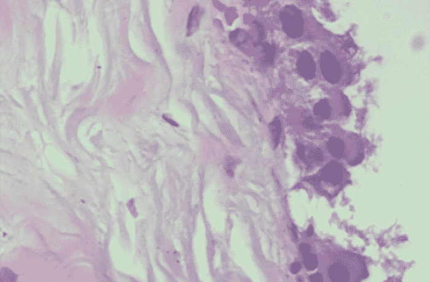
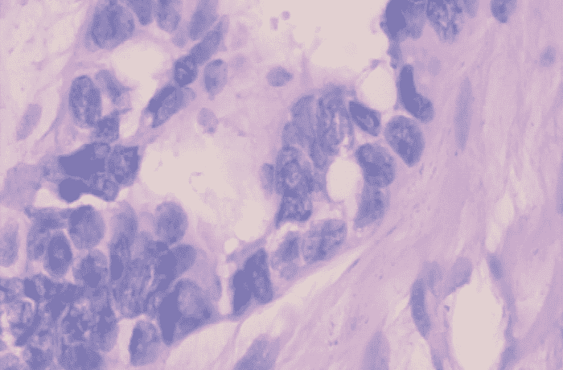
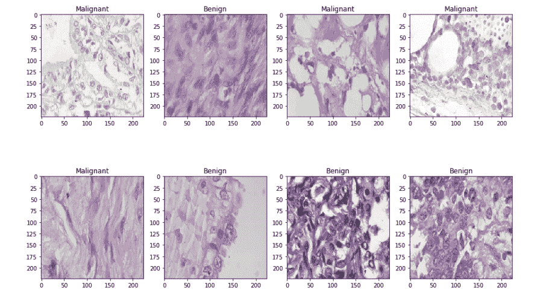
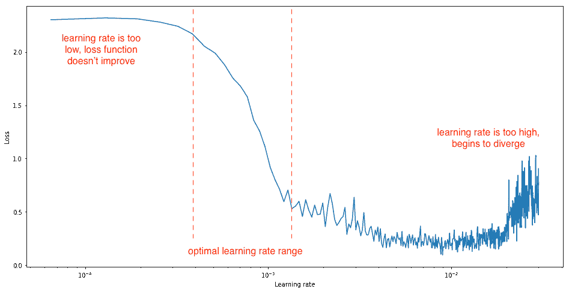
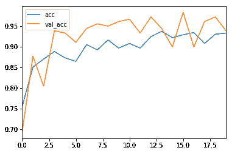
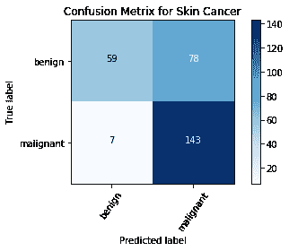
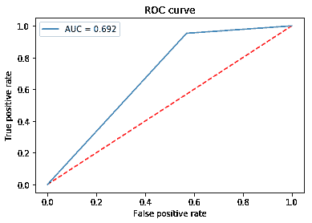

# 乳腺癌分类的卷积神经网络

> 原文：[`www.kdnuggets.com/2019/10/convolutional-neural-network-breast-cancer-classification.html`](https://www.kdnuggets.com/2019/10/convolutional-neural-network-breast-cancer-classification.html)

评论

乳腺癌是全球女性和男性中第二常见的癌症。在 2012 年，它占所有新癌症病例的约 12%，以及所有女性癌症的 25%。

乳腺癌开始于乳房中的细胞失控生长。这些细胞通常形成肿瘤，肿瘤通常可以通过 X 光看到或触摸到。肿瘤是恶性的（癌症），如果细胞能生长到（侵入）周围组织或扩散（转移）到身体的远处区域。

* * *

## 我们的前 3 名课程推荐

 1\. [谷歌网络安全证书](https://www.kdnuggets.com/google-cybersecurity) - 快速进入网络安全职业生涯。

 2\. [谷歌数据分析专业证书](https://www.kdnuggets.com/google-data-analytics) - 提升你的数据分析技能

 3\. [谷歌 IT 支持专业证书](https://www.kdnuggets.com/google-itsupport) - 支持你的组织 IT

* * *

这里是一些快速事实：

+   美国约 1/8 的女性（约 12%）将在其一生中发展为侵袭性乳腺癌。

+   2019 年，预计美国将诊断出 268,600 例侵袭性乳腺癌新病例，以及 62,930 例非侵袭性（原位）乳腺癌新病例。

+   大约 85%的乳腺癌发生在没有乳腺癌家族史的女性身上。这些癌症通常是由于衰老过程和生活中的遗传突变，而不是遗传突变。

+   如果一名女性有一位一度亲属（母亲、姐妹、女儿）被诊断出患有乳腺癌，她患乳腺癌的风险几乎会翻倍。不到 15%的乳腺癌患者有家族成员被诊断为乳腺癌。

### 挑战

构建一个算法，通过观察活检图像自动识别患者是否患有乳腺癌。由于关系到人们的生命，算法必须极其准确。

### 数据

数据集可以从 [这里](https://web.inf.ufpr.br/vri/databases/breast-cancer-histopathological-database-breakhis/) 下载。这是一个二分类问题。我按如下方式拆分数据—

```py
dataset train
  benign
   b1.jpg
   b2.jpg
   //
  malignant
   m1.jpg
   m2.jpg
   //  validation
   benign
    b1.jpg
    b2.jpg
    //
   malignant
    m1.jpg
    m2.jpg
    //...
```

训练文件夹中每个类别有 1000 张图像，而验证文件夹中每个类别有 250 张图像。

  

良性样本  

恶性样本

### 环境和工具

1.  [scikit-learn](https://scikit-learn.org/stable/)

1.  [keras](https://keras.io/)

1.  [numpy](https://www.numpy.org/)

1.  [pandas](https://pandas.pydata.org/)

1.  [matplotlib](https://matplotlib.org/)

### 图像分类

完整的图像分类流程可以形式化为如下：

+   我们的输入是一个训练数据集，包括*N*张图像，每张图像都标记为 2 种不同类别之一。

+   然后，我们使用这个训练集训练一个分类器，让它学习每个类别的样子。

+   最后，我们通过让分类器预测一组从未见过的新图像的标签来评估分类器的质量。然后，我们将这些图像的真实标签与分类器预测的标签进行比较。

### 代码在哪里？

话不多说，我们开始写代码吧。完整的项目可以在 github 上找到 [这里](https://github.com/abhinavsagar/Breast-cancer-classification)。

让我们先加载所有的库和依赖项。

接下来，我将图像加载到相应的文件夹中。

之后，我创建了一个由零组成的 numpy 数组用于标记良性图像，类似地，创建了一个由一组成的 numpy 数组用于标记恶性图像。我还打乱了数据集，并将标签转换为分类格式。

然后，我将数据集拆分为两个部分——训练集和测试集，分别包含 80%和 20%的图像。让我们看看一些示例的良性和恶性图像。



良性样本与恶性样本

我使用了 16 的批量大小。批量大小是深度学习中最重要的超参数之一。我倾向于使用较大的批量大小来训练我的模型，因为它允许通过 GPU 的并行性加速计算。然而，众所周知，过大的批量大小会导致较差的泛化效果。在一个极端的情况下，使用等于整个数据集的批量大小可以保证收敛到目标函数的全局最优解。然而，这会导致较慢的收敛速度。另一方面，使用较小的批量大小已被证明可以更快地收敛到良好的结果。这可以通过以下直观解释：较小的批量大小允许模型在必须查看所有数据之前开始学习。使用较小批量大小的缺点是模型不一定能收敛到全局最优解。因此，通常建议从较小的批量大小开始，利用更快的训练动态，并在训练过程中逐渐增加批量大小。

我还进行了数据增强。数据增强是一种有效的方法，可以增加训练集的规模。增强训练样本可以让网络在训练过程中看到更多的多样化，但仍具有代表性的数据点。

然后，我创建了一个数据生成器，以自动化的方式将数据从我们的文件夹中提取到 Keras 中。Keras 提供了方便的 Python 生成器函数来实现这一目的。

下一步是构建模型。这可以通过以下 3 个步骤描述：

1.  我使用了 DenseNet201 作为预训练权重，它已经在 Imagenet 竞赛中进行了训练。学习率选择为 0.0001。

1.  此外，我使用了全局平均池化层，后面跟着 50% 的 dropout 来减少过拟合。

1.  我使用了批量归一化和一个包含 2 个神经元的全连接层用于 2 个输出类别，即良性和恶性，激活函数为 softmax。

1.  我使用了 Adam 作为优化器，binary-cross-entropy 作为损失函数。

让我们看看每一层的输出形状和涉及的参数。


模型总结

在训练模型之前，定义一个或多个回调是很有用的。比较实用的有：ModelCheckpoint 和 ReduceLROnPlateau。

+   **ModelCheckpoint**：当训练需要很长时间才能取得好结果时，通常需要很多迭代。在这种情况下，最好仅在改进指标的纪元结束时保存表现最佳的模型副本。

+   **ReduceLROnPlateau**：当某项指标停止改善时，减少学习率。模型在学习停滞时通常会受益于将学习率减少 2-10 倍。这个回调监控一个量，如果在‘耐心’数量的纪元内没有看到改进，学习率将被减少。



ReduceLROnPlateau。

我训练了模型 20 个纪元。

### 性能指标

评估模型性能的最常见指标是准确率。然而，当你的数据集中只有 2% 是一个类别（恶性）而 98% 是另一个类别（良性）时，错误分类分数就没有意义了。你可以有 98% 的准确率，但仍然可能抓不到任何恶性病例，这会使模型表现很糟糕。


损失 vs 纪元 

准确率 vs 纪元

### 精确度、召回率和 F1-Score

为了更好地了解错误分类，我们通常使用以下指标来更好地了解真正例（TP）、真正负例（TN）、假正例（FP）和假负例（FN）。

**精确度** 是正确预测的正观察值与总预测正观察值的比率。

**召回率** 是正确预测的正观察值与实际类别中所有观察值的比率。

**F1-Score** 是精确度和召回率的加权平均值。


F1-Score 越高，模型越好。对于这三个指标，0 是最差的，而 1 是最好的。

### 混淆矩阵

混淆矩阵是分析分类错误时非常重要的指标。矩阵的每一行代表预测类别中的实例，每一列代表实际类别中的实例。对角线表示已正确分类的类别。这有助于我们不仅知道哪些类别被误分类，还知道它们被误分类为何种类别。



混淆矩阵

### ROC 曲线

45 度线是随机线，其下的曲线面积（AUC）为 0.5。曲线距离这条线越远，AUC 越高，模型越好。模型的最高 AUC 为 1，此时曲线形成一个直角三角形。ROC 曲线还可以帮助调试模型。例如，如果曲线的左下角更接近随机线，则表明模型在 Y=0 时分类错误。而如果在右上角随机，则表明错误发生在 Y=1。



ROC-AUC 曲线

### 结果


最终结果

### 结论

尽管这个项目还远未完成，但看到深度学习在如此多样的现实问题中的成功是值得注意的。在这篇博客中，我展示了如何使用卷积神经网络和转移学习对一组显微镜图像进行良恶性乳腺癌分类。

### 参考文献/进一步阅读

[**Keras 中的图像分类转移学习**](https://towardsdatascience.com/transfer-learning-for-image-classification-in-keras-5585d3ddf54e?source=post_page-----52f1213dcc9----------------------)

转移学习一站式指南

[**在 Keras 中使用卷积神经网络（CNN）预测侵袭性导管癌**](https://towardsdatascience.com/predicting-invasive-ductal-carcinoma-using-convolutional-neural-network-cnn-in-keras-debb429de9a6?source=post_page-----52f1213dcc9----------------------)

使用卷积神经网络对组织病理切片进行良恶性分类

[**使用卷积神经网络进行乳腺癌组织病理图像分类**](https://journals.plos.org/plosone/article?id=10.1371%2Fjournal.pone.0214587&source=post_page-----52f1213dcc9----------------------)

尽管从组织病理图像中成功检测恶性肿瘤在很大程度上依赖于长期的...

[**使用较少数据进行图像分类的深度学习**](https://becominghuman.ai/deep-learning-for-image-classification-with-less-data-90e5df0a7b8e?source=post_page-----52f1213dcc9----------------------)

深度学习确实可以在数据较少的情况下实现

### 离开前

对应的源代码可以在这里找到。

[**abhinavsagar/乳腺癌分类**](https://github.com/abhinavsagar/Breast-cancer-classification?source=post_page-----52f1213dcc9----------------------)

使用卷积神经网络的良性与恶性分类器 数据集可以从这里下载。 pip install…

### 联系方式

如果你想了解我最新的文章和项目，请[关注我在 Medium 的账号](https://medium.com/@abhinav.sagar)。这些是我的一些联系信息：

+   [个人网站](https://abhinavsagar.github.io/)

+   [Linkedin](https://in.linkedin.com/in/abhinavsagar4)

+   [Medium 个人资料](https://medium.com/@abhinav.sagar)

+   [GitHub](https://github.com/abhinavsagar)

+   [Kaggle](https://www.kaggle.com/abhinavsagar)

祝阅读愉快，学习愉快，编码愉快！

**个人简介：[Abhinav Sagar](https://www.linkedin.com/in/abhinavsagar4)** 是 VIT Vellore 的大四本科生。他对数据科学、机器学习及其在现实世界问题中的应用感兴趣。

[原文](https://towardsdatascience.com/convolutional-neural-network-for-breast-cancer-classification-52f1213dcc9)。经许可转载。

**相关：**

+   使用深度学习检测乳腺癌

+   如何轻松使用 Flask 部署机器学习模型

+   使用机器学习理解癌症

### 更多相关话题

+   [使用卷积神经网络（CNNs）的图像分类](https://www.kdnuggets.com/2022/05/image-classification-convolutional-neural-networks-cnns.html)

+   [使用 PyTorch 构建卷积神经网络](https://www.kdnuggets.com/building-a-convolutional-neural-network-with-pytorch)

+   [卷积神经网络全面指南](https://www.kdnuggets.com/2023/06/comprehensive-guide-convolutional-neural-networks.html)

+   [通过构建 15 个神经网络项目在 2022 年学习深度学习](https://www.kdnuggets.com/2022/01/15-neural-network-projects-build-2022.html)

+   [使用 AIMET 优化神经网络](https://www.kdnuggets.com/2022/04/qualcomm-neural-network-optimization-aimet.html)

+   [使用 TensorFlow 和 Keras 构建并训练您的第一个神经网络](https://www.kdnuggets.com/2023/05/building-training-first-neural-network-tensorflow-keras.html)
