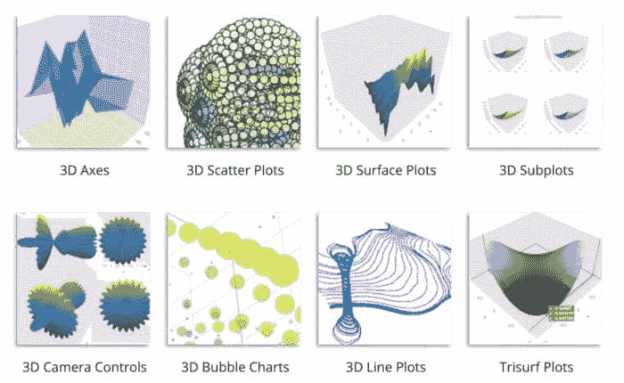

# 如何创建一个交互式 3D 图表并轻松与任何人分享

> 原文：[`www.kdnuggets.com/2021/06/create-interactive-3d-chart-share.html`](https://www.kdnuggets.com/2021/06/create-interactive-3d-chart-share.html)

评论

**由 [Olga Chernytska](https://www.linkedin.com/in/olga-chernytska-122700102/)，高级机器学习工程师**

3D 图表有一个巨大的缺点。当创建一个 3D 图表时，你可以从不同的角度/尺度可视化数据，或者使用一个交互式库，这样你可以很好地理解数据。然而，这些图表在创建后很难分享。

人们通常将 3D 图表转换为单一的静态图像或一组从不同角度和不同尺度拍摄的图像。这种方法可能会丢失一些重要信息或难以理解，因此我们需要一个更好的选择。这个选择确实存在。

在这个简短的教程中，我将向你展示如何创建一个交互式 3D 图表并轻松与任何人分享——无论是数据科学家、开发人员、经理，还是没有任何编程环境的非技术朋友。共享的图表也将完全互动。

### 工作原理

你可能听说过 [`plotly`](https://plotly.com/python/getting-started/)，这是一个开源库，允许在 Jupyter Notebooks 中创建交互式图表。我使用过这个库，并且也将图表作为静态图像分享，直到我的同事向我展示了 `plotly` 的一个很棒的功能：

你可以将交互式图表保存为 HTML 文件——当在浏览器中打开时，它们是完全互动的。

### 演示

让我们创建一个简单的 3D 函数可视化——抛物线。首先，我们使用 `numpy.meshgrid` 在网格 (x,y) 上计算函数值。然后我们使用 `plotly` 绘制表面并将其保存为 HTML 文件。以下是相关代码（基于 [文档](https://plotly.com/python/interactive-html-export/)）。

```py
import numpy as np
import plotly.graph_objects as go

def parabola_3d(x, y):
    z = x ** 2 + y ** 2
    return z

x = np.linspace(-1, 1, 50)
y = np.linspace(-1, 1, 50)
xv, yv = np.meshgrid(x, y)
z = parabola_3d(xv, yv)

fig = go.Figure(data=[go.Surface(z=z, x=x, y=y)])
fig.write_html("file.html")
```

结果如下所示。这个 HTML 文件可以在任何浏览器中打开、嵌入到网站上，并通过消息传递工具发送。最好的地方是打开这个文件时，不需要 Jupyter Notebook 或 `plotly` 库。

图像 1\. 在浏览器中打开时 HTML 文件的样子。

[下载这个 HTML 文件并自己试试](https://notrocketscience.blog/wp-content/uploads/2021/06/file-1.html)。

### 安装和更多

我记得 `plotly` 曾是一个过于复杂且功能非常有限的库，但在最近几年它变得非常酷。例如，现在有 13 种 3D 图表类型可用，还有数十种地图、统计、科学和金融的 2D 图表。

图像 2\. plotly 中可用的 3D 图表示例。 [来源](https://plotly.com/python/3d-charts/)

如果您感兴趣并想尝试 `plotly`，这里有 [文档](https://plotly.com/python/getting-started/) 介绍如何安装它并构建您的第一个图表。绝对值得尝试！

**简介：[Olga Chernytska](https://www.linkedin.com/in/olga-chernytska-122700102/)** 是一家大型东欧外包公司的高级机器学习工程师；参与了多个顶级美国、欧洲和亚洲公司的数据科学项目；主要专注领域和兴趣是深度计算机视觉。

[原文](https://notrocketscience.blog/how-to-create-an-interactive-3d-chart-and-share-it-easily-with-anyone/)。经许可转载。

**相关：**

+   唯一真正需要的 Jupyter Notebook 扩展

+   直接使用 Pandas 获取交互式图表

+   数据讲述：大脑擅长视觉，但心灵被故事打动

* * *

## 我们的前 3 个课程推荐

 1\. [谷歌网络安全证书](https://www.kdnuggets.com/google-cybersecurity) - 快速进入网络安全职业生涯。

 2\. [谷歌数据分析专业证书](https://www.kdnuggets.com/google-data-analytics) - 提升您的数据分析技能

 3\. [谷歌 IT 支持专业证书](https://www.kdnuggets.com/google-itsupport) - 支持您的组织 IT

* * *

### 相关主题

+   [以无编码方式轻松从网站抓取图像](https://www.kdnuggets.com/2022/06/octoparse-scrape-images-easily-websites-nocoding-way.html)

+   [使用 openplayground 在您的笔记本电脑上轻松探索 LLM](https://www.kdnuggets.com/2023/04/explore-llms-easily-laptop-openplayground.html)

+   [轻松将 LLM 集成到您的 Scikit-learn 工作流中，与 Scikit-LLM](https://www.kdnuggets.com/easily-integrate-llms-into-your-scikit-learn-workflow-with-scikit-llm)

+   [使用 Pandas 创建美丽的交互式可视化的最简单方法](https://www.kdnuggets.com/2021/12/easiest-way-make-beautiful-interactive-visualizations-pandas.html)

+   [使用 Python 和 Dash 创建仪表板](https://www.kdnuggets.com/2023/08/create-dashboard-python-dash.html)

+   [如何为您的数据项目创建抽样计划](https://www.kdnuggets.com/2022/11/create-sampling-plan-data-project.html)
