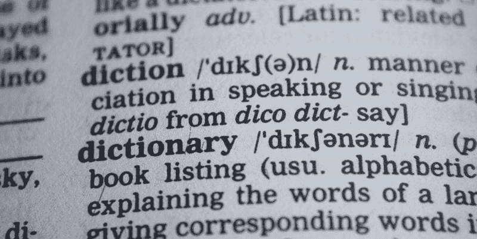

# 如何在 Python 中为 NLP 任务创建词汇表

> 原文：[`www.kdnuggets.com/2019/11/create-vocabulary-nlp-tasks-python.html`](https://www.kdnuggets.com/2019/11/create-vocabulary-nlp-tasks-python.html)

评论

在执行一个 自然语言处理任务 时，我们的文本数据转换大致按照以下方式进行：

* * *

## 我们的前三个课程推荐

 1\. [Google 网络安全证书](https://www.kdnuggets.com/google-cybersecurity) - 加速你的网络安全职业生涯

 2\. [Google 数据分析专业证书](https://www.kdnuggets.com/google-data-analytics) - 提升你的数据分析技能

 3\. [Google IT 支持专业证书](https://www.kdnuggets.com/google-itsupport) - 支持你的组织的 IT 工作

* * *

**原始文本语料库 → 处理后的文本 → 分词文本 → 语料库词汇表 → 文本表示**

请记住，这一切都发生在实际的 NLP 任务开始之前。

语料库词汇表是处理文本的储存区域，在其被转化为某种 表示形式 用于 即将到来的任务 之前，无论是分类，语言建模，还是其他任务。

词汇表有几个主要目的：

+   帮助预处理语料库文本

+   作为处理文本语料库在内存中的存储位置

+   收集并存储语料库的元数据

+   允许进行任务前的数据清理、探索和实验

词汇表有几个相关的目的，可以从几个不同的角度来理解，但主要的要点是，一旦语料库进入词汇表，文本就已经被处理，所有相关的元数据应当被收集和存储。

本文将逐步介绍一个有用的词汇表类的 Python 实现，展示代码中发生的事情，我们为什么这样做，以及一些示例用法。我们将从 [这个 PyTorch 教程](https://pytorch.org/tutorials/beginner/chatbot_tutorial.html) 开始，并在过程中进行一些修改。虽然这不会太依赖编程，但如果你对 Python 面向对象编程完全陌生， [我建议你先查看这里](https://realpython.com/python3-object-oriented-programming/)。

首先要做的是为句子开始、句子结束和句子填充的特殊标记创建值。当我们对文本进行分词（将文本拆分成其原子组成部分）时，我们需要特殊标记来划分句子的开始和结束，并在句子短于最大允许空间时填充句子（或其他文本块）的存储结构。稍后会详细介绍。

```py
PAD_token = 0   # Used for padding short sentences
SOS_token = 1   # Start-of-sentence token
EOS_token = 2   # End-of-sentence token
```

上述内容表示，我们的句子开始标记（字面上是‘SOS’）在我们创建标记查找表时将占据索引位置‘1’。同样，句子结束标记（‘EOS’）将占据索引位置‘2’，而句子填充标记（‘PAD’）将占据索引位置‘0’。

接下来我们将为我们的词汇表类创建一个构造函数：

```py
def __init__(self, name):
  self.name = name
  self.word2index = {}
  self.word2count = {}
  self.index2word = {PAD_token: "PAD", SOS_token: "SOS", EOS_token: "EOS"}
  self.num_words = 3
  self.num_sentences = 0
  self.longest_sentence = 0
```

第一行是我们的`__init__()`声明，它要求`self`作为第一个参数（如[查看此链接](https://realpython.com/python3-object-oriented-programming/)），并将一个词汇表的'name'作为第二个参数。

逐行来看，这些对象变量初始化的作用

+   `self.name = name` → 这将被实例化为传递给构造函数的名称，用于引用我们的词汇表对象

+   `self.word2index = {}` → 一个字典，用于保存词标记到相应词索引值，最终形式类似于`'the': 7`

+   `self.word2count = {}` → 一个字典，用于保存语料库中每个词的计数（实际上是标记）

+   `self.index2word = {PAD_token: "PAD", SOS_token: "SOS", EOS_token: "EOS"}` → 一个字典，保存了`word2index`的反向映射（词索引键到词标记值）；特殊标记立即添加

+   `self.num_words = 3` → 这将是语料库中词语的数量（实际上是标记）

+   `self.num_sentences = 0` → 这将是语料库中句子的数量（实际上是任何长度的文本块）

+   `self.longest_sentence = 0` → 这将是最长语料库句子的长度，以标记数量为单位

从上述内容，你应该能够看到我们目前关注的语料库元数据。尝试考虑一些你可能想要跟踪的额外语料库相关数据，这些数据我们尚未涉及。

既然我们已经定义了我们感兴趣的元数据，我们可以继续进行相关工作。填充词汇表的基本工作单元是向其中添加词语。

```py
def add_word(self, word):
  if word not in self.word2index:
    # First entry of word into vocabulary
    self.word2index[word] = self.num_words
    self.word2count[word] = 1
    self.index2word[self.num_words] = word
    self.num_words += 1
  else:
    # Word exists; increase word count
    self.word2count[word] += 1
```

如你所见，在尝试将一个单词标记添加到词汇表时，我们可能会遇到 2 种情况：要么该单词在词汇表中不存在（`if word not in self.word2index:`），要么存在（`else:`）。如果单词在词汇表中不存在，我们要将其添加到`word2index`字典中，将该单词的计数初始化为 1，将单词的索引（计数器中的下一个可用数字）添加到`index2word`字典中，并将总单词计数增加 1。另一方面，如果单词已经存在于词汇表中，则只需将该单词的计数器增加 1。

我们将如何将单词添加到词汇表中？我们将通过输入句子并进行分词处理来完成这项工作，逐一处理生成的标记。请再次注意，这些不一定是句子，命名这两个函数为`add_token`和`add_chunk`可能比`add_word`和`add_sentence`更为合适。我们将把重命名的工作留到另一天。

```py
def add_sentence(self, sentence):
  sentence_len = 0
  for word in sentence.split(' '):
    sentence_len += 1
    self.add_word(word)
  if sentence_len > self.longest_sentence:
    # This is the longest sentence
    self.longest_sentence = sentence_len
  # Count the number of sentences
  self.num_sentences += 1
```

这个函数接收一段文本，一个单一的字符串，并通过空白字符进行分割，以实现分词。这不是一种稳健的分词方法，也不是最佳实践，但目前足以满足我们的需求。我们将在后续文章中重新审视这个问题，并在我们的词汇类中构建更好的分词方法。在此期间，你可以在这里和这里了解更多关于文本数据预处理的内容。

在通过空白字符分割句子后，我们将句子长度计数器为每个传递给`add_word`函数处理并添加到词汇表中的单词增加 1（见上文）。然后我们检查该句子是否比我们处理过的其他句子更长；如果是，我们做个记录。我们还增加了到目前为止我们已经添加到词汇表中的语料库句子的计数。

然后我们将添加一对辅助函数，以便更容易访问我们两个最重要的查找表：

```py
def to_word(self, index):
  return self.index2word[index]

def to_index(self, word):
  return self.word2index[word]
```

这两个函数中的第一个在适当的字典中根据给定的索引执行词到索引的查找；另一个函数则执行反向查找。这是基本功能，因为一旦我们将处理过的文本放入词汇表对象中，我们将希望在某个时候将其取出，并执行查找和引用元数据。这两个函数在这方面非常有用。

把这些内容综合在一起，我们得到以下结果。

让我们看看效果如何。首先，让我们创建一个空的词汇表对象：

```py
voc = Vocabulary('test')
print(voc)
```

<__main__.Vocabulary object at 0x7f80a071c470>

然后我们创建一个简单的语料库：

```py
corpus = ['This is the first sentence.',
          'This is the second.',
          'There is no sentence in this corpus longer than this one.',
          'My dog is named Patrick.']
print(corpus)
```

```py
['This is the first sentence.',
 'This is the second.',
 'There is no sentence in this corpus longer than this one.',
 'My dog is named Patrick.']
```

让我们遍历语料库中的句子，并将每个句子中的单词添加到我们的词汇表中。请记住，`add_sentence`会调用`add_word`：

```py
for sent in corpus:
  voc.add_sentence(sent)
```

现在让我们测试一下我们所做的工作：

```py
print('Token 4 corresponds to token:', voc.to_word(4))
print('Token "this" corresponds to index:', voc.to_index('this'))
```

这是输出结果，似乎效果不错。

```py
Token 4 corresponds to token: is
Token "this" corresponds to index: 13
```

由于我们的语料库非常小，让我们打印出整个词汇表。注意，由于我们尚未实施任何有用的分词，只是基于空格分割，我们有一些标记以大写字母开头，还有一些带有尾随标点符号。我们将在后续中更恰当地处理这些问题。

```py
for word in range(voc.num_words):
    print(voc.to_word(word))
```

```py
PAD
SOS
EOS
This
is
the
first
sentence.
second.
There
no
sentence
in
this
corpus
longer
than
one.
My
dog
named
Patrick.
```

让我们创建并打印出特定句子的对应标记和索引。注意这次我们尚未修剪词汇表，也没有添加填充或使用 SOS 或 EOS 标记。我们将这些添加到下次需要处理的项目清单中。

```py
sent_tkns = []
sent_idxs = []
for word in corpus[3].split(' '):
  sent_tkns.append(word)
  sent_idxs.append(voc.to_index(word))
print(sent_tkns)
print(sent_idxs)
```

```py
['My', 'dog', 'is', 'named', 'Patrick.']
[18, 19, 4, 20, 21]
```

就这样。即便我们有诸多显著的不足，但我们似乎仍拥有一套可能最终会有用的词汇表，因为它展示了许多核心的必要功能，这些功能将使其最终变得有用。

我们必须在下次处理的项目包括：

+   对我们的文本数据进行规范化（强制全部小写，处理标点符号等）

+   正确地对文本块进行分词

+   使用 SOS、EOS 和 PAD 标记

+   修剪我们的词汇表（在词汇表中永久存储之前的最小标记出现次数）

下次我们将实现此功能，并在更强大的语料库上测试我们的 Python 词汇表实现。然后，我们将把数据从词汇对象中转移到适用于 NLP 任务的有用数据表示中。最后，我们将对我们精心准备的数据执行 NLP 任务。

**相关**：

+   自然语言处理任务的数据表示

+   自然语言处理任务的主要方法

+   处理文本数据科学任务的框架

### 更多相关内容

+   [在 Pandas 中清理和预处理 NLP 任务的文本数据](https://www.kdnuggets.com/cleaning-and-preprocessing-text-data-in-pandas-for-nlp-tasks)

+   [使用 Python 自动化的 5 个任务](https://www.kdnuggets.com/2021/06/5-tasks-automate-python.html)

+   [自然语言处理任务的数据表示](https://www.kdnuggets.com/2018/11/data-representation-natural-language-processing.html)

+   [HuggingGPT：解决复杂 AI 任务的秘密武器](https://www.kdnuggets.com/2023/05/hugginggpt-secret-weapon-solve-complex-ai-tasks.html)

+   [ChatGPT 无法完成的 5 个编码任务](https://www.kdnuggets.com/5-coding-tasks-chatgpt-cant-do)

+   [使用 Python 和 Dash 创建仪表盘](https://www.kdnuggets.com/2023/08/create-dashboard-python-dash.html)
