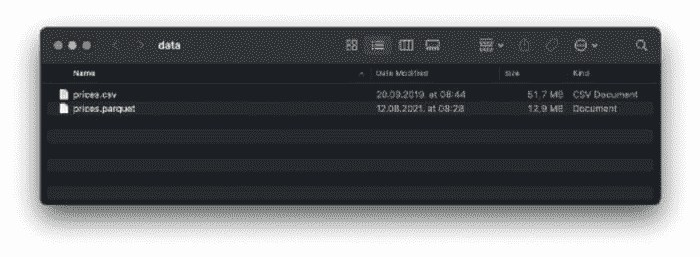

# CSV 文件用于存储？不，谢谢。有更好的选择。

> 原文：[`www.kdnuggets.com/2021/08/csv-files-storage-better-option.html`](https://www.kdnuggets.com/2021/08/csv-files-storage-better-option.html)

评论

**由 [Dario Radečić](https://www.linkedin.com/in/darioradecic/)，NEOS 顾问**


由 [David Emrich](https://unsplash.com/@davidemrich?utm_source=unsplash&utm_medium=referral&utm_content=creditCopyText) 提供的照片，来源于 [Unsplash](https://unsplash.com/?utm_source=unsplash&utm_medium=referral&utm_content=creditCopyText)

每个人和他们的祖母都知道什么是 CSV 文件。而 Parquet 却不那么为人所知。*它是一种地板类型吗？* 嗯，是的，但也不是——它是一种高效的数据存储格式，你今天将了解所有相关信息。

CSV 随处可见——从公司报告到机器学习数据集。这是一种简单直观的数据格式——只需打开一个文件，你就可以直接访问数据。实际情况并不像听起来那么好，原因稍后你将会了解到。

有许多 CSV 的替代方案——如 Excel、SQLite 数据库和 HDF——但其中一个特别突出。那就是 Parquet。

今天的文章回答了以下问题：

+   CSV 有什么问题？

+   什么是 Parquet 数据格式？

+   CSV 还是 Parquet？你应该使用哪一个？

## CSV 有什么问题？

我喜欢 CSV 文件，你也可能喜欢。几乎任何软件都可以生成 CSV 文件，甚至是普通的文本编辑器。如果你对数据科学和机器学习感兴趣，只需访问 [Kaggle.com](https://www.kaggle.com/)——几乎所有的表格数据集都是这种格式。

CSV 是按行组织的，这意味着它们查询速度慢且难以高效存储。Parquet 则不是这样，它是一种按列组织的存储选项。对于相同的数据集，这两者之间的大小差异巨大，稍后你将看到。

加重伤害的是，任何人都可以打开和修改 CSV 文件。这就是为什么你绝不应该将这种格式用作数据库的原因。有更安全的替代方案。

但让我们专注于对公司真正重要的——**时间**和**金钱**。你可能会将数据存储在云中，无论是作为网络应用还是机器学习模型的基础。云服务提供商会根据扫描的数据量或存储的数据量来收费。这两者对 CSV 来说都不是好消息。

首先让我们看看亚马逊 S3 的存储定价。这些数字来自 [这里](https://blog.openbridge.com/how-to-be-a-hero-with-powerful-parquet-google-and-amazon-f2ae0f35ee04):


图片 1 — 亚马逊 S3 不同数据格式的存储定价（作者提供的图片）

哎呀。Parquet 文件比 CSV 文件占用的磁盘空间要少得多（*在 Amazon S3 上的大小*），扫描速度也更快（*扫描的数据*）。因此，相同的数据集存储在 Parquet 格式中便宜了 16 倍！

接下来，让我们看看 Apache Parquet 的速度提升：


图片 2 — 不同数据格式的 Amazon S3 存储和查询价格比较（图片由作者提供）

再次强调——哇！如果你的原始 CSV 文件大小为 1TB，Parquet 将便宜 99.7%。

所以，当你的数据量很大时，CSV 绝对不是一个好的选择——无论是从时间还是成本的角度来看。

## 那么，Parquet 数据格式到底是什么？

它是一种用于存储数据的替代格式。它是开源的，并且遵循 Apache 许可协议。

CSV 和 Parquet 格式都用于存储数据，但它们的内部结构截然不同。CSV 是你所谓的 *行存储*，而 Parquet 文件将数据按列组织。

这意味着什么呢？假设你有以下数据：


图片 3 — 示例表数据（图片由作者提供）

这就是前一个表格在行存储和列存储中的组织方式：


图片 4 — 行存储 vs. 列存储（图片由作者提供）

简而言之，列存储文件更轻量，因为可以对每一列进行充分的压缩。与此不同的是，行存储通常包含多种数据类型。

Apache Parquet 旨在提高效率。列存储架构就是原因，它允许你快速跳过不相关的数据。这样查询和聚合都更快，从而节省硬件成本（换句话说，更便宜）。

简而言之，Parquet 是一种更高效的大文件数据格式。使用 Parquet 而非 CSV，你将节省时间和金钱。

如果你是 Python 爱好者，使用 Pandas 处理 CSV 文件应该很熟悉。接下来我们来看一下库如何处理 Parquet 文件。

## 实操 CSV 和 Parquet 比较

你将使用 [NYSE 股票价格数据集](https://www.kaggle.com/dgawlik/nyse?select=prices.csv) 来进行这一实操部分。CSV 文件大小约为 50MB——并不大——但你会看到 Parquet 能节省多少磁盘空间。

首先，用 Python 的 Pandas 加载 CSV 文件：

```py
import pandas as pddf = pd.read_csv('data/prices.csv')
df.head()
```

这就是它的样子：


图片 5 — NYSE 股票价格数据集的前几行 — CSV（图片由作者提供）

你需要使用 `to_parquet()` 函数来保存数据集。它的工作方式与 `to_csv()` 大致相同，因此使用起来不会有什么不同：

```py
df.to_parquet('data/prices.parquet')
```

数据集现在已保存。让我们看看如何在比较文件大小之前加载它。Pandas 提供了 `read_parquet()` 函数来读取 Parquet 数据文件：

```py
df_parquet = pd.read_parquet('data/prices.parquet')
df_parquet.head()
```

这就是数据集的样子：


图片 6 — NYSE 股票价格数据集的前几行 — Parquet（图片由作者提供）

两个数据集是完全相同的。命令 `df.equals(df_parquet)` 将在控制台上打印 `True`，所以可以用它来验证。

那么，文件大小是否有所减少？嗯，是的：



图 7 — NYSE 股票价格数据集中的 CSV 与 Parquet 文件大小对比（图像由作者提供）

这大约是磁盘空间使用量的四分之一。

*对于 50MB 数据集这是否重要？* 可能不重要，但在更大的数据集上，节省的空间也会增加。如果你将数据存储在云端并支付整体存储费用，这一点尤其重要。

这是一个值得考虑的问题。

*喜欢这篇文章吗？成为 *[*Medium 会员*](https://medium.com/@radecicdario/membership)* 继续无限制地学习。如果你使用以下链接注册会员，我将获得部分会员费用，但对你没有额外费用: *[*https://medium.com/@radecicdario/membership*](https://medium.com/@radecicdario/membership)

## 保持联系

+   在 [Medium](https://medium.com/@radecicdario) 上关注我，获取更多类似的故事

+   注册我的 [新闻通讯](https://mailchi.mp/46a3d2989d9b/bdssubscribe)

+   在 [LinkedIn](https://www.linkedin.com/in/darioradecic/) 上联系我

**简介: [Dario Radečić](https://www.linkedin.com/in/darioradecic/)** 是 NEOS 的顾问。

[原文](https://towardsdatascience.com/csv-files-for-storage-no-thanks-theres-a-better-option-72c78a414d1d)。经许可转载。

**相关:**

+   5 个 Python 数据处理技巧与代码片段

+   如何查询你的 Pandas 数据框

+   Pandas 不够用？这里有一些处理更大、更快数据的 Python 替代方案

* * *

## 我们的 3 个最佳课程推荐

 1\. [Google 网络安全证书](https://www.kdnuggets.com/google-cybersecurity) - 快速进入网络安全职业生涯。

 2\. [Google 数据分析专业证书](https://www.kdnuggets.com/google-data-analytics) - 提升你的数据分析技能

 3\. [Google IT 支持专业证书](https://www.kdnuggets.com/google-itsupport) - 支持你的组织 IT

* * *

### 更多相关话题

+   [3 种在 Python 中处理 CSV 文件的方法](https://www.kdnuggets.com/2022/10/3-ways-process-csv-files-python.html)

+   [来回… RAPIDS 之旅](https://www.kdnuggets.com/2023/06/back-again-rapids-tale.html)

+   [有没有办法弥合 MLOps 工具的差距？](https://www.kdnuggets.com/2022/08/way-bridge-mlops-tools-gap.html)

+   [从 CSV 到使用 ChatGPT 完成的完整分析报告：5 个简单步骤](https://www.kdnuggets.com/from-csv-to-complete-analytical-report-with-chatgpt-in-5-simple-steps)

+   [从 Oracle 到 AI 数据库：数据存储的演变](https://www.kdnuggets.com/2022/02/oracle-databases-ai-evolution-data-storage.html)

+   [云存储采用是当前企业的迫切需求](https://www.kdnuggets.com/2022/02/cloud-storage-adoption-need-hour-business.html)
