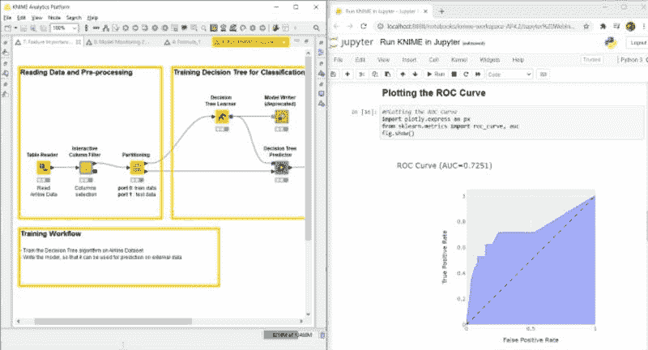
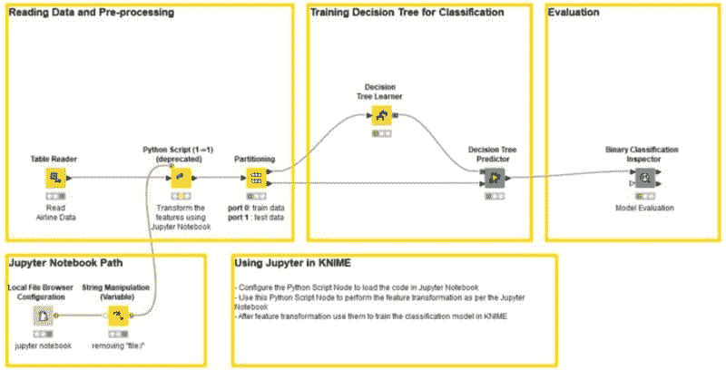
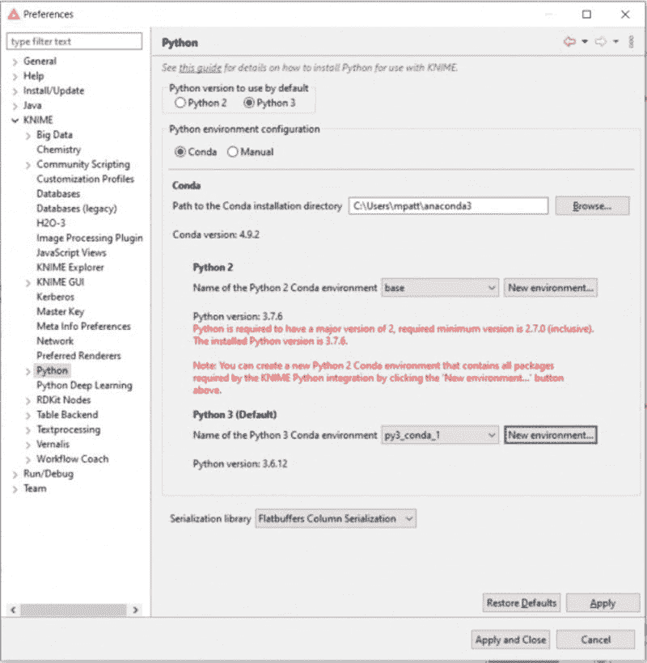
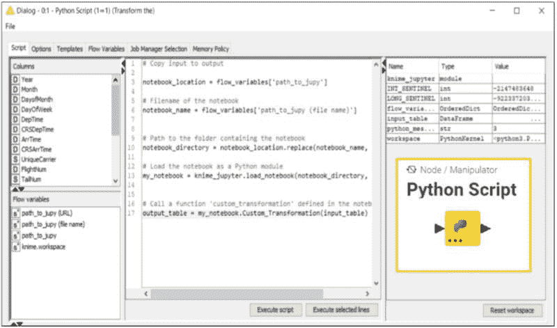
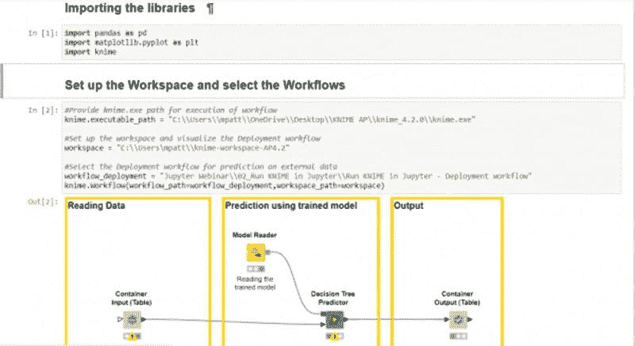

# 通过集成 Jupyter 和 KNIME 来缩短实施时间

> 原文：[`www.kdnuggets.com/2021/12/cutting-implementation-time-integrating-jupyter-knime.html`](https://www.kdnuggets.com/2021/12/cutting-implementation-time-integrating-jupyter-knime.html)

**由 [Mahantesh Pattadkal](https://medium.com/@mpattadkal)，KNIME 的数据科学家**

数据科学家以在 3I 结构中创建自己的泡沫而闻名——实施、集成和创新。我个人倾向于最后两个 I：集成新技术以进行持续实验和创新以获得显著成果。

* * *

## 我们的三大课程推荐

 1\. [Google 网络安全证书](https://www.kdnuggets.com/google-cybersecurity) - 快速进入网络安全职业的快车道。

 2\. [Google 数据分析专业证书](https://www.kdnuggets.com/google-data-analytics) - 提升您的数据分析能力

 3\. [Google IT 支持专业证书](https://www.kdnuggets.com/google-itsupport) - 支持您的组织进行 IT 工作

* * *

我已经使用 Jupyter Notebook 工作了 4-5 年，并且对它非常熟悉。另一方面，我与我的队友 Paolo 分享了很多工作项目，他是构建 KNIME 工作流的专家。你可能会认为这会是个问题……其实不是！

[KNIME Analytics 平台](https://www.knime.com/knime-analytics-platform) 和 [Jupyter Notebook](https://jupyter.org/) 都以其解决数据分析问题的视觉吸引力而著称（图 1）。Jupyter Notebook 通过网页浏览器提供了一个简化的脚本接口，支持 40 多种编程语言，但它最终仍然是一个主要受 Python 用户欢迎的编码平台。KNIME Analytics 平台完全在图形用户界面上运行，通过拖放操作和[可视化编程](https://en.wikipedia.org/wiki/Visual_programming_language)进行控制。它通过以可视化和透明的工作流表示复杂的数据分析，提供了对逻辑和结构的快速理解。您还可以在 KNIME Analytics 平台中编写 Python 代码片段；Jupyter Notebook 用户体验简化了代码的输入和执行，结果是一个优化的编码人员 UI。现在，想象一下这两个平台的协同作用可以构建出无数可能的应用。

在这篇文章中，我们讨论了两个常见的生活场景，这些场景需要 Jupyter Notebook 与 KNIME Analytics 平台的协作，并展示了这种协作的简单性。

## Jupyter Notebook 与 KNIME Analytics 平台的协作

在本节中，我们描述了两个场景以及如何：

+   在 KNIME 工作流中集成 Jupyter Notebook（场景 1）

+   将 KNIME 工作流集成到 Jupyter 代码中（场景 2）

在**场景 1**中，我的队友[Paolo](https://www.linkedin.com/in/paolo-tamagnini/)负责项目，并在时间压力下请求我帮助实施自定义数据转换，我在 Jupyter Notebook 中完成了这项工作。在这里，我将展示 Paolo 如何将我的 Jupyter 脚本集成到他的 KNIME 工作流中。

在**场景 2**中，我负责项目，仍然受到时间压力的影响，向 Paolo 请求帮助构建一个训练分类模型的工作流，他在 KNIME Analytics Platform 中提供了这个工作流。这里我将展示我如何将 Paolo 的工作流集成到我的 Jupyter Notebook 的 Python 脚本中。



图 1：这里展示了两个数据科学工具的用户界面：左侧是[KNIME Analytics Platform](https://www.knime.com/knime-analytics-platform)，右侧是[Jupyter Notebook](https://jupyter.org/)。

## 在 KNIME 工作流中集成 Jupyter Notebook — 场景 1

*利用机器学习进行航班延误预测*

Paolo 被要求根据起飞延误对航班进行分类，数据集为[Airline dataset](http://stat-computing.org/dataexpo/2009/the-data.html)。航班延误数据集中的每一行描述了一个航班，包括其出发地、目的地、计划起飞时间等。任何起飞延误超过 15 分钟的航班都被标记为“延误”。请求的任务是训练一个机器学习模型，分类一个航班是否会在起飞时延误，考虑所有其他合适的航班属性作为输入特征。

构建一个训练和评估机器学习模型的工作流的步骤通常是相同的：导入数据，转换和清洗数据，将其分为训练集和测试集，在训练集上训练选择的机器学习 (ML) 模型，将训练好的模型应用于测试集，并使用选择的评分指标对其性能进行评分。 [Run Jupyter in KNIME](https://kni.me/w/6rzm1Wn3Zsr4NO7-) 工作流将会大致类似于图 2（你可以从[KNIME Hub](https://hub.knime.com/)下载）。



图 2\. [Run Jupyter in KNIME](https://kni.me/w/6rzm1Wn3Zsr4NO7-) 训练工作流，用于训练和评估 ML 模型以预测航班的起飞延误。

数据清洗和数据转换部分通常非常耗时，因为这也取决于数据领域。Paolo 被时间压力所迫，问我是否可以实现这一部分。

对我来说，使用 Jupyter Notebook 来做这件事似乎很简单。然后，Paolo 可以通过 Python Script 节点将其导入他的工作流。我们一步一步来看这个过程。

+   步骤 1\. 在 Jupyter Notebook 中编写 Python 代码。

+   步骤 2\. 在 KNIME Analytics Platform 中设置 Python 环境

+   步骤 3\. 执行 KNIME 工作流中的 Jupyter Notebook 代码。

## 步骤 1. 在 Jupyter Notebook 中编写 Python 代码

我在 Jupyter Notebook（图 3）中创建了一个名为 *Custom_Transformation* 的 Python 函数。该函数实现了一些基本的特征工程，并返回了包括转换特征在内的原始特征集。


图 3. 用于特征转换的 Python 函数。

现在，我们需要将此代码导入到 Paolo 的 KNIME 工作流中。

## **步骤 2**. **在 KNIME Analytics Platform 中设置 Python 环境**

+   在 KNIME Analytics Platform 中，点击 *文件* → *偏好设置* → *KNIME* → *Python*

+   在 Python 偏好设置页面（图 4a），创建一个新的 Conda 环境

+   根据系统上安装的 Python 版本，点击 *新环境* 来选择 Python 2 或 Python 3。

+   *新 Conda 环境* 对话框打开（图 4b）。现在你需要：

+   在黄色高亮显示的字段中输入环境名称

+   点击 *创建新环境*

+   环境创建后，在偏好设置页面（图 4a）中点击 *应用* 和 *关闭*。



图 4a. Python 偏好设置窗口。


图 4b. 创建新 Conda 环境的对话框。

> *有关如何安装 KNIME 中的 Python 集成并使其正常工作，请查看我的文章 [*如何设置 Python 扩展*](https://medium.com/low-code-for-advanced-data-science/how-to-set-up-the-python-extension-fd25ecee66e3)。*

## 步骤 3. 从 KNIME 工作流中执行 Jupyter Notebook 代码

在图 2 中的 KNIME 工作流中，我们引入了一个 [Python Script](https://kni.me/n/6L0w9_dCmFzbn-rx) 节点（Table Reader 节点后的第二个节点）。该节点加载并运行我在 Jupyter Notebook（图 5）中的代码。

脚本中的关键指令是：

```py
My_notebook = knime_jupyter.load_notebook(...)
```

这行使用了 [knimepy](https://github.com/knime/knimepy) 指令

```py
knime_jupyter.load_notebook
```

以定位 Jupyter Notebook 的 *Custom_Transformation*，并将 Jupyter 脚本加载到 *my_notebook* 变量中。

下一行执行该函数

```py
Custom_Transformation
```

并将结果返回到一个名为的 pandas DataFrame

```py
output_table
```

> ***注意。*** Jupyter Notebook 中的代码应始终提供 pandas DataFrame 类型的输出。



图 5. [Python Script](https://kni.me/n/6L0w9_dCmFzbn-rx) 节点的配置对话框。

运行 Python 脚本节点中的 Jupyter Notebook 的脚本如下所示：

```py
#Copy input to output

notebook_location = flow_variables['path_to_jupy']

#Filename of the notebook
notebook_name = flow_variables['path_to_jupy (file name)']

#Path to the folder containing the notebook
notebook_directory = notebook_location.replace(notebook_name, "")

#Load the notebook as a Python module
my_notebook = knime_jupyter.load_notebook(notebook_directory, notebook_name)

#Call a function 'custom_transformation' defined in the notebook
output_table = my_notebook.Custom_Transformation(input_table)
```

执行 Python 脚本节点后，我们会在其输出中找到添加到原始特征中的转换特征，这些特征现在可以传递到 KNIME 工作流中的下一个节点。

## 将 KNIME 工作流集成到 Jupyter 代码中——场景 2

*使用机器学习进行航班延误预测*

我被要求实现一个部署应用程序，该程序使用以前在航班延误数据集上训练的模型来预测航班起飞延误。我想使用 Jupyter Notebook 开发这个应用程序。为了节省时间，我希望借用并整合 Paolo 的工作中的部署工作流。也就是说，我希望将 KNIME 工作流集成到我的 Jupyter Notebook 中。

这通过三个简单的步骤完成，类似于场景 1 中使用的三个步骤。

+   第一步。构建 KNIME 工作流

+   第二步。在 Jupyter Notebook 中设置 KNIME 环境

+   第三步。从 Jupyter Notebook 执行 KNIME 工作流

## 第一步。构建 KNIME 工作流

在我们的案例中，Paolo 已经通过 KNIME Hub 提供了 KNIME 工作流 [在 Jupyter 中运行 KNIME](https://kni.me/w/WwfJYzXiTB-VpNql)。这个工作流部署了一个机器学习模型，用于预测航班起飞延误（图 6）。

## 第二步。在 Jupyter Notebook 中设置 KNIME 包

在 Command/Anaconda 提示符中，输入

```py
pip install knime
```

这会安装最新的 [knimepy](https://github.com/knime/knimepy) 包。该包使 Jupyter Notebook 能够读取和运行 KNIME 工作流。

## 第三步。从 Jupyter Notebook 执行 KNIME 工作流

这是我在 Jupyter Notebook 中需要编写的内容（图 7 和图 8），以便导入和运行选定的 KNIME 工作流。

+   导入 `knime` 包

+   导入 KNIME 可执行文件、工作区和 KNIME 工作流的路径

+   命令 `knime.Workflow(...)` 可视化工作流。我使用它来双重检查 Jupyter 是否指向了预期的工作流（图 7）

+   这个指令 `wf.data_table_inputs[0]=data_set` 将存储为 DataFrame 的外部数据从 Jupyter 传递到 KNIME 工作流（图 7）。

+   `wf.execute` 命令执行 KNIME 工作流

+   工作流执行后，结果默认存储在 `wf.data_table_outputs[0]` 中（图 8）

> ***注意。*** 确保从 Jupyter 执行的工作流在 KNIME 中没有同时打开。这会导致执行暂停，因为工作流已经在 KNIME 中打开进行编辑。*



图 6。在 Jupyter Notebook 中设置工作区并显示选定的 KNIME 工作流 [在 Jupyter 中运行 KNIME](https://kni.me/w/WwfJYzXiTB-VpNql)。


图 7。执行工作流的代码。

从 KNIME Analytics Platform 4.3 开始，我还可以调用并执行驻留在 KNIME 服务器上的 KNIME 工作流，而不是在本地客户端安装中。这有三个主要优点：

+   **改进的可扩展性：** 在 [KNIME Server](https://www.knime.com/elastic-hybrid-execution) 上执行可以利用来自本地另一台机器、云端服务器，甚至多个 KNIME 执行器的并行计算能力，或通过 [KNIME Edge](https://www.knime.com/sites/default/files/2021-03/living-knime-edge-model-deployment-scale.pdf) 进行计算。

+   **更大的可访问性：** 任何拥有凭证和互联网连接的人都可以从他们的 Jupyter Notebook 中使用部署在 KNIME Server 上的共享 KNIME 工作流。

+   **更好的安全性和版本控制：** 将 Jupyter Notebook 与 KNIME Analytics Platform 结合使用通常意味着背景不同的数据科学家在一个数据访问可能受到限制的组织中进行协作。KNIME Server 提供了一种安全且一致的方式来共享工作流、数据以及 Jupyter Notebook 的每次编辑。

对于之前的脚本唯一的更改是 KNIME 服务器上 KNIME 工作流的路径以及访问所需的用户名和密码，如图 8 所示。此脚本也可以在 [GitHub](https://github.com/knime/knimepy) 仓库中找到。此外，此案例中不再需要像之前那样指定 knime 执行器路径。


图 8\. 从 Jupyter Notebook 执行工作流的代码片段。

## 协作是关键！

不需要在 Jupyter Notebook 和 KNIME Analytics Platform 之间做选择这一点是促进团队协作的一个优秀特点。通过混合和匹配 Jupyter Notebook 脚本和 KNIME 工作流片段，我们高效地创建了一套先进的应用程序，用于训练、应用和部署机器学习模型进行预测。

将这一策略与 KNIME Server 企业功能相结合，可以在具有不同背景和工具的数据科学家之间实现更大的协作。

协作始终是数据科学实验室中的关键因素，无论你是在寻找开源解决方案还是企业级解决方案，KNIME 软件都能以其在整合 Jupyter 和 [其他许多工具](https://hub.knime.com/search?q=integration&type=Extension) 的灵活性来帮助你。

**参考文献：**

+   从 KNIME Hub [这里](https://hub.knime.com/mpattadkal/spaces/Public/latest/Jupyter%20Webinar/) 下载 Run Jupyter in KNIME 和 Run KNIME in Jupyter 工作流。

+   阅读 Greg Landrum 关于 [KNIME 和 Jupyter](https://www.knime.com/blog/knime-and-jupyter) 的另一篇博客文章。

+   观看我们关于 [增强 Jupyter Notebook 的视觉工作流网络研讨会](https://www.youtube.com/watch?v=1Rr8Q27k7cQ&t=1161s) 的录播。

**个人简介：[Mahantesh Pattadkal](https://medium.com/@mpattadkal)** 是 KNIME 的数据科学家。他感兴趣的数据科学技术包括机器学习、自然语言处理、深度学习、预测建模和商业分析。他喜欢使用 Python、SQL、Tensorflow/Keras、Pytorch、Excel 和 R。

首次发表于 [低代码高级数据科学](https://medium.com/low-code-for-advanced-data-science)。

[原文](https://medium.com/low-code-for-advanced-data-science/cutting-down-implementation-time-by-integrating-jupyter-and-knime-f2fa920b25a4)。转载已获许可。

### 相关主题

+   [使用 KNIME 进行无代码时间序列分析](https://www.kdnuggets.com/2022/10/packt-codeless-time-series-analysis-knime.html)

+   [介绍 TPU v4：谷歌前沿超级计算机用于大型…](https://www.kdnuggets.com/2023/04/introducing-tpu-v4-googles-cutting-edge-supercomputer-large-language-models.html)

+   [将 ChatGPT 集成到数据科学工作流中：提示与最佳实践](https://www.kdnuggets.com/2023/05/integrating-chatgpt-data-science-workflows-tips-best-practices.html)

+   [解构量子计算：对数据科学和人工智能的影响](https://www.kdnuggets.com/breaking-down-quantum-computing-implications-for-data-science-and-ai)

+   [优化数据分析：在 Databricks 中集成 GitHub Copilot](https://www.kdnuggets.com/optimizing-data-analytics-integrating-github-copilot-in-databricks)

+   [在内容创作中集成生成性人工智能](https://www.kdnuggets.com/integrating-generative-ai-in-content-creation)
