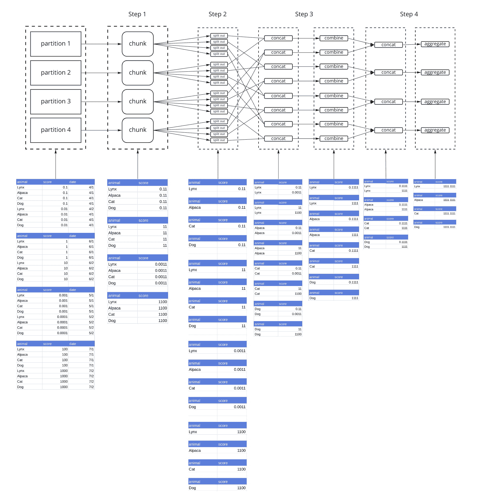

# Dask DataFrame 不是 Pandas

> 原文：[`www.kdnuggets.com/2021/11/dask-dataframe-not-pandas.html`](https://www.kdnuggets.com/2021/11/dask-dataframe-not-pandas.html)

评论

**由 [Hugo Shi](https://www.linkedin.com/in/hugo-shi/)，Saturn Cloud 创始人**

## 吸引力

你从中等大小的数据集开始。Pandas 做得相当好。然后数据集变大，因此你升级到更大的机器。但最终，你会在那台机器上耗尽内存，或者需要找到一种利用更多核心的方法，因为你的代码运行缓慢。此时，你将 Pandas DataFrame 对象替换为 Dask DataFrame。

* * *

## 我们的前三大课程推荐

 1\. [Google 网络安全证书](https://www.kdnuggets.com/google-cybersecurity) - 快速进入网络安全职业道路。

 2\. [Google 数据分析专业证书](https://www.kdnuggets.com/google-data-analytics) - 提升你的数据分析水平

 3\. [Google IT 支持专业证书](https://www.kdnuggets.com/google-itsupport) - 支持你的组织的 IT

* * *

不幸的是，这通常不会顺利进行，结果会带来很多痛苦。你依赖于的一些 Pandas 方法在 Dask DataFrame 中未实现（我在看你，MultiIndex），这些方法的行为稍有不同，或者相应的 Dask 操作失败、内存耗尽并崩溃（我还以为不会这样！）

Pandas 是为单个 Python 进程设计的库。分布式算法和数据结构本质上是不同的。在 Dask DataFrame 方面可以做一些工作来改善这一点，但单个进程和机器集群总是会有非常不同的性能特征。你不应该试图抗拒这一基本事实。

**Dask 是扩展你的 Pandas 代码的绝佳方法。盲目地将你的 Pandas DataFrame 转换为 Dask DataFrame 并不是正确的做法。** 基本的转变不应是用 Dask 替代 Pandas，而是重用你为单个 Python 进程编写的算法、代码和方法。这才是本文的核心。一旦你调整了思维，其余的就不是火箭科学了。

**有三种主要方式可以将你的 Pandas 代码与 Dask 结合使用**

+   将你的大问题拆分成许多小问题

+   使用分组和聚合

+   将 dask 数据帧用作其他分布式算法的容器。

## 将你的大问题拆分成许多小问题

Dask DataFrame 由许多 Pandas DataFrame 组成。它非常擅长在这些 Pandas DataFrame 之间移动行，以便你可以在自己的函数中使用它们。这里的一般方法是以拆分-应用-合并模式来表达你的问题。

+   将大数据集（Dask DataFrame）拆分成较小的数据集（Pandas DataFrame）

+   对这些较小的数据集应用一个函数（Pandas 函数，而非 Dask 函数）

+   将结果合并回一个大数据集（Dask DataFrame）

有两种主要方法来拆分数据：

`set_index` 将 Dask DataFrame 的一列设为索引，并根据该索引对数据进行排序。默认情况下，它会估计该列的数据分布，以便生成大小均匀的分区（Pandas DataFrames）。

`shuffle` 将行分组，使得具有相同 shuffle 列值的行在同一分区内。这与 set_index 不同，因为结果没有排序保证，但你可以按多个列进行分组。

一旦你的数据被拆分，`map_partitions` 是将函数应用于每个 Pandas DataFrame 并将结果合并回 Dask DataFrame 的好方法。

**但我有多个 DataFrame**

没问题！只要你能以相同的方式拆分所有用于计算的 Dask DataFrame，你就可以继续。

### 一个具体的例子

我不会在这里深入代码。目标是为这个理论描述提供一个具体的例子，以获得对其样子的直观理解。假设我有一个包含股票价格的 Dask DataFrame，还有一个包含相同股票分析师估计的 Dask DataFrame，我想弄清楚分析师是否正确。

1.  编写一个函数，该函数接受单一股票的价格和相同股票的分析师估计，并判断他们是否正确。

1.  对股票价格调用 `set_index`，按股票代码排序。结果 DataFrame 的 `index` 将具有 `divisions` 属性，描述了每个分区包含哪些股票代码。（所有 B 之前的内容在第一个分区，B 和 D 之间的内容在第二个分区，等等）。使用股票价格 `divisions` 对分析师估计的 Dask DataFrame 调用 `set_index`。

1.  使用 `map_partitions` 将函数应用于两个 Dask DataFrame 的分区。该函数将查看每个 DataFrame 中的股票代码，然后应用你的函数。

### 使用分组聚合

Dask 有一个出色的 Pandas [分组聚合算法](https://saturncloud.io/docs/reference/dask_groupby_aggregations/)。实际算法相当复杂，但我们在 [文档](https://saturncloud.io/docs/reference/dask_groupby_aggregations/) 中有详细的描述。如果你的问题符合这种模式，你就找对地方了。Dask 在分组聚合的实现中使用了树形化简。你可能需要调整两个参数，`split_out` 控制结果最终分成多少个分区，`split_every` 帮助 Dask 计算树中的层数。可以根据数据的大小调整这两个参数，以确保不会耗尽内存。

### 使用 Dask 作为其他算法的容器

许多库都内置了 Dask 集成。`dask-ml` 与 `scikit-learn` 集成。`cuML` 有多节点多 GPU 实现的许多常见 ML 算法。`tsfresh` 用于时间序列。`scanpy` 用于单细胞分析。`xgboost` 和 `lightgbm` 都有 Dask 支持的并行算法。

## 结论

Dask 是扩展 Pandas 代码的绝佳方式。简单地将 Pandas DataFrame 转换为 Dask DataFrame 不是正确的方法。但 Dask 使你可以轻松地将大型数据集拆分成更小的部分，并利用现有的 Pandas 代码。

[立即尝试 Saturn Cloud](https://accounts.community.saturnenterprise.io/register?trackid=17d2e7598417f6-08ec90c572b54a-14241209-1fa400-17d2e75984292e)

**简介: [Hugo Shi](https://www.linkedin.com/in/hugo-shi/)** 是 Saturn Cloud 的创始人，这是一个用于扩展 Python、协作、部署任务等的首选云工作区。

[原文](https://saturncloud.io/blog/dask-is-not-pandas/)。已获许可转载。

**相关内容:**

+   Pandas 不够？这里有几个处理更大、更快数据的好替代方案*   如果你会写函数，你就可以使用 Dask*   在 Python 中设置你的数据科学和机器学习能力

    ### 更多相关话题

    +   [Pandas 与 Polars：Python 数据框库的比较分析](https://www.kdnuggets.com/pandas-vs-polars-a-comparative-analysis-of-python-dataframe-libraries)

    +   [如何使用 Pandas 将 JSON 数据转换为 DataFrame](https://www.kdnuggets.com/how-to-convert-json-data-into-a-dataframe-with-pandas)

    +   [如何在几秒钟内处理包含百万行的 DataFrame](https://www.kdnuggets.com/2022/01/process-dataframe-millions-rows-seconds.html)

    +   [你可能不知道的 5 个 Pandas 绘图函数](https://www.kdnuggets.com/2023/02/5-pandas-plotting-functions-might-know.html)

    +   [机器学习没有为我的业务创造价值。为什么？](https://www.kdnuggets.com/2021/12/machine-learning-produce-value-business.html)

    +   [让你脱颖而出的那些不起眼的 SQL 概念](https://www.kdnuggets.com/2022/02/not-so-sexy-sql-concepts-stand-out.html)
