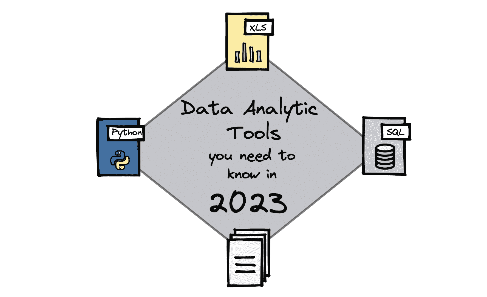

# 2023 年你需要了解的数据分析工具

> 原文：[`www.kdnuggets.com/2023/05/data-analytics-tools-need-know-2023.html`](https://www.kdnuggets.com/2023/05/data-analytics-tools-need-know-2023.html)

作者图片

你可能想要转行到数据分析，或者这可能对你来说是一个全新的领域。不管怎样，准备好始终是关键。大多数进入新职业的人只关注最终目标：找到一份工作。然而，有些人过于专注于找到理想的工作，以至于忘记了他们需要掌握所需的技能和工具。

* * *

## 我们的前三大课程推荐

 1\. [Google 网络安全证书](https://www.kdnuggets.com/google-cybersecurity) - 快速进入网络安全职业生涯。

 2\. [Google 数据分析专业证书](https://www.kdnuggets.com/google-data-analytics) - 提升你的数据分析水平

 3\. [Google IT 支持专业证书](https://www.kdnuggets.com/google-itsupport) - 支持你的组织在 IT 方面

* * *

# 什么是数据分析师？

数据分析师是指那些查看数据并提供报告和可视化的人，以解释数据。

数据分析师通常不会整天进行编码。他们的职责是利用技术思维以及 Excel、编码或 SQL 技能来识别趋势、模式和解决方案，以帮助企业做出决策。他们还负责将这些发现转化为可视化形式，呈现给相关利益方。

现在，让我们来看看数据分析师在工作中需要成功的必备工具。

# 作为数据分析师，你需要了解哪些工具？

## Excel

+   工具类型：电子表格软件。

+   可用性：商业软件。

+   用途：数据整理和报告。

Excel 被许多来自不同行业的人频繁使用——它是大多数领域的基本工具。如果你还记得在学校时，你可能使用过它，但没有意识到它的全部功能。除了排序和组织数据，它还有计算和图表功能，非常适合数据分析。

虽然 Excel 很受欢迎，并且有很多有用的功能和插件，但它也有其缺点。由于其能力和处理能力，当处理大数据集时，运行速度非常慢，可能会导致计算错误和不准确。

## Python

+   工具类型：编程语言。

+   可用性：开源。

+   用途：开发网站/软件、任务自动化、数据分析和数据可视化

Python 是一种通用编程语言，以其简单的语法而闻名，使得学习编程语言变得容易。由于其直观的语法，它目前是最受欢迎的编程语言。它包含多种库，例如[NumPy](https://numpy.org/)，以帮助处理计算任务。

作为数据分析师，你可以使用 Python 来帮助你的数据分析，例如导入和过滤数据、统计测试、寻找数据之间的关联以及生成可视化。

## R

+   工具类型：编程语言。

+   可用性：开源。

+   使用：统计分析和数据挖掘。

很多人在选择学习哪种编程语言时感到困惑——Python 还是 R。Python 以通用编程语言而闻名，而 R 是一种统计编程语言。

与 Python 相比，R 的语法更为复杂，但这是因为它专门构建用于处理重统计计算任务和创建数据可视化。

## SQL

+   工具类型：标准化编程语言。

+   可用性：商业。

+   使用：与数据库通信

作为数据分析师，你将花费大量时间与数据库进行通信。它用于执行任务，如更新数据库中的数据或从数据库中检索数据。它提供了一种更简单的方式来扫描你的数据库，并通过几行代码探索新的发现。

## Jupyter Notebook

+   工具类型：交互式创作软件。

+   可用性：开源。

+   使用：创建和共享代码/计算文档。

Jupyter Notebook 是一款开源软件，提供交互式计算，并且与不同的编程语言兼容。它可以创建和共享包含实时代码、方程式、可视化和文本的文档，供团队成员之间使用。

它的主要用途包括编程实践、跨项目协作、数据清洗、数据可视化和共享。它还与大数据分析工具如 Apache Spark 集成，接下来我们将讨论这个工具。

## Apache Spark

+   工具类型：数据处理框架。

+   可用性：开源。

+   使用：大数据工作负载。

Apache Spark 是一个分析引擎，可以快速而有效地处理大规模数据。据知，Apache Spark 可以帮助你将工作负载运行速度提高 100 倍。作为数据分析师，你将使用它来处理各种数据集，分析非结构化的大数据，以及进行机器学习。

该框架与 Python、R、Java、Scala 和 SQL 等编程语言兼容。

## Tableau

+   工具类型：数据可视化工具。

+   可用性：商业。

+   使用：连接数据，构建工作簿、故事和仪表板。

Tableau 是市场领先的商业智能工具之一，用于以简单的格式分析和可视化数据。如果你是一个没有精通编码技能的数据分析师，但仍然希望能够创建交互式可视化和仪表板来向利益相关者展示，Tableau 可以帮助你实现这一目标。

它包含如机器学习、统计学、自然语言和智能数据准备等功能。不仅让数据科学家生活更轻松，也让业务用户受益。

## SAS

+   工具类型：统计软件套件。

+   可用性：商业。

+   用途：统计分析和数据可视化。

SAS 是一款命令驱动的软件，仅支持 Windows 操作系统。它代表统计分析系统（Statistical Analysis System），是一组协同工作的程序，用于存储和检索数据、修改数据、进行统计分析、以及创建可视化和报告。

该软件帮助你快速洞察数据，然后使用机器学习支持的自动分析，生成易于理解的报告，以支持决策过程。

## KNIME

+   工具类型：数据集成平台。

+   可用性：开源。

+   用途：访问、融合、分析和可视化数据。

KNIME 是一个开源软件，允许你在任何复杂程度上构建分析。你可以使用：

+   KNIME Analytics Platform – 用于清理和收集数据、分析数据并通过可视化使其对所有人可访问。

+   KNIME Server – 部署工作流，并使其可供团队协作、管理和自动化。

## 微软 Power BI

+   工具类型：商业分析套件。

+   可用性：商业。

+   用途：将数据转化为视觉沉浸式和互动式的洞察。

微软 Power BI 允许你将数据转换为交互式可视化报告和仪表板，更加方便地分享你的发现。它支持与 Excel、文本文件、SQL 和云源的操作。你的数据在 Power BI 中是安全的，因为它使用敏感性标签、端到端加密和实时访问监控。

你可以在其产品范围内进行选择，如 Power BI Desktop、Power BI Pro、Power BI Premium、Power BI Mobile、Power BI Embedded 和 Power BI Report Server。

# 结论

随着你在数据分析师的旅程中不断前进，你会看到这些现有工具的进步和市场上新工具的出现。你的技能取决于你在未来 10 年中的定位。了解得越多，越好。

如果你仍然不确定数据分析的路径并需要更多指导，可以阅读：

+   2022 年顶级数据分析师认证课程

**[Nisha Arya](https://www.linkedin.com/in/nisha-arya-ahmed/)** 是一位数据科学家、自由技术写作者以及 KDnuggets 的社区经理。她特别感兴趣于提供数据科学职业建议或教程，以及围绕数据科学的理论知识。她还希望探索人工智能如何/能够促进人类寿命的延续。作为一名热心的学习者，她致力于拓宽自己的技术知识和写作技能，同时帮助指导他人。

### 更多相关话题

+   [2023 年成为数据科学家需要掌握的 19 项技能](https://www.kdnuggets.com/2023/04/top-19-skills-need-know-2023-data-scientist.html)

+   [KDnuggets 新闻，4 月 13 日：数据科学家应该了解的 Python 库](https://www.kdnuggets.com/2022/n15.html)

+   [2023 年你需要尝试的 5 个惊人且免费的 LLM 游乐场](https://www.kdnuggets.com/5-amazing-free-llms-playgrounds-you-need-to-try-in-2023)

+   [2023 年你应该了解的 10 个惊人的机器学习可视化](https://www.kdnuggets.com/2022/11/10-amazing-machine-learning-visualizations-know-2023.html)

+   [数据科学最低要求：你需要了解的 10 项基本技能](https://www.kdnuggets.com/2020/10/data-science-minimum-10-essential-skills.html)

+   [以数据为中心的人工智能：你需要了解的最新研究](https://www.kdnuggets.com/2022/02/datacentric-ai-latest-research-need-know.html)
