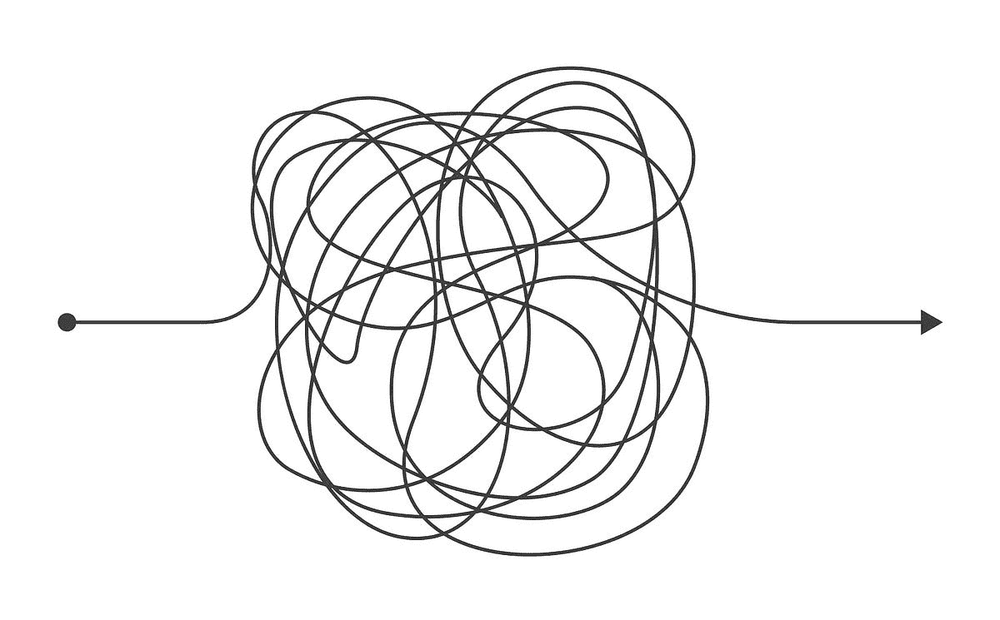
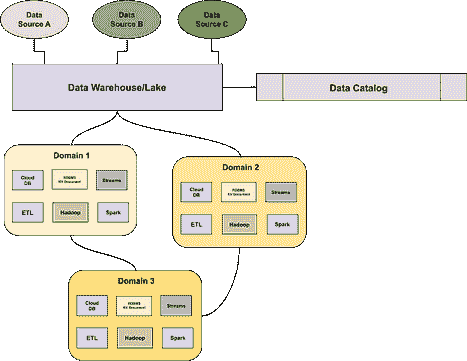
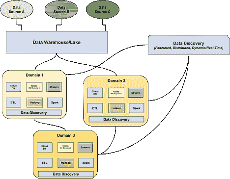

# 数据目录已经死了；数据发现万岁

> 原文：[`www.kdnuggets.com/2020/12/data-catalogs-dead-long-live-data-discovery.html`](https://www.kdnuggets.com/2020/12/data-catalogs-dead-long-live-data-discovery.html)

评论

**由 Debashis Saha & Barr Moses 提供**

图片由 [Andrey_Kuzmin](https://www.shutterstock.com/g/akz) 提供，来源于 [Shutterstock](http://www.shutterstock.com/)

* * *

## 我们的三大课程推荐

 1\. [Google 网络安全证书](https://www.kdnuggets.com/google-cybersecurity) - 快速进入网络安全职业道路。

 2\. [Google 数据分析专业证书](https://www.kdnuggets.com/google-data-analytics) - 提升你的数据分析能力

 3\. [Google IT 支持专业证书](https://www.kdnuggets.com/google-itsupport) - 支持你的组织在 IT 方面

* * *

*随着公司越来越多地利用数据来推动数字产品、决策制定和创新，理解这些最关键资产的健康状况和可靠性是基本的。几十年来，组织依赖数据目录来推动数据治理。但这足够吗？*

[*Debashis Saha*](https://www.linkedin.com/in/debashis1saha)*，AppZen 的工程副总裁，曾任职于 eBay 和 Intuit，和 *[*Barr Moses*](https://www.linkedin.com/in/barrmoses)*，Monte Carlo 的首席执行官兼联合创始人，讨论了为什么数据目录无法满足现代数据体系的需求，以及为什么需要一种新的方法——数据发现——来更好地促进元数据管理和数据可靠性。*

这不是什么秘密：知道你的数据在哪里以及谁可以访问它，对理解数据对业务的影响至关重要。事实上，当涉及到构建 [**成功的数据平台**](https://www.montecarlodata.com/how-to-build-your-data-platform-like-a-product/) 时，确保数据既有组织又集中，同时又容易被发现，是至关重要的。

类似于实体图书馆目录，[数据目录](https://cloud.google.com/data-catalog) 作为元数据的清单，提供给用户评估数据的可访问性、健康状况和位置所需的信息。在我们的 [自助商业智能](https://searchbusinessanalytics.techtarget.com/definition/self-service-business-intelligence-BI) 时代，数据目录也成为数据管理和数据治理的重要工具。

不足为奇，对大多数数据领导者来说，建立数据目录是他们的首要任务之一。

至少，数据目录应该回答以下问题：

+   我应该在哪里寻找我的数据？

+   这些数据重要吗？

+   这些数据代表了什么？

+   这些数据是否相关且重要？

+   我如何使用这些数据？

尽管数据操作不断成熟，数据管道变得越来越复杂，传统的数据目录往往无法满足这些要求。

> **这就是为什么一些顶级数据工程团队正在创新他们的元数据管理方法 — 以及他们正在做什么：**

### 数据目录的不足之处

尽管数据目录能够记录数据，但使用户“发现”并获取有关数据健康状况的有意义的实时洞察的根本挑战仍然未得到解决。

我们所知的数据目录无法跟上这一新现实，主要有三个原因：（1）缺乏自动化，（2）无法随着数据堆栈的增长和多样性进行扩展，以及（3）其不分布式的格式。

### 对自动化的需求增加

传统的数据目录和治理方法通常依赖数据团队进行繁重的手动数据录入，将更新目录的责任留给他们，随着数据资产的发展而更新。这种方法不仅耗时，而且需要大量的手动工作，这些工作本可以自动化，从而使数据工程师和分析师能够将时间用于真正推动进展的项目。

作为数据专业人士，理解数据状态是一场持续的斗争，这也突显了对更大、更多定制化自动化的需求。也许这个场景让你感到熟悉：

在利益相关者会议前，你是否经常发现自己急忙在 Slack 频道中寻找数据集，以搞清楚某个报告或模型的数据来源 — 以及为什么上周数据突然停止到达？为了应对这种情况，你和你的团队是否会聚集在一个房间里，开始白板绘制特定关键报告的所有上游和下游连接？

我会省略详细的描述，但它可能看起来是这样的：

*你的数据血缘图看起来像是一场线条和箭头的风暴吗？我们也一样。图片由*[EgudinKa](https://www.shutterstock.com/g/EgudinKa)提供，来自[*Shutterstock*](http://www.shutterstock.com/)*。*

如果这让你感到共鸣，你并不孤单。许多公司需要解决这种依赖关系拼图问题，开始了一个多年的过程来手动映射所有数据资产。有些公司能够投入资源构建短期解决方案，甚至开发内部工具，让他们能够搜索和探索数据。即使这能帮助你达到最终目标，但这对数据组织来说是一种沉重负担，耗费了数据工程团队的时间和金钱，这些本可以用于其他事情，比如产品开发或实际使用数据。

### 随数据变化而扩展的能力

当数据是结构化的时，数据目录效果很好，但在 2020 年，这种情况并不总是如此。随着机器生成的数据增加，公司在机器学习项目上的投资不断增加，非结构化数据变得越来越普遍，占所有新数据的[90%以上](https://www.cio.com/article/3406806/ai-unleashes-the-power-of-unstructured-data.html)。

[通常存储在数据湖中](https://towardsdatascience.com/how-to-build-your-data-platform-choosing-a-cloud-data-warehouse-3de66862f41c)，非结构化数据没有预定义的模型，必须经过多次转化才能可用和有用。非结构化数据非常动态，其形状、来源和意义在经过各种处理阶段（包括转化、建模和聚合）时不断变化。我们对这些非结构化数据所做的事情（即转化、建模、聚合和可视化），使得在其“理想状态”下进行目录记录变得更加困难。

除此之外，不仅仅是*描述*消费者访问和使用的数据，还需要基于数据的意图和目的来*理解*这些数据。数据生产者如何描述资产与数据消费者如何理解其功能将非常不同，即使是不同的数据消费者之间，对数据赋予的意义也可能存在巨大的差异。

例如，从 Salesforce 提取的数据集对数据工程师来说意义完全不同于对销售团队成员的意义。虽然工程师能理解“DW_7_V3”的含义，但销售团队可能会困惑，试图确定该数据集是否与他们在 Salesforce 中的“2021 年收入预测”仪表盘相关。情况还有很多类似的例子。

静态的数据描述本质上有限。到 2021 年，我们必须接受并适应这些新的和不断演变的动态，以真正理解数据。

### 数据是分布式的；目录则不是

尽管现代数据架构的分布（参见：[数据网格](https://towardsdatascience.com/what-is-a-data-mesh-and-how-not-to-mesh-it-up-210710bb41e0)）以及转向接受半结构化和非结构化数据作为常态，但大多数数据目录仍然将数据视为一维实体。随着数据的聚合和转化，它流经数据栈的不同元素，几乎无法进行文档记录。

*传统的数据目录在数据摄取阶段管理元数据（有关数据的数据），但数据在不断变化，这使得随着数据在管道中演变，难以了解数据的健康状况。图像由 Barr Moses 提供。*

如今，数据往往是[**自描述的**](https://www.gartner.com/en/information-technology/glossary/self-describing-messages#:~:text=A%20message%20that%20contains%20data,consists%20of%20tag%2Fvalue%20pairs.)，包含了描述数据格式和意义的元数据与数据本身。

由于传统的数据目录不是分布式的，因此几乎不可能将其作为数据的中央真实来源。随着数据变得更加容易被各种用户访问，从 BI 分析师到运营团队，以及支持 ML、运营和分析的管道变得越来越复杂，这个问题只会加剧。

现代数据目录需要跨这些领域整合数据的意义。数据团队需要能够理解这些数据领域如何相互关联，以及汇总视图中的哪些方面是重要的。他们需要一种集中化的方法来回答这些分布式的问题——换句话说，就是一个分布式的、联合的数据目录。

> 从一开始就投资于正确的数据目录构建方法，将允许你构建一个更好的数据平台，帮助你的团队实现数据民主化和轻松探索数据，使你能够跟踪重要的数据资产并充分利用其潜力。

### 数据目录 2.0 = 数据发现

数据目录在你拥有严格模型时表现良好，但随着数据管道变得越来越复杂以及非结构化数据成为黄金标准，我们对这些数据的理解（例如它的功能、谁在使用它、如何使用它等）并不反映现实。

我们相信，下一代目录将具备学习、理解和推断数据的能力，使用户能够以自助服务的方式利用其洞察。但我们该如何实现这一目标？

*数据发现可以通过提供分布式、实时的数据洞察，取代现代数据目录，同时遵守一套中央治理标准。图片由 Barr Moses 提供。*

除了对数据进行目录化之外，元数据和数据管理策略还必须纳入数据发现，这是一种实时了解分布式数据资产健康的新方法。借鉴了 Zhamak Deghani 提出的分布式领域导向架构以及 Thoughtworks 的[**数据网格模型**](https://martinfowler.com/articles/data-monolith-to-mesh.html)，数据发现认为不同的数据拥有者对其数据作为产品负有责任，并且负责促进不同位置之间的分布式数据的沟通。一旦数据被传递给特定领域并经过转化，该领域的数据拥有者可以利用这些数据满足其运营或分析需求。

数据发现通过提供基于数据如何被摄取、存储、聚合和使用的领域特定动态理解，取代了对数据目录的需求。与数据目录一样，治理标准和工具在这些领域中是联合的（允许更大的可访问性和互操作性），但与数据目录不同，数据发现提供对数据当前状态的实时理解，而不是其理想状态或“目录化”状态。

数据发现不仅可以回答数据理想状态下的问题，还可以回答当前数据在各个领域的状态问题：

+   哪个数据集是最新的？哪些数据集可以弃用？

+   这个表格上次更新时间是什么时候？

+   我所在领域中某个字段的含义是什么？

+   谁可以访问这些数据？这些数据上次被使用是什么时候？由谁使用的？

+   这些数据的上游和下游依赖关系是什么？

+   这些数据是生产级质量吗？

+   对于我所在领域的业务需求，哪些数据是重要的？

+   我对这些数据的假设是什么，它们是否得到了满足？

我们相信，下一代数据目录，也就是数据发现，将具有以下特性：

### 自助发现和自动化

数据团队应能够轻松使用数据目录，而无需专门的支持团队。自助服务、自动化和数据工具的工作流编排消除了数据管道各阶段之间的隔阂，并在此过程中使数据更容易理解和访问。更高的可访问性自然会导致数据采用率的增加，从而减轻数据工程团队的负担。

### 随着数据的演变，扩展性

随着公司摄取越来越多的数据以及非结构化数据成为常态，能够扩展以满足这些需求将对数据计划的成功至关重要。数据发现利用机器学习在数据资产扩展时获得全局视角，确保随着数据的演变而调整理解。这使得数据使用者能够做出更智能和明智的决策，而不是依赖过时的文档（即数据关于数据的过时情况，多么元！）或更糟的——凭直觉做决策。

### [数据血缘](https://en.wikipedia.org/wiki/Data_lineage)用于分布式发现

数据发现严重依赖自动化的表和字段级血缘，以映射数据资产之间的上游和下游依赖关系。血缘帮助在正确的时间提供正确的信息（这是数据发现的核心功能之一），并在数据资产之间建立联系，以便在数据管道出现故障时能更好地排除故障，这在[现代数据堆栈发展](https://www.montecarlodata.com/data-observability-how-to-prevent-your-data-pipelines-from-breaking/)以适应更复杂的用例时变得越来越常见。

### 数据可靠性以确保数据的黄金标准——始终如一

事实上，无论如何，你的团队可能已经在投资数据发现。无论是通过手动工作来验证数据、工程师编写的自定义验证规则，还是基于破碎数据或未被注意的隐性错误所做的决策成本。现代数据团队已经开始利用自动化方法来确保每个阶段的高可靠性数据，从数据质量监控到更全面的、端到端的[data observability platforms](https://towardsdatascience.com/how-do-you-prevent-broken-data-pipelines-326f3c6d239e)来监控和警报数据管道中的问题。这些解决方案会在数据出错时通知你，以便你快速识别根本原因，快速解决问题，并[防止未来的停机时间](https://www.montecarlodata.com/the-rise-of-data-downtime/)。

数据发现使数据团队能够相信他们对数据的假设与现实相符，从而在数据基础设施中实现动态发现和高度可靠性，无论领域如何。

### 接下来是什么？

如果坏数据比没有数据还糟糕，那么没有数据发现的数据目录比没有数据目录更糟。为了实现真正可发现的数据，重要的是你的数据不仅要“被编目”，还要准确、干净，并且在从摄取到消费的整个过程中完全可观测——换句话说：可靠。

有效的数据发现方法依赖于自动化和可扩展的数据管理，这与数据系统的新分布性质相适应。因此，为了真正实现组织中的数据发现，我们需要重新思考我们如何处理数据目录。

只有了解你的数据、数据的状态以及它是如何被使用的——在生命周期的所有阶段、跨领域——我们才能开始信任它。

***想了解更多关于***[***构建更好的数据目录***](http://www.montecarlodata.com/)***的内容吗？请联系***[***Debashis Saha***](https://www.linkedin.com/in/debashis1saha)***或***[***Barr Moses***](https://www.linkedin.com/in/barrmoses)***以及***[***Monte Carlo 团队***](http://www.montecarlodata.com/)***。***

**[Debashis Saha](https://www.linkedin.com/in/debashis1saha/)** 是 AppZen 的工程副总裁。在此之前，他曾担任 Intuit 和 eBay 的数据平台副总裁。

**[Barr Moses](https://www.linkedin.com/in/barrmoses/)** 是 Monte Carlo 的首席执行官兼联合创始人，这是一家数据可观测性公司。在此之前，她曾担任 Gainsight 的运营副总裁。

[原文](https://towardsdatascience.com/data-catalogs-are-dead-long-live-data-discovery-a0dc8d02bd34?source=friends_link&sk=3140d4e8c1e40c35ec7a29967f81a453)。经许可转载。

**相关：**

+   数据科学和机器学习：免费电子书

+   数据专业人士寻找数据集的 8 个地方

+   全面了解端到端的机器学习平台

### 更多相关内容

+   [OLAP 还活着吗？](https://www.kdnuggets.com/2022/10/olap-dead.html)

+   [学习数据科学基础需要多长时间？](https://www.kdnuggets.com/2022/03/long-take-learn-data-science-fundamentals.html)

+   [使用 BERT 对长文本进行分类](https://www.kdnuggets.com/2022/02/classifying-long-text-documents-bert.html)

+   [完整的机器学习算法从开发到部署的过程](https://www.kdnuggets.com/2021/12/deployment-machine-learning-algorithm-live-production-environment.html)

+   [最后呼吁：Stefan Krawcyzk 的‘Mastering MLOps’直播班](https://www.kdnuggets.com/2022/08/sphere-last-call-stefan-krawcyzk-mastering-mlops.html)

+   [通过 DataOps.live 解锁 DataOps 成功——在 Gartner 市场指南中 featured](https://www.kdnuggets.com/2023/07/dataopslive-unlock-dataops-success-featured-gartner-market-guide.html)
