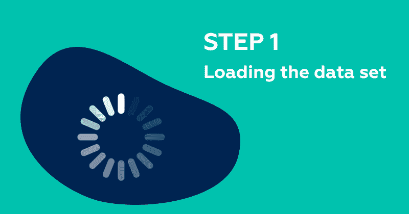
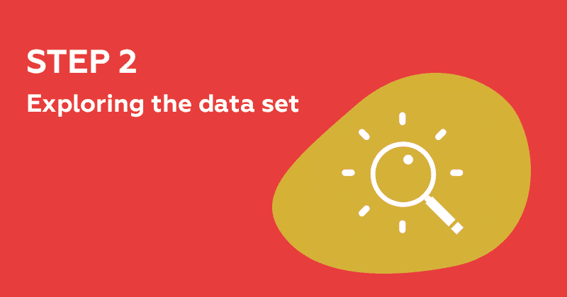

# 数据清洗与预处理入门

> 原文：[`www.kdnuggets.com/2019/11/data-cleaning-preprocessing-beginners.html`](https://www.kdnuggets.com/2019/11/data-cleaning-preprocessing-beginners.html)

评论

**由 [Sciforce](https://sciforce.solutions) 提供。**

当我们团队的[项目](https://arxiv.org/abs/1908.02505)在今年的 CALL 共享任务挑战的文本子任务中获得第一名时，我们成功的关键因素之一是对数据的仔细准备和清理。数据清理和准备是任何 AI 项目中最关键的第一步。证据表明，[大多数数据科学家将大部分时间 — 多达**70%** — 用于清理数据](https://www.forbes.com/sites/gilpress/2016/03/23/data-preparation-most-time-consuming-least-enjoyable-data-science-task-survey-says/#77d304176f63)。

在这篇博客文章中，我们将引导你完成数据清理和预处理的初始步骤，从导入最流行的库到实际编码特征。

> * * *
> 
> ## 我们的前三大课程推荐
> ## 
>  1\. [谷歌网络安全证书](https://www.kdnuggets.com/google-cybersecurity) - 快速进入网络安全职业生涯。
> 
>  2\. [谷歌数据分析专业证书](https://www.kdnuggets.com/google-data-analytics) - 提升你的数据分析技能
> 
>  3\. [谷歌 IT 支持专业证书](https://www.kdnuggets.com/google-itsupport) - 支持你的组织进行 IT 管理
> 
> * * *
> 
> ***数据清洗***或**数据清理**是检测和纠正（或删除）记录集、表格或数据库中的损坏或不准确记录的过程，并指的是识别数据中不完整、不正确、不准确或不相关的部分，然后替换、修改或删除脏数据或粗糙数据。 //[**维基百科**](https://en.wikipedia.org/wiki/Data_cleansing)*

### 第一步：加载数据集



**导入库**

首先，你需要导入用于数据预处理的库。虽然有很多可用的库，但用于数据处理的最流行和重要的 Python 库是 Numpy、Matplotlib 和 Pandas。**Numpy** 是用于所有数学操作的库。**Pandas** 是导入和管理数据集的最佳工具。**Matplotlib**（Matplotlib.pyplot）是用于制作图表的库。

为了方便将来使用，你可以使用快捷别名导入这些库：

```py
import numpy as np
import matplotlib.pyplot as plt
import pandas as pd

```

**将数据加载到 pandas 中**

一旦你下载了数据集并将其命名为 .csv 文件，你需要将其加载到 pandas DataFrame 中，以便探索数据并执行一些基本的清理任务，去除那些会使数据处理变慢的信息。

通常，这些任务包括：

+   删除第一行：它包含了额外的文本而不是列标题。这些文本会阻碍 pandas 库正确解析数据集：

```py
my_dataset = pd.read_csv(‘data/my_dataset.csv’, skiprows=1, low_memory=False)

```

+   删除我们不需要的文本解释列、网址列和其他不必要的列：

```py
my_dataset = my_dataset.drop([‘url’],axis=1)

```

+   删除所有只有一个值或缺失值超过 50%的列，以便提高处理速度（如果你的数据集足够大，这样做仍然有意义）：

```py
my_dataset = my_dataset.dropna(thresh=half_count,axis=1)

```

另外，一个好的做法是将筛选后的数据集命名为不同的名称，以便与原始数据分开。这确保了你仍然保留了原始数据，以备需要时可以返回。

### 第 2 步。探索数据集



**理解数据**

现在你已经设置好了数据集，但你仍然应该花些时间来探索它并理解每一列代表的特征。对数据集进行手动检查是很重要的，以避免在数据分析和建模过程中出现错误。

为了简化过程，你可以创建一个包含列名、数据类型、第一行的值和数据字典描述的 DataFrame。

在你探索特征时，可以注意任何列：

+   格式不佳，

+   需要更多数据或大量预处理才能转化为有用特征，或者

+   包含冗余信息，

因为这些问题处理不当会影响你的分析。

***你还应该注意数据泄漏***，这可能导致模型过拟合。这是因为模型还会从在使用时无法获得的特征中学习。我们需要确保我们的模型只使用在贷款申请时能够获得的数据进行训练。

**确定目标列**

在探索过筛选后的数据集后，你需要创建一个因变量矩阵和一个自变量向量。首先，你应该根据你想要回答的问题决定使用哪个列作为建模的目标列。例如，如果你想预测癌症的发展情况，或信用是否会被批准，你需要找到一个包含疾病状态或贷款批准状态的列，并将其用作目标列。

例如，如果目标列是最后一列，你可以通过输入以下内容来创建因变量矩阵：

```py
X = dataset.iloc[:, :-1].values 

```

第一个冒号（**:**）表示我们想要获取数据集中的所有行。**: -1** 表示我们想要获取除最后一列外的所有数据列。**.values** 表示我们想要所有的值。

要拥有一个仅包含最后一列数据的自变量向量，你可以输入

```py
y = dataset.iloc[:, -1].values

```

### 第 3 步。为机器学习准备特征


最后，到了为机器学习算法准备特征的数据清理工作。为了清理数据集，你需要**处理缺失值和类别特征**，因为大多数机器学习模型的数学基础假设数据是数值型的且没有缺失值。此外，`scikit-learn`库会在你尝试使用包含缺失值或非数值值的数据训练线性回归和逻辑回归模型时返回错误。

**处理缺失值**

缺失数据可能是数据不洁的最常见特征。这些值通常以 NaN 或 None 的形式存在。

这里是缺失值的几种原因：有时值缺失是因为它们不存在，或由于数据收集不当或数据录入错误。例如，如果某人未成年，而问题适用于 18 岁以上的人群，那么问题将包含缺失值。在这种情况下，为该问题填补一个值是不正确的。

填补缺失值的方法有几种：

+   如果你的数据集足够大且缺失值的比例很高（例如超过 50%），你可以删除包含数据的行；

+   如果处理的是数值型数据，你可以用 0 填补所有空变量；

+   你可以使用来自`scikit-learn`库的 Imputer 类用数据的（均值、中位数、最频繁值）填补缺失值。

+   你还可以决定用同一列中紧接着的值填补缺失值。

这些决定取决于数据类型、你对数据的需求以及缺失值的原因。实际上，虽然某种方法很流行，但并不一定是正确的选择。最常见的策略是使用均值，但根据你的数据，你可能会找到完全不同的方法。

**处理类别数据**

机器学习仅使用数值型数据（浮点型或整数型）。然而，数据集通常包含需要转换为数值的对象数据类型。在大多数情况下，类别值是离散的，可以编码为虚拟变量，为每个类别分配一个数字。最简单的方法是使用 One Hot Encoder，指定你要处理的列的索引：

```py
from sklearn.preprocessing import OneHotEncoder
onehotencoder = OneHotEncoder(categorical_features = [0])X = onehotencoder.fit_transform(X).toarray()

```

**处理不一致的数据录入**

不一致性发生在例如，当列中存在不同的唯一值但这些值本应相同时。你可以考虑不同的大小写处理方法、简单的打印错误和不一致的格式，以形成一个概念。移除数据不一致性的方法之一是去除条目名称前后的空格，并将所有字符转换为小写。

如果有大量不一致的唯一条目，手动检查最接近的匹配项是不可能的。你可以使用 [Fuzzy Wuzzy](https://github.com/seatgeek/fuzzywuzzy) 包来识别最可能相同的字符串。它接收两个字符串并返回一个比率。比率越接近 100，字符串统一的可能性就越大。

**处理日期和时间**

一种特定类型的数据不一致是日期格式的不一致，例如同一列中的 dd/mm/yy 和 mm/dd/yy。你的日期值可能不是正确的数据类型，这将使你无法有效地进行操作并从中获得洞察。这时你可以使用 [datetime](https://docs.python.org/2/library/datetime.html) 包来修复日期的类型。

**缩放和归一化**

如果你需要指定一个量的变化不等于另一个量的变化，缩放是很重要的。借助缩放，你可以确保某些特征虽然很大，但不会被用作主要预测因子。例如，如果你在预测中使用一个人的年龄和薪水，一些算法会更关注薪水，因为它更大，这并没有意义。

归一化涉及将数据集转换为正态分布。一些算法如 SVM 在归一化数据上收敛得更快，因此归一化数据以获得更好的结果是有意义的。

有许多方法可以执行特征缩放。简而言之，我们将所有特征放在相同的尺度上，以便没有特征会被其他特征所主导。例如，你可以使用 [StandardScaler](https://scikit-learn.org/stable/modules/preprocessing.html) 类来拟合和转换你的数据集：

```py
from sklearn.preprocessing import StandardScalersc_X = StandardScaler()X_train = sc_X.fit_transform(X_train)
X_test = sc_X.transform(X_test)As you don’t need to fit it to your test set, you can just apply transformation.sc_y = StandardScaler()
y_train = sc_y.fit_transform(y_train)

```

**保存为 CSV**

为了确保你仍然保留原始数据，将每个阶段或部分的最终输出存储在单独的 CSV 文件中是一个好习惯。这样，你可以在不重新计算所有内容的情况下对数据处理流程进行更改。

正如我们之前做的，你可以使用 pandas *to_csv()* 函数将 DataFrame 存储为 .csv 文件。

```py
my_dataset.to_csv(“processed_data/cleaned_dataset.csv”,index=False)

```

### 结论

这些是处理大型数据集、清洗和准备数据以用于任何数据科学项目所需的基本步骤。你可能会发现其他形式的数据清洗也很有用。但现在我们希望你理解，在任何模型的构建之前，你需要正确地整理和清理数据。更好、更干净的数据能超越最好的算法。如果你在最干净的数据上使用一个非常简单的算法，你会得到非常令人印象深刻的结果。而且，更重要的是，执行基本预处理并不难！

[原文](https://medium.com/sciforce/data-cleaning-and-preprocessing-for-beginners-25748ee00743)。转载授权。

**简介：**[SciForce](https://sciforce.solutions)是一家总部位于乌克兰的 IT 公司，专注于基于科学驱动的信息技术的软件解决方案开发。我们在许多关键的人工智能技术领域拥有广泛的专业知识，包括数据挖掘、数字信号处理、自然语言处理、机器学习、图像处理和计算机视觉。

**相关:**

+   [掌握机器学习数据准备的 7 个步骤 — 2019 年版](https://www.kdnuggets.com/2019/06/7-steps-mastering-data-preparation-python.html)

+   [简单但实用的数据清理代码](https://www.kdnuggets.com/2019/02/simple-yet-practical-data-cleaning-codes.html)

+   [特征预处理笔记：什么，为什么，如何](https://www.kdnuggets.com/2018/10/notes-feature-preprocessing-what-why-how.html)

### 更多相关话题

+   [通过这本免费电子书学习数据清理和预处理数据科学](https://www.kdnuggets.com/2023/08/learn-data-cleaning-preprocessing-data-science-free-ebook.html)

+   [掌握数据清理和预处理技术的 7 个步骤](https://www.kdnuggets.com/2023/08/7-steps-mastering-data-cleaning-preprocessing-techniques.html)

+   [利用 ChatGPT 进行自动化数据清理和预处理](https://www.kdnuggets.com/2023/08/harnessing-chatgpt-automated-data-cleaning-preprocessing.html)

+   [在 Pandas 中清理和预处理文本数据以进行 NLP 任务](https://www.kdnuggets.com/cleaning-and-preprocessing-text-data-in-pandas-for-nlp-tasks)

+   [Python 数据预处理的简单指南](https://www.kdnuggets.com/2020/07/easy-guide-data-preprocessing-python.html)

+   [KDnuggets 新闻，6 月 29 日：数据科学的 20 个基本 Linux 命令…](https://www.kdnuggets.com/2022/n26.html)
