# 从数据收集到模型部署：数据科学项目的 6 个阶段

> 原文：[`www.kdnuggets.com/2023/01/data-collection-model-deployment-6-stages-data-science-project.html`](https://www.kdnuggets.com/2023/01/data-collection-model-deployment-6-stages-data-science-project.html)

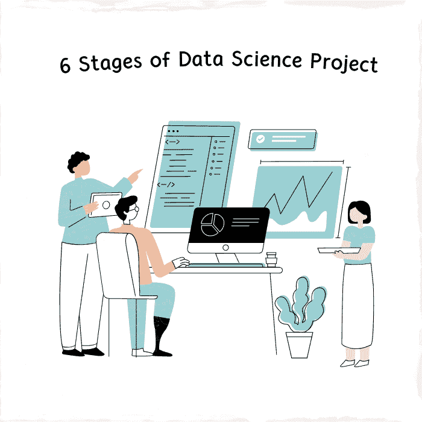

图片由作者提供

数据科学是一个不断发展的领域。让我用两项不同的研究来支持这一点。

* * *

## 我们的前三大课程推荐

 1\. [谷歌网络安全证书](https://www.kdnuggets.com/google-cybersecurity) - 快速进入网络安全职业生涯。

 2\. [谷歌数据分析专业证书](https://www.kdnuggets.com/google-data-analytics) - 提升你的数据分析技能

 3\. [谷歌 IT 支持专业证书](https://www.kdnuggets.com/google-itsupport) - 支持你的组织的 IT

* * *

第一个研究来源于[Linkedin](https://www.linkedin.com/pulse/linkedin-jobs-rise-2022-25-us-roles-growing-demand-linkedin-news)，完成于 2022 年。该研究展示了过去 5 年中增长最快的职位名称。机器学习工程师的职位是第四个增长最快的职位。它是数据科学的一个分支。

作为一名数据科学家，你必须构建自己的机器学习模型并将其投入生产。当然，你还应该了解网络爬虫，以及数据科学项目的所有其他阶段。你可以在文章的以下部分中找到这些内容。

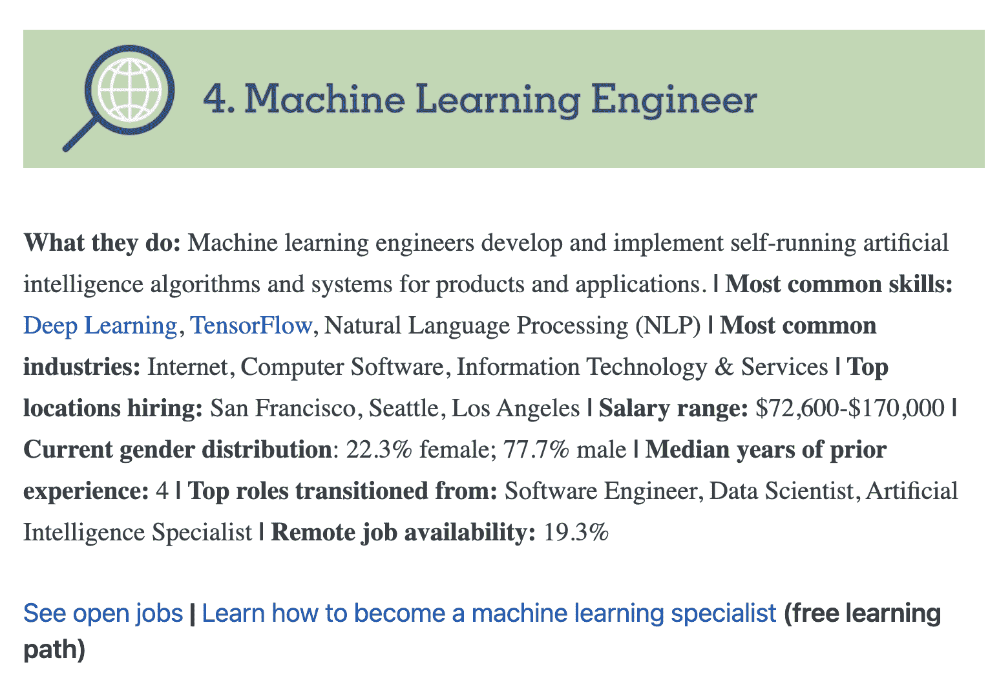

图片来源：[LinkedIn](https://www.linkedin.com/pulse/linkedin-jobs-rise-2022-25-us-roles-growing-demand-linkedin-news)

第二项研究来自于[Glassdoor](https://www.glassdoor.com/List/Best-Jobs-in-America-LST_KQ0,20.htm)。它显示数据科学在美国 50 个最佳职位中排名前三。此外，这种情况在过去七年中一直保持不变。让我们看看这些统计数据。10,071 个职位空缺和 4.1/5 的职位满意度可能是它成为最佳职位之一的原因。此外，中位数基本工资为每年$120,000。

图片来源：[Glassdoor](https://www.glassdoor.com/List/Best-Jobs-in-America-LST_KQ0,20.htm)

现在，数据科学作为一个不断发展的领域变得更加明显。同时，行业需求也显得非常有前景。

由于这种需求，学习数据科学的选项正在增加。在线课程和网站是学习数据科学概念的流行方式。

# 选择正确的数据科学项目

掌握理论之后，做真实项目将使你为工作面试做好准备。这也有助于丰富你的作品集。

然而，初级开发者所做的项目常常存在重叠。例如，房价预测、识别鸢尾花或预测泰坦尼克号的幸存者。尽管这些项目很有用，但将这些项目包括在你的作品集中可能不是最好的选择。

**为什么？**

因为招聘人员查看你的简历的时间非常有限。这是另一项研究，应该让你更加意识到这一点。这是[ladders](https://www.theladders.com/static/images/basicSite/pdfs/TheLadders-EyeTracking-StudyC2.pdf)进行的眼动追踪研究。这一职业网站显示，招聘人员平均只看你的简历 6 秒钟。

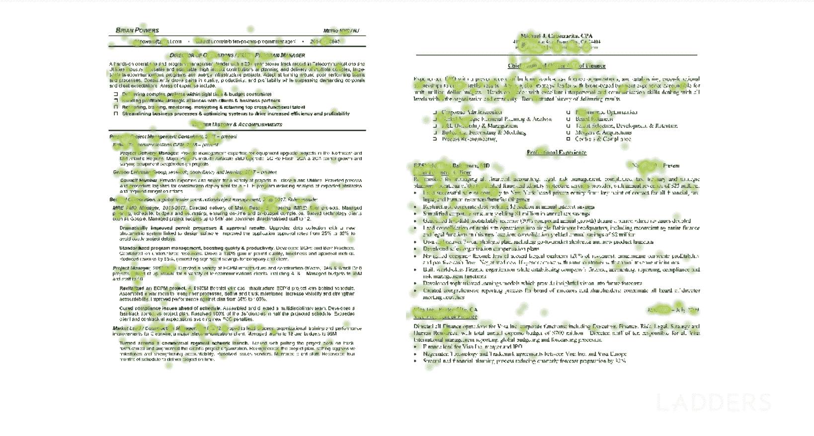

图片来自[theladders](https://www.theladders.com/static/images/basicSite/pdfs/TheLadders-EyeTracking-StudyC2.pdf)

现在，我已经提到数据科学的受欢迎程度。由于其受欢迎程度，许多开发者已经迈出了一步。因此，这使得该领域竞争非常激烈。

为了让自己与众不同，你必须做出引人注目的新颖项目。你必须遵循某些阶段，以使这些项目达到最佳效果。这样，你不仅通过做不同于他人的项目脱颖而出，还通过全面而系统的工作吸引招聘人员的注意力并保持他们的关注。

这是项目阶段的概述。

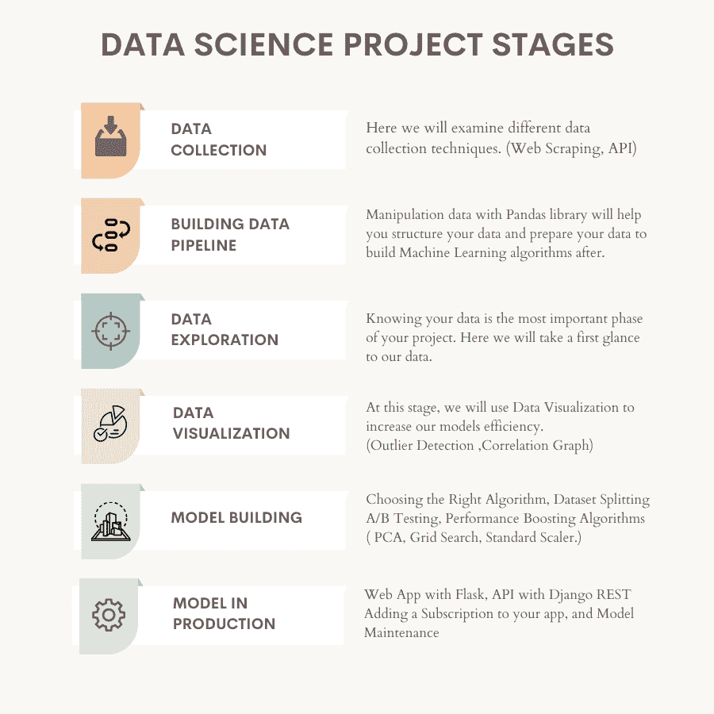

图片由作者提供

现在我们来逐一查看。我还会给你不同项目和编码库的链接。在这种情况下，没有必要重新发明轮子。

# 1\. 数据收集

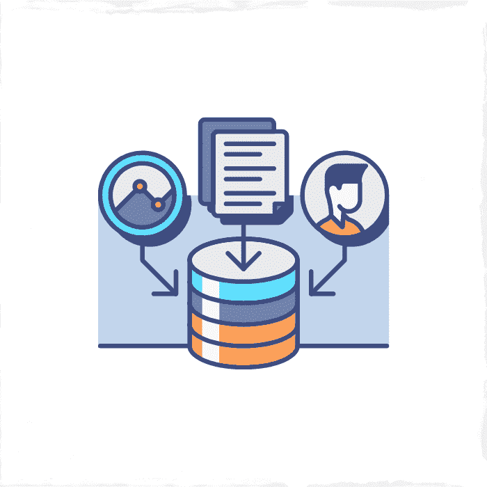

图片由作者提供

数据收集是从不同来源收集数据的过程。在过去的 10 年中，来自不同来源的数据量不断增长。

到 2025 年，收集的数据量将增加到今天的近三倍。

这是 IDC 进行的[研究](https://www.import.io/wp-content/uploads/2017/04/Seagate-WP-DataAge2025-March-2017.pdf)，展示了不同类型的数据创建变化。

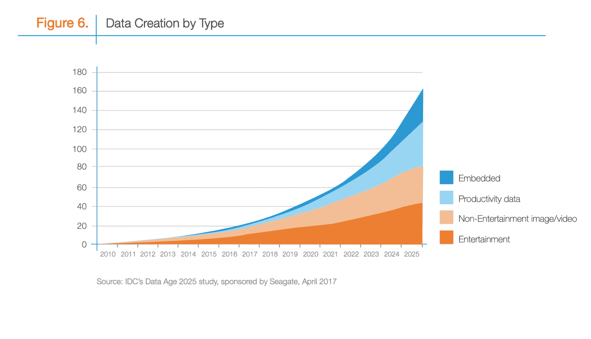

图片来自[import.io](https://www.import.io/wp-content/uploads/2017/04/Seagate-WP-DataAge2025-March-2017.pdf)

这意味着收集的数据量将继续增加。这是企业和开发者抓取更多数据的机会。

## 为什么你需要更多的数据？

数据收集后，最后阶段将是模型构建和部署到生产环境。因此，提高模型性能将非常重要。一个方法是通过收集更多数据来实现。在这里，主要关注的是如何随着数据量的增加来提升模型的性能。

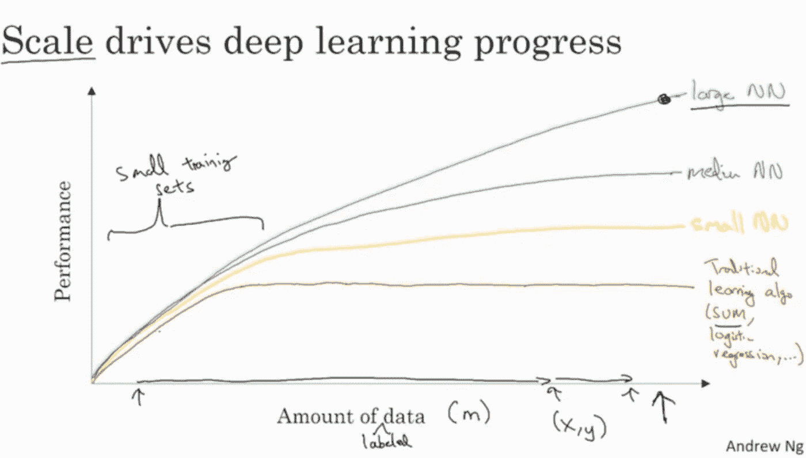

图片来源于[Deeplearning.AI](https://www.deeplearning.ai/)

现在，已经有许多不同的技术来收集数据。在这里，我将解释其中的 3 种：从不同的文件源读取、网页爬取和 API。

## 从不同文件源收集数据

许多网站和公司会以良好的格式呈现数据。然而，在你的编码环境中读取这些数据需要几行代码。

例如，[这个项目](https://platform.stratascratch.com/data-projects/marketing-campaign-results)旨在分析那些负债累累却难以偿还的人群的数据。正如你所看到的，这个项目也从使用[pandas 中的 read_csv](https://pandas.pydata.org/docs/reference/api/pandas.read_csv.html)函数读取数据开始。

现在你有了数据，可以进行这个项目所要求的探索性数据分析。

关于如何操作的更多细节，请参阅[这里](https://www.youtube.com/watch?v=sVdNVgtpkD4&t=1s)的视频。

有许多不同的网站可以找到开源数据。

这里有 4 种方法。

+   [Kaggle](https://www.kaggle.com/)

+   [加州大学欧文分校机器学习库](https://archive.ics.uci.edu/ml/datasets.php)

+   [Google 数据集](https://datasetsearch.research.google.com/)

+   [AWS 数据集](https://registry.opendata.aws/)

找到数据并使用 Python 函数读取它们，就像上面所做的那样。如果你的数据以其他格式（[HTML](https://pandas.pydata.org/pandas-docs/stable/reference/api/pandas.read_html.html)、[JSON](https://pandas.pydata.org/docs/reference/api/pandas.read_json.html)、[excel](https://pandas.pydata.org/pandas-docs/stable/reference/api/pandas.read_excel.html)）存在，你也可以使用[Pandas 函数](https://pandas.pydata.org/pandas-docs/stable/reference/io.html)来读取它们。

## 网页爬取

网页爬取是使用自动化工具通过网络抓取数据的过程。这意味着使用爬虫和抓取器。它们映射网站 HTML，然后按照给定的指令收集数据。

### 爬虫工具

网页爬虫会寻找可以从网站上获取的信息。它帮助你找到包含你想要抓取的信息的 URL。

### 爬虫

抓取器收集你预设的信息。每个抓取器都有一个选择器来定位你想从网站上获取的信息。

### 它是如何工作的？

通常，它们是一起工作的。首先，爬虫程序获取有关你的主题的信息并找到 URLs。然后，抓取程序通过使用选择器来定位你需要的信息。在最后一步，你抓取这些数据。

### 数据抓取 Python 库

在 Python 中，你可以通过使用不同的库来抓取数据。这里有 4 个库供你参考。

+   [BeautifulSoup](https://www.crummy.com/software/BeautifulSoup/bs4/doc/)

+   [Scrapy](https://docs.scrapy.org/en/latest/)

+   [Selenium](https://selenium-python.readthedocs.io/)（这个不是官方文档，但我觉得更易读。）

+   [Request](https://requests.readthedocs.io/en/latest/)

这是[Ken Jee 的视频](https://www.youtube.com/watch?v=GmW4F6MHqqs)。你可以看到他将数据科学项目分成不同步骤的 YouTube 系列。在[第二个视频](https://www.youtube.com/watch?v=GmW4F6MHqqs)中，他解释了数据收集的重要性。然后，他使用 Selenium 从 Glassdoor 抓取数据，以对数据科学家的薪资进行数据分析。

## API

作者提供的图片

API 代表应用程序编程接口，用于不同程序之间的通信。它帮助两个程序或应用程序之间传递信息。

### YouTube 抓取 API

这是一个用于在下一个视频中收集数据的[YouTube API](https://developers.google.com/youtube/v3)。它允许你获取频道统计数据，例如总订阅者数和观看次数、视频名称、评论等。

在这个[视频](https://www.youtube.com/watch?v=D56_Cx36oGY)中，The Vu Data Analytics 频道使用 YouTube API 从 YouTube 抓取数据。

首先，数据会被处理。之后进行探索性数据分析、可视化等。

你可以看到与之前视频的一些相似之处，比如清理数据和进行解释性分析。这是正常的，因为大多数数据项目都会经历相同的阶段。但你在这些阶段中使用的数据和使用方式会提升你的项目并丰富你的作品集。

# 2\. 构建数据管道

作者提供的图片

这是将你未结构化的数据转化为有意义版本的阶段。这里的管道术语侧重于转换。有时这个阶段也被称为数据清理，但可视化管道并将其分配到数据阶段是有意义的。

抓取数据后，数据通常不会处于最佳状态。这就是为什么改变其格式是必要的。例如，如果你有少量数据但包含许多[NAs 或缺失值](https://pandas.pydata.org/docs/user_guide/missing_data.html)，将这些值填充为列的平均值将帮助你使用这些数据。

或者例如，如果你处理的是 [日期时间列](https://pandas.pydata.org/docs/user_guide/timeseries.html)，你列的数据类型可能是对象。这会阻止你对该列应用日期时间函数。因此，你应该将这一列的数据类型转换为日期时间型。

拥有更多高质量的数据可以帮助你构建更有效的模型。

让我们给出一个机器学习中需要的转换示例。如果你构建一个模型，你的变量应该是数值型的。然而，有些数据包含类别信息。为了将这些变量转换为数值型，你应该进行 [独热编码](https://scikit-learn.org/stable/modules/generated/sklearn.preprocessing.OneHotEncoder.html)。

# 3\. 数据探索

作者提供的图片

在进行项目时了解你的数据是非常重要的。为此，你必须首先使用不同的函数对数据进行探索。

下面是一些常用的 Pandas 函数，用于数据探索。

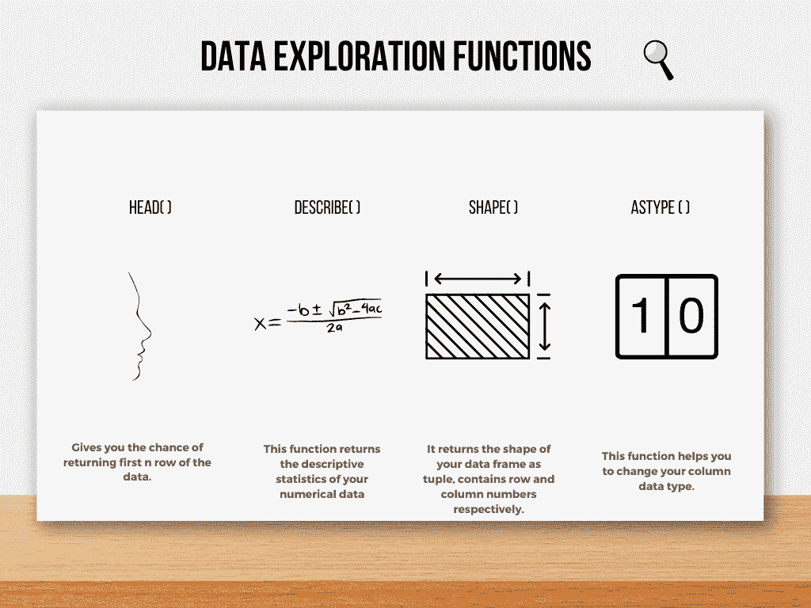

作者提供的图片

## 数据的初步查看

[head( )](https://pandas.pydata.org/pandas-docs/stable/reference/api/pandas.DataFrame.head.html) 函数让你有机会查看数据的前几行。同时，info( ) 函数会提供有关数据列的一些信息，例如长度和数据类型。

[describe( )](https://pandas.pydata.org/docs/reference/api/pandas.DataFrame.describe.html) 函数会提供描述性统计的总结。

[shape( )](https://numpy.org/devdocs/reference/generated/numpy.shape.html) 函数会提供有关数据维度的信息，输出为行/列的元组。

[astype( )](https://pandas.pydata.org/pandas-docs/stable/reference/api/pandas.DataFrame.astype.html) 函数帮助你改变列的格式。

此外，你可能不会仅仅处理一个数据集，因此合并数据也是你常用的操作。

# 4\. 数据可视化

作者提供的图片

如果你可视化数据，从中提取有意义的信息会变得更容易。在 Python 中，你可以使用许多库来可视化数据。

+   [Matplotlib](https://matplotlib.org/)

+   [Seaborn](https://seaborn.pydata.org/)

+   [Pandas](https://pandas.pydata.org/docs/reference/api/pandas.DataFrame.plot.html)

+   [Plotly](https://plotly.com/python/)

你应该利用这个阶段来检测异常值和相关的预测变量。如果未被检测，它们会降低你的机器学习模型性能。

创建图形使得这种检测更容易。

## 异常值检测

异常值通常是由于异常情况发生的，它们不会帮助你的模型预测。检测异常值后需要将其从数据中移除。

[这里](https://platform.stratascratch.com/data-projects/market-analysis-dublin?tabname=assignment)我们可以看到这个分布图，它显示了人们在都柏林的 Airbnb 上愿意为一个房间支付的最高价格。

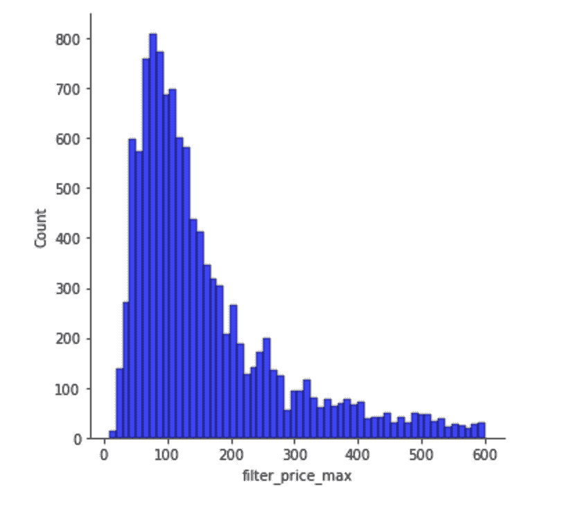

大多数人搜索每晚低于$200 的房间，尤其是在$100 左右每晚。然而，也有一些人搜索价格在 500-600 之间的房间。

在构建模型时，在某个层级对其进行筛选将帮助你更准确地预测行为。

## 相关图

图片由作者提供

[这里](https://platform.stratascratch.com/data-projects/delivery-duration-prediction)，相关图检测相关的预测因子，这会降低你的模型性能。你可以看到图右侧的颜色刻度，显示了随着颜色密度的增加，相关性也增加，无论是负相关还是正相关。

# 5. 模型构建

图片由作者提供

这里你可以看到模型构建的不同阶段。

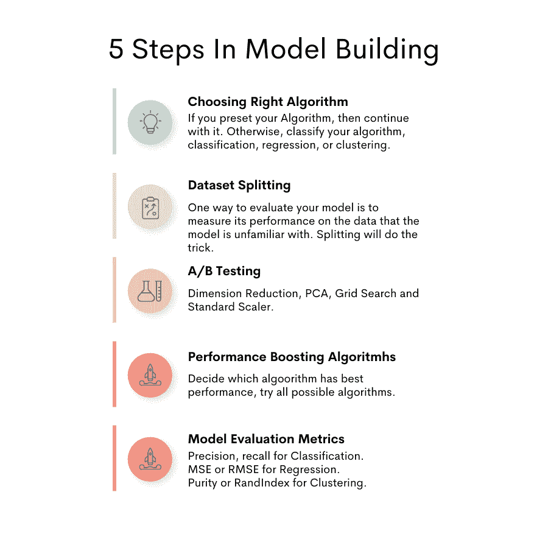

图片由作者提供

## 选择合适的算法

构建模型的第一步是选择使用哪种算法类型。当然，这取决于你的主题。

你是否处理数值数据并计划进行预测？那么你的选择将是[回归](https://scikit-learn.org/stable/supervised_learning.html#supervised-learning)。或者你想用[分类](https://scikit-learn.org/stable/supervised_learning.html#supervised-learning)算法对图像进行分类？这取决于你的项目。例如，异常检测通常是一个受欢迎的项目内容。它可以用于信用卡欺诈检测，并在后台使用[聚类](https://scikit-learn.org/stable/modules/clustering.html#clustering)算法。当然，你也可以在项目中使用[深度学习](https://www.tensorflow.org/?gclid=Cj0KCQiAkMGcBhCSARIsAIW6d0DKsxizRs0kcr0r3bcwmvwmpCFofj_daKrcjgctLydLxFl9respIxYaAsBFEALw_wcB)。

## 数据集拆分

评估模型的一种方法是测量其在模型不熟悉的数据上的性能。将数据拆分为训练集和测试集有助于实现这一点。

你使用训练数据集训练模型，然后使用测试集测试模型的性能，测试集包含模型不熟悉的数据。

在这个阶段，如果你已经知道将使用哪个模型，你可以跳过使用验证集。然而，如果你想尝试不同的模型以找出哪个最好，使用验证集是适合你的。

## A/B 测试

在选择算法并划分数据集后，是时候进行 A/B 测试了。

有不同的算法。你如何确定哪个算法最适合你的模型？一个检查的方法是称为 A/B 测试的技术。在机器学习中，A/B 测试意味着你将尝试不同的模型，以找到最适合你的项目的那个。

尝试所有可能的算法，并找到表现最好的算法，然后继续使用它。

## 性能提升算法和技术

图片由作者提供

你的模型的性能通常可以通过使用不同的技术来提升。让我们重点讨论其中的三种。

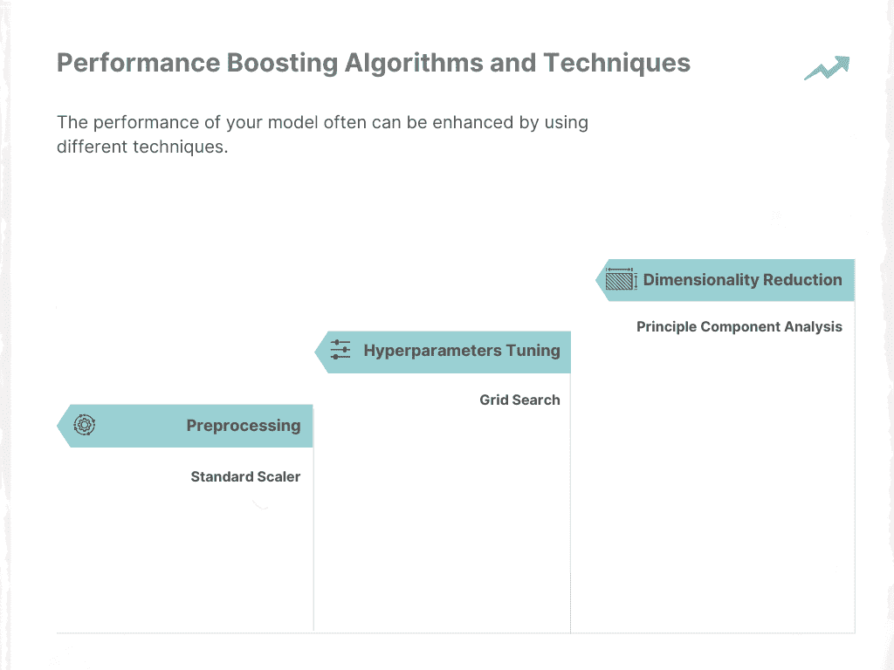

图片由作者提供

### 降维

降维用于找到那些能比其他特征更好地表示数据的预测变量。这项技术使你的算法运行更快，模型预测效果更佳。

[这里](https://scikit-learn.org/stable/modules/decomposition.html#decompositions)你可以看到在 sci-kit learn 库中应用降维技术的例子。

**PCA**

PCA 代表主成分分析，它帮助你确定需要多少个预测变量来解释数据集的某一百分比。

让我通过一个[例子](https://platform.stratascratch.com/data-projects/delivery-duration-prediction?tabname=assignment)来解释一下，预计的交货时间是预测的。有 100 个预测变量，因此消除它们将有助于提升算法的速度，并使结果有更好的表现。这就是为什么应用 PCA 算法的原因。

PCA 表明，至少需要 60 个代表性特征来解释 80%的数据集。这是[代码](https://scikit-learn.org/stable/modules/decomposition.html#principal-component-analysis-pca)，在 sci-kit learn 库中提供了解释。

### **超参数调优**

在构建机器学习模型时，会有很多不同的参数可以用于预测。**超参数调优**帮助我们根据项目需求找到这些参数中的最佳值。

**网格搜索**

网格搜索帮助你找到最佳的参数值，以优化你的机器学习模型。

[这里](https://scikit-learn.org/stable/modules/grid_search.html#grid-search)是 sci-kit learn 库中的代码，解释了什么是网格搜索，并提供了实现代码。

### 预处理

这有助于将变量缩放到相同的水平，这样你的预测算法就能更快地工作。

**标准化器**

主要思想是将预测变量的均值变为零，并将标准差调整为 1。 [这里](https://scikit-learn.org/stable/modules/generated/sklearn.preprocessing.StandardScaler.html#sklearn.preprocessing.StandardScaler) 是 sci-kit learn 库的代码，帮助你计算这一点。

## 模型评估指标

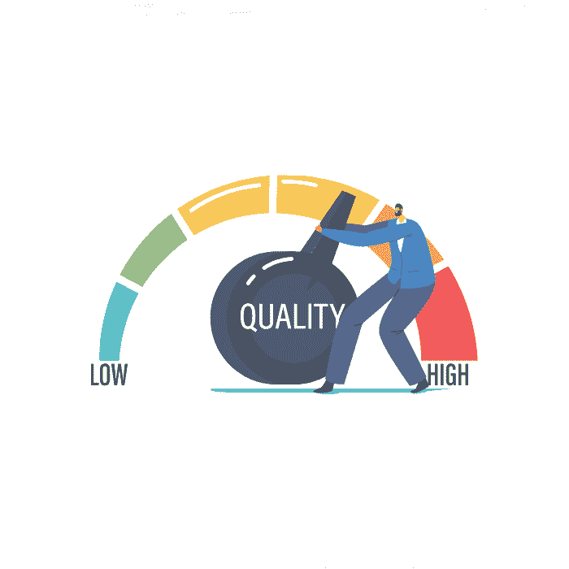

图片由作者提供

这一步帮助我们解读模型。这就是为什么不同算法有不同的评估指标。算法结果的解读会根据问题的类型有所不同：回归、分类或聚类。

### 回归

这是一种找出数值变量之间关系的技术。简单来说，我们将使用回归来预测数值变量。

这里是回归问题的两个评估指标。

**均方误差（MSE）**

均方误差是通过找到预测值和实际值之间的差异并对结果进行平方来计算的，适用于数据集中的每一个元素。

这里是公式。

[这里](https://scikit-learn.org/stable/modules/generated/sklearn.metrics.mean_squared_error.html) 是 Python 中使用 sci-kit learn 实现 MSE 的代码。

**均方根误差（RMSE）**

RMSE 是 MSE 的平方根。

这里是公式。

[这里](https://scikit-learn.org/stable/modules/generated/sklearn.metrics.mean_squared_error.html) 是 Python 中使用 sci-kit learn 实现 RMSE 的代码。

### 分类

分类算法将数据分成不同的组，并相应地定义它们。

分类评估过程通常包括混淆矩阵，其中包括真实类别和预测类别。（真正例，假正例，真负例，假负例）

[这里](https://scikit-learn.org/stable/modules/generated/sklearn.metrics.confusion_matrix.html) 是 sci-kit learn 中混淆矩阵的实现。

**精度**

这是用来评估正预测的准确性。

这里是公式。

TP = 真正例

FP = 假正例

[这里](https://scikit-learn.org/stable/modules/generated/sklearn.metrics.precision_score.html) 是 Python 中使用 sci-kit learn 实现精度的代码。

**召回率**

召回率或敏感性，是算法正确分类的正例的比例。

这里是公式。

FN: 假阴性

[这里](https://scikit-learn.org/stable/modules/generated/sklearn.metrics.recall_score.html) 是使用 sci-kit learn 实现召回率的 Python 代码。

**F1 分数**

这是精确率和召回率的调和平均数。

这是公式

### 聚类

聚类的第一步是将数据点分组为一个簇。第二步是分配它们。

如果你选择了聚类算法，以下是两个评估指标来解释你模型的表现。我还添加了它们的公式和 sci-kit learn 库的链接。

**纯度**

纯度是正确分类的总数据点的百分比。

这是公式

要计算纯度，首先应计算 [混淆矩阵](https://scikit-learn.org/stable/modules/generated/sklearn.metrics.confusion_matrix.html)。

**RandIndex**

它衡量两个簇之间的相似性。

TP = 真阳性

FP = 假阳性

TN = 真阴性

FN = 假阴性

[这里](https://scikit-learn.org/stable/modules/generated/sklearn.metrics.rand_score.html) 是使用 sci-kit learn 实现 RandIndex 的 Python 代码。

# 6. 生产中的模型

作者提供的图片

在构建你的机器学习模型之后，是时候通过将模型展示给不同用户来查看其性能了。这儿我将说明如何通过使用 Python 中的两个不同库：Flask 和 Django 来实现。

此外，还有不同的选项来运行和托管你的模型，例如 [Heroku](https://www.heroku.com/)、[Digitalocean](https://www.digitalocean.com/)、[pythonanywhere.com](https://www.pythonanywhere.com/)，你可以将它们用于自己的项目。

## 使用 Flask 的 Web 应用程序

Flask 是一个 Python 库，允许你编写 Web 应用程序。欲了解更多信息，请访问官方 [网站](https://flask.palletsprojects.com/en/2.2.x/)。

假设你开发了一个 [机器学习模型](http://gencay.pythonanywhere.com/) 来预测用户的体重，使用体测数据和年龄。

为此，你首先需要访问数据，以便构建多元线性回归。在这里，你可以访问体脂预测的开源 [数据集](https://www.kaggle.com/datasets/fedesoriano/body-fat-prediction-dataset)，以创建一个预测体重的机器学习模型。

使用 pythonanywhere.com，你可以同时运行和托管你的模型。

## 使用 Django REST 的 API

我已经提到过 API 的定义，现在我将提及它的实现选项。你可以通过使用 Django REST 框架来编写你的 API。Django 类似于 flask，是一个微型 Web 框架。通过使用它，你还可以编写应用程序的后台和前台代码，同时编写 API。

让我们谈谈使用 Django REST 开发 API 的优势。

社区活跃，文档丰富。

此外，[这里](https://www.techrepublic.com/article/build-apis-python/)是其他 Python 框架；通过使用这些框架，你可以开发一个 API。

在这六个主要项目阶段之外，这里还有两个额外的阶段。

## 为你的应用程序添加订阅

你可以在你的 Web 应用程序中包含订阅计划。假设你开发了一个 OCR 算法，旨在通过图像处理从文档中提取信息，比如 [Docsumo](https://docsumo.com/)。

这里是他们定价系统的不同选项。

图片来自 [docsumo.com](https://www.docsumo.com/pricing)

当然，在将你的 Web 应用程序转变为业务之前，还需要经历许多阶段，但最终目标可能是这样的。

要通过使用 API 获得收入，可以在 [网站](https://rapidapi.com/) 上传你的 API，它还包含了成千上万的不同 API。

你可以通过添加不同的订阅选项来实现 API 的货币化，并在之后获得收入。

这是一个面部识别 [api](https://rapidapi.com/eyerecognize/api/face-detection-and-facial-features/pricing)，它帮助你将文本转换为语音。这个 API 可能在后台使用 CNN 来识别面部。

图片来自 [RapidAPI](https://rapidapi.com/eyerecognize/api/face-detection-and-facial-features/pricing)

如果你想开发一个面部识别算法，可以参考 Adem Geitgay 编写的 [教程](https://medium.com/@ageitgey/machine-learning-is-fun-part-4-modern-face-recognition-with-deep-learning-c3cffc121d78)，该教程解释了面部识别的阶段，而无需深入，并通过开发自己的库使其更易于理解。

## 模型维护

图片由作者提供

将模型上传到生产环境后，它应该定期维护。由于模型将使用用户的信息，因此你的算法应该定期更新。

假设你构建了一个深度学习模型，用于预测用户照片中两个物体之间的距离。在训练模型时，你可能会使用高质量的图像。然而，现实生活中的数据可能不会达到你期望的质量。

在查看评估指标时，你可能会看到由于技术问题导致模型性能下降。当然，还有许多可能的解决方案来克服这个问题。

其中一种方法是向模型中的图片添加噪声。

这样，你的模型也将具备预测低质量图像的能力。

因此，为了保持模型的性能始终较高，需要定期进行类似的更新。同时，你还应定期关注客户反馈，以确保他们对你的工作感到满意，并排除他们的问题。

# 最后的想法

创建项目通常从数据收集开始。为了与众不同，使用我在文章中提到的一些或所有数据收集选项。此外，还可以使用不同的开源网站，以获取不同的数据集。

在收集数据、构建管道并将数据转换为正确格式后，接下来是从中提取有意义的信息，通过探索和可视化来完成。下一阶段是构建模型。

在这里，我们检查了模型构建和性能提升算法，以及评估指标。

当然，将模型部署到生产环境中有很多选择，我已经覆盖了一些。

遵循这些阶段将帮助你在项目中取得成功，丰富你的作品集，并获得潜在收入。

随着经验的积累，根据需要在这些阶段之间添加阶段是可以的。

在完成项目后，尝试将这些阶段映射到你的脑海中。因为详细解释这些阶段给面试官，也将帮助你在面试中表现出色并获得新工作。

**[内特·罗西迪](https://www.stratascratch.com)** 是一位数据科学家和产品战略专家。他还是一位兼任教授，教授分析学，并且是 [StrataScratch](https://www.stratascratch.com/) 的创始人，这是一个帮助数据科学家准备面试的平台，提供来自顶级公司的真实面试问题。可以通过 [Twitter: StrataScratch](https://twitter.com/StrataScratch) 或 [LinkedIn](https://www.linkedin.com/in/nathanrosidi/) 与他联系。

### 更多相关主题

+   [前 7 名模型部署和服务工具](https://www.kdnuggets.com/top-7-model-deployment-and-serving-tools)

+   [将机器学习算法完整端到端部署到…](https://www.kdnuggets.com/2021/12/deployment-machine-learning-algorithm-live-production-environment.html)

+   [基础知识回顾第 4 周：高级主题和部署](https://www.kdnuggets.com/back-to-basics-week-4-advanced-topics-and-deployment)

+   [数据科学定义幽默：一些古怪的名言…](https://www.kdnuggets.com/2022/02/data-science-definition-humor.html)

+   [KDnuggets™ 新闻 22:n06，2 月 9 日：数据科学编程…](https://www.kdnuggets.com/2022/n06.html)

+   [KDnuggets 新闻，4 月 6 日：8 门免费 MIT 课程学习数据科学…](https://www.kdnuggets.com/2022/n14.html)
