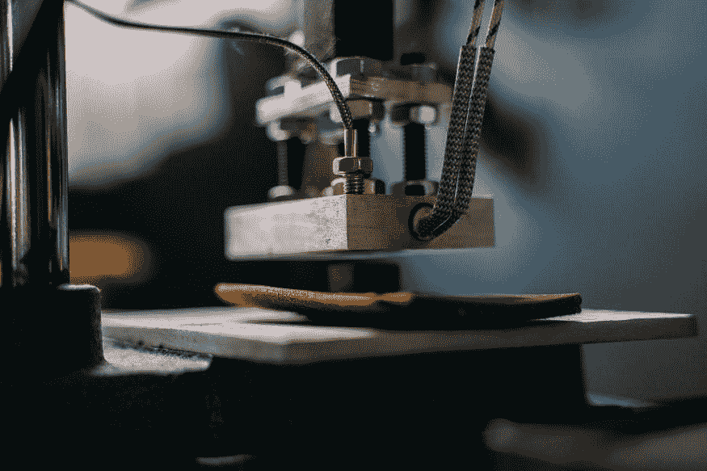
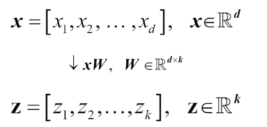
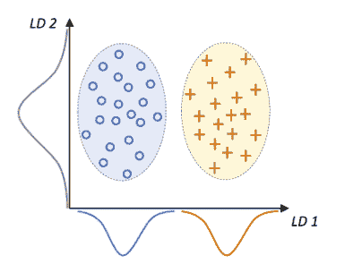
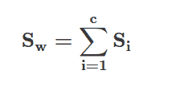
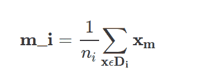
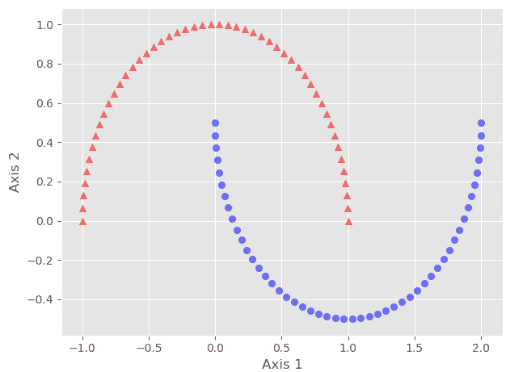
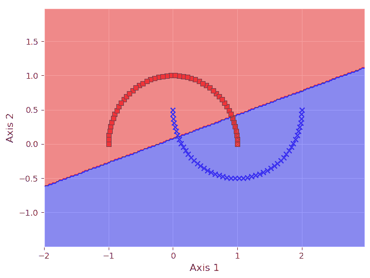
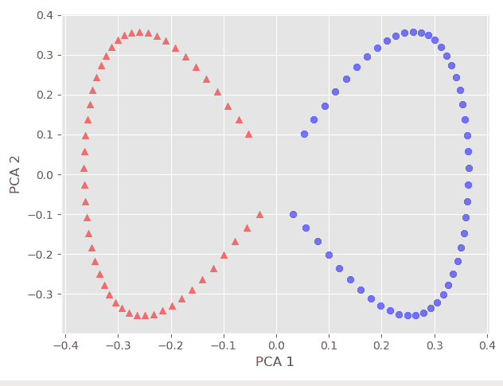
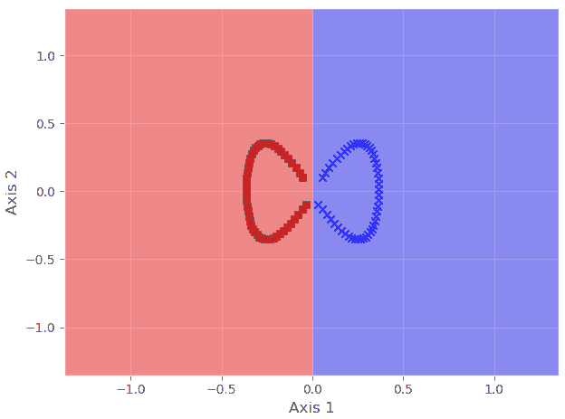
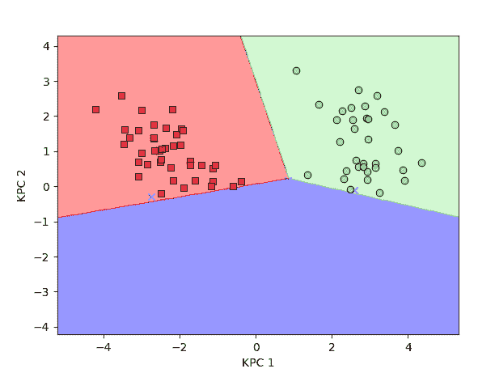

# 通过维度缩减的数据压缩：3 种主要方法

> 原文：[`www.kdnuggets.com/2020/12/data-compression-dimensionality-reduction.html`](https://www.kdnuggets.com/2020/12/data-compression-dimensionality-reduction.html)

评论



*照片来自 [Anna Tarazevich](https://www.pexels.com/@anntarazevich?utm_content=attributionCopyText&utm_medium=referral&utm_source=pexels) ，来自 [Pexels](https://www.pexels.com/photo/gray-and-black-metal-machine-5963136/?utm_content=attributionCopyText&utm_medium=referral&utm_source=pexels)。*

* * *

## 我们的三大课程推荐

 1\. [Google 网络安全证书](https://www.kdnuggets.com/google-cybersecurity) - 快速进入网络安全职业生涯。

 2\. [Google 数据分析专业证书](https://www.kdnuggets.com/google-data-analytics) - 提升你的数据分析技能

 3\. [Google IT 支持专业证书](https://www.kdnuggets.com/google-itsupport) - 支持组织中的 IT

* * *

### 为什么要减少数据的维度？

如果你在数据科学领域工作了一段时间，你一定听说过这个短语：

> *维度是一种诅咒。*

这也被称为维度灾难。你可以在[这里](https://en.wikipedia.org/wiki/Curse_of_dimensionality)了解更多关于这个术语的信息。

总的来说，高维数据的一些常见缺点包括：

1.  模型过拟合

1.  [聚类算法](https://towardsdatascience.com/the-curse-of-dimensionality-50dc6e49aa1e)中的困难

1.  非常难以可视化

1.  你的数据中可能存在一些无用的特征

1.  复杂且昂贵的模型

还有其他缺点，你可以在 Google 上搜索并查看详细信息。

在本文中，我们将讨论三种重要而著名的技术，这些技术将帮助你在减少数据维度的同时保持有用的特征或信息。

这三种基本技术分为两部分。

1.  **线性维度缩减**

+   PCA（主成分分析）

+   LDA（线性判别分析）

1.  **非线性维度缩减**

+   KPCA（核主成分分析）

我们将讨论每种技术的基本思想、在 sklearn 中的实际应用，以及每种技术的结果。

### PCA（主成分分析）

主成分分析是用于无监督数据压缩的最著名数据压缩技术之一。

PCA 帮助我们识别数据集中的模式，基于它们之间的相关性。或者简单来说，它是一种特征提取技术，通过这种方式将输入变量结合起来，使我们能够丢弃不重要的特征，同时保留数据集中重要的信息。PCA 找到最大方差的方向，并将数据投影到较低维度的空间中。新子空间的主成分可以解释为在新特征轴彼此正交的约束下的最大方差方向。


*图片来源：[Python 机器学习 repo](https://github.com/rasbt/python-machine-learning-book-3rd-edition/blob/master/ch05/ch05.ipynb).*

这里，x1 和 x2 是原始特征轴，PC1 和 PC2 是主成分。

在使用 PCA 进行降维时，我们构建一个变换矩阵 **W**，其维度为 ***d *x *k***，这允许我们将样本向量 **x** 映射到一个新的 k 维特征子空间中，该子空间的维度比原始 *d* 维特征空间要少。



通常，*k* 远小于 *d*，因此第一个主成分具有最大的方差，以此类推。

PCA 对数据缩放非常敏感，因此在使用 PCA 之前，我们必须标准化特征，并将它们调整到相同的尺度。

PCA 在 Python 中从头实现很简单，且在 sklearn 中提供了内置函数。要查看从头实现的代码，请参考这个 [repo](https://github.com/rasbt/python-machine-learning-book-3rd-edition/blob/master/ch05/ch05.ipynb)。我们将回顾 sklearn 中的实现。

**Sklearn 代码：**

首先，我们必须导入数据集并进行预处理。

```py
import pandas as pd
df = pd.read_csv('https://archive.ics.uci.edu/ml/'
                 'machine-learning-databases/wine/wine.data',
                  header=None)
print(df.head)

```


这是我们的数据框，其中第 0 列包含类别标签（1,2,3），第 1 到 13 列包含特征。让我们将它们分别分配给 **X** 和 **y**。

```py
X = df.iloc[:, 1:] #all rows, columns starting from 1 till end
y = df.iloc[:, 0] #all rows, only 0th column

```

现在，让我们将数据集拆分为训练集和测试集。

```py
from sklearn.model_selection import train_test_split
X_train, X_test, y_train, y_test = train_test_split(X, y, stratify=y, test_size=0.2, random_state=0)

```

既然我们已经分割了数据集，让我们应用标准化缩放器来标准化我们的特征。

```py
from sklearn.preprocessing import StandardScaler
sc = StandardScaler()
X_train_std = sc.fit_transform(X_train)
X_test_std = sc.transform(X_test)

```

现在，我们要做的就是对它执行 PCA。

```py
from sklearn.decomposition import PCA
#pca = PCA()

```

现在，我们可以传递我们想要保留多少百分比的方差，或者主成分的数量。例如，如果我们想要保留数据的 80%信息，我们可以使用 *pca = PCA(n_components=0.8)*，或者如果我们希望数据集中有 4 个特征，我们可以使用 *pca = PCA(n_components=4)*。

```py
pca = PCA(n_components=2)
X_train_pca = pca.fit_transform(X_train_std)
print(X_train_pca.shape)

```


我们可以看到，我们已经从 13 个特征减少到 2 个特征。为了检查我们保存了多少信息，我们可以做

```py
pca.explained_variance_ratio_

```


为了可视化目的，我们使用了两个特征，因为两个特征可以很容易地进行可视化。我们可以看到，第一个特征有约 36%的信息，而第二个特征有约 18%的信息。因此，我们丢失了 11 个特征，但仍然保留了 55%的信息，这真的很酷。

让我们绘制这两个特征。

```py
colors = ['r','b','g']
markers = ['s','x','o']
for l,c,m in zip(np.unique(y_train), colors, markers):
    plt.scatter(X_train_pca[y_train==l,0],
                X_train_pca[y_train==l,1],
                c=c, label=l, marker=m)
plt.title("Compressed Data")
plt.xlabel("PC1")
plt.ylabel("PC2")
plt.legend()
plt.tight_layout()
plt.show()

```


现在你可以应用任何机器学习算法，它将比最初在 13 个特征上训练的算法收敛得更快。

类似地，如果我想保留 80%的信息，我只需要做的是

```py
pca1 = PCA(n_components=0.8)
X_train_pca = pca1.fit_transform(X_train_std)
X_test_pca = pca1.transform(X_test_std)

```

现在我们可以检查*X_train_pca*的维度。

```py
X_train_pca.shape
>>> (142,5)

```

结果数据集的前 5 行是

```py
X_train_pca[:6, :]

```


通过解释方差比

```py
pca1.explained_variance_ratio_

```


**如何选择 PCA 中的维度数**

实际上，当你拥有良好的计算能力时，我们通常使用网格搜索来找到最佳超参数数量，也用它来找到提供最佳性能的主成分数量。

如果计算能力不足，我们必须在分类器性能和计算效率之间权衡，以选择主成分的数量。

### 通过线性判别分析（LDA）进行监督数据压缩

LDA 或线性判别分析是著名的监督数据压缩方法之一。正如“监督”这个词可能已经给你暗示的那样，它考虑了 PCA 中缺失的类别标签。它也是一种线性变换技术，就像 PCA**一样**。

LDA 使用的方法与 PCA*相似*，即我们将矩阵分解为特征值和特征向量，然后形成一个低维特征空间。然而，它使用了一种监督方法，意味着它考虑了类别标签。

在对数据应用 LDA 之前，我们假设数据是正态分布的，类别具有相同的协方差矩阵，并且训练样本彼此统计独立。一些研究论文证明，如果这些假设中的一个或多个假设稍微被违反，LDA 仍然表现良好。



*来源：[Python 机器学习 Github Repo](https://github.com/rasbt/python-machine-learning-book-3rd-edition/blob/master/ch05/ch05.ipynb)。*

这个图形总结了 2 类问题的 LDA 概念，其中圆圈代表类别 1，+代表类别 2。线性判别 LD 1（*x*-轴）将很好地分离这两个正态分布的类别。而线性判别 LD 2 捕获了数据集中的大量方差，但由于无法获得任何类别区分信息，它会失败。

在 LDA 中，我们基本上是计算类内和类间散布矩阵。然后，我们计算散布矩阵的特征向量和相应的特征值，对其按降序排序，并选择前 ***k*** 个特征向量，这些特征向量对应于 ***k*** 个最大特征值，用于构建 ***d*** x ***k*** 维的变换矩阵 ***W***。然后，我们将样本投影到新的特征子空间中。

我们可以使用以下公式计算 ***类内散布矩阵***：



其中 **c** 是不同类别的总数，***Si*** 是类 ***i*** 的个别散布矩阵，通过以下公式计算：


其中 ***mi*** 是存储类 i 的样本的均值特征值 **μm** 的均值向量。



同样，我们可以计算类间散布矩阵 **S*b:***


这里，**m** 是计算出的整体均值，包括所有 **c** 类别的样本。

在 Python 和 Numpy 中，整个工作并不难，很多人已经完成了。如果你想详细查看从零实现的细节，可以看看这个 [repo](https://github.com/rasbt/python-machine-learning-book-3rd-edition/blob/master/ch05/ch05.ipynb)。

让我们看看它在 Python 的 sklearn 中的实现。

```py
from sklearn.discriminant_analysis import LinearDiscriminantAnalysis as LDA
# we have already preprocessed the dataset in PCA, we will use the same dataset

```

*LinearDiscriminantAnalysis* 是在 sklearn 的 *discriminant_analysis* 包中实现的一个类。你可以在 [这里](https://scikit-learn.org/stable/modules/generated/sklearn.discriminant_analysis.LinearDiscriminantAnalysis.html#sklearn.discriminant_analysis.LinearDiscriminantAnalysis) 查看文档。

第一步是创建一个 LDA 对象。

```py
lda = LDA()
X_train_lda = lda.fit_transform(X_train_std, y_train)
X_test_lda = lda.transform(X_test_std)

```

这里需要注意的一点是，在 *fit_transform* 函数中，我们传递了数据集的标签，并且正如前面讨论的，这是一个监督算法。

这里我们没有设置 *n_components* 参数，因此它会自动决定从公式 *min(n_features, n_classes — 1)* 中选择。如果我们隐式提供了大于此的任何值，它将给我们一个错误。有关更多详细信息，请查看 [文档](https://scikit-learn.org/stable/modules/generated/sklearn.discriminant_analysis.LinearDiscriminantAnalysis.html)。

我们可以通过以下方式检查结果形状

```py
X_train_lda.shape
>>> (124, 2)

```

由于它是二维的，我们可以轻松地绘制所有类别。我们将使用上面相同的代码进行绘图。

```py
colors = ['r','b','g']
markers = ['s','x','o']
for l,c,m in zip(np.unique(y_train), colors, markers):
    plt.scatter(X_train_lda[y_train==l,0],
                X_train_lda[y_train==l,1],
                c=c, label=l, marker=m)
plt.title("Compressed Data")
plt.xlabel("LD 1")
plt.ylabel("LD 2")
plt.legend()
plt.tight_layout()
plt.show()

```


现在，由于我们已经压缩了数据，我们可以轻松地对其应用任何机器学习算法。我们可以看到这些数据是容易线性可分的，因此逻辑回归会给我们相当不错的准确性。

我们在使用 sklearn 的 LDA 时需要注意的一点是，我们不能像在 PCA 中那样以概率形式提供*n_components*。它必须是整数，并且必须满足条件*min(n_features, n_classes — 1)*。

### LDA 与 PCA

你可能会遇到这样的想法：由于 LDA 也考虑了类标签作为其监督算法，结果在某些情况下显示 PCA 比 LDA 表现更好，比如在每个类包含少量示例的图像识别任务中（PCA Vs LDA, A. M. Martinez, and A. C. Kak, *IEEE Transactions on Pattern Analysis and Machine Intelligence*, 23(2): 228-233, 2001）。

### 核 PCA

如前所述，PCA 和 LDA 都是线性降维技术。同样，大多数机器学习算法对数据的线性可分性做出假设，以便完美收敛。

但现实世界并不总是线性的，大多数时候，你必须处理非线性数据集。因此，我们可以看到线性降维技术可能不是这些数据集的最佳选择。


*图片来源： [statistics4u](http://www.statistics4u.info/fundstat_eng/cc_linvsnonlin.html)。*

使用 KPCA，我们可以将非线性的数据显示到一个线性子空间中，在这个子空间上分类器表现得非常好。

KPCA 背后的主要思想是我们必须执行一个非线性映射，将数据转换到一个更高维的空间。

换句话说，我们将我们的*d*-维数据转换到这个更高的*k*-维空间，并定义一个非线性映射函数ϕ。


把ϕ看作一个函数，它通过一些非线性映射将原始*d*-维数据集映射到更大的*k*-维数据集上。

换句话说，我们执行一个非线性映射，将数据集转换到一个更高维度的空间，在那里我们使用标准 PCA 将数据投影回到一个较低维度的线性可分空间。

这种方法的一个缺点是计算成本非常高。为了克服这个问题，我们必须使用**核技巧**，通过它我们可以计算原始特征空间中两个高维特征向量之间的相似性。

现在，核技巧背后的数学细节和直觉很难用书面方式解释。我建议你观看加州理工学院的[this](https://www.youtube.com/watch?v=HbDHohXPLnU&t=30s&ab_channel=caltech)视频，通过它你可以很好地理解 KPCA 和核技巧背后的数学直觉。

如果你想查看 Python 和 scipy 中的实现，我推荐你查看这个[repo](https://github.com/rasbt/python-machine-learning-book-3rd-edition/blob/master/ch05/ch05.ipynb)，其中逐步实现了这个过程。

我们将查看它在 Python 的 sklearn 中的实现。我们要做的是将一个非线性 2-D 数据集转换为线性 2-D 数据集。请记住，KPCA 会将其映射到更高维度，然后再映射到线性可分的较低维度。

```py
from sklearn.datasets import make_moons #non-linear dataset
from sklearn.decomposition import KernelPCA
import matplotlib.pyplot as plt
import numpy as np

```

这里我们导入了重要的库和数据集。

```py
X, y = make_moons(n_samples=100)
print(X.shape)

```


我们可以看到数据集有 100 行和 2 列。让我们查看数据集中类别的数量及其值。

```py
print("Number of Unique Classes", len(np.unique(y)), "\nUnique Values are", np.unique(y))

```


由于我们有 2 个类别，我们可以轻松绘制它们。

```py
#plotting the first class i.e y=0
plt.scatter(X[y==0,0], X[y==0,1],
            color = 'red', marker='^',
            alpha= 0.5)
#plotting the 2nd class i.e y=1
plt.scatter(X[y==1,0], X[y==1,1],
            color = 'blue', marker='o',
            alpha= 0.5)
#showing the plot
plt.xlabel("Axis 1")
plt.ylabel("Axis 2")
plt.tight_layout()
plt.show()

```



在这里我们可以看到两个类别并不线性可分。我们可以通过任何线性分类器来确认。



因此，为了使其线性可分，我们将其转换为更高维度，然后再映射回较低维度，全部使用 KPCA。

```py
kpca = KernelPCA(n_components=2, kernel='rbf', gamma=15) #defining the KenrelPCA object

```

这里我们使用了*kernel='rbf'*和*gamma=15*。有不同的核函数可供使用。它们包括*linear*、*poly*和*rbf*。同样，*gamma*是 rbf、poly 和 sigmoid 核的核系数。关于选择哪个核的详细答案可以在 stats.StackExchange 上阅读，[点击这里](https://stats.stackexchange.com/questions/131142/how-to-choose-a-kernel-for-kernel-pca)。

现在我们只需对数据进行变换。

```py
X_kpca = kpca.fit_transform(X) #transforming our dataset

```

让我们绘制图形以检查现在是否线性可分。

```py
plt.scatter(X_kpca[y==0,0], X_kpca[y==0,1],
            color = 'red', marker='^',
            alpha= 0.5)
plt.scatter(X_kpca[y==1,0], X_kpca[y==1,1],
            color = 'blue', marker='o',
            alpha= 0.5)
plt.xlabel("PCA 1")
plt.ylabel("PCA 2")
plt.tight_layout()
plt.show()

```



我们可以看到我们的数据现在是线性可分的，甚至可以通过任何线性分类器来确认。



在这个例子中，我们通过使用 KPCA 将一个非线性数据集转换为线性数据集。在接下来的例子中，我们将减少之前在 PCA 和 LDA 中使用的葡萄酒数据集的维度。

```py
kpca = KernelPCA(n_components=2)
X_train_kpca = kpca.fit_transform(X_train_std)
X_test_kpca = kpca.transform(X_test_std)

```

这将把我们之前的 13 维数据转变为 2 维线性可分的数据。我们现在可以使用任何线性分类器来获得良好的决策边界和良好的结果。



**学习成果**

在这篇文章中，你学习了 3 种维度降低技术的基础，其中 2 种是线性的，1 种是非线性的或使用了核技巧。你还学习了它们在最著名的 Python 库 sklearn 中的实现。

**相关：**

+   [主成分分析（PCA）中的维度降低](https://www.kdnuggets.com/2020/05/dimensionality-reduction-principal-component-analysis.html)

+   [数据科学中的维度降低是什么？](https://www.kdnuggets.com/2019/01/dimension-reduction-data-science.html)

+   [必知：什么是维度诅咒？](https://www.kdnuggets.com/2017/04/must-know-curse-dimensionality.html)

### 更多相关内容

+   [数据科学中的降维技术](https://www.kdnuggets.com/2022/09/dimensionality-reduction-techniques-data-science.html)

+   [人工智能、分析、机器学习、数据科学、深度学习…](https://www.kdnuggets.com/2021/12/developments-predictions-ai-machine-learning-data-science-research.html)

+   [数据科学与分析行业在 2021 年的主要发展和关键…](https://www.kdnuggets.com/2021/12/developments-predictions-data-science-analytics-industry.html)

+   [2021 年的主要发展及 2022 年人工智能、数据科学的关键趋势](https://www.kdnuggets.com/2021/12/trends-ai-data-science-ml-technology.html)

+   [数据科学方法推动业务成功](https://www.kdnuggets.com/2023/10/nwu-data-science-methods-drive-business-success)

+   [k-means 聚类的质心初始化方法](https://www.kdnuggets.com/2020/06/centroid-initialization-k-means-clustering.html)
