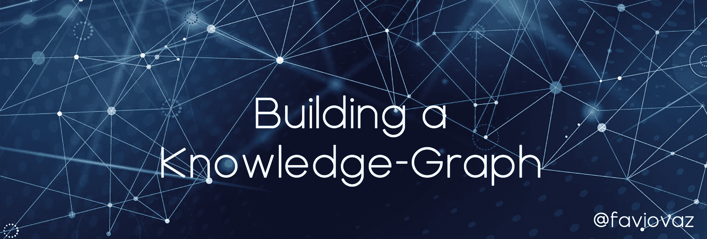
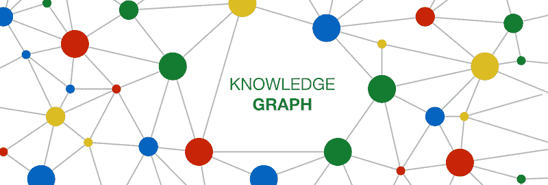
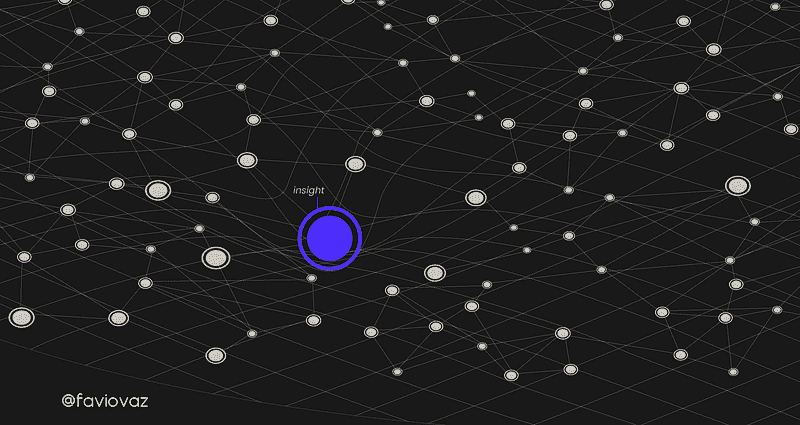
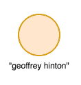
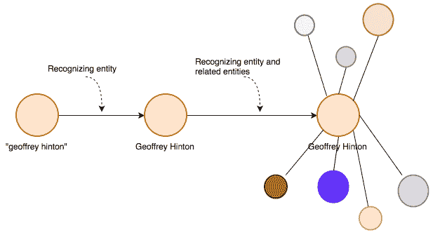
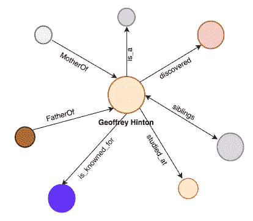
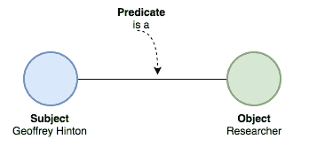
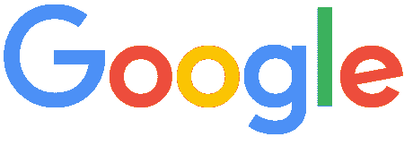
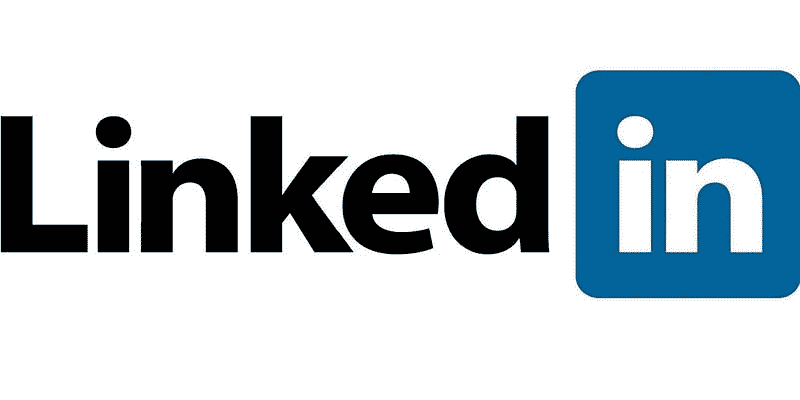
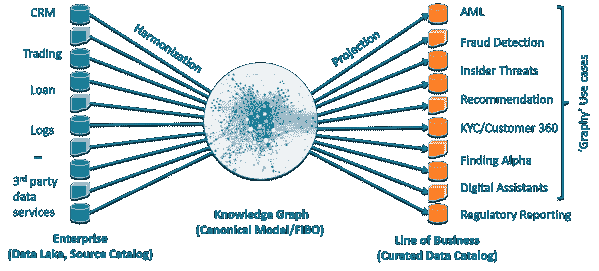

# 机器学习的数据结构 – 第二部分：构建知识图谱

> 原文：[`www.kdnuggets.com/2019/06/data-fabric-machine-learning-building-knowledge-graph.html`](https://www.kdnuggets.com/2019/06/data-fabric-machine-learning-building-knowledge-graph.html)

 评论

### 介绍

* * *

## 我们的前 3 个课程推荐

 1\. [Google 网络安全证书](https://www.kdnuggets.com/google-cybersecurity) - 快速进入网络安全职业

 2\. [Google 数据分析专业证书](https://www.kdnuggets.com/google-data-analytics) - 提升你的数据分析技能

 3\. [Google IT 支持专业证书](https://www.kdnuggets.com/google-itsupport) - 支持你的组织的 IT

* * *

在系列文章的最后：

[**机器学习的数据结构。第一部分。**

*如何利用语义的新进展提高我们在机器学习中的表现。* [towardsdatascience.com](https://towardsdatascience.com/the-data-fabric-for-machine-learning-part-1-2c558b7035d7)

[**机器学习的数据结构。第 1-b 部分：图上的深度学习。**

*图上的深度学习日益重要。在这里，我将展示思考机器学习的基础...* [towardsdatascience.com](https://towardsdatascience.com/the-data-fabric-for-machine-learning-part-1-b-deep-learning-on-graphs-309316774fe7)

我已经在谈论数据结构的一般情况，并给出了一些数据结构中机器学习和深度学习的概念。同时也给出了我对数据结构的定义：

> *数据结构是支持公司中所有数据的平台。它的管理、描述、组合和普遍访问方式。该平台由****企业知识图谱****构成，以创建统一的数据环境。*

如果你查看定义，它会说数据结构是由**企业知识图谱**形成的。因此，我们最好了解如何创建和管理它。

### 目标

**一般**

建立知识图谱理论和构建的基础。

**细节**

+   解释与企业相关的知识图谱概念。

+   关于建立成功的企业知识图谱提供一些建议。

+   展示知识图谱的例子。

### 主要理论

数据结构中的**数据结构**是通过知识图谱构建的，要创建知识图谱，你需要语义和本体来寻找有效的方式将数据链接起来，以独特地识别和连接具有共同业务术语的数据。

### 第一部分。什么是知识图谱？

[`medium.com/@sderymail/challenges-of-knowledge-graph-part-1-d9ffe9e35214`](https://medium.com/@sderymail/challenges-of-knowledge-graph-part-1-d9ffe9e35214)

> 知识图谱由整合的数据和信息集合组成，并且还包含大量不同数据之间的链接。

关键在于，在这种新模型下，**我们正在寻找答案**。我们希望获得事实——这些事实来自哪里并不那么重要。这里的数据可以表示概念、对象、事物、人物，实际上可以是你脑海中想到的任何东西。图谱填补了概念之间的关系和连接。

在这种情况下，我们可以向数据湖提问：

> 这里有什么？

我们在这里的情况不同。一个可以建立框架来研究数据及其与其他数据关系的地方。在知识图谱中，以特定形式的[本体](https://towardsdatascience.com/ontology-and-data-science-45e916288cc5)表示的信息可以更容易被自动信息处理访问，如何最好地实现这一点是计算机科学如数据科学中的一个活跃研究领域。

所有数据建模声明（以及其他所有内容）在本体语言和知识图谱的世界中本质上都是渐进的。事后增强或修改数据模型可以通过修改概念来轻松完成。

通过知识图谱，我们正在构建一个人类可读的数据表示，这个表示唯一标识并连接了带有共同业务术语的数据。这个“层”帮助最终用户自主、安全、可靠地访问数据。

记得这个图像吗？

我之前提出过，数据结构中的洞察力可以被看作是其中的一个**缺口**。发现这种洞察力的自动化过程就是机器学习。

但这个**结构**是什么？它是由知识图谱形成的对象。就像在爱因斯坦的相对论中，结构是由时空的连续体（[或离散体？](https://www.amazon.com/Road-Reality-Complete-Guide-Universe/dp/0679776311)）构成的，这里，结构是在你创建知识图谱时建立的。

构建知识图谱需要链接数据。链接数据的目标是以一种可以轻松消费并与其他链接数据结合的方式发布结构化数据，本体则是我们连接实体并理解它们关系的方式。

### 第二部分：创建成功的企业知识图谱

[`www.freepik.com/free-vector/real-estate-development-flat-icon_4167283.htm`](https://www.freepik.com/free-vector/real-estate-development-flat-icon_4167283.htm)

不久前，[**Sébastien Dery**](https://medium.com/@sderymail) 撰写了一篇关于知识图谱挑战的有趣文章。你可以查看一下：

[**知识图谱的挑战**

*从字符串到事物——介绍* medium.com](https://medium.com/@sderymail/challenges-of-knowledge-graph-part-1-d9ffe9e35214)

来自伟大的博客[cambridgesemantics.com](https://www.cambridgesemantics.com/)

[**学习 RDF**

*介绍 这组课程是对 RDF 的介绍，RDF 是语义网的核心数据模型和基础……* www.cambridgesemantics.com](https://www.cambridgesemantics.com/blog/semantic-university/learn-rdf/)

还有更多的资源，其中一个我在任何文章中都没有提到但非常重要的概念是**三元组**：**主题、对象和谓词**（或*实体-属性-值*）。通常，当你学习三元组时，它们实际上指的是资源描述框架（RDF）。

RDF 是三种基础语义网技术之一，另外两种是 SPARQL 和 OWL。RDF 是语义网的数据模型。

**注意：哦，顺便提一下，几乎所有这些概念都是随着对万维网语义的新定义而来的，但我们将其用于一般的知识图谱。**

我不打算在这里提供框架的完整描述，但我会给你一个它们如何工作的示例。请记住，我这样做是因为这是我们开始构建本体、链接数据和知识图谱的方式。

让我们看一个示例，看看这些三元组是什么。这与 Sebastien 的示例密切相关。

我们将从字符串“geoffrey hinton”开始。

这里我们有一个简单的字符串，它表示第一个边界，即我想了解更多的内容。

现在开始构建知识图谱，系统首先会识别到该字符串实际上指的是**Geoffrey Hinton**。然后，它会识别与此人相关的实体。

然后我们有一些与 Geoffrey 相关的实体，但我们还不知道它们是什么。

顺便提一下，如果你不认识这是**Geoffrey Hinton**：

[`www.thestar.com/news/world/2015/04/17/how-a-toronto-professors-research-revolutionized-artificial-intelligence.html`](https://www.thestar.com/news/world/2015/04/17/how-a-toronto-professors-research-revolutionized-artificial-intelligence.html)

然后系统会开始给关系命名：

现在我们有了命名的关系，我们知道我们的主要实体的连接类型。

该系统可以继续寻找连接的连接，从而创建一个巨大的图谱，代表我们“搜索字符串”的不同关系。

为此，知识图谱使用三元组。像这样：

要获得一个三元组，我们需要一个主题和对象，以及一个连接这两者的谓词。

正如你所看到的，我们有**主体**<Geoffrey Hinton> 与 **对象**<Researcher> 通过 **谓词**<is a> 相关。这对我们人类来说可能听起来很简单，但要用机器完成这项工作需要一个非常全面的框架。

这就是知识图谱形成的方式，以及我们如何使用本体论和语义来链接数据。

那么，我们需要什么来创建一个成功的知识图谱？来自 Cambridge Semantics 的 Partha Sarathi 写了一篇关于此的精彩博客。你可以在这里阅读：

[**创建成功的企业知识图谱**](https://info.cambridgesemantics.com/build-your-enterprise-knowledge-graph)

*自从 Google 在 2012 年通过一篇关于增强网页搜索的流行博客主流化知识图谱以来，企业们……* [blog.cambridgesemantics.com](https://blog.cambridgesemantics.com/creating-a-successful-enterprise-knowledge-graph?utm_campaign=data%20fabric%20drip%20campaign%202019&utm_source=hs_automation&utm_medium=email&utm_content=69101454&_hsenc=p2ANqtz-9BB7227QOhvpzRuILO6HfQFdI4PR1o-4SfjbxqhPYv3rlfuL27w3y9AKEfZ3cs3cbEFc4hmDnnCeu6heguyt8AwCwtcw&_hsmi=69101454)

总结来说，他表示我们需要：

+   **构思它的人：** 你需要具备一些形式的业务关键领域专业知识和技术交集的人才。

+   **数据多样性及其可能的高容量**：企业知识图谱的价值和采用规模与其所涵盖的数据多样性成正比。

+   **构建它的好产品：** ***知识图谱需要具备其他要求，包括良好的治理、安全性、与上游和下游系统的易连接性、可规模化分析性，并且通常需要适应云环境。因此，用于创建现代企业知识图谱的产品需要优化自动化，支持多种输入系统的连接器，提供基于标准的数据输出到下游系统，迅速分析任何数据量，并使治理用户友好。***

你可以在这里阅读更多内容：

[**构建您的企业知识图谱**](https://info.cambridgesemantics.com/build-your-enterprise-knowledge-graph)

*企业知识图谱帮助公司连接复杂的数据源。通过 Anzo®，你可以设计、构建……* [info.cambridgesemantics.com](https://info.cambridgesemantics.com/build-your-enterprise-knowledge-graph)

### 第三部分 知识图谱示例

**Google：**

Google 基本上是一个庞大的知识（不断扩展）图谱，他们基于此创建了也许是最大的数据结构。Google 拥有数十亿个事实，包括有关数百万个对象的信息及其之间的关系。它允许我们在其系统中进行搜索，以发现其中的见解。

在这里你可以了解更多：

**LinkedIn：**

我最喜欢的社交网络 LinkedIn 拥有一个庞大的知识图谱基础，建立在 LinkedIn 上的“实体”之上，如成员、职位、头衔、技能、公司、地理位置、学校等。这些实体及其之间的关系构成了职业世界的本体论。

洞察帮助领导者和销售人员做出业务决策，并提升 LinkedIn 的会员参与度：

[`engineering.linkedin.com/blog/2016/10/building-the-linkedin-knowledge-graph`](https://engineering.linkedin.com/blog/2016/10/building-the-linkedin-knowledge-graph)

记住，LinkedIn（以及几乎所有）知识图谱需要随着新成员注册、新职位发布、新公司、技能和职位在成员资料和职位描述中出现等情况进行扩展。

你可以在这里阅读更多内容：

[**构建 LinkedIn 知识图谱**](https://engineering.linkedin.com/blog/2016/10/building-the-linkedin-knowledge-graph)

*作者：Qi He, Bee-Chung Chen, Deepak Agarwal* engineering.linkedin.com](https://engineering.linkedin.com/blog/2016/10/building-the-linkedin-knowledge-graph)

****金融机构的知识图谱：****

概念模型用于协调来自不同来源的数据，并创建受管控的数据集以供业务使用。

在 [这篇文章](https://blog.cambridgesemantics.com/why-knowledge-graph-for-financial-services-real-world-use-cases) 中，Marty Loughlin 展示了平台 [Anzo](https://www.cambridgesemantics.com/product/) 如何帮助银行，你可以看到这项技术不仅与搜索引擎相关，而且能够处理不同的数据。

在那里，他展示了知识图谱如何帮助这种机构：

+   替代数据用于分析和机器学习

+   利率互换风险分析

+   交易监控

+   欺诈分析

+   特征工程与选择

+   数据迁移

还有更多内容。去看看吧。

### 结论

要创建知识图谱，你需要语义学和本体来找到一种有效的方式将数据链接起来，这样可以唯一标识并连接具有共同业务术语的数据，从而建立数据结构的基础。

当我们构建知识图谱时，需要形成三元组以使用本体和语义连接数据。同时，知识图谱的制造基本上依赖于三点：构思它的人、数据的多样性和一个良好的构建产品。

我们周围有许多我们甚至不知道的知识图谱。世界上最成功的公司正在实施和迁移他们的系统，以构建数据结构，并且当然包括其中的所有内容。

**个人简介：[Favio Vazquez](https://www.linkedin.com/in/faviovazquez/)** 是一名物理学家和计算机工程师，专注于数据科学和计算宇宙学。他对科学、哲学、编程和音乐充满热情。他是西班牙语数据科学出版物 Ciencia y Datos 的创作者。他喜欢新挑战，和优秀团队合作，以及解决有趣的问题。他是 Apache Spark 合作项目的一部分，帮助开发 MLlib、Core 和文档。他热衷于运用自己的知识和专长于科学、数据分析、可视化和自动学习，助力世界变得更美好。

[原文](https://towardsdatascience.com/the-data-fabric-for-machine-learning-part-2-building-a-knowledge-graph-2fdd1370bb0a)。经许可转载。

**相关链接：**

+   我在敏捷数据科学研究中的最佳技巧

+   如何实时监控机器学习模型

+   2018 年 AI/机器学习进展：Xavier Amatriain 总结

### 更多相关主题

+   [构建视觉搜索引擎 - 第一部分：数据探索](https://www.kdnuggets.com/2022/02/building-visual-search-engine-part-1.html)

+   [构建视觉搜索引擎 - 第二部分：搜索引擎](https://www.kdnuggets.com/2022/02/building-visual-search-engine-part-2.html)

+   [微积分：机器学习的隐藏基石](https://www.kdnuggets.com/2022/02/mlm-hidden-building-block-machine-learning.html)

+   [一步步教程：构建你的第一个机器学习模型](https://www.kdnuggets.com/step-by-step-tutorial-to-building-your-first-machine-learning-model)

+   [构建机器学习模型的结构化方法](https://www.kdnuggets.com/2022/06/structured-approach-building-machine-learning-model.html)

+   [机器学习不像你的大脑 第一步：神经元的缓慢,…](https://www.kdnuggets.com/2022/04/machine-learning-like-brain-part-one-neurons-slow-slow-slow.html)
