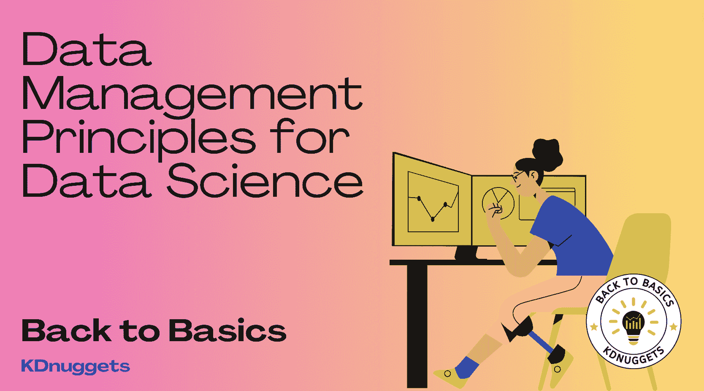

# 数据科学的数据管理原则

> 原文：[`www.kdnuggets.com/data-management-principles-for-data-science`](https://www.kdnuggets.com/data-management-principles-for-data-science)

作者提供的图片

在你作为数据科学家的旅程中，你会遇到挫折，并且克服它们。你将学习到一个过程如何优于另一个过程，以及如何根据手头的任务使用不同的过程。

* * *

## 我们的三大课程推荐

 1\. [谷歌网络安全证书](https://www.kdnuggets.com/google-cybersecurity) - 快速进入网络安全职业生涯。

 2\. [谷歌数据分析专业证书](https://www.kdnuggets.com/google-data-analytics) - 提升你的数据分析技能

 3\. [谷歌 IT 支持专业证书](https://www.kdnuggets.com/google-itsupport) - 支持你的组织在 IT 方面

* * *

这些过程将协同工作，以确保你的数据科学项目尽可能高效，并在决策过程中发挥关键作用。

# 什么是数据管理？

其中一个过程是数据管理。在一个数据驱动的世界中，数据管理是组织利用数据资产并确保其有效性的一个重要元素。

数据管理是收集、存储、组织和维护数据的过程，以确保数据准确、可供需要的人访问，并在数据科学项目生命周期中保持可靠。就像任何管理过程一样，它需要由政策和技术支持的程序。

数据科学项目中的数据管理关键组件包括：

+   数据收集与获取

+   数据清理与预处理

+   数据存储

+   数据安全与隐私

+   数据治理与文档管理

+   协作与共享

如你所见，有一些关键组件。目前可能看起来有些令人生畏，但我将逐一讲解，以给你一个作为数据科学家需要预期的概述。

## 数据收集与获取

尽管现在有大量的数据存在，数据收集仍将是你作为数据科学家的职责之一。数据收集与获取是从各种来源（如网站、调查、数据库等）收集原始数据的过程。这个阶段非常重要，因为数据的质量直接影响到你的结果。

你需要识别不同的数据来源，并找到符合你要求的来源。确保你有适当的权限访问这些数据源，数据源的可靠性，以及格式是否与你的范围一致。你可以通过不同的方法收集数据，如手动数据输入、数据提取等。

在这些步骤中，你要确保数据的完整性和准确性。

## 数据清理与预处理

一旦你获得数据，下一步就是清理它 - 这可能会占用你大量时间。你需要仔细检查数据集，找出任何问题并加以修正。你在这一阶段的最终目标是标准化和转换数据，以便它准备好进行分析。

数据清理可以帮助处理缺失值、重复数据、错误的数据类型、异常值、数据格式、转换等问题。

## 数据存储

一旦你清理完数据，它的质量良好且准备好进行分析 - 就存储它吧！你不想丢失你刚刚花费的所有小时来清理数据并达到黄金标准。

你需要为你的项目和组织选择最佳的数据存储解决方案，例如数据库或云存储。同样，这将基于数据的体积和复杂性。你还可以设计架构，以便高效的数据检索和可扩展性。

另一个你可以实施的工具是数据版本控制和归档，它允许你维护所有历史数据及其任何更改，帮助保存数据资产并实现长期访问。

## 数据安全与隐私

我们都知道在当今时代数据的重要性，因此要不惜一切代价保护它！数据泄露和隐私侵犯可能会产生严重后果，你不想面临这个问题。

你可以采取一些步骤来确保数据安全和隐私，例如访问控制、加密、定期审计、数据生命周期管理等。你要确保你采取的任何保护数据的措施都符合数据隐私法规，例如 GDPR。

## 数据治理与文档管理

如果你想在数据生命周期中确保数据质量和问责制，数据治理和文档管理对于你的数据管理过程至关重要。这个过程包括制定政策、流程和最佳实践，以确保你的数据得到良好管理，并保护所有资产。其主要目的是提供透明度和合规性。

所有这些政策和流程应全面记录，以提供对数据如何结构化、存储和使用的洞察。这在组织内部建立信任，以及他们如何利用数据驱动决策过程，从而避免风险并发现新机会。

过程的示例包括创建全面的文档、元数据、维护审计跟踪和提供数据血缘。

## 协作与共享

数据科学项目涉及协作工作流程，因此你可以想象这会有多么混乱。你有一个数据科学家在处理同一个数据集，而另一个数据科学家则在进一步清理。

为了确保团队内的数据管理，始终沟通你的任务，以避免重叠，或某人拥有比其他人更好的数据集版本。

数据科学团队中的协作确保了数据对不同利益相关者的可访问性和价值。为了提高团队内部的协作和共享，你可以使用数据共享平台，使用诸如 Tableau 等协作工具，设置访问控制，并允许反馈。

# 数据管理工具和技术

好的，现在我们已经深入探讨了数据管理的关键组件，我将创建一个数据管理工具和技术的列表，以帮助你在数据科学项目生命周期中。

关系型数据库管理系统（RDBMS）：

+   MySQL

+   PostgreSQL

+   Microsoft SQL Server

NoSQL 数据库：

+   MongoDB

+   Cassandra

数据仓库

+   Amazon Redshift

+   Google BigQuery

+   Snowflake

ETL（提取、转换、加载）工具：

+   Apache NiFi

+   Talend

+   Apache Spark

数据可视化和商业智能：

+   Tableau

+   Power BI

版本控制与协作：

+   Git

+   GitHub

数据安全和隐私：

+   Varonis

+   Privitar

# 总结

数据管理是数据科学项目的重要元素。把它看作支撑你城堡的基础。数据管理过程越好，结果就越好。我提供了一些文章，你可以阅读以了解更多关于数据管理的内容。

# 资源与进一步学习

+   5 个数据管理挑战及解决方案

+   前 5 大数据管理平台

+   免费数据管理与数据科学学习 CS639

+   为什么数据管理对数据科学如此重要？

**[尼莎·阿亚](https://www.linkedin.com/in/nisha-arya-ahmed/)** 是一位数据科学家、自由技术写作员以及 KDnuggets 的社区经理。她特别感兴趣于提供数据科学职业建议或教程，以及围绕数据科学的理论知识。她还希望探索人工智能如何能够有益于人类生命的延续。作为一个热衷学习者，她寻求拓宽自己的技术知识和写作技能，同时帮助指导他人。

### 更多相关主题

+   [为什么数据管理对数据科学如此重要？](https://www.kdnuggets.com/2022/08/data-management-important-data-science.html)

+   [免费数据管理与数据科学学习 CS639](https://www.kdnuggets.com/2023/01/free-data-management-data-science-learning-cs639.html)

+   [免费 4 周数据科学课程关于 AI 质量管理](https://www.kdnuggets.com/2022/02/truera-free-4-week-data-science-course-ai-quality-management.html)

+   [数据科学项目管理方法指南](https://www.kdnuggets.com/2023/07/guide-data-science-project-management-methodologies.html)

+   [掌握数据科学项目管理的 7 个敏捷步骤](https://www.kdnuggets.com/2023/07/7-steps-mastering-data-science-project-management-agile.html)

+   [数据科学项目管理的 7 个技巧](https://www.kdnuggets.com/2023/03/7-tips-data-science-project-management.html)
