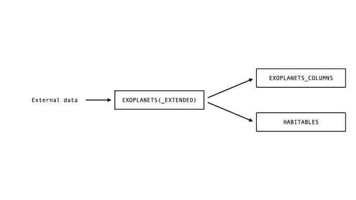
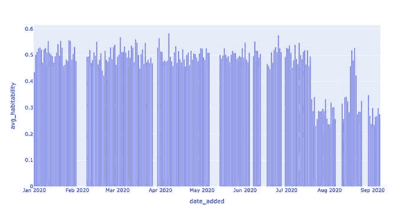
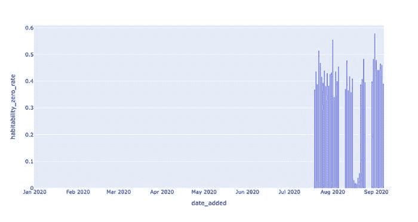

# 数据可观测性，第 II 部分：如何使用 SQL 构建自己的数据质量监控系统

> 原文：[`www.kdnuggets.com/2021/02/data-observability-part-2-build-data-quality-monitors-sql.html`](https://www.kdnuggets.com/2021/02/data-observability-part-2-build-data-quality-monitors-sql.html)

评论

**作者：[Barr Moses](https://www.linkedin.com/in/barrmoses/)，Monte Carlo 的首席执行官兼联合创始人 & [Ryan Kearns](https://www.linkedin.com/in/ryan-kearns-203686a9)，Monte Carlo 的机器学习工程师**

*在这篇文章系列中，我们将讲解如何从零开始创建自己的数据可观测性监控系统，并映射到*[***数据健康的五个关键支柱***](https://towardsdatascience.com/introducing-the-five-pillars-of-data-observability-e73734b263d5)*。第一部分可以在*[*这里*](https://www.montecarlodata.com/data-observability-in-practice-using-sql-1/)*找到。*

* * *

## 我们的前三个课程推荐

 1\. [Google 网络安全证书](https://www.kdnuggets.com/google-cybersecurity) - 快速进入网络安全职业生涯。

 2\. [Google 数据分析专业证书](https://www.kdnuggets.com/google-data-analytics) - 提升你的数据分析能力

 3\. [Google IT 支持专业证书](https://www.kdnuggets.com/google-itsupport) - 在 IT 领域支持你的组织

* * *

*本系列的第二部分改编自 Barr Moses 和 Ryan Kearns 的 O'Reilly 培训课程，*[***管理数据停机时间：将可观测性应用于你的数据管道***](https://www.oreilly.com/live-training/courses/managing-data-downtime/0636920508717/)*，这是业内首个数据可观测性的课程。相关的练习可以在*[*这里*](https://github.com/monte-carlo-data/data-downtime-challenge)*找到，本文中展示的改编代码可以在*[*这里*](https://github.com/monte-carlo-data/data-observability-in-practice)*找到。*

随着世界对数据的需求增加，强大的数据管道变得更加必要。当数据出现问题时——无论是来自模式变化、空值、重复还是其他情况——数据工程师需要知道。

最重要的是，我们需要快速评估问题的根本原因，以免影响下游系统和用户。我们用“*[**数据停机时间**](https://towardsdatascience.com/the-rise-of-data-downtime-841650cedfd5)*”来指代数据缺失、错误或其他不准确的时间段。如果你是一名数据专业人士，你可能会问以下问题：

+   数据是否是最新的？

+   数据是否完整？

+   字段是否在预期范围内？

+   空值率是否高于或低于预期？

+   模式是否发生了变化？

为了有效回答这些问题，我们可以借鉴软件工程师的做法：[**监控和可观测性**](https://observability.workshop.aws/en/anomalydetection.html)**。**

为了帮助你回忆第一部分的内容，我们将[**数据可观测性**](https://towardsdatascience.com/what-is-data-observability-40b337971e3e)定义为组织回答这些问题并评估其数据生态系统健康的能力。反映数据健康的关键变量，数据可观测性的五个支柱是：

+   **新鲜度**：我的数据是否是最新的？在何时数据没有更新？

+   **分布**：我的数据在字段级别上有多健康？我的数据是否在预期范围内？

+   **数据量**：我的数据接收是否达到预期阈值？

+   **模式**：我的数据管理系统的正式结构是否发生了变化？

+   **血统**：如果我的部分数据出现问题，哪些上游和下游的内容会受到影响？我的数据源之间如何相互依赖？

在这一系列文章中，我们感兴趣的是揭开面纱，研究数据可观测性在——*代码中*是如何表现的。

在[第一部分](https://medium.com/swlh/data-observability-building-your-own-data-quality-monitors-using-sql-a4c848b6882d)中，我们探讨了前两个支柱：新鲜度和分布，并展示了如何通过少量的 SQL 代码将这些概念转化为操作性。这些问题可以称为更“经典”的[**异常检测问题**](https://en.wikipedia.org/wiki/Anomaly_detection)——在数据持续流入的情况下，有没有什么看起来不对劲的？良好的异常检测确实是数据可观测性的一部分，但它不是全部。

> 同样重要的是[***上下文***](https://www.montecarlodata.com/data-teams-your-metadata-is-useless/)。如果发生了异常，那很好。但在哪里发生的？哪个上游管道可能是原因？哪些下游仪表盘会受到影响？我的数据的正式结构是否发生了变化？良好的数据可观测性取决于我们利用元数据来回答这些问题——以及许多其他问题——的能力，从而可以在问题变得更严重之前找出根本原因并解决它。

在这篇文章中，我们将探讨旨在提供这一关键上下文的两个数据可观测性支柱——**模式**和**血统**。我们将再次使用轻量级工具，如 Jupyter 和 SQLite，因此你可以轻松启动我们的环境，并尝试这些练习。让我们开始吧。

### 我们的数据环境

*本教程基于*[*练习 2 和 3*](https://github.com/monte-carlo-data/data-downtime-challenge/blob/master/exercise_text/ex2.md)*，这是我们 O'Reilly 课程*[*Managing Data Downtime*](https://www.oreilly.com/live-training/courses/managing-data-downtime/0636920508717/)*的一部分。欢迎使用 Jupyter Notebook 和 SQL 自行尝试这些练习。我们将在未来的文章中详细讨论，包括练习*[*4*](https://github.com/monte-carlo-data/data-downtime-challenge/blob/master/exercise_text/ex4.md)*。*

如果你阅读了[第一部分](https://medium.com/swlh/data-observability-building-your-own-data-quality-monitors-using-sql-a4c848b6882d) 本系列文章，你应该对我们的数据比较熟悉。如之前所述，我们将处理[mock 天文数据](https://github.com/monte-carlo-data/data-observability-in-practice/blob/main/EXOPLANETS.db)，有关宜居系外行星。我们使用 Python 生成了数据集，模拟了我在生产环境中遇到的实际事件的数据和异常。该数据集完全免费使用，[utils 文件夹](https://github.com/monte-carlo-data/data-downtime-challenge/tree/master/data/utils) 包含生成数据的代码，如果你感兴趣的话。

我使用的是 SQLite 3.32.3，这使得数据库可以通过命令行提示符或 SQL 文件轻松访问。该概念适用于几乎任何查询语言，[这些实现](https://github.com/monte-carlo-data/data-observability-in-practice/tree/main/queries) 可以扩展到 MySQL、Snowflake 以及其他数据库环境，所需更改极小。

再次查看我们的 EXOPLANETS 表：

```py
$ sqlite3 EXOPLANETS.db
sqlite> PRAGMA TABLE_INFO(EXOPLANETS);
0 | _id            | TEXT | 0 | | 0
1 | distance       | REAL | 0 | | 0
2 | g              | REAL | 0 | | 0
3 | orbital_period | REAL | 0 | | 0
4 | avg_temp       | REAL | 0 | | 0
5 | date_added     | TEXT | 0 | | 0
```

EXOPLANETS 数据库条目包含以下信息：

0. `_id`：与行星对应的 UUID。

1. `distance`：与地球的距离，单位为光年。

2. `g`：作为 g 的倍数的表面重力，g 是重力常数。

3. `orbital_period`：单个轨道周期的长度，单位为天。

4. `avg_temp`：表面平均温度，单位为开尔文。

5. `date_added`：我们的系统发现该行星并自动将其添加到数据库中的日期。

请注意，由于数据缺失或错误，`distance`、`g`、`orbital_period` 和 `avg_temp` 中一个或多个可能为 `NULL`。

`sqlite> SELECT * FROM EXOPLANETS LIMIT 5;`

请注意，这个练习是回顾性的——我们在查看历史数据。在生产数据环境中，数据可观测性是实时的，并应用于数据生命周期的每个阶段，因此会涉及到与这里做法稍有不同的实现。

看起来我们的最旧数据的日期是 2020–01–01 (*注意*：大多数数据库不会存储单个记录的时间戳，因此我们的 `DATE_ADDED` 列会为我们跟踪这一信息)。我们最新的数据……

```py
sqlite> SELECT DATE_ADDED FROM EXOPLANETS ORDER BY DATE_ADDED DESC LIMIT 1;
2020–07–18
```

…似乎来自 2020-07-18。当然，这是我们在过去文章中使用的同一张表。如果我们想要探索更具上下文的模式和谱系支柱，我们需要扩展我们的环境。

现在，除了`EXOPLANETS`，我们还有一个叫做`EXOPLANETS_EXTENDED`的表，它是我们过去表的超集。可以把这些表看作是在*不同时间点*的同一个表。实际上，`EXOPLANETS_EXTENDED`包含的数据可以追溯到 2020-01-01……

```py
sqlite> SELECT DATE_ADDED FROM EXOPLANETS_EXTENDED ORDER BY DATE_ADDED ASC LIMIT 1;
2020–01–01
```

…但也包含数据到 2020-09-06，比`EXOPLANETS`的数据更为广泛：

```py
sqlite> SELECT DATE_ADDED FROM EXOPLANETS_EXTENDED ORDER BY DATE_ADDED DESC LIMIT 1;
2020–09–06
```

### 可视化模式变化

这些表之间还有其他不同之处：

```py
sqlite> PRAGMA TABLE_INFO(EXOPLANETS_EXTENDED);
0 | _ID            | VARCHAR(16777216) | 1 | | 0
1 | DISTANCE       | FLOAT             | 0 | | 0
2 | G              | FLOAT             | 0 | | 0
3 | ORBITAL_PERIOD | FLOAT             | 0 | | 0
4 | AVG_TEMP       | FLOAT             | 0 | | 0
5 | DATE_ADDED     | TIMESTAMP_NTZ(6)  | 1 | | 0
6 | ECCENTRICITY   | FLOAT             | 0 | | 0
7 | ATMOSPHERE     | VARCHAR(16777216) | 0 | | 0
```

除了`EXOPLANETS`中的 6 个字段外，`EXOPLANETS_EXTENDED`表还包含两个额外字段：

6. `eccentricity`：行星绕其宿主恒星的[轨道偏心率](https://en.wikipedia.org/wiki/Orbital_eccentricity)。

7. `atmosphere`：行星大气的主要化学成分。

请注意，像`distance`、`g`、`orbital_period`和`avg_temp`一样，`eccentricity`和`atmosphere`也可能由于缺失或错误的数据而为`NULL`。例如，[流浪行星](https://en.wikipedia.org/wiki/Rogue_planet)具有未定义的轨道偏心率，许多行星根本没有大气层。

还要注意数据没有回填，这意味着表开始的数据（也包含在`EXOPLANETS`表中的数据）将没有偏心率和大气信息。

```py
sqlite> SELECT
   ...>     DATE_ADDED,
   ...>     ECCENTRICITY,
   ...>     ATMOSPHERE
   ...> FROM
   ...>     EXOPLANETS_EXTENDED
   ...> ORDER BY
   ...>     DATE_ADDED ASC
   ...> LIMIT 10;
2020–01–01 | |
2020–01–01 | |
2020–01–01 | |
2020–01–01 | |
2020–01–01 | |
2020–01–01 | |
2020–01–01 | |
2020–01–01 | |
2020–01–01 | |
2020–01–01 | |
```

两个字段的增加是一个[**模式** **变化**](https://www.educative.io/blog/what-are-database-schemas-examples)的例子——我们的数据的正式蓝图已经被修改。模式变化发生在对数据结构进行更改时，并且可能会令人沮丧地手动调试。模式变化可以指示有关数据的各种信息，包括：

+   新 API 端点的增加

+   假定已弃用但尚未…弃用的字段

+   列、行或整个表的增加或删除

在理想情况下，我们希望有这种变化的记录，因为它代表了我们管道可能出现问题的向量。不幸的是，我们的数据库并未自然配置来跟踪此类变化。它没有版本历史记录。

我们在[第一部分](https://medium.com/swlh/data-observability-building-your-own-data-quality-monitors-using-sql-a4c848b6882d)中遇到过这个问题，当时我们查询单个记录的年龄，并添加了`DATE_ADDED`列来应对。在这种情况下，我们将做类似的操作，只不过是增加整个表：

```py
sqlite> PRAGMA TABLE_INFO(EXOPLANETS_COLUMNS);
0 | DATE    | TEXT | 0 | | 0
1 | COLUMNS | TEXT | 0 | | 0
```

`EXOPLANETS_COLUMNS`表通过记录`EXOPLANETS_EXTENDED`中在任何给定日期的列来“版本化”我们的模式。通过查看最初和最后的条目，我们可以看到列确实在某个时候发生了变化：

```py
sqlite> SELECT * FROM EXOPLANETS_COLUMNS ORDER BY DATE ASC LIMIT 1;
2020–01–01 | [
              (0, ‘_id’, ‘TEXT’, 0, None, 0),
              (1, ‘distance’, ‘REAL’, 0, None, 0),
              (2, ‘g’, ‘REAL’, 0, None, 0),
              (3, ‘orbital_period’, ‘REAL’, 0, None, 0),
              (4, ‘avg_temp’, ‘REAL’, 0, None, 0),
              (5, ‘date_added’, ‘TEXT’, 0, None, 0)
             ]sqlite> SELECT * FROM EXOPLANETS_COLUMNS ORDER BY DATE DESC LIMIT 1;
2020–09–06 | 
[
              (0, ‘_id’, ‘TEXT’, 0, None, 0),
              (1, ‘distance’, ‘REAL’, 0, None, 0),
              (2, ‘g’, ‘REAL’, 0, None, 0),
              (3, ‘orbital_period’, ‘REAL’, 0, None, 0),
              (4, ‘avg_temp’, ‘REAL’, 0, None, 0),
              (5, ‘date_added’, ‘TEXT’, 0, None, 0),
              (6, ‘eccentricity’, ‘REAL’, 0, None, 0),
              (7, ‘atmosphere’, ‘TEXT’, 0, None, 0)
             ]
```

现在，回到我们最初的问题：究竟是什么时候发生了模式变化？由于我们的列列表是按日期索引的，我们可以通过一个快速的 SQL 脚本来找到变化的日期：

这是返回的数据，我已重新格式化以提高可读性：

```py
DATE:         2020–07–19
NEW_COLUMNS:  [
               (0, ‘_id’, ‘TEXT’, 0, None, 0),
               (1, ‘distance’, ‘REAL’, 0, None, 0),
               (2, ‘g’, ‘REAL’, 0, None, 0),
               (3, ‘orbital_period’, ‘REAL’, 0, None, 0),
               (4, ‘avg_temp’, ‘REAL’, 0, None, 0),
               (5, ‘date_added’, ‘TEXT’, 0, None, 0),
               (6, ‘eccentricity’, ‘REAL’, 0, None, 0),
               (7, ‘atmosphere’, ‘TEXT’, 0, None, 0)
              ]
PAST_COLUMNS: [
               (0, ‘_id’, ‘TEXT’, 0, None, 0),
               (1, ‘distance’, ‘REAL’, 0, None, 0),
               (2, ‘g’, ‘REAL’, 0, None, 0),
               (3, ‘orbital_period’, ‘REAL’, 0, None, 0),
               (4, ‘avg_temp’, ‘REAL’, 0, None, 0),
               (5, ‘date_added’, ‘TEXT’, 0, None, 0)
              ]
```

使用此查询，我们返回了问题日期：2020–07–19。像新鲜度和分布可观察性一样，实现模式可观察性遵循一个模式：我们识别[有用的元数据](https://towardsdatascience.com/metadata-is-useless-535e43311cd8)来指示管道健康，跟踪它，并构建探测器以警告我们潜在的问题。提供像`EXOPLANETS_COLUMNS`这样的额外表格是一种跟踪模式的方法，但还有许多其他方法。我们鼓励你思考如何为自己的数据管道实现模式变化检测器！

### 视觉化谱系

我们将谱系描述为[数据可观察性的五大支柱](https://towardsdatascience.com/introducing-the-five-pillars-of-data-observability-e73734b263d5)中最全面的一项，这也是有充分理由的。

> 谱系通过告诉我们（1）哪些下游来源可能受到影响，（2）哪些上游来源可能是根本原因，从而为事件提供背景。虽然用 SQL 代码“可视化”谱系并不直观，但一个简单的示例可能会说明它的用途。

为此，我们需要再次扩展我们的数据环境。

### 介绍：HABITABLES

让我们向数据库中添加另一张表。到目前为止，我们一直在记录系外行星的数据。这里有一个有趣的问题：这些行星中有多少可能存在生命？

`HABITABLES`表格从`EXOPLANETS`中获取数据，以帮助我们回答这个问题：

```py
sqlite> PRAGMA TABLE_INFO(HABITABLES);
0 | _id          | TEXT | 0 | | 0
1 | perihelion   | REAL | 0 | | 0
2 | aphelion     | REAL | 0 | | 0
3 | atmosphere   | TEXT | 0 | | 0
4 | habitability | REAL | 0 | | 0
5 | min_temp     | REAL | 0 | | 0
6 | max_temp     | REAL | 0 | | 0
7 | date_added   | TEXT | 0 | | 0
```

`HABITABLES`中的一条记录包含以下内容：

0. `_id`：对应于行星的 UUID。

1. `perihelion`：在一个轨道周期内，离天体的[最短距离](https://en.wikipedia.org/wiki/Apsis#Perihelion_and_aphelion)。

2. `aphelion`：在一个轨道周期内，离天体的[最远距离](https://en.wikipedia.org/wiki/Apsis#Perihelion_and_aphelion)。

3. `atmosphere`：行星大气层的主要化学成分。

4. `habitability`：一个介于 0 和 1 之间的实数，表示行星可能存在生命的概率。

5. `min_temp`：行星表面上的最低温度。

6. `max_temp`：行星表面上的最高温度。

7. `date_added`：我们的系统发现该行星并自动将其添加到数据库中的日期。

像`EXOPLANETS`中的列一样，`perihelion`、`aphelion`、`atmosphere`、`min_temp`和`max_temp`的值也可以为`NULL`。实际上，对于`EXOPLANETS`中任何`_id`的`eccentricity`为`NULL`的记录，`perihelion`和`aphelion`也会是`NULL`，因为你使用轨道偏心率来计算这些指标。这解释了为什么在我们较旧的数据条目中这两个字段总是`NULL`：

```py
sqlite> SELECT * FROM HABITABLES LIMIT 5;
```

因此，我们知道`HABITABLES`依赖于`EXOPLANETS`（或者同样地，`EXOPLANETS_EXTENDED`）中的值，`EXOPLANETS_COLUMNS`也是如此。我们数据库的依赖关系图如下所示：



图片由[Monte Carlo](http://www.montecarlodata.com/)提供。

非常简单的谱系信息，但已经很有用。让我们在这个图表的背景下查看`HABITABLES`中的一个异常，并看看我们能学到什么。

### 调查异常

当我们有一个关键指标，比如`HABITABLES`中的宜居性时，我们可以通过几种方式评估该指标的健康状况。首先，给定日期的新数据`habitability`的平均值是多少？

查看这些数据，我们看到情况不对。`habitability`的平均值通常在 0.5 左右，但在记录的数据后期降至约 0.25。



一个分布异常……但是什么导致了它？

这是一个明显的分布异常，但究竟发生了什么？换句话说，这个异常的*根本原因*是什么？

为什么我们不查看一下`NULL`率对于宜居性，就像我们在[第一部分](https://ryanothnielkearns.medium.com/data-observability-building-your-own-data-quality-monitors-using-sql-a4c848b6882d)中做的那样？

幸运的是，这里没有看起来不正常的地方：

但这看起来并不对我们的问提有帮助。如果我们查看另一个分布健康指标——**零值率**，会怎样呢？

显然这里的情况更有问题：

从历史上看，`habitability`几乎从未为零，但在稍后的日期，它的零率平均接近 40%。这导致了字段平均值的下降。



一个分布异常……但是什么导致了它？

我们可以使用在第一部分中构建的分布检测器之一，来获取`habitability`字段中可观的零率的首次日期：

我通过命令行运行了这个查询：

```py
$ sqlite3 EXOPLANETS.db < queries/lineage/habitability-zero-rate-detector.sql
DATE_ADDED | HABITABILITY_ZERO_RATE | PREV_HABITABILITY_ZERO_RATE
2020–07–19 | 0.369047619047619      | 0.0
```

2020 年 7 月 19 日是零率开始显示异常结果的第一天。请记住，这也是`EXOPLANETS_EXTENDED`的架构变更检测的那一天。`EXOPLANETS_EXTENDED`位于`HABITABLES`的上游，因此这两个事件很可能是相关的。

就是这样，谱系信息可以帮助我们识别事件的**根本原因**，并更快地解决问题。比较以下两个对`HABITABLES`事件的解释：

1.  在 2020 年 7 月 19 日，`HABITABLES`表中的宜居性列的零率从 0%跃升至 37%。

1.  在 2020 年 7 月 19 日，我们开始在`EXOPLANETS`表中跟踪两个额外的字段，`eccentricity`和`atmosphere`。这对下游表`HABITABLES`产生了不利影响，通常在`eccentricity`不为`NULL`时将字段`min_temp`和`max_temp`设置为极端值。反过来，这导致了`habitability`字段中零率的激增，我们检测到了平均值的异常下降。

解释（1）仅使用异常发生的事实。解释（2）使用血统，即表和字段之间的依赖关系，将事件置于背景中并确定根本原因。实际上，解释（2）中的一切都是正确的，我鼓励你在环境中进行实验，以自己理解发生了什么。虽然这些只是简单的示例，但拥有（2）知识的工程师将更快地*理解*和*解决*根本问题，这都归功于适当的可观测性。

### 下一步是什么？

跟踪模式变化和血统可以让你前所未有地了解数据的健康状况和使用模式，提供关于数据使用的谁、什么、哪里、为何以及如何的关键信息。事实上，模式和血统是理解数据停机的下游（以及往往是现实世界）影响时两个最重要的数据可观测性支柱。

总结：

+   观察我们数据的**模式**意味着理解我们数据的正式结构，以及它何时和如何发生变化。

+   观察我们数据的**血统**意味着理解管道中的上游和下游依赖关系，并将孤立事件放在更大的背景中。

+   这两个**数据可观测性**支柱都涉及跟踪适当的元数据，并以使异常情况可理解的方式转化数据。

+   更好的可观测性意味着**更好地理解数据为何以及如何崩溃**，从而减少检测时间和解决时间。

我们希望这一期的“数据可观测性背景”对你有帮助。

在第三部分之前，祝你没有数据停机！

***想了解更多关于 Monte Carlo 数据可观测性方法的内容吗？请联系*** [***Ryan***](https://www.linkedin.com/in/ryan-kearns-203686a9)***、***[***Barr***](https://www.linkedin.com/in/barrmoses/)*** 和 ***[***Monte Carlo 团队***](http://www.montecarlodata.com/)***。***

**[Barr Moses](https://www.linkedin.com/in/barrmoses/)** 是 Monte Carlo 的首席执行官兼联合创始人，这是一家数据可观测性公司。在此之前，她曾担任 Gainsight 的运营副总裁。

**[Ryan Kearns](https://www.linkedin.com/in/ryan-kearns-203686a9)** 是 Monte Carlo 的数据与机器学习工程师，同时是斯坦福大学的高年级学生。

[原文](https://towardsdatascience.com/data-observability-in-practice-using-sql-part-ii-schema-lineage-5ca6c8f4f56a)。经许可转载。

**相关：**

+   数据可观测性：使用 SQL 构建数据质量监控器

+   数据目录已死；数据发现万岁

+   SQL 中的数据清洗与处理

### 更多相关内容

+   [数据质量维度：用“伟大期望”确保你的数据质量](https://www.kdnuggets.com/2023/03/data-quality-dimensions-assuring-data-quality-great-expectations.html)

+   [数据治理与可观测性，详解](https://www.kdnuggets.com/2022/08/data-governance-observability-explained.html)

+   [IMPACT 2022: 数据可观测性峰会，10 月 25-26 日](https://www.kdnuggets.com/2022/09/monte-carlo-impact-2022-data-observability-summit.html)

+   [IMPACT: 数据可观测性峰会将于 11 月 8 日重返](https://www.kdnuggets.com/2023/10/monte-carlo-impact-the-data-observability-summit-is-back)

+   [LangChain 101: 构建你自己的 GPT 驱动应用程序](https://www.kdnuggets.com/2023/04/langchain-101-build-gptpowered-applications.html)

+   [使用 LlamaIndex 构建你自己的 PandasAI](https://www.kdnuggets.com/build-your-own-pandasai-with-llamaindex)
