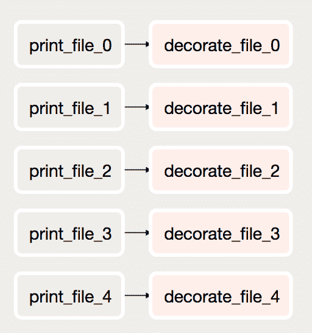

# 数据管道、Luigi、Airflow：你需要知道的一切

> 原文：[`www.kdnuggets.com/2019/03/data-pipelines-luigi-airflow-everything-need-know.html`](https://www.kdnuggets.com/2019/03/data-pipelines-luigi-airflow-everything-need-know.html)

 评论

**由 [Lorenzo Peppoloni](https://www.linkedin.com/in/lorenzo-peppoloni/)，Lyft**

照片由 [Gerrie van der Walt](https://unsplash.com/photos/m3TYLFI_mDo) 提供，发布在 [Unsplash](https://unsplash.com/search/photos/pipeline)

这篇文章基于我最近给同事讲解 Airflow 的讲座。

特别地，讲座的重点是：什么是 Airflow，你可以用它做什么，以及它与 Luigi 的不同之处。

### 为什么你需要一个 WMS

在公司中，移动和转换数据非常常见。

比如，你有大量的日志存储在 S3 上，你希望定期获取这些数据，提取和汇总有意义的信息，然后将其存储在分析数据库中（例如，Redshift）。

通常，这类任务最初是手动执行的，然后随着事情需要扩展，过程会自动化，例如用 cron 触发。最终，你会达到一个好老的 cron 无法保证稳定和可靠性能的地步。它已经不够用了。

这时你需要一个工作流管理系统（WMS）。

### Airflow

Airflow 是在 2014 年由 Airbnb 开发的，后来开源了。2016 年，它加入了 Apache 软件基金会的孵化程序。

当被问到“Airflow 在 WMS 领域有什么不同？”时，Maxime Beauchemin（Airflow 的创建者）回答说：

> 一个关键的区别在于 Airflow 管道被定义为代码，并且任务是动态实例化的。

希望在这篇文章的最后，你能够理解，并且更重要的是，同意（或不同意）这一观点。

让我们首先定义主要概念。

### 作为 DAG 的工作流

在 Airflow 中，工作流被定义为具有方向性依赖关系的任务集合，基本上是一个有向无环图（DAG）。

图中的每个节点都是一个任务，边缘定义了任务之间的依赖关系。

任务分为两个类别：

1.  **操作符**：它们执行某些操作

1.  **传感器**：它们检查进程或数据结构的状态

现实中的工作流可以从每个工作流只有一个任务（你不必总是追求花哨）到非常复杂的 DAG，几乎无法可视化。

**主要组件**

Airflow 的主要组件是：

+   一个 **元数据数据库**

+   一个 **调度器**

+   一个 **执行器**

Airflow 架构

元数据数据库存储任务和工作流的状态。调度器使用 DAG 定义，加上元数据数据库中的任务状态，决定需要执行的内容。

执行器是一个消息队列进程（通常是 [Celery](http://www.celeryproject.org/)），它决定哪个工作进程将执行每个任务。

使用 Celery 执行器，可以管理任务的分布式执行。另一种选择是将调度器和执行器运行在同一台机器上。在这种情况下，平行处理将通过多个进程来管理。

Airflow 还提供了一个非常强大的用户界面。用户能够通过网页 UI 监控 DAG 和任务执行，并直接与其交互。

读到 Airflow 采用 *“设置并忘记”* 方法是很常见的，但这是什么意思呢？

这意味着一旦设置了 DAG，调度器将自动根据指定的调度间隔安排其运行。

### Luigi

理解 Airflow 最简单的方法可能是将其与 Luigi 进行比较。

Luigi 是一个用于构建复杂流水线的 Python 包，它是在 Spotify 开发的。

在 Luigi 中，与 Airflow 一样，你可以将工作流指定为任务以及它们之间的依赖关系。

Luigi 的两个基本构建块是 **Tasks** 和 **Targets**。目标是任务通常输出的文件，任务执行计算并消耗由其他任务生成的目标。

Luigi 流水线结构

你可以把它看作是一个实际的流水线。一个任务完成其工作并生成一个目标，第二个任务将目标文件作为输入，进行一些操作并输出第二个目标文件，依此类推。

咖啡休息（照片由 [rawpixel](https://unsplash.com/photos/qbrmH8y1jHY) 提供，来源于 [Unsplash](https://unsplash.com/search/photos/break)）

### 一个简单的工作流

让我们看看如何实现一个由两个任务组成的简单流水线。

第一个任务生成一个包含单词（在此情况下为“pipeline”）的 .txt 文件，第二个任务读取该文件并装饰行，添加“我的”。新行被写入一个新文件中。

Luigi 简单流水线

每个任务都指定为从 `luigi.Task` 派生的类，方法 `output()` 指定输出即目标，`run()` 指定任务执行的实际计算。

方法 `requires()` 指定任务之间的依赖关系。

从代码中可以很清楚地看到，一个任务的输入是另一个任务的输出，以此类推。

让我们看看如何在 Airflow 中做同样的事情。

Airflow 简单 DAG

首先，我们定义并初始化 DAG，然后将两个操作符添加到 DAG 中。

第一个是 `BashOperator`，它基本上可以运行任何 bash 命令或脚本，第二个是 `PythonOperator`，执行 Python 代码（为了展示，我在这里使用了两个不同的操作符）。

正如你所见，没有输入和输出的概念。两个操作员之间没有信息共享。确实存在在操作员之间共享信息的方法（你基本上是共享一个字符串），但作为一般规则：如果两个操作员需要共享信息，那么它们可能应该合并成一个。

### 更复杂的工作流

现在让我们考虑一下我们想同时处理更多文件的情况。

在 Luigi 中我们可以用多种方式做到这一点，但没有一种方式是特别直接的。

Luigi 管理多个文件的管道

在这种情况下，我们有两个任务，每个任务处理所有文件。依赖任务（`t2`）必须等到 `t1` 处理完所有文件后才能开始。

我们使用一个空文件作为目标来标记每个任务何时完成其工作。

我们可以通过编写并行的循环来增加一些并行化。

这个解决方案的问题在于 `t2` 可能会在 `t1` 开始产生输出后逐渐开始处理文件，实际上 `t2` 不必等到 `t1` 创建所有文件。

在 Luigi 中，一个常见的做法是创建一个包装任务并使用多个工作者。

这里是代码。

Luigi 使用多个工作者的管道

为了用多个工作者运行任务，我们可以在运行任务时指定 `— workers number_of_workers`。

现实中你常见的一种方法是委托并行化。基本上，你使用前面介绍的第一个方法，并在 `run()` 函数内部使用 Spark 等来实际处理。

### 让我们用 Airflow 来实现

你还记得最初的引言中提到 DAG 是如何用代码动态实例化的吗？

那这到底意味着什么呢？

这意味着通过 Airflow 你可以做到这一点

Airflow 通过多个文件实现并行 DAG

任务（和依赖项）可以通过编程方式添加（例如，在循环中）。相应的 DAG 如下所示。

并行 DAG

在这个阶段，你不需要担心并行化。Airflow 执行器从 DAG 定义中知道每个分支可以并行运行，这就是它所做的！

### 最终考虑

在这篇文章中我们讨论了很多点，我们谈到了工作流、Luigi、Airflow 以及它们之间的区别。

让我们快速回顾一下。

**Luigi**

+   它通常基于管道，任务的输入和输出共享信息并且互相连接

+   基于目标的方法

+   界面最小，没有用户与运行中的进程交互

+   没有自己的触发机制

+   Luigi 不支持分布式执行

**Airflow**

+   基于 DAG 的表示

+   通常，任务之间没有信息共享，我们希望尽可能并行化

+   没有强大的任务间通信机制

+   它有一个执行器，管理分布式执行（你需要设置它）

+   这种方法是“设定后忘记”，因为它有自己的调度程序

+   强大的 UI，你可以看到执行情况并与运行中的任务互动。

结论：在这篇文章中，我们查看了 Airflow 和 Luigi，以及这两者在工作流管理系统中的差异。我们看了一些非常简单的管道示例，并展示了如何使用这两种工具来实现它们。最后，我们总结了 Luigi 和 Airflow 之间的主要区别。

如果你喜欢这篇文章并且觉得有用，请随意????或分享。

祝好

**个人简介：[洛伦佐·佩波洛尼](https://www.linkedin.com/in/lorenzo-peppoloni/)** 是一位技术爱好者，终身学习者，拥有机器人学博士学位。他撰写有关他在软件和数据工程领域的日常经验。

[原文](https://towardsdatascience.com/data-pipelines-luigi-airflow-everything-you-need-to-know-18dc741449b7)。经许可转载。

**相关：**

+   数据科学管道初学者指南

+   数据科学家如何提高生产力

+   用 MLflow 管理你的机器学习生命周期  –  第一部分

* * *

## 我们的前三大课程推荐

 1\. [谷歌网络安全证书](https://www.kdnuggets.com/google-cybersecurity) - 快速入门网络安全职业。

 2\. [谷歌数据分析专业证书](https://www.kdnuggets.com/google-data-analytics) - 提升你的数据分析技能

 3\. [谷歌 IT 支持专业证书](https://www.kdnuggets.com/google-itsupport) - 支持你的组织进行 IT 管理

* * *

### 更多相关主题

+   [KDnuggets 新闻，4 月 13 日：数据科学家应该了解的 Python 库…](https://www.kdnuggets.com/2022/n15.html)

+   [5 种 Airflow 替代方案用于数据编排](https://www.kdnuggets.com/5-airflow-alternatives-for-data-orchestration)

+   [关于数据湖屋的一切](https://www.kdnuggets.com/2022/09/everything-need-know-data-lakehouses.html)

+   [朴素贝叶斯算法：你需要知道的一切](https://www.kdnuggets.com/2020/06/naive-bayes-algorithm-everything.html)

+   [关于张量的一切](https://www.kdnuggets.com/2022/05/everything-need-know-tensors.html)

+   [关于 MLOps 的一切：KDnuggets 技术简报](https://www.kdnuggets.com/tech-brief-everything-you-need-to-know-about-mlops)
