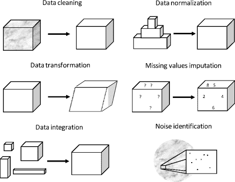

# 机器学习中的数据准备和原始数据

> 原文：[`www.kdnuggets.com/2022/07/data-preparation-raw-data-machine-learning.html`](https://www.kdnuggets.com/2022/07/data-preparation-raw-data-machine-learning.html)

随着可用数据量的巨大，分析和机器学习（ML）越来越多地被用来提取可以用于多种不同用途的关键信息。

例如，通过研究用户如何与电子商务网站互动，可以自动识别信用卡欺诈。但这仅在所有相关数据已被以适合机器学习算法的方式准备好时才有效。

* * *

## 我们的三大课程推荐

 1\. [Google 网络安全证书](https://www.kdnuggets.com/google-cybersecurity) - 快速进入网络安全职业生涯。

 2\. [Google 数据分析专业证书](https://www.kdnuggets.com/google-data-analytics) - 提升您的数据分析技能

 3\. [Google IT 支持专业证书](https://www.kdnuggets.com/google-itsupport) - 支持您的组织的 IT

* * *

在这篇文章中，我将描述机器学习的数据准备技术。

# 原始数据

原始数据指的是由计算机收集的未经处理的原始数据。它通常体积庞大且复杂，难以分析。

在机器学习中，原始数据通常是从大量人群或传感器收集的，这些传感器收集有关某个对象或事件的信息。

当与特定类型的算法结合时，原始数据可以帮助计算机预测事件并做出决策，而无需人工干预。

# 数据准备

数据准备是清理数据的过程，包括去除无关信息和将数据转换为所需格式。数据准备是机器学习过程中的一个重要步骤，因为它使数据可以被机器学习算法使用，以创建准确的模型或预测。

简而言之，你需要收集一些原始数据，然后对其进行处理，使其对 ML 模型可理解。

# 数据准备的重要性

你用来构建模型的数据类型对模型的结果有很大影响。如果数据存在小的偏差或缺失信息，那么它可能会对模型的准确性产生很大影响。因此，拥有高质量的数据以用于训练模型是至关重要的。

实际上，研究人员发现 80%的数据工程工作都投入在数据准备上。因此，数据挖掘领域非常重视开发获取高质量数据的技术。 （张世超，张成奇，杨强，2003）

数据准备在以下三个方面至关重要：

1.  现实世界的数据可能是嘈杂或不纯的

1.  高级处理系统需要准确的数据

1.  数据完整性产生高质量的趋势（Zhang, Shichao 和 Zhang, Chengqi 和 Yang, Qiang, 2003）

此外，数据准备会产生比源数据集更窄的数据集，这可以显著提升数据收集的性能。

# 原始数据中的问题

原始数据中可能存在许多问题，如噪声、数据冗余、不一致数据、异质数据等。（大数据上的机器学习：机遇与挑战，2017）。其中的一些问题如下所述：

## 数据冗余

重复可能发生在相同的数据多次出现的情况下。在你的机器学习系统中，重复的数据样本如果没有得到解决，可能会导致性能不佳。

数据冗余是指有多个信息源包含相同的数据。数据冗余并不总是一个问题，但在某些情况下可能会引起问题。

## 嘈杂数据

原始数据可能会有噪声。有时缺失或不正确的值，或者异常值，会扭曲其余数据。噪声数据带来了许多挑战。传统解决方案在大数据面前并不总是有效。它们不可扩展，如果使用简单的解决方案如均值，可能会丧失大数据的优势，因为这无法考虑数据的所有复杂性。

由于传感器故障造成的错误或缺失值可以通过预测分析进行替换。

## 数据异质性

大数据包含大量信息，包括文本、音频和视频文件。这些文件存储在不同的位置，并且以易于使用的格式存在。由于这些数据是从多个地方（例如 YouTube 上的手机视频）收集的，因此它们可以提供同一事物的不同视角。这些视角是异质的，因为它们是从不同群体的人那里收集的。

如果你想学习新知识，专家建议最好同时获取来自多个来源的信息。

# 数据准备技术

数据准备技术分为两种：**传统**和**机器学习技术**。

传统的数据预处理和准备工作是劳动密集型的、成本高昂且容易出错的；机器学习（ML）算法可以通过从大量、多样化和实时的数据集中学习来减少这种依赖。 （Bhatnagar, Roheet, 2018）

图 1 数据准备涉及的任务（来源（García, S., Ramírez-Gallego, S., Luengo, J., 2016））

# 数据处理的机器学习方法

## 实例减少

要从大型数据集中删除实例，可以使用一种叫做**实例减少**的过程。实例减少通过从数据集中移除实例或生成新实例来减少信息的数量。实例减少允许研究人员在不减少他们可以从数据中提取的知识和信息质量的情况下，减少非常大的数据集的大小。

## 缺失值的填补

处理缺失值的问题有不同的方法。首先，我们可以丢弃存在缺失值的实例。但这通常效果不佳，因为我们忽略了重要信息。另一种方法是对缺失值进行赋值。这通常使用建模数据集概率函数的机器学习技术来完成。然后可以应用最大似然程序来找到最佳的填补模型。

*Paxata、Trifacta、Alteryx、Databricks、Qubole 和 Google AI 是一些最强大的数据准备工具。*

# 结论

常见的数据预处理步骤有

1.  格式化：将数据安排成所需的文件格式

1.  清理：删除不完整和不一致的数据

1.  采样：为快速处理取小部分数据

数据世界的导航可能对一些人来说很困惑，但希望本指南能帮助你更好地理解原始数据和处理数据之间的区别。学习如何准备数据的第一步将取决于你使用的数据类型。然而，确保数据尽可能准确和干净在建模时非常重要。在开始任何统计项目时，无论简单还是复杂，都要始终牢记这些数据准备提示。

## 参考文献

+   Bhatnagar, Roheet. (2018). *机器学习与大数据处理：技术视角与综述。*

+   García, S., Ramírez-Gallego, S., Luengo, J. (2016). 大数据预处理：方法与前景。Big Data Anal 1。

+   大数据上的机器学习：机会与挑战。 (2017). *神经计算*, 350-361。

+   张世超、张成奇、杨强. (2003). 数据挖掘的数据准备。*应用人工智能*, 375-381。

**[尼拉吉·阿加瓦尔](https://www.linkedin.com/in/neeagl/)** 是 [Algoscale](https://www.linkedin.com/company/algoscale) 的创始人，这是一家涵盖数据工程、应用人工智能、数据科学和产品工程的数据咨询公司。他在该领域拥有超过 9 年的经验，曾帮助从初创公司到财富 100 强企业的各种组织摄取和存储大量原始数据，以便将其转化为可操作的见解，从而实现更好的决策和更快的业务价值。

### 更多相关话题

+   [SQL 数据准备备忘单](https://www.kdnuggets.com/2021/05/data-preparation-sql-cheat-sheet.html)

+   [R 数据准备备忘单](https://www.kdnuggets.com/2021/10/data-preparation-r-dplyr-cheat-sheet.html)

+   [学习数据科学、机器学习和深度学习的切实计划](https://www.kdnuggets.com/2023/01/mwiti-solid-plan-learning-data-science-machine-learning-deep-learning.html)

+   [每位机器学习工程师都应该掌握的 5 种机器学习技能…](https://www.kdnuggets.com/2023/03/5-machine-learning-skills-every-machine-learning-engineer-know-2023.html)

+   [KDnuggets 新闻，12 月 14 日：3 个免费的机器学习课程…](https://www.kdnuggets.com/2022/n48.html)

+   [人工智能、分析、机器学习、数据科学、深度学习…](https://www.kdnuggets.com/2021/12/developments-predictions-ai-machine-learning-data-science-research.html)
