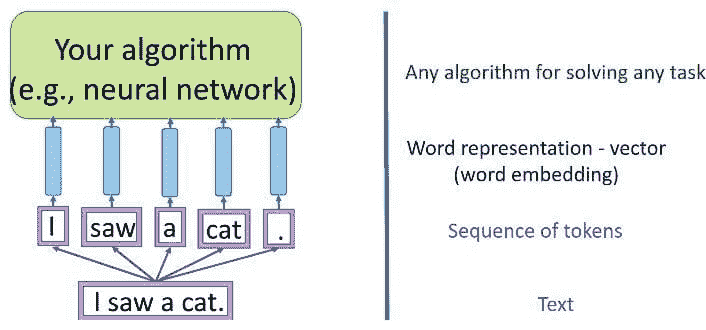

# 自然语言处理任务的数据表示

> 原文：[`www.kdnuggets.com/2018/11/data-representation-natural-language-processing.html`](https://www.kdnuggets.com/2018/11/data-representation-natural-language-processing.html)

我们之前详细探讨了 [一些入门自然语言处理 (NLP) 主题](https://www.kdnuggets.com/2022/10/abcs-nlp-a-to-z.html)，包括如何处理这些任务、预处理文本数据、入门流行的 Python 库等。我希望能转向探索不同类型的 NLP 任务，但有人指出我忽略了一个重要方面：自然语言处理的数据表示。

就像其他类型的机器学习任务一样，在 NLP 中，我们必须找到一种方法来将我们的数据（即一系列文本）表示给系统（例如文本分类器）。正如 [Yoav Goldberg 提问](https://www.morganclaypool.com/doi/abs/10.2200/S00762ED1V01Y201703HLT037) 的那样，“我们如何以一种对统计分类器友好的方式编码这些分类数据？”这就引出了词向量。

* * *

## 我们的前三个课程推荐

 1\. [Google 网络安全证书](https://www.kdnuggets.com/google-cybersecurity) - 快速入门网络安全职业。

 2\. [Google 数据分析专业证书](https://www.kdnuggets.com/google-data-analytics) - 提升你的数据分析技能

 3\. [Google IT 支持专业证书](https://www.kdnuggets.com/google-itsupport) - 支持你所在组织的 IT 工作

* * *

来源: [Yandex 数据学院自然语言处理课程](https://github.com/yandexdataschool/nlp_course/)

首先，除了“将单词转换为数字表示”，在进行数据编码时我们还对什么感兴趣？更确切地说，我们在编码什么？

我们必须从原始（或预处理过的）文本中的一组分类特征——单词、字母、词性标记、单词排列、单词顺序等——转化为一系列向量。实现文本数据编码的两种选择是稀疏向量（或独热编码）和密集向量。

这两种方法在几个基本方面有所不同。请继续阅读以了解讨论。

# 独热编码

在神经网络广泛应用于 NLP 之前——在我们称之为“传统” NLP 的领域——文本的向量化通常通过独热编码进行（请注意，这种做法仍然是许多练习中的有用编码方式，并未因神经网络的使用而过时）。对于独热编码，文本中的每个单词或标记对应一个向量元素。

来源：[Adrian Colyer](https://blog.acolyer.org/2016/04/21/the-amazing-power-of-word-vectors/)

我们可以考虑上面的图像，例如，作为一个向量的小片段，代表句子“女王走进了房间”。请注意，只有“女王”的元素被激活，而“国王”、“男人”等元素没有被激活。你可以想象，“国王曾经是一个男人，但现在是一个孩子”这句话的独热向量表示在上面显示的相同向量元素部分会有多么不同。

对语料库进行独热编码处理的结果是一个稀疏矩阵。考虑如果你有一个包含 20,000 个独特单词的语料库：在这个语料库中，一个仅包含 40 个单词的短文将被表示为一个具有 20,000 行（每个独特单词一个）的矩阵，矩阵中最多有 40 个非零元素（如果这 40 个单词中有大量非独特单词，则可能会更少）。这留下了大量的零，可能需要大量内存来存储这些稀疏表示。

除了潜在的内存容量问题，独热编码的一个主要缺点是缺乏**意义**表示。虽然我们可以通过这种方法很好地捕捉到文本中特定词汇的存在与缺失，但我们不能仅凭这些词汇的简单存在/缺失来确定任何意义。部分问题在于，我们使用独热编码时丢失了词语之间的位置关系或词序。这种顺序在表示词汇的意义时至关重要，下文会对此进行讨论。

提取词汇的**相似性**的概念也很困难，因为词向量在统计上是正交的。例如，考虑词对“狗”和“狗狗”，或“车”和“汽车”。显然，这些词对在不同方面是相似的。在一个线性系统中，使用独热编码，传统的自然语言处理工具，如词干提取和词形还原，可以用于预处理，以帮助揭示第一个词对之间的相似性；然而，我们需要更强健的方法来揭示第二个词对之间的相似性。

独热编码词向量的主要优点是它捕捉了词汇的二元共现（有时被描述为词袋模型），这足以执行广泛的自然语言处理任务，包括文本分类，这是这个领域最有用和最广泛的追求之一。这种类型的词向量对线性机器学习算法以及神经网络都很有用，尽管它们最常与线性系统相关。对线性系统也有用的独热编码变体，包括[n-gram](https://en.wikipedia.org/wiki/N-gram)和[TF-IDF](https://en.wikipedia.org/wiki/Tf%E2%80%93idf)表示形式。虽然它们与独热编码不同，但它们相似的是，它们是简单的向量表示，而不是下文介绍的**嵌入**。

# 密集嵌入向量

稀疏词向量似乎是一种完全可接受的表示某些文本数据的方式，特别是考虑到二元词共现。我们还可以使用相关的线性方法来解决一些 one-hot 编码的最大和最明显的缺点，如 n-grams 和 TF-IDF。但要深入理解文本的核心意义和标记之间的语义关系，仍然困难重重，词[嵌入](https://en.wikipedia.org/wiki/Embedding)向量就是这样一种方法。

在“传统”自然语言处理（NLP）中，可以使用手动或学习的词性标注（POS）方法来确定文本中哪些标记执行了哪些类型的功能（名词、动词、副词、不定冠词等）。这是一种手动特征分配的形式，这些特征可以用于多种 NLP 功能的方法。例如，考虑命名实体识别：如果我们在文本段落中寻找命名实体，那么首先查看名词（或名词短语）以进行识别是合理的，因为命名实体几乎完全是所有名词的一个子集。

然而，假设我们将特征表示为密集向量——也就是说，将核心特征嵌入到一个大小为*d*维的嵌入空间中。如果愿意的话，我们可以将表示 20,000 个唯一词汇所用的维度数量压缩到 50 或 100 维。在这种方法中，每个特征不再具有自己的维度，而是被映射到一个向量中。

如前所述，意义与二元词共现无关，而与词汇的位置关系有关。这样想：如果我说“foo”和“bar”这两个词出现在一个句子中，那么确定它们的意义是困难的。然而，如果我说“那个 foo 叫了出来，吓到了年轻的 bar，”那么确定这些词的意义就容易多了。词语的位置及其与周围词语的关系是很重要的。

> “你将通过一个词汇所伴随的词语来了解它。”
> 
> —[约翰·鲁珀特·费斯](https://en.wikipedia.org/wiki/John_Rupert_Firth)

来源：[Adrian Colyer](https://blog.acolyer.org/2016/04/21/the-amazing-power-of-word-vectors/)

那么，这些特征究竟是什么呢？我们将其交给神经网络来确定词汇之间关系的重要方面。尽管人类对这些特征的解释可能不完全准确，但上面的图像提供了一个关于底层过程可能如何工作的见解，这与著名的**King - Man + Woman = Queen** [例子](https://www.technologyreview.com/s/541356/king-man-woman-queen-the-marvelous-mathematics-of-computational-linguistics/)相关。

这些特性是如何学习的？这是通过使用一个 2 层（浅层）神经网络实现的——词嵌入通常与“深度学习”方法结合在一起，但创建这些嵌入的过程并不使用深度学习，尽管学习到的权重通常在之后的深度学习任务中使用。流行的原始[word2vec](https://en.wikipedia.org/wiki/Word2vec)嵌入方法 Continuous Bag of Words (CBOW)和 Skip-gram 与根据上下文预测一个词以及根据一个词预测上下文的任务相关（注意*上下文*是文本中的滑动窗口）。我们不关心模型的输出层；它在训练后被丢弃，嵌入层的权重随后用于后续的 NLP 神经网络任务。这个嵌入层类似于在 one-hot 编码方法中的结果词向量。

以上是用于 NLP 任务的两种主要文本数据表示方法。我们现在准备在下次探讨一些实际的 NLP 任务。

## 参考文献

1.  [自然语言处理](https://www.coursera.org/learn/language-processing)，国家研究大学高等经济学院（Coursera）

1.  [自然语言处理](https://github.com/yandexdataschool/nlp_course/)，Yandex 数据学院

1.  [自然语言处理的神经网络方法](https://www.morganclaypool.com/doi/abs/10.2200/S00762ED1V01Y201703HLT037)，Yoav Goldberg

**[Matthew Mayo](https://www.linkedin.com/in/mattmayo13/)** ([**@mattmayo13**](https://twitter.com/mattmayo13)) 是数据科学家以及 KDnuggets 的主编，KDnuggets 是开创性的在线数据科学和机器学习资源。他的兴趣包括自然语言处理、算法设计和优化、无监督学习、神经网络和机器学习的自动化方法。Matthew 拥有计算机科学硕士学位和数据挖掘研究生文凭。可以通过 editor1 at kdnuggets[dot]com 与他联系。

### 相关主题

+   [自然语言处理中的 N-gram 语言建模](https://www.kdnuggets.com/2022/06/ngram-language-modeling-natural-language-processing.html)

+   [Python 中的稀疏矩阵表示](https://www.kdnuggets.com/2020/05/sparse-matrix-representation-python.html)

+   [在类别不平衡数据集中的无监督解耦表示学习](https://www.kdnuggets.com/2023/01/unsupervised-disentangled-representation-learning-class-imbalanced-dataset-elastic-infogan.html)

+   [掌握 SQL、Python、数据科学、机器学习和自然语言处理的 25 本免费书籍](https://www.kdnuggets.com/25-free-books-to-master-sql-python-data-science-machine-learning-and-natural-language-processing)

+   [自然语言处理关键术语解释](https://www.kdnuggets.com/2017/02/natural-language-processing-key-terms-explained.html)

+   [图像识别和自然语言处理的迁移学习](https://www.kdnuggets.com/2022/01/transfer-learning-image-recognition-natural-language-processing.html)
