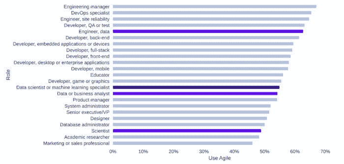
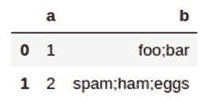
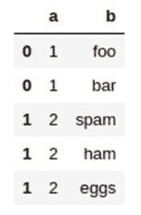
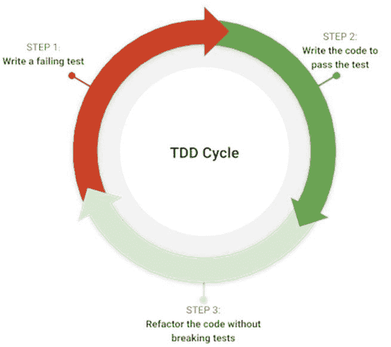

# 数据科学可以是敏捷的吗？将最佳敏捷实践应用于你的数据科学过程

> 原文：[`www.kdnuggets.com/2021/01/data-science-agile-best-practices.html`](https://www.kdnuggets.com/2021/01/data-science-agile-best-practices.html)

评论

**由[Jerzy Kowalski](https://www.linkedin.com/in/jerzy-kowalski-dev/)，STX Next 的 Python 开发者**。

我经常看到的观点是敏捷开发和数据科学不太适配。如果这是真的，那就意味着敏捷在数据科学家中并不受欢迎。

* * *

## 我们的前三个课程推荐

 1\. [谷歌网络安全证书](https://www.kdnuggets.com/google-cybersecurity) - 快速进入网络安全职业的快车道。

 2\. [谷歌数据分析专业证书](https://www.kdnuggets.com/google-data-analytics) - 提升你的数据分析能力

 3\. [谷歌 IT 支持专业证书](https://www.kdnuggets.com/google-itsupport) - 支持你的组织进行 IT 管理

* * *

由于我更倾向于进行严格分析而非轶事证据，我开始验证这个观点，并了解数据科学家是否使用敏捷。我发现他们确实在使用，但也可以使用得更多。

这促使我为将敏捷实践应用于数据科学项目提供了一个案例。结果就是这篇文章。

*继续阅读以了解更多：*

+   敏捷在数据科学家中有多受欢迎？

+   你可以做些什么来提升你的数据科学过程？

+   你应该将哪些最佳敏捷实践应用于数据科学？为什么？

+   在数据科学中实施敏捷有任何弊端吗？

### 使用敏捷的数据显示科学家占比是多少？

回答这个问题的一种可能方式是使用[Stack Overflow 调查](https://insights.stackoverflow.com/survey/2020)的结果。如果你想查看我分析的技术细节，我已经为你提供了一个[jupyter notebook](https://github.com/stxnext/agile-in-data-science/blob/master/so_survey_analysis.ipynb)。

不幸的是，那里没有类似“你是否使用敏捷开发？”的问题，所以我选择了有关使用的协作工具的问题。我假设如果我发现了“Jira”作为答案，那么受访者很可能是在敏捷环境中工作。

别误解我的意思。我*并不*认为你必须使用 Jira 来进行敏捷开发——还有很多其他工具可供选择。如果你使用 Jira，这也不意味着你 100%是在进行敏捷开发。我只是做了一个我认为是“你是否使用敏捷开发”的最佳近似的假设。

回答“谁在使用敏捷？”这个问题要简单得多。“以下哪些描述了你？”正是我一直在寻找的答案之一，因为其中一个可能的答案是“数据科学家或机器学习专家。”

好了，理论讲解够了。现在让我们看看一些可视化数据吧！



显然，数据科学家在这方面并不是行业领先者，因为只有 54.9%的人使用敏捷方法。类似角色的结果更差，数据工程师除外，他们在这方面接近最佳水平。此外，数据科学家与该群体中敏捷用户的比例之间在“工程性”方面存在正相关。

根据我的发现，我们不能说数据科学家对敏捷一无所知。但肯定还有改进的空间，所以让我们看看一些将敏捷方法融入数据科学项目的可能方式。

### 如何使你的数据科学工作更具敏捷性

有很多方法可以通过敏捷提升你的数据科学过程。让我们深入探讨两个我认为极其有价值的最佳实践，无论你是数据工程师、数据科学家还是软件工程师。

**1\. 分而治之**

TL;DR：解决和管理较小的问题比试图一次性完成所有任务要容易。

我假设你至少有一些基本的任务定义系统。也许你使用像 Jira 或 Trello 这样的工具，或者在某个专用文档中使用待办事项列表。工具的选择其实不重要。

现在退一步思考一下你或团队中的其他人未能按时交付的任务。我相当肯定这些任务中有些是因为太大而无法在指定时间内完成。

我们为什么会创建庞大的任务？首先：**常常会有一个巨大的诱惑让你尽快开始编码**。当新的、令人兴奋的事物即将到来时，详细讨论实际需要做什么可能会显得无聊。小心，这是一种陷阱！除非你充分讨论任务，否则你会错过障碍，风险低估任务。

[via GIPHY](https://giphy.com/gifs/trap-Z1LYiyIPhnG9O)

我们考虑以下场景：你正在开发一个识别热狗的系统，并且得到了一个庞大的图片集合用于训练模型。你脑海中的一个急躁的声音告诉你迅速在待办事项列表中创建一个新项目，称之为“提高模型准确性”，然后……开始编码。然后你被问到需要多长时间，你迅速回应：“三天。”

在与香肠的不平衡战斗了两周后，你发现自己正在向不满的利益相关者解释，由于许多标记为“热狗”的图片实际上是……香蕉，这比你最初假设的要困难得多。

如果你曾经花时间思考需要完成的任务，你可能会**将其拆分为更小的部分**。也许你会在初步数据集分析完成之前推迟三天的估计。

[via GIPHY](https://giphy.com/gifs/illustration-disney-xd-disneyxd-3o85xIp0iu8Qkkv1de)

拆分任务时，记得要确保每个部分都能实际带来一些价值。下面的“模糊交付物”部分包含了更详细的指南。

最后但同样重要的是：**较小的任务通常意味着更早的反馈。** 如果在一天的数据集分析后，你告知你的利益相关者数据很混乱，那么他们可能会决定跳过这部分，让你去做一个更相关的任务。

**2\. 回顾**

Scrum 是一个敏捷框架，帮助你组织交付产品的过程。Scrum 的一个组成部分是一系列旨在解决开发过程中可能出现的大多数问题的事件。

很难挑选出最有价值的形式，因为它们都是相辅相成的。但如果我必须说服一个 Scrum 怀疑者开始使用 Scrum 事件，我会从回顾开始。

**回顾意味着专门留出时间来停下来反思哪些事情做得好，哪些事情做得不好。**

这里是关键点：

1.  给你的团队几分钟时间，思考一下最近在项目中发生的好事和坏事。让每个人写下他们想讨论的内容。

1.  收集所有笔记，然后尝试找到并合并重复的内容。

1.  再次给自己几分钟时间，对你认为最相关的话题进行投票。

1.  现在是时候进行小组讨论，从获得最多票数的话题开始。尽量制定一个计划来改进这些痛点。

回顾可以采取[多种形式](https://www.atlassian.com/blog/jira-software/5-fun-sprint-retrospective-ideas-templates)，你可以自由提出新的形式。

说到工具：如果你有幸能面对面开会，那么老式的便利贴会很管用。如果不行，那么寻找一个在线解决方案就像谷歌“回顾工具”一样简单。

给自己一些时间来检视最近发生的事件和活动绝对是个好主意。我强烈建议你和你的团队一起尝试一下。

注意，Scrum 远不止是一两个花哨的会议！[Scrum 指南](https://www.scrumguides.org/)无疑是获得关于 Scrum 的更广泛视角的最佳资源之一。希望阅读它能说服你尝试更多，甚至所有的组成部分。

### 最佳敏捷工程实践的好处：单元测试和测试驱动开发

除了过程级的敏捷改进，还有许多低层次的技术可以提升你的工作，包括代码审查、结对编程、持续集成——仅举几例。

我相信这些方法都适用于数据科学领域，但在这里我想重点关注两个：**单元测试和测试驱动开发。** 两者都是敏捷应用于软件工程的突出例子，而且根据[最新的敏捷状态报告](https://explore.digital.ai/state-of-agile/14th-annual-state-of-agile-report)，它们都位列前十的敏捷工程实践中。

如果你不编写单元测试，那么你可能是在某个 REPL 环境中测试你的函数，或者编写临时脚本来完成工作。这种方法的问题在于，当你关闭 REPL 或删除测试脚本时，你的测试也会消失。

现在，假设你的测试被存储和共享。它们与许多其他测试一起周期性地运行，例如，在每次提交之前。你刚刚获得了**一个保证你的函数按预期行为的保护措施。** 如果任何更改使其失败，你将立即知道。

更重要的是，你可以**将你的测试用例视为活的文档**。你可能会同意，“示例”是大多数文档中最受欢迎的部分。现在你有了自己的“示例”部分：你的测试套件，解释如何使用函数以及预期的输出是什么。

此外，如果你在代码*之前*编写测试——这正是 TDD 的核心——你将获得更多好处。由于同时编写一个检查多个内容的测试是繁琐的，你最好保持简单，只检查给定输入是否返回正确的输出。因此，**在编写函数时，你应该只专注于满足定义的需求。**

这样，函数将保持为一个紧凑的、高度专业化的工具，而不是一段神秘的代码。我认为较小的函数通常更易于理解，所以可以公平地说，**TDD 提供了更好的设计和增强的可读性。**

### 将单元测试和测试驱动开发应用于数据科学

现在，让我们回答一个大问题：单元测试和 TDD 如何适用于数据科学的世界？好吧，如果你的日常工作包括使用像 NumPy 或 Pandas 这样的库进行数据整理，那么 TDD 完美适合！

考虑以下问题：你得到了一个 Pandas *DataFrame*，其中包含用分号分隔的多个值的字符串条目列：



你的任务是转换 *DataFrame*，使每一行都具有单个 b 列条目。这类似于 Pandas 的*[explode](https://pandas.pydata.org/pandas-docs/stable/reference/api/pandas.DataFrame.explode.html)*，但输入是分号分隔的字符串。



我们有了样本输入，并且知道期望的输出。这就是编写测试所需知道的所有信息！让我们创建一个 test_utils.py 文件，并将我们的需求转化为代码：

```py
import pandas as pd

from utils import explode_str_column

def test_explode_str_column():
    input_df = pd.DataFrame(
        {
            "a": [1, 2],
            "b": ["foo;bar", "spam;ham;eggs"]
        }
    )
    column_to_explode = "b"
    expected_df = pd.DataFrame(
        {
            "a": [1, 1, 2, 2, 2],
            "b": ["foo", "bar", "spam", "ham", "eggs"]
        },
        index=[0, 0, 1, 1, 1]
    )
    actual_df = explode_str_column(input_df, column_to_explode)

```

如果你用*pytest test_utils.py*运行测试文件——自然，你需要安装[pytest](https://pytest.org/)——它将失败，因为没有带有*explode_str_column*函数的*utils*模块。这没关系。当使用 TDD 时，你首先将需求定义为失败的测试，然后提供实现以使测试通过。


现在，让我们在新的 *utils* 模块中创建 *explode_str_column* 函数：

```py
def explode_str_column(df, column):
    df[column] = df[column].str.split(";")
    return df.explode(column)

```

重新运行*pytest test_utils.py*，你会看到一个漂亮的绿色日志，说明你做得很好！


就这些！并不难或可怕，对吧？现在，作为某种家庭作业，你可以增强这个功能，以满足额外要求，比如处理不同的分隔符或避免修改输入的*DataFrame*。

记住从一个检查新需求的失败测试开始，然后编写解决方案。确保之前的测试没有失败！你还可以重构代码，使解决方案更清晰和/或性能更好。如果你完成了当前需求，应该为新的需求重复这个过程。



现在你知道如何通过单元测试和 TDD 使开发过程更敏捷了。**使用这些技术可以解决数据操作问题，并为你提供更可靠、易读和设计更好的解决方案。**

我确信在将这些方法融入你的日常工作后，你会看到越来越多的用例！

### 实施敏捷方法有哪些挑战和风险？

**1\. 模糊的交付成果**

数据科学家在敏捷工作中的主要挑战是他们工作的输出往往很模糊。

让我们将其与网页开发人员进行比较。大多数时候，他们的任务非常具体，比如调整一个表单或添加一个新过滤器。这些任务的输出结果相当具体。用户可以点击新的界面项，提供的价值也相当容易识别。

现在，想想标准的数据科学任务，如原始数据清理、初步数据分析或改进预测模型。难点在于组织你的工作，使输出结果具有可展示性，并且理想情况下对最终用户可用。

这可能并不简单，但在开始任务之前回答以下问题应该会使其更容易：

+   **谁是你的最终用户？**

不要仅将最终用户视为客户。如果你有这些客户，那很好，但你还应该考虑所有将使用你软件的人。

+   **你为什么需要“X”？**

尝试理解你所做工作的理由。尽可能多地提出问题，以便早期发现风险。

+   **“X”将如何使用？**

避免编写仅仅填补空白的脚本。创建一些对最终用户实际有价值的东西。也许这是一种 CLI 工具、一个包含有用分析的 jupyter notebook，或者一个小型库。为你的项目准备一个[完成定义](https://www.agilealliance.org/glossary/definition-of-done/)文档，将有助于明确什么可以被视为交付成果。

现在，将你的答案写在[用户故事描述](https://blog.easyagile.com/how-to-write-good-user-stories-in-agile-software-development-d4b25356b604)中。

最后，不要忘记应用我之前提到的“分而治之”方法。尽量找出最小的有价值的交付物。记住：你的工作成果不应该因为没有可点击的界面而变得模糊！

**2. 研究和原型设计**

原型设计的核心在于快速验证进一步的探索是否有意义。

[通过 GIPHY](https://giphy.com/gifs/beycreative-yhRhIgnJIRD0I)

起初，敏捷工程实践可能会让你感觉进展缓慢。对偶编程的要求是两位工程师：他们难道不能同时实现更多的代码吗？而且，为什么要关心测试？这只是更多的代码需要编写和维护——而且这需要时间！信不信由你，我确实听到过这样的论点……

令人遗憾的是，大多数原型代码最终都被丢弃了。这是不可否认的。那么，关心这种代码的质量是否值得？我认为是值得的。

原型经常变成被遗忘的脚本，存在于一些古老的仓库中。但时不时地，某个人（包括你！）可能会想要让它们重获新生。如果代码一团糟，那么复活将不会发生，或者会很痛苦。

如果你的原型成功了会怎样？我敢打赌，一旦你向更广泛的公众展示了有前景的结果，就会有人想要立刻使用它。*不过，如果你创造了一个弗兰肯斯坦的怪物，你就得自己处理它。* 尊重良好的实践在这种时候是值得的。

总结一下：在实现原型时，专注于相对较快地交付可工作的软件。但*不要*把它当作实现巨大功能或其他糟糕工作的绿灯。也许你可以减少重构代码的频率，不必追求 100%的测试覆盖率。允许自己不那么严格，但要尽量找到平衡。

### 最后的想法

说到底，很明显敏捷方法不仅仅适用于软件开发人员。数据显示，它在信息技术的其他领域也得到了广泛应用。

有很多敏捷实践可以有效地应用于各种问题，比如单元测试和测试驱动开发。

然而，数据科学领域的一些方面使得采用敏捷方法变得更加困难。我认为，工程责任越多，你成功应用敏捷实践的可能性就越大。另一方面，分析和研究的敏捷方法往往需要一种实质性的观念转变。

总的来说，我坚信无论你的项目性质如何，你都会从将敏捷方法融入你的过程中受益。我希望这些指导方针能帮助你迈出第一步。

**个人简介：** [耶日·科瓦尔斯基](https://www.linkedin.com/in/jerzy-kowalski-dev/)是一位 Python 爱好者，他利用自己最喜欢的编程语言解决[机器学习](https://www.stxnext.com/services/machine-learning/)和[网络开发](https://www.stxnext.com/services/web-development/)问题。耶日在可能的情况下传播函数式编程和 TDD 实践，并应用敏捷方法来改进软件开发过程。

**相关：**

+   [管理数据分析项目的整体框架](https://www.kdnuggets.com/2020/05/framework-managing-data-analytics-projects.html)

+   [数据科学的软件工程技巧和最佳实践](https://www.kdnuggets.com/2020/10/software-engineering-best-practices-data-science.html)

+   [如何使敏捷团队适用于大数据分析](https://www.kdnuggets.com/2019/10/agile-team-big-data-analytics.html)

### 更多相关主题

+   [掌握数据科学项目管理的 7 个步骤（使用敏捷方法）](https://www.kdnuggets.com/2023/07/7-steps-mastering-data-science-project-management-agile.html)

+   [将 ChatGPT 整合进数据科学工作流程：技巧和最佳实践](https://www.kdnuggets.com/2023/05/integrating-chatgpt-data-science-workflows-tips-best-practices.html)

+   [数据科学团队协作的 5 个最佳实践](https://www.kdnuggets.com/2023/06/5-best-practices-data-science-team-collaboration.html)

+   [数据科学的 5 个 Python 最佳实践](https://www.kdnuggets.com/5-python-best-practices-for-data-science)

+   [迁移到 AWS 云的 11 个最佳实践](https://www.kdnuggets.com/2023/04/11-best-practices-cloud-data-migration-aws-cloud.html)

+   [数据仓库和 ETL 最佳实践](https://www.kdnuggets.com/2023/02/data-warehousing-etl-best-practices.html)
