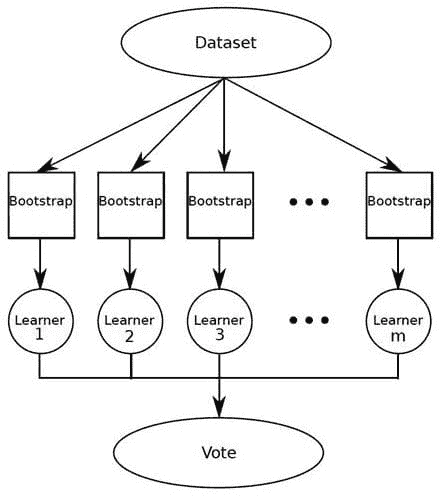
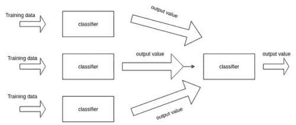

# 数据科学基础：集成学习器简介

> 原文：[`www.kdnuggets.com/2016/11/data-science-basics-intro-ensemble-learners.html`](https://www.kdnuggets.com/2016/11/data-science-basics-intro-ensemble-learners.html)

算法选择对机器学习新手来说可能具有挑战性。构建分类器时，尤其是对初学者来说，通常采用考虑单一算法实例的解决方案方法。

然而，在特定情况下，将分类器链式或分组使用，利用投票、加权和组合技术以追求最准确的分类器，可能会更有用。集成学习器就是提供这种功能的分类器，它们以多种方式实现这一功能。

* * *

## 我们的前三个课程推荐

 1\. [谷歌网络安全证书](https://www.kdnuggets.com/google-cybersecurity) - 快速进入网络安全职业生涯。

 2\. [谷歌数据分析专业证书](https://www.kdnuggets.com/google-data-analytics) - 提升你的数据分析技能

 3\. [谷歌 IT 支持专业证书](https://www.kdnuggets.com/google-itsupport) - 支持你的组织的 IT

* * *

本文将提供自助聚合、提升和堆叠的概述，这些方法可以说是最常用和最知名的基本集成方法。然而，它们并不是**唯一**的选项。随机森林是另一种集成学习器的例子，它在单一预测模型中使用大量决策树，通常被忽视并被视为一种“常规”算法。还有其他选择有效算法的方法，下面会介绍。

**自助聚合**

自助聚合的运作概念非常简单：建立多个模型，观察这些模型的结果，然后确定大多数结果。我最近在我的车的后轴组件上遇到了问题：我对经销商的诊断不太信服，因此我将车送到另外两个车库，他们都同意问题与经销商所建议的不同。*瞧*。自助聚合的实际应用。

我在这个例子中只访问了 3 个车库，但你可以想象如果我访问了几十个或几百个车库，准确性可能会提高，尤其是当我的车的问题非常复杂时。这对于自助聚合也适用，自助聚合的分类器通常比单一的组成分类器更准确。同时请注意，所使用的组成分类器类型并不重要；结果模型可以由任何单一分类器类型组成。

自助聚合是*bootstrap aggregation*的缩写，之所以这样命名是因为它从数据集中抽取多个样本，每个样本集被视为一个自助样本。这些自助样本的结果随后被聚合。

自助聚合 TL;DR:

+   通过模型的等权重来操作

+   通过多数投票来确定结果

+   对于一个数据集使用相同分类器的多个实例

+   通过带替换的抽样构建较小数据集的模型

+   当分类器不稳定时（例如决策树），效果最佳，因为这种不稳定性产生了具有不同准确度的模型，并从中得出多数结果

+   Bagging 通过引入人为的变异性来可能损害稳定模型，从而得出不准确的结论

**Boosting**

Boosting 类似于 bagging，但有一个概念上的修改。与将模型赋予相等权重不同，boosting 为分类器分配不同的权重，并根据加权投票得出最终结果。

再考虑一下我的汽车问题，也许我过去去过某个特定的车库很多次，并且稍微比其他车库更信任他们的诊断。此外，假设我不喜欢之前与经销商的互动，并且对他们的见解信任度较低。我分配的权重将会反映这一点。

Boosting 简而言之：

+   通过加权投票来操作

+   算法以迭代方式进行；新模型受到之前模型的影响

+   新模型成为对早期模型分类错误的实例的专家

+   **可以**通过使用重采样而无需权重，概率由权重决定

+   如果分类器不是太复杂，则效果很好

+   也适用于弱学习者

+   [AdaBoost](https://en.wikipedia.org/wiki/AdaBoost)（自适应提升）是一种流行的提升算法

+   [LogitBoost](https://en.wikipedia.org/wiki/LogitBoost)（源自 AdaBoost）是另一种方法，它使用加性逻辑回归，并处理多类问题

**Stacking**

Stacking 与之前的两种技术略有不同，因为它训练多个单一分类器，而不是同一个学习者的不同版本。与 bagging 和 boosting 使用多种模型构建的同一分类算法（例如决策树）不同，stacking 使用不同的分类算法（可能是决策树、逻辑回归、人工神经网络或其他组合）来构建模型。

然后训练一个组合器算法，通过其他算法的预测来进行最终预测。这个组合器可以是任何集成技术，但逻辑回归通常被认为是执行这种组合的足够简单的算法。除了分类之外，stacking 还可以用于无监督学习任务，例如密度估计。

Stacking 简而言之：

+   训练多个学习者（与训练单个学习者的 bagging/boosting 相对）

+   每个学习者使用数据的子集

+   一个“组合器”在验证段上进行训练

+   Stacking 使用元学习者（与使用投票方案的 bagging/boosting 相对）

+   理论上难以分析（“黑魔法”）

+   Level-1 → 元学习者

+   Level-0 → 基本分类器

+   也可以用于数值预测（回归）

+   用于基本模型的最佳算法是平滑的全局学习者

虽然上述集成学习者可能是最知名和最常用的，但还有许多其他选项。除了堆叠，还有各种其他的元学习者。

数据科学新手容易犯的一个错误是低估算法领域的复杂性，以为决策树就是决策树，神经网络就是神经网络等。除了忽视算法家族的各种特定实现之间存在显著差异（查看过去几年神经网络领域的大量研究作为明确证据），还未意识到各种算法可以通过集成或介入的元学习者协同使用，从而在给定任务中实现更高的准确性，甚至解决单独无法解决的任务。任何你能想到的最新“人工智能”形式都采用了这种方法。不过，这是完全不同的话题。

**相关**：

+   数据科学基础：数据挖掘与统计学

+   数据科学基础：初学者的 3 个见解

+   机器学习关键术语解释

### 更多相关主题

+   [何时选择集成技术是明智的？](https://www.kdnuggets.com/2022/07/would-ensemble-techniques-good-choice.html)

+   [集成学习示例](https://www.kdnuggets.com/2022/10/ensemble-learning-examples.html)

+   [集成学习技术：Python 中随机森林的详细讲解](https://www.kdnuggets.com/ensemble-learning-techniques-a-walkthrough-with-random-forests-in-python)

+   [基础回顾第 3 周：机器学习介绍](https://www.kdnuggets.com/back-to-basics-week-3-introduction-to-machine-learning)

+   [基础回顾第 1 周：Python 编程与数据科学基础](https://www.kdnuggets.com/back-to-basics-week-1-python-programming-data-science-foundations)

+   [掌握数据科学中的 Python：超越基础](https://www.kdnuggets.com/mastering-python-for-data-science-beyond-the-basics)
