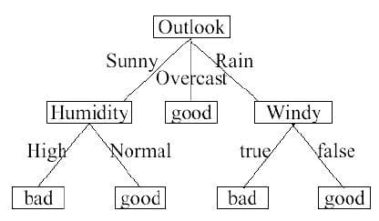
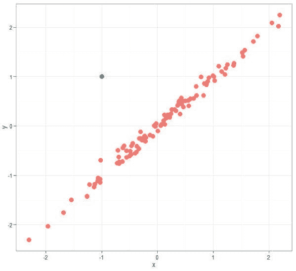

# 数据科学基础：从数据中可以挖掘出哪些类型的模式？

> 原文：[`www.kdnuggets.com/2016/12/data-science-basics-types-patterns-mined-data.html`](https://www.kdnuggets.com/2016/12/data-science-basics-types-patterns-mined-data.html)

记住，数据科学可以被认为是根植于科学原理的数据相关任务的集合。虽然对于数据科学的确切定义或范围没有共识，但我谦虚地提供了我自己的尝试进行解释：

> 数据科学是一个多方面的学科，涵盖了机器学习和其他分析过程、统计学及相关数学分支，越来越多地借鉴高性能科学计算，最终目的是从数据中提取洞察，并利用这些新获得的信息讲述故事。

* * *

## 我们的前三名课程推荐

 1\. [谷歌网络安全证书](https://www.kdnuggets.com/google-cybersecurity) - 快速进入网络安全职业生涯。

 2\. [谷歌数据分析专业证书](https://www.kdnuggets.com/google-data-analytics) - 提升你的数据分析技能

 3\. [谷歌 IT 支持专业证书](https://www.kdnuggets.com/google-itsupport) - 支持你所在组织的 IT

* * *

至于数据科学与数据挖掘的关系，我曾表示“数据科学既与数据挖掘同义，也包括了数据挖掘的概念。”由于这篇文章将重点讨论从数据中**挖掘**的不同类型的模式，让我们转向**数据挖掘**。

数据挖掘功能可以分为 4 个主要的“问题”，即：分类和回归（合称：预测分析）；聚类分析；频繁模式挖掘；以及异常值分析。当然，你也可以从其他方面来划分数据挖掘功能，例如，关注算法，从监督学习与无监督学习开始等等。然而，这是一种合理且被接受的方法来识别数据挖掘能够完成的任务，因此这些问题在下文中逐一介绍，重点关注每个“问题”能解决的内容。

**分类**

分类是监督学习的主要方法之一，涉及到如何对带有类别标签的数据进行预测。分类包括寻找一个描述数据类别的模型，然后用这个模型对未知数据进行分类。概念上的训练数据与测试数据对分类至关重要。

流行的分类算法用于模型构建，以及呈现分类器模型的方式，包括（但不限于）：

+   决策树

+   支持向量机

+   神经网络

+   最近邻

分类的例子比比皆是。一些这样的机会包括：

+   在多个级别（低、中、高）识别信用风险

+   贷款批准（分类：贷款与否）

+   基于多个主题（政治、体育、商业、娱乐等）对新闻故事进行分类

例如，要对新闻故事进行分类，可以使用已标记的故事来建立模型，然后用未知类别的故事来测试模型，模型根据训练预测故事的主题。分类是数据挖掘的主要驱动力之一，其潜在应用几乎是无穷无尽的。

**回归**

回归类似于分类，因为它也是一种主流的监督学习形式，并且对于预测分析很有用。它们的区别在于，分类用于预测具有明确有限类别的数据，而回归用于预测连续的数值数据。作为监督学习的一种形式，回归中的训练/测试数据也是一个重要概念。线性回归是一种常见的回归“挖掘”形式。

回归有什么用？像分类一样，其潜力是无限的。一些具体的例子包括：

+   预测房价，因为房屋价格通常是在金融连续体上进行定价，而不是分类的

+   趋势估计，通过拟合趋势线来分析时间序列数据

+   健康相关指标的多变量估计，例如预期寿命

作为初学者，不要让非线性回归迷惑你：它只是最佳拟合线不是线性的，它取而代之的是另一种形状。这可以被称为曲线拟合，但本质上与线性回归和拟合直线没有不同，只不过用于估计的方法会有所不同。

**聚类分析**

聚类分析用于分析不包含预先标记类别的数据。数据实例通过最大化类内相似性和最小化不同类别之间的相似性来进行分组。这意味着聚类算法会识别并分组非常相似的实例，而不是分组那些彼此不太相似的实例。由于聚类不需要预先标记类别，它是一种无监督学习形式。

*k*-均值聚类可能是最著名的聚类算法示例，但并非唯一。存在不同的聚类方案，包括层次聚类、模糊聚类和密度聚类，还有不同的质心风格聚类方法（*k*-均值所属的家族）。

返回到文档示例，聚类分析可以将一组作者未知的文档根据其内容风格进行聚类，并且（希望）结果能够将它们的作者 - 或至少是类似作者 - 聚集在一起。在营销中，聚类可以特别有用，因为它可以帮助识别不同的客户群体，从而根据已知在这些群体中对类似客户有效的技术进行针对性营销。

其他示例？想象一下任何情况下，你可能有一个大数据集，这些实例没有明确的分类，但可能“自然”地展示出类似的特征集：描述动物类型的数据（腿数、眼睛位置、覆盖物）；关于多种蛋白质的大量数据；描述各种族背景个体的遗传信息。所有这些情况（以及更多）都可以从允许无监督聚类算法找出哪些实例彼此相似，哪些实例彼此不同中受益。

**频繁模式挖掘**

频繁模式挖掘是一个已经使用了很长时间的概念，用来描述数据挖掘的一个方面，许多人认为这正是数据挖掘的精髓所在：对一组数据应用统计方法，以寻找该数据集中有趣且之前未知的模式。我们并不是要对实例进行分类或执行实例聚类；我们只是想学习在数据集和实例中出现的子集模式，哪些模式经常出现，哪些项目是关联的，哪些项目与其他项目相关。很容易看出为什么上述术语会混淆。

频繁模式挖掘最接近于市场篮分析，这是一种识别有限产品超集的子集，这些子集以一定的绝对频率和相关频率一起购买。这个概念可以推广到购买项目之外；然而，项目子集的基本原则保持不变。

**异常分析**

异常分析，也称为异常检测，与其他数据挖掘“问题”有些不同，通常不会单独考虑，原因有几个具体的方面。

首先，也是本讨论中最重要的一点，异常值分析并不像上述其他问题那样是独立的数据挖掘方法，而是可以利用上述方法来实现其自身目标（它是一种终极目标，而非手段）。其次，异常值分析也可以被视为描述性统计的一个练习，有些人认为这根本不是数据挖掘（认为数据挖掘按定义是预测统计方法）。然而，为了全面性，这里也包括了它。

[异常值](https://en.wikipedia.org/wiki/Outlier)是指那些看起来与剩余数据或结果模型行为不太一致的数据实例。虽然许多数据挖掘算法故意不考虑异常值，或可以被修改以明确排除它们，但有时异常值本身可能就是重点。

这在欺诈检测中尤为明显，欺诈检测利用异常值来识别欺诈活动。如果你在纽约及其周边地区和在线频繁使用信用卡，主要用于微不足道的购买？今天上午在 Soho 的咖啡馆用了，晚上在上西区吃了饭，但在此期间在巴黎的实体店花费了几千美元购买电子设备？这就是你的异常值，这些数据会通过各种挖掘和简单的描述性技术被不懈追踪。

**相关：**

+   数据科学基础：初学者的 3 个见解

+   [数据科学基础：数据挖掘与统计学](https://www.kdnuggets.com/2016/09/data-science-basics-data-mining-statistics.html)

+   数据科学基础：集成学习者简介

### 更多相关主题

+   [Python 基础：语法、数据类型和控制结构](https://www.kdnuggets.com/python-basics-syntax-data-types-and-control-structures)

+   [MLOps 中的机器学习设计模式](https://www.kdnuggets.com/2022/02/design-patterns-machine-learning-mlops.html)

+   [揭示隐藏模式：分层聚类简介](https://www.kdnuggets.com/unveiling-hidden-patterns-an-introduction-to-hierarchical-clustering)

+   [优化数据存储：探索 SQL 中的数据类型和规范化](https://www.kdnuggets.com/optimizing-data-storage-exploring-data-types-and-normalization-in-sql)

+   [可视化框架的类型](https://www.kdnuggets.com/types-of-visualization-frameworks)

+   [回到基础第 1 周：Python 编程与数据科学基础](https://www.kdnuggets.com/back-to-basics-week-1-python-programming-data-science-foundations)
