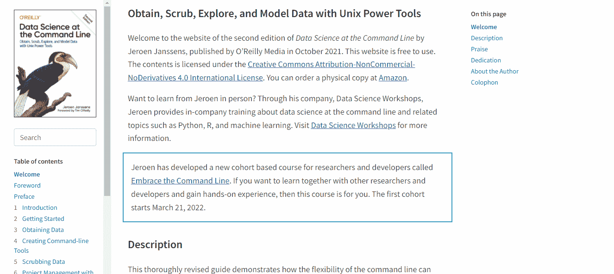
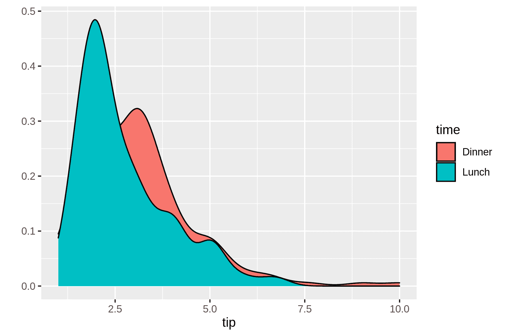

# 《命令行中的数据科学：免费电子书》

> 原文：[`www.kdnuggets.com/2022/03/data-science-command-line-free-ebook.html`](https://www.kdnuggets.com/2022/03/data-science-command-line-free-ebook.html)


图片由作者提供

去年年底，我非常渴望了解关于 MLOps 的一切，最终目标是建立一个端到端的机器学习系统。像其他好奇的人一样，我报名参加了 [Noah Gift](https://www.linkedin.com/in/noahgift/) 主办的 MLOps 事件。他在推广他的书和 Coursera 上的教程。我惊讶于自己从未学习过命令行工具以及它们在自动化中的重要性。在问答环节中，我告诉他我对这些工具的痴迷，他建议我参加他的 DataCamp 迷你课程：[Python 中的命令行自动化](https://app.datacamp.com/learn/courses/command-line-automation-in-python)。这门课程让我对数据管道、数据编辑、创建脚本以及如何在终端中用一行代码实现与 Python 中 15 行代码相同的结果有了新的看法。因此，我继续寻找有关命令行的最佳资料，最后找到了 [Jeroen Janssens](https://www.linkedin.com/in/jeroenjanssens/) 的《命令行中的数据科学》([Amazon](https://www.amazon.com/Data-Science-Command-Line-Explore-dp-1492087912/dp/1492087912))。

* * *

## 我们的三大课程推荐

 1\. [谷歌网络安全证书](https://www.kdnuggets.com/google-cybersecurity) - 快速进入网络安全职业。

 2\. [谷歌数据分析专业证书](https://www.kdnuggets.com/google-data-analytics) - 提升你的数据分析水平

 3\. [谷歌 IT 支持专业证书](https://www.kdnuggets.com/google-itsupport) - 支持你的组织进行 IT 工作

* * *

# 关于本书



[获取免费电子书](https://datascienceatthecommandline.com/) | [在 GitHub 上收藏](https://github.com/jeroenjanssens/data-science-at-the-command-line) | [在亚马逊上购买](https://www.amazon.com/Data-Science-Command-Line-Explore-dp-1492087912/dp/1492087912)

本书通过编程示例解释了如何利用 Unix 强大工具执行与数据科学相关的所有任务。本书适合所有数据专业人士、工程师、系统管理员和研究人员。免费的电子书是互动式的，几乎没有时间就能掌握所有核心主题。我读过电子书、PDF 和纸质书，但这种阅读方式简直是一个新境界。它就像是在阅读你最喜欢的库的文档，但更好。

**本书内容包括：**

1.  获取数据

1.  创建命令行工具

1.  清理数据

1.  使用 Make 的项目管理

1.  探索数据

1.  并行管道

1.  数据建模

1.  多语言数据科学

在这本书中，你将学习如何使用 API、数据集和电子表格来提取数据。接着，进行数据清理和操作。之后，你将学习如何使用**rush**进行数据分析和可视化。你还将学会管理数据科学工作流程、创建并行管道以及构建机器学习模型（回归、分类）。除了核心主题，你还会学到如何利用 Unix 的强大工具提升你进行快速数据分析的效率。

我喜欢如何使用**csvsql**对 CSV 文件运行 SQL 查询，以及如何使用**rush**绘制各种图表。我从未见过任何机器学习工程师使用命令行工具进行数据预处理、创建模型和评估结果。当我第一次读到建模部分时，我感到怀疑，我知道他们必须使用 Python 或 R 脚本进行训练，但令我惊讶的是，作者使用了**vw**进行训练和评估。

# 特殊功能

这本书有许多突出的特点，但其中一些令人震惊的特性将在本评论中提到。

## 数据分析

一行代码的数据分析结合强大工具和 SQL 查询是我从未想象过的。这本书解释了多种提取和分析数据的方法，如使用 grep、header、trim 和 csvsql。

```py
$ seq 5 | header -a val | csvsql --query "SELECT SUM(val) AS sum FROM stdin"
sum
15.0
```

## 数据可视化

这本书展示了如何使用**rush**进行任何基于**R**的数据分析。运行复杂的统计函数，探索数据，然后使用**ggplot**以任何形式可视化数据。书中还教你如何创建自己的工具，以优化当前的工作流程。

```py
$ rush plot --x tip --fill time --geom density tips.csv > plot-density.png

$ display plot-density.png
```



## 模型训练

我仍然对如何使用**vw**进行回归分析以及如何使用**skll**训练分类模型感到惊讶。我不想透露太多，因为你需要亲自体验才能理解。

```py
$ skll -l classify.cfg 2>/dev/null
```

这些工具接受多个参数，并使用相同的算法训练模型。没有什么不同，只是我们用一行脚本完成所有这些。在 Python 中，我们需要写至少 20-30 行代码才能获得类似的结果。

```py
$ < output/wine_summary.tsv csvsql --query "SELECT learner_name, accuracy FROM s
tdin ORDER BY accuracy DESC" | csvlook -I
│ learner_name           │ accuracy  │
├────────────────────────┼───────────┤
│ LogisticRegression     │ 0.9953125 │
│ RandomForestClassifier │ 0.9953125 │
│ KNeighborsClassifier   │ 0.99375   │
│ DecisionTreeClassifier │ 0.984375  │
```

## GNU 并行管道

如果你正在处理大型文件或下载大型数据集，**parallel**将减少运行任何计算过程的时间。它将允许你并行化和分配命令及管道。**parallel**的最佳之处在于，你不需要修改当前的工具就能运行并行任务。

```py
$ seq 0 2 100 | parallel "echo {}² | bc" | trim
0
4
16
36
64
100
144
196
256
324
... with 41 more lines
```

# 结论

数据科学是一个令人兴奋的领域，而命令行工具使其更加有趣，因为它简化了复杂性，并提供了用一行代码执行任务的新方法。书中完美地解释了这些强大工具的必要性以及如何利用它们改进当前的数据科学工作流程。如果你决定阅读这本书，我建议你通过编写脚本并自行测试来学习。书中还指导你拉取并运行 docker 镜像，以便你无需手动安装 Unix 强大工具。

**这本免费** [**电子书**](https://datascienceatthecommandline.com/) **遵循** [**CC BY-NC-ND 4.0**](https://creativecommons.org/licenses/by-nc-nd/4.0/) **许可协议。你也可以在** [**亚马逊**](https://www.amazon.com/Data-Science-Command-Line-Explore-dp-1492087912/dp/1492087912)**购买纸质版。**

**[Abid Ali Awan](https://www.polywork.com/kingabzpro)** ([@1abidaliawan](https://twitter.com/1abidaliawan)) 是一位认证的数据科学专家，他热衷于构建机器学习模型。目前，他专注于内容创作和撰写有关机器学习和数据科学技术的技术博客。Abid 拥有技术管理硕士学位和电信工程学士学位。他的愿景是使用图神经网络构建一个 AI 产品，帮助那些受心理疾病困扰的学生。

### 更多相关主题

+   [数据科学的更多命令行工具](https://www.kdnuggets.com/2023/03/5-command-line-tools-data-science.html)

+   [ChatGPT CLI: 将你的命令行界面转变为 ChatGPT](https://www.kdnuggets.com/2023/07/chatgpt-cli-transform-commandline-interface-chatgpt.html)

+   [通过这个 GitHub 仓库掌握命令行的艺术](https://www.kdnuggets.com/master-the-art-of-command-line-with-this-github-repository)

+   [用 Python 在 7 个简单步骤中构建命令行应用](https://www.kdnuggets.com/build-a-command-line-app-with-python-in-7-easy-steps)

+   [通过这本免费电子书学习数据清理和预处理](https://www.kdnuggets.com/2023/08/learn-data-cleaning-preprocessing-data-science-free-ebook.html)

+   [超级学习指南：一本免费的算法和数据结构电子书](https://www.kdnuggets.com/2022/06/super-study-guide-free-algorithms-data-structures-ebook.html)
