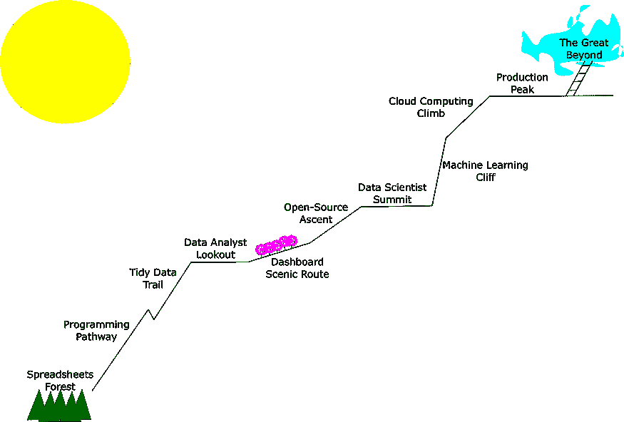

# 专业数据科学课程

> 原文：[`www.kdnuggets.com/2021/03/data-science-curriculum-professionals.html`](https://www.kdnuggets.com/2021/03/data-science-curriculum-professionals.html)

评论

**由 [布洛克·陶特](https://www.linkedin.com/in/brock-taute-578402b7/)，Odyssey Energy Solutions 的数据与系统专家**。

* * *

## 我们的前三个课程推荐

 1\. [谷歌网络安全证书](https://www.kdnuggets.com/google-cybersecurity) - 快速进入网络安全职业生涯。

 2\. [谷歌数据分析专业证书](https://www.kdnuggets.com/google-data-analytics) - 提升你的数据分析技能

 3\. [谷歌 IT 支持专业证书](https://www.kdnuggets.com/google-itsupport) - 支持您组织的 IT 工作

* * *

*作者提供的图示。*

如果你终于决定从 Excel 的复制粘贴转向可重复的数据科学，那么你需要知道最佳的路线。好消息是，有大量免费的资源可以帮助你，还有很棒的在线社区可以帮助你。坏消息是，选择哪些资源可能会让人感到不知所措。这里有一个直截了当的指南，你可以毫无遗憾地跟随，这样你就可以花更少的时间担心路径，更多的时间在上面跋涉。它基于我从一个从未上过统计课的可再生能源项目工程师到主要数据平台负责人的经历中学到的教训。

### 你在这里

在这段旅程的起点，你可以发现一群因必要而非激情进行数据分析的受过教育的个人。他们接受过工程师和商业分析师的培训，使用最简单的软件来运行他们的方程式。电子表格之所以美妙，是因为它们非常直观。你可以在每一步方程式中真实地看到并在隐喻中感受到数字。构建一个主电子表格是一个亲密的过程。（不相信我？试试看当他们展示他们的新模板时，你批评他们的颜色方案。）然而，一旦从原型转到全规模数据分析，电子表格很快会遇到局限性。一旦遇到需要整整一天时间才能修复的循环引用，开始计划在需要打开大文件或花一周时间尝试重建别人完成的分析时，你就该考虑转变了。在你旅程的第一步中，你需要去除电子表格的手动步骤，加快速度，并简化公式的跟踪。你需要开始编程。

**第一次旅行：选择编程语言**

现在你面临着人生中最重要的决定。大多数有抱负的数据科学家永远无法跨越这个巨大的障碍。你打算先学习哪种编程语言？为了减轻你的焦虑，你应该知道实际上没有错误的答案；这就像在选择一只小狗和一辆新车之间（或者对某些人来说，是猫和摩托车）。虽然有很多编程语言可以选择，但在目前的阶段，我只能推荐两个：Python 和 R。

你可以花几个月的时间阅读关于哪个更好的文章，但它们最终都说同样的话。所以，减轻你的负担，让这成为你最后一次纠结于这个话题。这份指南直截了当，记住吗？我会直白地告诉你。

如果你要与任何人合作，并且他们已经做出了这个选择，那就选择相同的语言。这样生活会更轻松。假设你是为你的团队开辟这条道路（这很棒），我可能推荐你选择 R。这种语言专门设计用于让非计算机程序员的生活更轻松，学习社区也非常棒。更重要的是，RStudio IDE（集成开发环境；你将在这里编辑代码）比使用 Python 更容易入门。（对于那些在大学里使用过 Matlab 的人来说，感觉就像是在使用 Matlab。）尽管如此，Python 是软件工程师更受欢迎的语言，在你开始构建机器学习应用程序时，实际世界中使用的频率也更高。

我个人开始是为了普通计算机编程目的自学 Python，并且在很多令人沮丧的东西上遇到了麻烦（比如该死的 PATH 变量），这使得进展开始时非常缓慢。当我开始学习数据科学时，我切换到了 R，并且真的很喜欢这种体验。最近，我深入研究了 Python 的数据科学包，现在在两者之间频繁切换（这实际上非常容易）。

如果你想更深入了解这个话题，你应该阅读 [这篇文章](https://towardsdatascience.com/should-an-engineer-learn-r-or-python-c91b36215a91) ，文章更详细地探讨了这个话题。然后，你应该选择一个并开始学习。

**第二段征程：基础统计和整洁数据**

一旦你选择了编程语言，你需要选择 IDE 和学习材料。如果你选择了 R，请使用 RStudio 并阅读 Garrett Grolemund 和 Hadley Wickham 的《R For Data Science》（通常缩写为 R4DS）。如果你选择了 Python，请下载 JupyterLab（使用 Anaconda）并阅读 Jake VanderPlas 的《Python Data Science Handbook》。这两本书都可以在网上免费获取。

这两本书将带你从完全新手提升到超越电子表格的能力，使你能够处理各种项目。所以，去做吧。拿一个让你非常沮丧的数据分析过程（也许是需要将数据从一堆 CSV 文件复制到一个模板中，也许是一个需要许多电子表格和在它们之间复制/粘贴数据的过程，等等），并编写一个 R/Python 脚本来完成它。当你遇到障碍时，向社区寻求支持。

推动我前进的最大一步是理解整洁数据的概念。因此，我建议阅读 Hadley Wickham 的《整洁数据》一文，并在你的代码中运用其原则。

此外，做数据分析最有趣的部分就是创建令人惊叹的可视化。确保你花大量时间玩弄你的图表。这些图表将帮助你让其他人看到你的代码比他们的电子表格更好。

最后，由于你现在正在进行更深入的数据分析，复习稳健统计学的原则可能会很有帮助。我推荐 David Spiegelhalter 的《统计学的艺术》。这本书不是教科书，而是讲解统计学数学背后的思维方式，对于编程者来说，比深入探讨数学本身更有用。

### 首个目的地

你做到了！通过这些非常简单的步骤，你现在可以称自己为数据分析师了。此时，你可以做 Excel 中能做的一切，甚至更多。数据分析现在快得多，你自动化了乏味的工作，制作图表的乐趣大大增加。对于许多人来说，这已经是你想要达到的最远目标。然而，接下来的几个步骤将看起来非常诱人。如果你觉得之前很有趣，等你做出第一个仪表板时就会更加精彩。

**第三站：仪表板**

查看 Shiny R 画廊 ([`shiny.rstudio.com/gallery/`](https://shiny.rstudio.com/gallery/))。或者，如果你是 Python 爱好者，可以看看 Dash Enterprise 应用画廊 ([`dash-gallery.plotly.host/Portal/`](https://dash-gallery.plotly.host/Portal/))。这些是仪表板，你可以将所有数据分析结果汇集在一个地方，让你的商业领导者惊叹于你的工作，并做出数据驱动的明智决策。（不错的口号，对吧？）进一步说，仪表板可以是 Web 应用，允许你的团队其他成员通过 GUI（图形用户界面）运行你的代码。你的团队当前使用的软件是否让你抓狂？你可以重新创建它，但量身定制以完全符合你的需求，真正减少点击次数。该程序的输出可能是一个漂亮的 PDF 报告。

简而言之，仪表盘很棒。你想要掌握制作这些仪表盘的技能。从将你的一个分析结果转化为仪表盘开始，然后逐步建立。使用 R 的 Shiny 包和 Python 的 Dash 包。还有大量文档可以帮助你，包括 Hadley Wickham 的《Mastering Shiny》一书，但与基础数据科学书籍不同，我不一定推荐完全读完这些书。只需开始编码，并在不确定如何做时使用它们。再说一次，学习社区是你的朋友。

**第四阶段：包、GitHub、开源、环境**

现在你的同事对你的仪表盘赞不绝口，羡慕你的自动化脚本，你将需要开始协作。一开始，你可能会通过电子邮件或文件共享与他人分享你的代码。类似地，每当你开始一个新的分析时，你很可能会复制上一个分析，然后在不同地方做些修改以适应新的数据。这是每个人的起点，但很快就会变得混乱。此外，你希望有更好的方法来跟踪代码的变化并允许其他人共同编辑。为了解决这些问题，你需要将代码转换为一个包，并将其托管在 GitHub 上。这样，每个人都可以访问代码，甚至可以将其开源，允许你与全球合作。

学习如何做到这一点的最佳资源是 Hadley Wickham 的《R Packages》和官方 Python Packaging 文档（[`packaging.python.org/overview/`](https://packaging.python.org/overview/)）。GitHub 的指南也是学习如何使用其平台的极好资源（[`guides.github.com/`](https://guides.github.com/)）。

当你第一次为团队构建应用程序时，管理本地环境会让你感到非常沮丧。我指的是，每个人的计算机上安装了不同的文件和操作系统中的细微差别，导致在他们的“环境”中运行的代码与在你的环境中行为不同。这是一件非常混乱的事情，涉及到计算机科学而非基础数据科学。我尽可能避免学习环境管理，但一旦我开始学习，它确实让我的生活变得容易多了。不管是主动学习还是出于必要，你都需要自己掌握这一技能。我从未找到过学习这方面的优秀资源，所以我在[这里](https://towardsdatascience.com/data-science-environments-adfeb5dadd7a)做了一个推荐你阅读的资源。

### 第二个目的地

你现在已经将数据分析技能提升到了一个新水平。你可以为开源代码做出贡献，并且现在具备了排查同事问题所需的技能。你可以领导一个高效的数据分析团队。拥有这些能力后，你正在寻找真正推动业务价值的方法，以便高层管理者不能再忽视你的工作。

**第五阶段：高级统计与机器学习**

如果你想真正为公司带来价值，你需要超越简单的线性回归和计算平均值。你需要开始深入研究高级统计和（提醒词！）机器学习。这一步是比较陡峭的。盲目尝试开源机器学习模型是可能的，但这有点像玩火。你真的需要理解你在做什么，否则计算机可能会将你的动机转化为一些疯狂的东西。我不是说你必须理解每个模型中所有的数学，但你应该对这些数学试图实现的目标感到舒适。你还应该开始从数据中提取更大的推论，识别出你未受过训练的眼睛所遗漏的模式。你应该学习更多统计的细微差别，以确保你得出的结论是负责任的。这部分确实是关于大权力需要大责任的。好好学习这些工具，你就可以做得更好。

最好的机器学习资源是 Coursera 上的机器学习课程，由斯坦福大学教授、机器学习名人 Andrew Ng 教授讲授。你可以在 GitHub 上找到 Python 和 R 的作业，而不是他在课程中使用的 Octave（编程语言）。紧接着这个课程的另一个极好的课程是 MIT 的深度学习入门（6.S191）课程。它是 MIT 课程，每年在课程结束后公开。该课程使用 Python 和一个叫 TensorFlow 的包。（注意，深度学习是一种机器学习，机器学习是一种人工智能。你说的内容部分取决于你想给谁留下深刻印象。）

在 Coursera 上有一门很好的高级统计课程，约翰斯·霍普金斯大学的“统计推断”（使用 R），或者密歇根大学的“用 Python 进行推断统计分析”。

**第六步：云计算，数据管道**

在某些时候，本地托管所有的处理过程将不再有意义。这可能是由于所需的计算能力、需要将来自多个来源的数据汇总到一个位置，或需要一个持续运行的应用程序而不是一次性分析。在这种情况下，你将转向云计算，这意味着你还必须找到将数据导入云中的方法。此时，你可能会从数据分析师/科学家过渡到数据工程师。这涉及到很多内容，其中大部分是特定于云托管提供商的。为了避免这种情况，你可以使用类似 RStudio Cloud 的工具，它会为你处理所有麻烦的工作。否则，你需要重新学习许多计算机科学概念，如分区、复制和网络。

要深入了解云服务，我写了 [这篇文章](https://towardsdatascience.com/data-science-in-the-cloud-bcdee3c519e7)。其他一些有用的资源包括 Google Cloud Labs（或类似的 Amazon、Microsoft 等材料）以及 Martin Kleppmann 的书《设计数据密集型应用》。

对于那些希望利用云计算能力但不打算实际托管应用程序的人，你绝对应该查看 Google Colab Notebooks。这些工具允许你在云端运行 Jupyter 笔记本，而不是在自己的计算机上，无需任何复杂的设置。它非常适合共享代码，同时也不必处理本地环境问题。

### 第三目的地

你已经达到了数据科学的圣地。你可以申请的职位有生产数据科学家或机器学习工程师。你现在具备了为大科技公司工作的技能，同时你在所在行业的专业知识也让你区别于普通数据科学家，这使得你的才能非常有吸引力。利用这些来清楚地为你的公司带来价值，这样你才能被认可你的真正价值。

### 伟大的未来

你可以考虑无数条下一步的路径。你可以深入研究神经网络和开源 AI 库，将人工智能带到你的行业。或者你可以投入到前端编码中，学习 JavaScript、HTML 和 CSS，将你开始构建的 web 应用提升到一个新的水平。或者你可以精通数据可视化和设计，更好地传达你的分析结果。或者你可以做其他无数的事情。因为你已经学会了如何在云端进行数据科学，天空不再是你的限制。

[原文](https://towardsdatascience.com/data-science-curriculum-for-professionals-46d131675602)。经许可转载。

**简介：** [布罗克·陶特](https://www.linkedin.com/in/brock-taute-578402b7/) 是一位在可再生能源行业工作的工程师和数据科学家。

**相关：**

+   [如何克服对数学的恐惧并学习数据科学数学](https://www.kdnuggets.com/2021/03/overcome-fear-learn-math-data-science.html)

+   [2021 年数据科学学习路线图](https://www.kdnuggets.com/2021/02/data-science-learning-roadmap-2021.html)

+   [我的数据科学学习历程](https://www.kdnuggets.com/2021/01/data-science-learning-journey.html)

### 更多相关话题

+   [KDnuggets 新闻，5 月 11 日：SQL 职业人士笔记；如何…](https://www.kdnuggets.com/2022/n19.html)

+   [Burtch Works 2023 数据科学与 AI 职业薪资报告…](https://www.kdnuggets.com/2023/08/burtch-works-2023-data-science-ai-professionals-salary-report.html)

+   [有经验的专业人士 SQL 面试问题](https://www.kdnuggets.com/2022/01/sql-interview-questions-experienced-professionals.html)

+   [SQL 职业人士笔记：免费电子书评论](https://www.kdnuggets.com/2022/05/sql-notes-professionals-free-ebook-review.html)

+   [停止学习数据科学以寻找目标，并通过寻找目标来……](https://www.kdnuggets.com/2021/12/stop-learning-data-science-find-purpose.html)

+   [数据科学入门：你需要掌握的 10 项基本技能](https://www.kdnuggets.com/2020/10/data-science-minimum-10-essential-skills.html)
