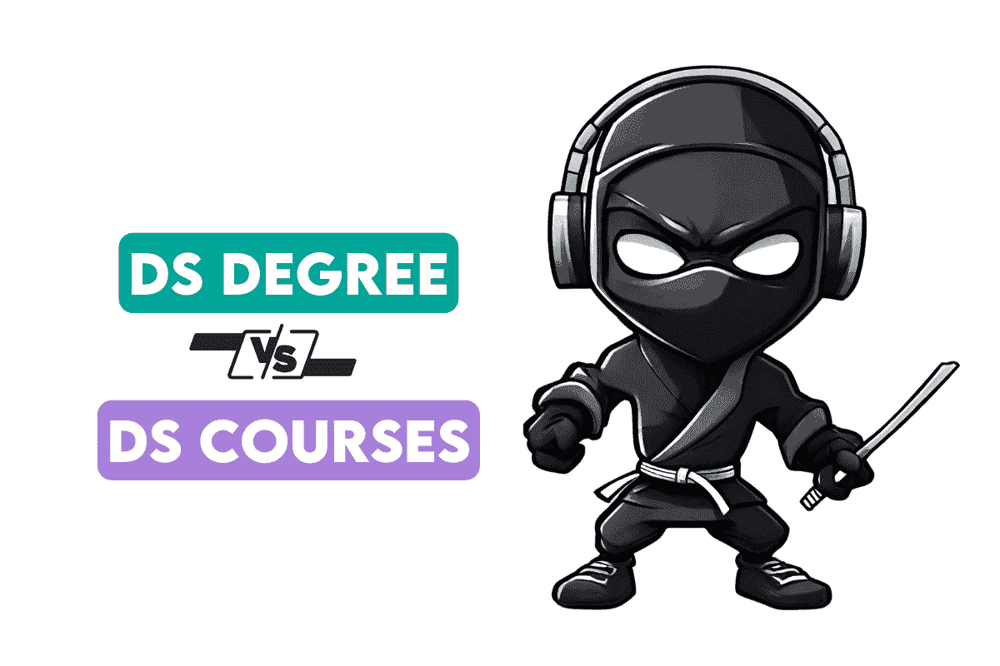
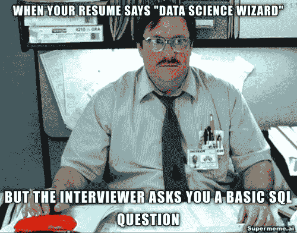

# 数据科学学位与课程：价值判断

> 原文：[`www.kdnuggets.com/data-science-degrees-vs-courses-the-value-verdict`](https://www.kdnuggets.com/data-science-degrees-vs-courses-the-value-verdict)

作者提供的图片

* * *

## 我们的前三大课程推荐

 1\. [谷歌网络安全证书](https://www.kdnuggets.com/google-cybersecurity) - 快速进入网络安全职业生涯

 2\. [谷歌数据分析专业证书](https://www.kdnuggets.com/google-data-analytics) - 提升你的数据分析能力

 3\. [谷歌 IT 支持专业证书](https://www.kdnuggets.com/google-itsupport) - 支持你的组织 IT

* * *

如果你想在数据科学领域找到工作，而你第一次没有获得计算机科学、数据科学或数学学位，你现在可能在考虑你的选择。你可以回到学校获得那个学位，或者尝试完成一个认证的数据科学课程或训练营。

两者都昂贵且耗时，但学位比大多数课程或训练营要昂贵和耗时得多。这个价格对雇主来说值得吗？让我们通过每种课程提供的内容来详细分析一下。

## **传统路径：数据科学学位**

标准路线是获得数据科学、计算机科学或数学的学位（甚至两个）。这种结构化的学习将教会你在数据科学工作中表现出色所需的知识。

学位的一个好处是它可以让你扎实而全面地学习该主题。它提供了真正的深度和对理论概念的深刻理解，这些是你从密集的训练营或在线课程中无法获得的。

学位涵盖广泛而深入的主题，包括高级数学、统计学、计算机科学基础、数据结构、算法、机器学习、数据可视化，甚至可能包括近年来变得更加实用的人工智能、深度学习和大数据技术等专业领域。

这样广泛而深入的学习意味着你真正理解了基础知识。你不仅仅是一个代码工蜂；你明白如何以及何时使用特定的统计工具或进行特定的分析。

不仅如此，学位还具有分量。许多大学就像品牌名称，雇主会认可并钦佩。例如，拥有 MIT 数学学位的求职者会以积极的方式脱颖而出。

不过，正如我之前提到的，学位通常需要四年时间，尽管也有更短、更专注的选项。例如，如果四年太长，你可以选择一个加速课程或一个专注于数据科学的硕士学位，这通常需要一到两年时间。

这些替代方案有点像大学学位的速成版，提供了更集中、侧重于工作所需的课程——数据科学、机器学习和统计技能。对于那些已经毕业并希望立即转行进入数据科学职位而不愿花费四年时间的人来说，它们可能是一个有吸引力的选择。

## **现代途径：在线课程和训练营**

正如你所知道的，数据科学领域非常强劲且持续增长（不，[没有泡沫](https://www.stratascratch.com/blog/data-science-in-2024-what-has-changed/?utm_source=blog&utm_medium=click&utm_campaign=kdn+ds+degrees+vs+courses)）。这些领域的毕业生数量与职位空缺的数量不匹配。这意味着，虽然没有学位获得工作确实不容易，但也不是不可能——雇主只是希望你证明你的技能。

一种方法是通过结合在线课程、证书和训练营来做到这一点。这条路径更加灵活。你甚至可以兼职进行，同时进行现有工作。

与标准学位相比，这些课程的课程设置更具实用性，并根据当前的就业市场需求进行设计。它们包括类似实际数据科学工作的动手项目，教授你在标准职位描述中可能会看到的具体技能，如 Python、R、机器学习算法和数据可视化工具的熟练使用。这种方法对那些喜欢直接应用而非坐在讲堂里的学习者尤其有用。

许多训练营只持续几个月，通常在结束时提供某种工作安置机会。它们很昂贵，有时达到数万美元，但如果它们能帮助你在不到一年内找到六位数的工作，这可能会有很高的投资回报率。

问题在于，这条路线并没有提供完整的、整体的视角。你可能能够用优秀的项目充实你的简历，但在面试中可能会因为被问到训练营未涵盖的基础问题而表现不佳。

作者通过 [supermeme.ai](https://www.supermeme.ai/) 创建

这就是为什么单一的训练营不够；你通常需要通过审计（或支付）Coursera 或 EdX 课程，或者进行自学、研究和实践来补充。

## **填补空白**

学位无疑提供了无与伦比的深度和声望。但是，通过课程和训练营获得的敏捷性和实用技能不仅是一个值得的替代方案，而且实际上可能使你更好地为职场做准备。虽然学位是传统的，但它们也具有更大的惯性——课程和训练营可以比学位更快地响应不断变化的就业市场。此外，学位课程更加注重理论，对诸如面试准备等技能的重视较少。

作者创建于 [supermeme.ai](https://www.supermeme.ai/)

也就是说，如果你选择课程和训练营的混合组合，你将错过从专注于一个主题一年的深度知识和学科信心。

幸运的是，我们推荐了一些资源，可以帮助你弥补这一差距，确保无论你选择了学位路径还是训练营方向，都能展现出全面且合格的候选人形象。

### **进一步了解数据科学主题**

你可以通过两种方式进行。其一，你可以查看数据科学学位的课程大纲，并列出你想要学习的所有内容。其二，你可以从后向前推——选择一个理想的工作岗位，写下你想要学习的所有职位要求。无论哪种方式，编制你想要学习的主题列表。

有了这个列表，你可以利用以下资源来完善你的学习：

+   [Coursera](https://www.coursera.org/) 和 [edX](https://www.edx.org/): 如果你不想支付课程费用，你可以旁听课程以学习材料，尽管你无法获得结业证书。Coursera 和 edX 提供大量关于数据科学和数学理论与基础主题的全面课程。

+   [可汗学院](https://www.khanacademy.org/): 提供免费的课程，包括统计学和概率等大学级别的课程。

+   [麻省理工学院开放课程](https://ocw.mit.edu/): 你完全可以利用麻省理工学院这个品牌！这是一个宝贵的资源，提供了来自麻省理工学院的免费讲座和课程材料，涵盖计算机科学和数据科学的高级主题。

+   学术期刊和论文：这可能有点深奥，但阅读研究论文是深入理解高级数据科学主题的好方法，更重要的是，跟上当前研究趋势。一些论文需要付费获取，但许多可以在线免费获取。从 [Google Scholar](https://scholar.google.com/) 开始。

### **为一个主题练习技能**

如你所知，仅仅在简历上写“精通统计学”并不够，还需付出更多努力。

作者创建于 [supermeme.ai](https://www.supermeme.ai/)

你需要应用你实际的数据科学技能，从编码到项目实施，并且要有项目来证明这一点。以下是一些资源，可以为你的简历增加额外的光彩。注意：这些资源对于学位型候选人尤其有用，因为学位通常比课程和训练营提供的实际项目机会要少。

+   [DataCamp](https://www.datacamp.com/): 提供以编程、数据分析和机器学习等实际技能为重点的互动课程。

+   [GitHub](https://github.com/): 让你参与真实世界的项目，与他人合作，以获得实际经验并展示你的编码和项目管理技能。

+   [Kaggle](https://www.kaggle.com/): 提供一个平台，让你与其他新人竞争，解决现实世界的问题，访问数据集，并与全球社区合作。

### **成功面试**

无论你选择了学位还是训练营，你都需要在面试中表现出色才能获得工作。你应该准备数据科学工作面试，关注技术问题以及展示你的项目工作。以下是一些资源：

+   [StrataScratch](https://www.stratascratch.com/?utm_source=blog&utm_medium=click&utm_campaign=kdn+ds+degrees+vs+courses): 曾经希望你能提前知道面试官会问你什么吗？StrataScratch（我创办的）收集了 1000 多个真实的面试问题，包括编码和非编码问题，以及最佳答案，让你能够练习和准备面试官可能问你的任何问题。

+   会议和研讨会：建立联系和网络的重要性不可低估。参加这些活动，无论是亲自还是虚拟，了解最新趋势，与专业人士建立联系，甚至可能找到可以提供建议和面试见解的导师。

+   [LeetCode](https://leetcode.com/): 提供大量编码挑战和问题，以提升你的算法和编码技能，这对于技术面试至关重要。

+   [Glassdoor](https://www.glassdoor.com/index.htm)：提供关于公司特定面试问题和流程的见解，以及候选人对面试经历的评价。

## **最后的想法**

如果你是一个有抱负的数据科学家，最好的做法是评估自己的现状。如果你有时间和资金可以用于学位，那是一个很好的选择，只要你将深厚的理论知识与实际操作和面试准备结合起来。如果你需要选择训练营或课程，那也是一个越来越有竞争力的选项——只要确保你完全掌握了相关概念。

两种选择都是可行的，但其中一种可能比另一种更适合你。希望这个价值指南能帮助你选择适合你的选项，并填补你需要的空白，从而获得理想的工作。

****[Nate Rosidi](https://twitter.com/StrataScratch)**** 是一名数据科学家，并且从事产品策略工作。他还是一名兼职教授，教授分析学，并且是 StrataScratch 的创始人，该平台帮助数据科学家准备面试，提供来自顶尖公司的真实面试问题。Nate 撰写有关职业市场的最新趋势，提供面试建议，分享数据科学项目，并涵盖 SQL 的所有内容。

### 更多相关主题

+   [通过这些在线学位从家里进入大学](https://www.kdnuggets.com/go-to-university-from-home-with-these-online-degrees)

+   [数据科学的基础数学：奇异值分解的可视化介绍](https://www.kdnuggets.com/2022/06/essential-math-data-science-visual-introduction-singular-value-decomposition.html)

+   [通过第三名最佳在线数据科学硕士课程最大化你的价值](https://www.kdnuggets.com/2023/05/bay-path-maximize-value-online-masters-data-science.html)

+   [结合数据管理与数据讲述生成价值](https://www.kdnuggets.com/combining-data-management-and-data-storytelling-to-generate-value)

+   [键值数据库解释](https://www.kdnuggets.com/2021/04/nosql-explained-understanding-key-value-databases.html)

+   [使用 Datawig，这是一款用于缺失值填补的 AWS 深度学习库](https://www.kdnuggets.com/2021/12/datawig-aws-deep-learning-library-missing-value-imputation.html)
