# 数据科学面试指南

> 原文：[`www.kdnuggets.com/2018/04/data-science-interview-guide.html/2`](https://www.kdnuggets.com/2018/04/data-science-interview-guide.html/2)

 评论

### 机器学习模型

现在我们有了最佳特征，是时候训练我们的实际模型了！机器学习模型分为两大类：监督学习和无监督学习。监督学习是当标签可用时。无监督学习是当标签不可用时。明白了吗？监督标签！带点双关意味。话虽如此，**千万不要混淆监督学习和无监督学习的区别**！！！这个错误足以让面试官取消面试。此外，另一个新手常犯的错误是运行模型前没有标准化特征。虽然有些模型对这个问题具有抵抗力，但很多模型（如线性回归）对尺度非常敏感。因此，经验法则是：**使用前务必标准化特征！！！**

**线性与逻辑回归**

* * *

## 我们的前三大课程推荐

 1\. [Google 网络安全证书](https://www.kdnuggets.com/google-cybersecurity) - 快速进入网络安全职业生涯

 2\. [Google 数据分析专业证书](https://www.kdnuggets.com/google-data-analytics) - 提升你的数据分析技能

 3\. [Google IT 支持专业证书](https://www.kdnuggets.com/google-itsupport) - 支持你的组织的 IT 工作

* * *

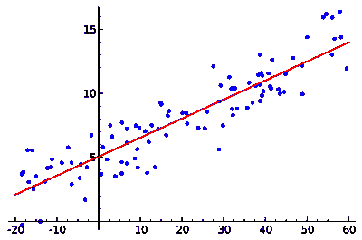

线性回归和逻辑回归是最基本且最常用的机器学习算法。在进行任何分析之前，**务必先进行线性/逻辑回归作为基准！**一个常见的面试失误是直接从更复杂的模型如神经网络开始分析。神经网络无疑具有很高的准确性。然而，基准测试是重要的。如果你的简单回归模型已经有 98%的准确率并且非常接近过拟合，那么使用更复杂的模型并不是明智的选择。值得注意的是，线性回归用于连续目标，而逻辑回归用于二元目标（主要因为 sigmoid 曲线将特征输入强制到 0 或 1）。

我建议同时掌握逻辑回归和线性回归（包括单变量和多变量）。除了为面试做准备，线性回归模型还被用作各种其他机器学习模型的基础。因此，这是一项长期投资。

**决策树与随机森林**

比线性回归模型稍复杂的模型是决策树。决策树算法根据信息增益在不同特征上进行划分，直到遇到纯叶子（即只有一个标签的记录集）。可以通过在一定数量的划分后停止决策树来防止出现纯叶子（修复过拟合问题的常用策略）。

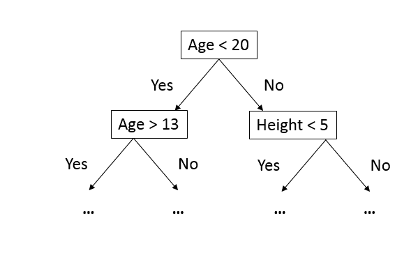

计算用来划分树的**信息增益**是很重要的。**常见面试问题！确保你知道如何计算信息增益！！！** 常见的信息增益计算函数有基尼系数和熵。

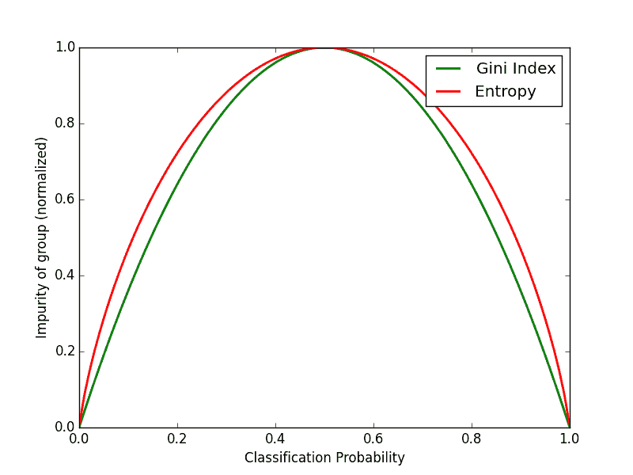

上述曲线中重要的是，熵对信息增益的值更高，因此会比基尼系数引起更多的划分。

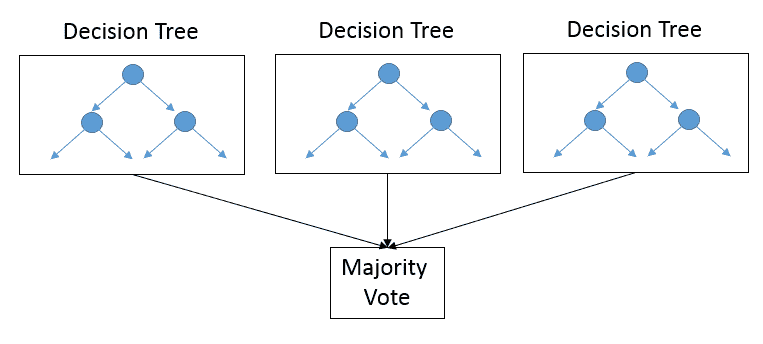

当决策树不够复杂时，通常会使用随机森林（它只是多个决策树在数据子集上生长，最终进行多数投票）。如果树的数量没有正确确定，随机森林算法可能会过拟合。有关决策树、随机森林和基于树的集成模型的更多信息，请查看我的其他博客：[在 Scikit-Learn 上学习决策树和集成模型](https://medium.com/@sadatnazrul/study-of-decision-trees-and-ensembles-on-scikit-learn-e713a8e532b8)

**K-Means**

K-Means 是一种无监督学习模型，用于将数据点分类到不同的簇中。提供簇的数量，使得模型会不断调整质心，直到迭代地找到最佳簇中心。

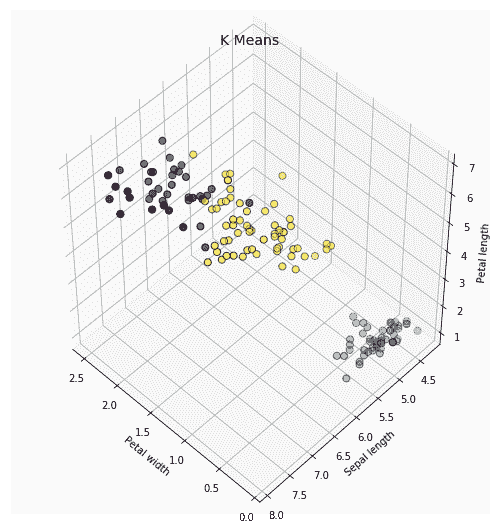

簇的数量是通过肘部曲线来确定的。

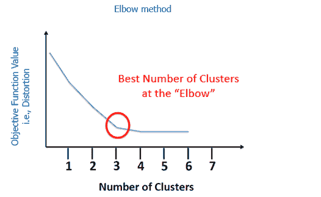

簇的数量可能很难确定（尤其是当曲线没有明显的拐点时）。另外，要注意 K-Means 算法是局部优化而非全局优化。这意味着你的簇将取决于初始化值。最常见的初始化值是在 K-Means++中计算的，其中初始值尽可能远离彼此。有关 K-Means 和其他无监督学习算法的更多细节，请查看我的其他博客：[基于聚类的无监督学习](http://clustering%20based%20unsupervised%20learning/)

**神经网络**

神经网络是现在大家都在关注的一个热门算法。

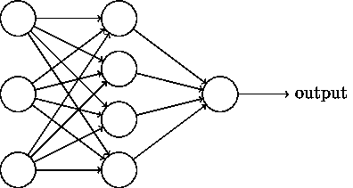

虽然我无法在这个博客上涵盖所有复杂的细节，但了解基本机制以及反向传播和梯度消失的概念是非常重要的。同样重要的是认识到神经网络本质上是一个黑箱。如果案例研究要求你构建一个可解释的模型，选择不同的模型或准备好解释你如何找到权重对最终结果的贡献（例如图像识别过程中隐藏层的可视化）。

**集成模型**

最后，单一模型可能无法准确地确定目标。某些特征需要特殊的模型。在这种情况下，会使用多个模型的集成。以下是一个示例：

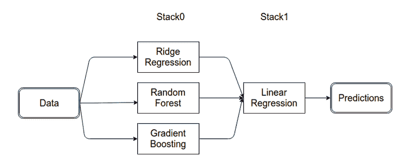

这里，模型以层或堆栈的形式存在。每一层的输出是下一层的输入。

### 模型评估

**分类评分**

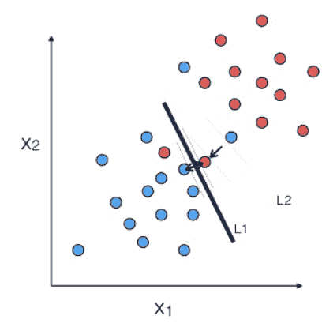

评估模型性能的最常见方法之一是计算记录被准确预测的百分比。

**学习曲线**

学习曲线也是评估模型的常见方法。在这里，我们旨在查看我们的模型是否过于复杂或不够复杂。

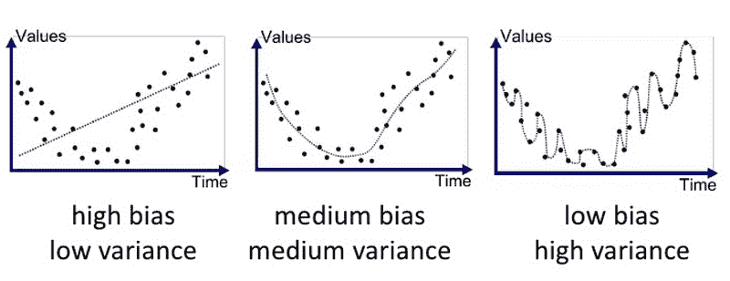

如果模型不够复杂（例如我们决定在模式不是线性的情况下使用线性回归），我们会遇到高偏差和低方差的问题。当我们的模型过于复杂（例如我们决定在简单问题上使用深度神经网络）时，会导致低偏差和高方差。高方差是因为结果会随着训练数据的随机化而变化（即模型现在非常不稳定）。**在面试过程中不要混淆偏差和方差的区别！！！**为了确定模型的复杂性，我们使用如下所示的学习曲线：

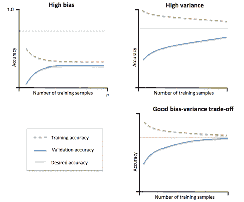

在学习曲线上，我们在 x 轴上变化训练-测试分割，并计算模型在训练集和验证集上的准确性。如果它们之间的差距过大，则说明模型过于复杂（即过拟合）。如果曲线中的任何一条都没有达到期望的准确度，而且曲线之间的差距过小，则数据集偏差较大。

**ROC**

当处理具有严重类别不平衡的欺诈数据集时，分类评分并没有多大意义。相反，接收者操作特征（ROC）曲线提供了更好的替代方案。

45 度线是随机线，其中曲线下面积（AUC）为 0.5。曲线离此线越远，AUC 越高，模型越好。模型的最高 AUC 值为 1，此时曲线形成直角三角形。ROC 曲线也可以帮助调试模型。例如，如果曲线的左下角接近随机线，则意味着模型在 Y=0 时误分类。而如果在右上角是随机的，则意味着错误发生在 Y=1。此外，如果曲线有尖峰（而不是平滑），则表明模型不稳定。在处理欺诈模型时，ROC 是你的最佳朋友。

### 额外材料

[**斯坦福机器学习 | Coursera**](https://www.coursera.org/specializations/machine-learning)

*关于本课程：机器学习是让计算机在没有明确编程的情况下行动的科学。在…*www.coursera.org](https://www.coursera.org/learn/machine-learning)

[**华盛顿大学机器学习专业化 | Coursera**](https://www.coursera.org/specializations/machine-learning)

*这个专业化课程由华盛顿大学的领先研究人员提供，将带你进入令人兴奋的…*www.coursera.org](https://www.coursera.org/specializations/machine-learning)

[**深度学习专业化 | Coursera**](https://www.coursera.org/specializations/deep-learning)

*来自 deeplearning.ai 的深度学习。如果你想进入人工智能领域，这个专业化将帮助你做到这一点。深度…*www.coursera.org](https://www.coursera.org/specializations/deep-learning)

**个人简介：[Syed Sadat Nazrul](https://www.linkedin.com/in/snazrul1/)** 正在利用机器学习来抓捕网络和金融犯罪分子，并在夜晚写有趣的博客。

[原文](https://towardsdatascience.com/data-science-interview-guide-4ee9f5dc778)。已获授权转载。

**相关：**

+   成为数据科学家的两个方面

+   如何在数据科学面试中生存

+   数据科学家招聘指南

### 更多相关内容

+   [数据科学面试指南 - 第二部分：面试资源](https://www.kdnuggets.com/2022/04/data-science-interview-guide-part-2-interview-resources.html)

+   [Interview Kickstart 数据科学面试课程 — 其不同之处](https://www.kdnuggets.com/2022/10/interview-kickstart-data-science-interview-course-makes-different.html)

+   [数据科学面试指南 - 第一部分：结构](https://www.kdnuggets.com/2022/04/data-science-interview-guide-part-1-structure.html)

+   [KDnuggets 新闻，5 月 4 日：9 门免费的哈佛课程来学习数据…](https://www.kdnuggets.com/2022/n18.html)

+   [如何回答数据科学编程面试问题](https://www.kdnuggets.com/2022/01/answer-data-science-coding-interview-questions.html)

+   [15 个你必须知道的 Python 编程面试问题](https://www.kdnuggets.com/2022/04/15-python-coding-interview-questions-must-know-data-science.html)
